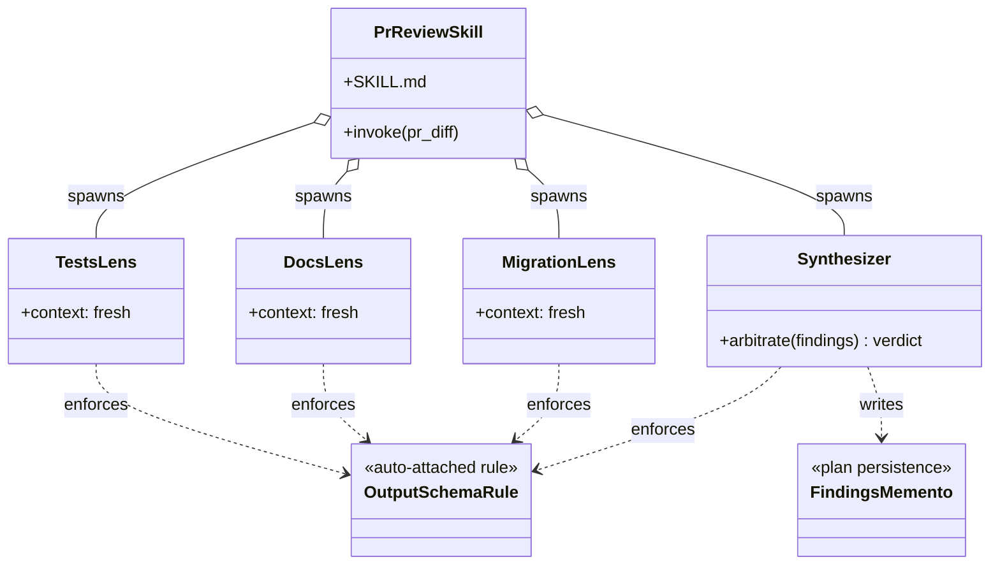

<p align="center">
  
</p>

<h1 align="center">genesis</h1>

<p align="center">
  <strong>Markdown that steers an LLM is code. Design it before you write it.</strong>
</p>

<p align="center">
  <a href="LICENSE"></a>
  <a href="https://github.com/danielmeppiel/genesis/commits/main"></a>
</p>

**Genesis ports the software architect's role to agentic systems -- decomposition, contracts, and cross-cutting concerns applied to workflows where LLMs are the runtime.**

Software engineering needed architecture, not just style guides, the moment systems crossed a complexity threshold. AI-coding-agent systems crossed that threshold a while ago. The downstream cost is paid by the developers using the agents you ship: poor user experience, unreliable behavior, regressions that look like the model failing when in fact the system around the model has no architecture. Genesis is the architectural layer that was missing.

## Install

```bash
npx skills add danielmeppiel/genesis
```

Zero global install. Works with Claude Code, Cursor, Codex, OpenCode, GitHub Copilot, and 41+ more agents -- see [skills.sh](https://skills.sh).

Already using [apm](https://github.com/microsoft/apm) (manifest + lockfile)?

```bash
apm install danielmeppiel/genesis
```

---

## You've felt this

If you've built anything non-trivial with AI coding agents, one of these has happened to you:

- **Monolithic instruction files.** The forty-line rule file became four hundred. No modules, no boundaries, no separation of concerns. Every change requires reading the whole thing, and the agent silently ignores the half it cannot fit in attention.
- **Copy-paste duplication across primitives.** The same convention lives in three skills and two rule files. One was edited last week; the agent now contradicts itself depending on which path the harness loads first.
- **Behavioral drift on long sessions.** Constraints that held at turn one are silently dropped by turn twenty. There is no contract, no acceptance check, no test at the boundary -- the regression ships and you find out from the user.

Genesis names the primitives, the patterns, and the refactor moves -- so you compose instead of copy, and review instead of guess.

---

## Quick Start

After install, summon the skill in your agent (Claude Code, Cursor, GitHub Copilot, OpenCode, Codex) by typing `/genesis` followed by what you want designed:

```
/genesis Design a skill that reviews my pull requests for missing tests,
undocumented public API, and unsafe migrations.
```

You will get a named pattern, an execution diagram, an acceptance test, and a written plan -- before any file is touched.

For how `/genesis` resolves on each harness, see [Runtimes](#runtimes).

---

## What it produces

Cold-load the skill on the Quick Start prompt. Before writing a single file, genesis proposes this layout:

```
.github/skills/pr-review/
├── SKILL.md                       # entrypoint, 8-step contract
├── agents/
│   ├── pr-tests-lens.agent.md     # missing-tests reviewer (fresh context)
│   ├── pr-docs-lens.agent.md      # public-API doc reviewer
│   ├── pr-migration-lens.agent.md # unsafe-migration reviewer
│   └── pr-synthesizer.agent.md    # arbiter, dissent-weighted
├── rules/
│   └── review-output.md           # auto-attached output schema
├── assets/
│   ├── severity-rubric.md         # acceptance gate
│   └── findings.template.md       # plan persistence shape
└── triggers/
    └── on-pull-request.yml        # event binding
```

Then it justifies each piece against the genesis catalogue:

| Component | Pattern | Why this, not that |
|---|---|---|
| Three lens agents in fresh contexts | [Fan-Out + Synthesizer](assets/architectural-patterns.md) | Independent lenses must not share a context; later lenses inherit attention drift from earlier ones. |
| Dissent-weighted synthesizer | [Panel arbiter](assets/architectural-patterns.md) | A single vote is not consensus when reviewers disagree on the same hunk. |
| Output schema as auto-attached rule | [Scope-Attached Rule File](assets/design-patterns.md) | Every lens emits the same shape; downstream parsing and assertions stay mechanical. |
| Trigger as a separate file | [Event-Driven Orchestration](assets/architectural-patterns.md) | Decouples *when* from *what*; the same skill works in any harness. |
| `findings.template.md` | [Plan Memento](assets/design-patterns.md) | State outside the context window; a re-run on the same PR is comparable. |

Object diagram of the runtime shape:



The file you eventually author is the easy part. The composition above is what was missing.

---

## Same skill, three prompts, three architectures (and why)

Three cold-load runs of the genesis skill -- same skill, fresh context each time, three different operator prompts -- yielded three materially different (and each justified) output architectures:

| Operator prompt (excerpt) | Output shape | Patterns selected (and rejected) | Worked example |
|---|---|---|---|
| "Draft release notes from CHANGELOG entries" | 6 files: 1 skill + 2 assets + 3 scripts; single thread | A9 Supervised Execution + S7 Bridge + S4 Schema Gate. A1 Panel **rejected** (lens-count gate did not fire). | [examples/03](examples/03-release-notes-single-skill.md) |
| "Review every PR: gather findings and present them" | 17 primitives: 6 personas + 4 assets + 3 scripts + trigger + entrypoint + rule + evals | A6 Event-Driven + A1 Panel + Dissent-Weighted arbiter. R1 Split considered, applied at lens content as R3 Extract. | [examples/04](examples/04-pr-review-advisory.md) |
| "Review every PR: emit APPROVE or REJECT verdict" | 9 primitives + S7 deterministic bridges + S4 schema gate + post-emit verifier loop + graceful tool probes | Regime change: A9 + S7 + S4 hardened. A8 Alignment Loop, B5 Escalation, R1 Split all **considered and rejected with WHEN-clause grounding**. | [examples/05](examples/05-pr-review-verdict.md) |

Notice row 3: removing the operator's "gather and present, never decide" constraint flipped the system from advisory to consequential. Genesis hardened the existing pipeline with deterministic bridges and a verifier loop -- it did **not** reach for new orchestration patterns. That restraint, with its rejection logic shown, is the discipline being demonstrated. Each example is the verbatim output of a fresh agent session that loaded only `SKILL.md` and the operator prompt.

---

## The architect's role, ported

The six decisions a software architect makes map to AI-coding-agent systems row for row. The code is Markdown; the runtime is an LLM; the structural failure modes are the same.

| Classical concern | Agent-architect equivalent | Genesis deliverable |
|---|---|---|
| Greenfield design | Partition a goal into agents, skills, and instruction scopes; define execution boundaries | Skill dependency graph + handoff packet + `plan.md` |
| Service decomposition | Identify where one agent ends and another begins; prevent skill coupling | Primitive dependency graph + R1 Split when seams drift |
| Integration and contracts | Design skill inputs, outputs, and agent-to-agent handoffs | Interface sketch (trigger, inputs, outputs) + sequence diagram |
| Cross-cutting concerns | Auth context, safety rails, encoding rules that apply across all agents | Shared Scope-Attached Rule Files + Rule Bridge pattern |
| Refactoring strategy | Identify drifted skills and conflicting instruction files; pay prompt debt | Skill refactor plan using R1-R4 patterns ([refactor-patterns.md](assets/refactor-patterns.md)) |
| Architecture review | Evaluate proposed designs for consistency; prevent prompt sprawl | Panel pattern (multi-lens review) + severity-rubric compliance check |

---

## Primitives

Every harness implements the same six concepts under different folder names. Genesis names them once so the vocabulary outlives any one tool.

| Concept | What it is | Common terms |
|---|---|---|
| Persona Scoping File | A document loaded at session start to scope who the agent is. | "agent file", "subagent", "mode" |
| Module Entrypoint | A bundled, self-contained capability with assets and a contract. | "skill", "module" |
| Scope-Attached Rule File | A constraint that auto-applies to a path or context. | "instruction", "rule", "memory" |
| Child-Thread Spawn | A primitive that creates a new context window running in parallel. | "subagent thread", "Task tool" |
| Trigger Orchestrator | A declarative pipeline that runs primitives on events. | "workflow", "hook", "automation" |
| Plan Persistence | A stable artifact (file or DB) holding the active plan across turns. | "plan.md", "TODO state", "checkpoints" |

These names are deliberately generic. The architecture must outlive any one tool.

---

## Patterns

Genesis maps the Gang-of-Four onto agent design. The classical name is your Rosetta Stone; the AI-native name encodes the LLM-physics specifics (context isolation, attention decay).

| GoF axis | Classical | AI-native | When |
|---|---|---|---|
| Creational | Factory Method | Thread Spawn | Work benefits from a fresh context window |
| Structural | Facade | Orchestrator Facade | A multi-step capability needs to look like one signature |
| Behavioral | Master-Worker | Fan-Out + Synthesizer | >=3 independent lenses, no shared state |
| Behavioral | *(no analog)* | **Attention Anchor** | Re-inject goal + constraints at every re-grounding boundary |

**Attention Anchor has no classical counterpart -- it exists because LLM attention degrades over distance.** Without periodic re-injection of goal and hard constraints, long sessions silently drift from the original intent. It is the highest-leverage behavioral pattern for any non-trivial agent task.

Full catalogue (19 design patterns + 6 architectural patterns + 4 refactor patterns): [`assets/design-patterns.md`](assets/design-patterns.md), [`assets/architectural-patterns.md`](assets/architectural-patterns.md), [`assets/refactor-patterns.md`](assets/refactor-patterns.md).

---

## The architect's loop

```
1.  state goal          --> one sentence, observable outcome
2.  name primitives     --> which substrate concepts will you use?
3.  pick pattern        --> architectural shape, then design patterns; justify in one line
3.5 compose or build?   --> can an existing module satisfy this?
4.  draw uml            --> mermaid, validate it renders
5.  acceptance          --> what proves it works?
6.  persist plan        --> write plan.md (or equivalent) before coding
7.  implement           --> author files; commit
7b. reload plan         --> on every meaningful turn, re-read the plan
8.  stop condition      --> ship, or stop the design
```

Steps 6 and 7b are non-negotiable. They realize **Plan Memento** (state outside the context window) and **Attention Anchor** (re-inject goal + constraints on every meaningful turn). Together they defeat the silent drift that ends most long agent sessions.

---

## Runtimes

| Harness | Persona file format | Skill folder | Adapter |
|---|---|---|---|
| Claude Code        | `.claude/agents/*.md`        | `.claude/skills/`   | [adapter](assets/runtime-affordances/per-harness/claude-code.md) |
| GitHub Copilot CLI | `.github/agents/*.agent.md`  | `.github/skills/`   | [adapter](assets/runtime-affordances/per-harness/copilot.md)     |
| Cursor             | `.cursor/rules/*.mdc`        | `.cursor/skills/`   | [adapter](assets/runtime-affordances/per-harness/cursor.md)      |
| OpenCode           | `.opencode/agent/*.md`       | `.opencode/skills/` | [adapter](assets/runtime-affordances/per-harness/opencode.md)    |
| Codex              | `AGENTS.md` files            | `~/.codex/skills/`  | [adapter](assets/runtime-affordances/per-harness/codex.md)       |

The primitives are the same. Only the file names change.

---

## Read more

- [`examples/`](examples/) -- five worked designs with operator prompts, pattern reasoning, and considered-and-rejected alternatives.
- [`SKILL.md`](SKILL.md) -- the skill itself; the eight-step process and progressive-disclosure protocol.
- [`agents/genesis-architect.agent.md`](agents/genesis-architect.agent.md) -- the persona file.
- [`assets/`](assets/) -- the loadable knowledge base (primitives, patterns, anti-patterns, refactor moves, runtime affordances).

---

**MIT licensed.** If two failure modes above matched something you ship, [open an issue](https://github.com/danielmeppiel/genesis/issues/new) with which one -- that is the data that shapes the next pattern.
