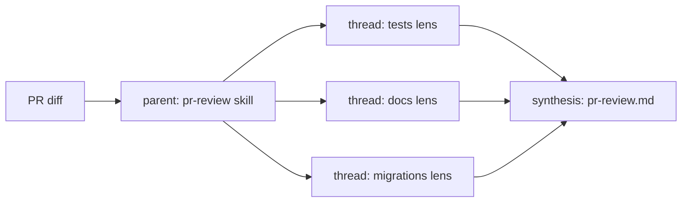

<p align="center">
  
</p>

<h1 align="center">genesis</h1>

<p align="center">
  <strong>Markdown that steers an LLM is code. Design it before you write it.</strong>
</p>

<p align="center">
  <a href="https://agentskills.io"></a>
  <a href="LICENSE"></a>
  <a href="https://github.com/danielmeppiel/genesis/stargazers"></a>
  <a href="https://github.com/danielmeppiel/genesis/commits/main"></a>
</p>

A design discipline for agent skills, agents, and instruction files &mdash; portable across Claude Code, Copilot, Cursor, OpenCode, and Codex. Names the primitives, maps the Gang-of-Four onto agent design, and gives you a process loop that survives long sessions.

```bash
apm install danielmeppiel/genesis
```

---

## Does this match anything you ship?

- **The agent file that grew teeth.** Your `CLAUDE.md` (or `.cursor/rules`, or `.github/copilot-instructions.md`) was forty lines. It is now four hundred. The agent ignores half of it and you cannot tell which half.
- **Great at turn one, confidently wrong by turn twenty.** The early constraints slid out of attention as the later notes piled up. Re-pasting holds for two turns, then drifts again.
- **The same paragraph in four places.** A convention copy-pasted across a skill, an instruction file, and a slash command. You edited one of them last week. The agent now contradicts itself depending on which one fires.

If two of these landed, keep reading.

## The thesis

An LLM is a capable but amnesiac engineer. Every turn starts with whatever fits in its context window and nothing else. That makes a skill or instruction file *code* &mdash; for an inferencing engine with a finite window, an attention drop-off, and a probabilistic output. Without an architectural discipline it dilutes into context bloat, cross-contaminated lenses, and quietly drifting outputs. Genesis is the discipline you apply *before* writing the file: name the primitives, choose a pattern, draw the diagram, persist the plan.

## What it produces

A common ask:

> *"Use the genesis-architect persona and the genesis discipline to design a skill that reviews my PRs before I do &mdash; checking for missing tests, undocumented public API, and unsafe migrations."*

Genesis produces this **before** writing any file. (The capitalized tokens are the substrate vocabulary defined in the [Primitives](#primitives) section that follows.)

**GOAL.** One reviewer that flags missing tests, undocumented public API, and unsafe migrations on a PR diff.

**PRIMITIVES.**
- `MODULE ENTRYPOINT` &mdash; the `pr-review` skill itself.
- `CHILD-THREAD SPAWN` &times; 3 &mdash; one per lens (tests, docs, migrations), so each runs in a fresh context window.
- `PLAN PERSISTENCE` &mdash; findings written to `pr-review.md` so a re-run on the same PR is comparable.

**PATTERN.** **Master-Worker** (genesis name: FAN-OUT + SYNTHESIZER). The parent skill spawns one worker per lens, each in a fresh context window, and synthesizes their findings into one verdict. Independent inquiries with no shared state should never compete in the same window &mdash; later lenses inherit attention drift from earlier ones.

**UML.**



**ACCEPTANCE.** On a PR with one missing test, one undocumented export, and a benign migration, the output names exactly two findings (no false positive on the migration), each citing the file path.

**PLAN.** `pr-review.md` written first. Only then does the agent author the skill, the persona, and the rule files.

This output is what the discipline buys you. The file you eventually write is the easy part.

## Primitives

Every harness implements the same six concepts under different folder names. Genesis names them once so the vocabulary outlives any one tool.

| Concept | What it is | Industry term |
|---|---|---|
| **PERSONA SCOPING FILE** | A document loaded at session start to scope WHO the agent is. | "agent file", "subagent", "mode" |
| **MODULE ENTRYPOINT** | A bundled, self-contained capability with assets and a contract. | "skill" ([agentskills.io](https://agentskills.io)) |
| **SCOPE-ATTACHED RULE FILE** | A constraint that auto-applies to a path or context. | "instruction", "rule", "memory" |
| **CHILD-THREAD SPAWN** | A primitive that creates a new context window running in parallel. | "subagent thread", "Task tool" |
| **TRIGGER ORCHESTRATOR** | A declarative pipeline that runs primitives on events. | "workflow", "hook", "automation" |
| **PLAN PERSISTENCE** | A stable artifact (file or DB) holding the active plan across turns. | "plan.md", "TODO state", "checkpoints" |

These names are deliberately generic. The discipline must outlive any one tool.

## Patterns

Genesis maps the Gang-of-Four onto agent design. The classical name is your Rosetta Stone; the AI-native name names the LLM-physics specifics (context isolation, dispatcher signatures, attention decay).

| GoF axis | Classical | AI-native | When |
|---|---|---|---|
| Creational | Factory Method | THREAD SPAWN | Work benefits from a fresh context window |
| Structural | Facade | ORCHESTRATOR FACADE | A multi-step capability needs to look like one signature |
| Behavioral | Master-Worker | FAN-OUT + SYNTHESIZER | >=3 independent lenses, no shared state |
| Behavioral | *(no analog)* | **ATTENTION ANCHOR** | Re-inject goal + constraints at every re-grounding boundary |

**ATTENTION ANCHOR is the LLM-physics-native pattern with no classical counterpart**, and the single most important behavioral pattern for any non-trivial agent task: without periodic re-injection of goal and hard constraints, long sessions silently drift from the original intent.

Full catalogue (19 design patterns + 6 architectural patterns + 4 refactor patterns): [`assets/design-patterns.md`](assets/design-patterns.md), [`assets/architectural-patterns.md`](assets/architectural-patterns.md), [`assets/refactor-patterns.md`](assets/refactor-patterns.md).

## The architect's loop

```
1.  STATE GOAL          --> one sentence, observable outcome
2.  NAME PRIMITIVES     --> which substrate concepts will you use?
3.  PICK PATTERN        --> architectural shape, then design patterns; justify in one line
3.5 COMPOSE OR BUILD?   --> can an existing module satisfy this?
4.  DRAW UML            --> mermaid, validate it renders
5.  ACCEPTANCE          --> what proves it works?
6.  PERSIST PLAN        --> write plan.md (or equivalent) BEFORE coding
7.  IMPLEMENT           --> author files; commit
7b. RELOAD PLAN         --> on every meaningful turn, re-read the plan
8.  STOP CONDITION      --> ship, or stop the design
```

Steps 6 and 7b are non-negotiable. They realize **PLAN MEMENTO** (state outside the context window) and **ATTENTION ANCHOR** (re-inject goal + constraints on every meaningful turn). Together they defeat the silent drift that ends most long agent sessions.

## Runtimes

| Harness | Persona file format | Skill folder | Adapter |
|---|---|---|---|
| **Claude Code** | `.claude/agents/*.md` (subagents) | `.claude/skills/` | [adapter](assets/runtime-affordances/per-harness/claude-code.md) |
| **GitHub Copilot CLI** | `.github/agents/*.agent.md` | `.github/skills/` | [adapter](assets/runtime-affordances/per-harness/copilot.md) |
| **Cursor** | `.cursor/rules/*.mdc` | `.cursor/skills/` | [adapter](assets/runtime-affordances/per-harness/cursor.md) |
| **OpenCode** | `.opencode/agent/*.md` | `.opencode/skills/` | [adapter](assets/runtime-affordances/per-harness/opencode.md) |
| **Codex** | `AGENTS.md` files | `~/.codex/skills/` | [adapter](assets/runtime-affordances/per-harness/codex.md) |

The primitives are the same. Only the file names change.

## Further reading

Genesis is the executable companion to *[The Agentic SDLC Handbook](https://github.com/danielmeppiel/agentic-sdlc-handbook)*. For the role-shift behind the discipline (architect / reviewer / escalation handler), read [ch 8: The Practitioner's Mindset](https://github.com/danielmeppiel/agentic-sdlc-handbook/blob/main/handbook/ch08-the-practitioners-mindset.qmd).

---

**MIT licensed.** If two failure modes above matched something you ship, [open an issue](https://github.com/danielmeppiel/genesis/issues/new) with which one &mdash; that's the data that shapes the next pattern.

<sub>By Daniel Meppiel &mdash; author of <a href="https://github.com/danielmeppiel/agentic-sdlc-handbook"><em>The Agentic SDLC Handbook</em></a>.</sub>
