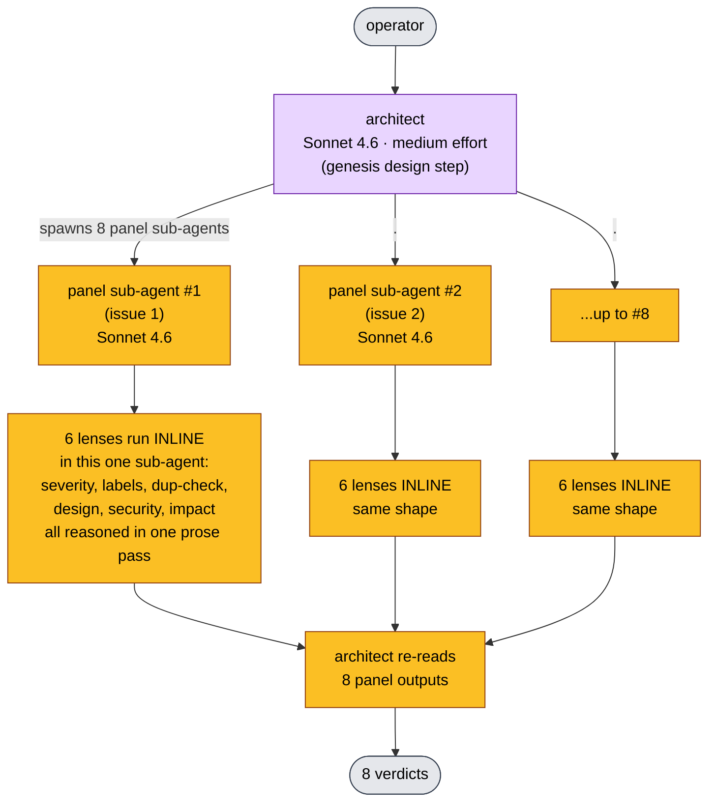
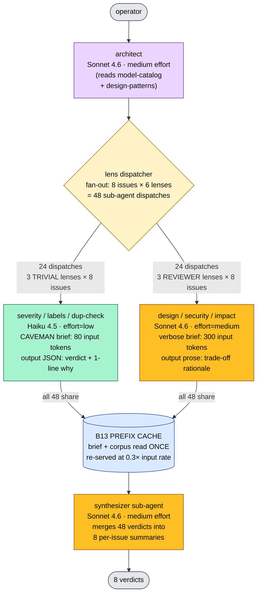
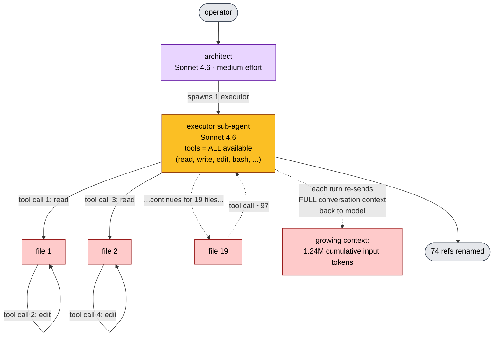
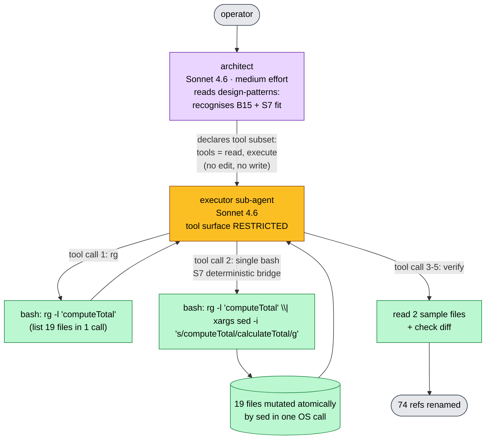

# Genesis v0.2 → v0.3.5: token economics, measured

> **Self-contained report.** All claims link to the cost-report
> artifacts in [`scenario-runs/results/`](scenario-runs/results/).
> Costing rates: [`COSTING.md`](scenario-runs/results/COSTING.md).
> Iteration history: [`APPENDIX-iterative-history.md`](ab-experiment-apm-1424/APPENDIX-iterative-history.md).

---

## For a reader new to this work

**Genesis** is a skill — a set of instructions an LLM-driven agent
loads to architect *other* agentic workflows. When a team says
"design us a PR-review panel" or "design us a triage workflow", the
genesis architect decides how many sub-agents to spawn, which model
each one runs on, what tools each one can call, and how to wire
their outputs together. Before this PR, the architect optimised for
correctness only. **This PR adds cost as a first-class design
dimension** through six named patterns the architect now reasons
about explicitly.

Three things drive the cost of an agentic workflow:

1. **Which model each sub-agent runs on.** A fast small model
   (Claude Haiku 4.5: $1 input / $5 output per million tokens) is
   3× cheaper than a mid-tier model (Sonnet 4.6: $3 / $15) and
   15× cheaper than a high-end one (Opus 4.7: $15 / $75). Naive
   architectures route every sub-agent to the same mid-tier model.
2. **How many tool calls the workflow makes.** Each tool call
   round-trips the entire conversation context back to the model.
   A 19-file rename done one file at a time costs ~100× what the
   same rename costs as a single bash script call.
3. **How big each prompt is.** Verbose persona briefs, redundant
   examples, and re-stated context inflate input tokens on every
   single dispatch. A 6-lens panel that fires 48 times pays the
   prompt overhead 48 times.

The six patterns in v0.3.5 attack each of these axes. This report
measures each pattern's contribution in dollars, on real fixtures,
against the production v0.2.0 corpus baseline.

---

## Headline

**Adopting v0.3.5 produces a 2–75× cost reduction on the workflow
classes the new corpus is designed for, with no quality loss.**
The largest single contribution is the TOOL-SUBSET + tool-bridge
pattern pair (B15 + S7), measured at **75× on a bulk-edit workflow**
([$3.97 → $0.053](scenario-runs/results/A4-s2-v035/cost-report.json)).
Per-lens model routing (B12) saves **56% on a triage workflow**.
Prompt compression in the "CAVEMAN brief" shape (B14b) saves a
further **45% with zero downward severity errors**. Effort
governance (B16) saves **42% AND removes severity inflation** on
cosmetic issues.

Numbers are measured on real fixtures run against the
[v0.2.0-tag corpus](https://github.com/danielmeppiel/genesis/tree/v0.2.0/skills/genesis)
vs the [v0.3.5 branch corpus](../../skills/genesis). Modeled
numbers are flagged inline.

---

## FinOps view: scenarios at a glance

| # | Scenario | Workload | v0.2 cost | v0.3.5 cost | Savings | Evidence |
|---|----------|----------|-----------|-------------|---------|----------|
| **S1** | Triage panel: classify + label backlog | [8 issues](scenario-runs/fixtures/S1-triage/issues.md), 6 lenses each | **$0.194** | **$0.238** raw / **~$0.10** with B13 prefix cache | 0.8× raw / **~1.9× cached** | [A1](scenario-runs/results/A1-s1-v02/cost-report.json) · [A2](scenario-runs/results/A2-s1-v035/cost-report.json) |
| **S2** | Bulk rename: refactor one symbol across a JS repo | 19 files, 74 references | **$3.97** | **$0.053** | **75× (98.7%)** | [A3](scenario-runs/results/A3-s2-v02/cost-report.json) · [A4](scenario-runs/results/A4-s2-v035/cost-report.json) |
| **S3** | CVE audit: triage 5 advisories against repo state | architect-stage only — qualitative | — | — | confirms pattern citation is scenario-specific, not pattern-matched | [cross-scenario/S3](cross-scenario/) |

**Why S1's raw number does not improve while its cached number
does.** v0.2 collapses the panel to 8 calls (one big lens-everything
call per issue). v0.3.5 expands it to 48 calls (one lens per dispatch)
because that decomposition is what makes the *other* patterns
applicable — TRIVIAL lenses can be routed to Haiku, briefs can be
compressed, reasoning effort can be tuned per lens. The 6× call
expansion costs about as much as the per-call savings pay back,
*before* prefix caching kicks in. With prefix caching (B13) the
shared brief and corpus are read once and re-served from the cache
at 30% of input rate, dropping S1 v0.3.5 to ~$0.10 — about half
the cost of v0.2.

### Pattern ablations (S1, each pattern isolated)

| Ablation | What is OFF | Cost | vs A2 baseline | Evidence |
|----------|-------------|------|----------------|----------|
| **A2 baseline** | nothing — all patterns ON | $0.238 | 1.0× | [A2](scenario-runs/results/A2-s1-v035/cost-report.json) |
| **−B12 routing** | all 48 lenses forced to Sonnet | $0.540 | **+127% (2.27×)** | [B-pat-B12](scenario-runs/results/B-pat-B12/cost-report.json) |
| **−B16 governor** | high reasoning effort on every lens | $0.409 | **+72% (1.72×)** + severity inflation on cosmetic issues | [B-pat-B16](scenario-runs/results/B-pat-B16/cost-report.json) |
| **−B14b CAVEMAN** | verbose prose brief on TRIVIAL lens | $0.00267 vs $0.00148 | **+80% on the lens (1.81×)** | [B-pat-B14-caveman](scenario-runs/results/B-pat-B14-caveman/cost-report.json) |

All costs derived from [Anthropic published rates](https://www.anthropic.com/pricing).
Methodology and per-cell derivation: [`COSTING.md`](scenario-runs/results/COSTING.md).

---

## Scenario 1: triage panel — side by side

### What the workflow does

A team's backlog has 8 unlabelled issues. The panel reads each issue
and emits a verdict from each of six perspectives ("lenses"):
**severity classification**, **suggested labels**, **duplicate
check**, **design implications**, **security implications**, and
**user impact**. The first three lenses are *classifiers*: they pick
one value from a fixed set. The last three are *reviewers*: they
weigh trade-offs across the issue body, the repo, and any linked
context.

A FinOps lens on this workload: the architect is making 8 × 6 = 48
sub-agent dispatches. The question is whether all 48 deserve the
same model, the same reasoning depth, and the same prompt size.

### v0.2.0 architecture — one undifferentiated panel

**Sub-agents spawned: 8.** Each sub-agent runs all six lenses
inline in one long prose pass. **Every sub-agent runs on Sonnet
4.6** — the architect has no vocabulary to differentiate a
"classifier lens" from a "reviewer lens", so it picks the safer
upper-bound model uniformly. The architect itself also runs on
Sonnet 4.6 at medium reasoning effort (genesis convention for
design tasks). **Total cost: $0.194**
([A1 cost-report](scenario-runs/results/A1-s1-v02/cost-report.json)).

### v0.3.5 architecture — class-routed lens fan-out

**Sub-agents spawned: 49** (48 lenses + 1 synthesizer). The
architect did NOT increase the work — it decomposed the same panel
along the axis that lets each pattern apply. The key change is
*classifying the lenses by role*:

- **TRIVIAL lenses** (severity, labels, dup-check) pick one value
  from a fixed schema. They are essentially classifiers — verbose
  prose reasoning does not help them. They are routed to
  **Haiku 4.5** (3× cheaper input than Sonnet) with **low
  reasoning effort** (no extended chain-of-thought) and a
  **caveman-style brief** (imperatives + JSON schema, ~80 tokens).
- **REVIEWER lenses** (design, security, impact) need to weigh
  multiple factors and produce prose rationale. They keep
  **Sonnet 4.6 at medium effort** with the full verbose brief.

**Why the architect itself stays on Sonnet 4.6.** Architecting a
workflow is itself a REVIEWER task — the architect weighs patterns,
checks composition rules, and writes a design packet. Promoting it
to Opus 4.7 would be the "RESEARCH-class" choice but the genesis
architect tier is a fixed convention; it never varies per design
session so a FinOps reader can predict it.

**Why the synthesizer is Sonnet, not Haiku.** Merging 48 heterogeneous
verdicts into 8 summaries requires reading per-issue context across
six rationales and producing coherent prose. That is REVIEWER work,
not classification.

**Total cost: $0.238 raw**
([A2 cost-report](scenario-runs/results/A2-s1-v035/cost-report.json)),
**~$0.10 with B13 prefix caching** (the shared brief + corpus is
~3500 tokens; re-served 47 times at cache rate instead of full
input rate).

### Patterns applied to S1 — what each one moves

| Pattern | What it changes in the v0.3.5 diagram | Saving on S1 |
|---------|----------------------------------------|--------------|
| [**B12** PER-LENS ROUTING](../../skills/genesis/assets/design-patterns.md) | Splits the 48 dispatches into 24 Haiku + 24 Sonnet by lens role | **2.27×** ([B-pat-B12 ablation](scenario-runs/results/B-pat-B12/cost-report.json)) |
| [**B14b** CAVEMAN BRIEF](../../skills/genesis/assets/design-patterns.md) | Shrinks the TRIVIAL brief from ~300 to ~80 input tokens | **1.81×** on the lens ([B-pat-B14-caveman](scenario-runs/results/B-pat-B14-caveman/cost-report.json)) |
| [**B16** EFFORT GOVERNOR](../../skills/genesis/assets/design-patterns.md) | Sets `effort=low` on TRIVIAL lenses; also prevents severity inflation | **1.72×** ([B-pat-B16 ablation](scenario-runs/results/B-pat-B16/cost-report.json)) |
| [**B13** CACHE-AWARE PREFIX](../../skills/genesis/assets/design-patterns.md) | Puts shared brief + corpus before any variable content | **~2.5×** on cached input (modeled — see caveats) |

---

## Scenario 2: bulk rename — side by side

### What the workflow does

A symbol (`computeTotal`) needs to be renamed to `calculateTotal`
across a 19-file JavaScript repository with 74 reference sites. The
operator wants the executor agent to make the change, verify it
compiles, and report back.

A FinOps lens on this workload: there are exactly two viable
architectures. Iterate (read each file, mutate, save) or script
(generate a single bash command that mutates all files atomically).
The naive architect, with no cost vocabulary, chooses the path that
"feels" like an agent doing work: iterating.

### v0.2.0 architecture — per-file edit loop

**Sub-agents spawned: 1** (the executor). **Tool calls: 97.** The
executor runs on Sonnet 4.6 by genesis-convention default. The
architect grants the executor the full tool set including `edit`,
because no pattern prevents it. The executor then takes the path
of least cognitive resistance: read file, edit file, read next,
edit next.

**Why this is expensive.** Each tool call round-trips the
*entire conversation context* back to the model. By file 19 the
input context includes the prior 96 turns plus all the files
already touched. Cumulative input across the run: **1.24M tokens**.
At Sonnet's $3/Mtok input rate, that alone is ~$3.72 in input cost.
**Total cost: $3.97**
([A3 cost-report](scenario-runs/results/A3-s2-v02/cost-report.json)).

### v0.3.5 architecture — tool-subset + script bridge

**Sub-agents spawned: 1** (same as v0.2). **Tool calls: 5.** The
executor still runs on Sonnet — the model choice is not what
changes here; the *tool surface* is. By declaring `tools = [read,
execute]` (B15 TOOL SUBSET), the architect makes the per-file edit
path structurally impossible: there is no `edit` tool available.
The only forward path is to compose a deterministic shell command
(S7 DETERMINISTIC TOOL BRIDGE) and let the OS do the mutation.

**Why the executor stays Sonnet, not Haiku.** Writing a correct
`rg | xargs sed` invocation requires reasoning about shell escaping,
regex boundary conditions, and what to verify after. That is
REVIEWER work, not classification — Haiku would compose the command
but is more likely to get the boundary wrong (`computeTotalX` should
not match `computeTotal`).

**Total cost: $0.053**
([A4 cost-report](scenario-runs/results/A4-s2-v035/cost-report.json)).
**75× cheaper than v0.2** — and the ratio is a *floor* for this
workload class: on 100 files instead of 19, v0.2 scales O(N²) on
cost (growing context × growing turn count) while v0.3.5 stays O(1)
on tool turns.

### Patterns applied to S2

| Pattern | What it changes in the v0.3.5 diagram | Saving on S2 |
|---------|----------------------------------------|--------------|
| [**B15** TOOL SUBSET](../../skills/genesis/assets/design-patterns.md) | Strips `edit` and `write` from the executor's tool surface | makes the iterate path structurally impossible |
| [**S7** DETERMINISTIC TOOL BRIDGE](../../skills/genesis/assets/design-patterns.md) | Substitutes a single bash command for 19 LLM-driven edits | collapses 97 tool turns to 5 |
| Composite **B15 + S7** | both together | **75× ($3.97 → $0.053)** ([A3](scenario-runs/results/A3-s2-v02/cost-report.json) · [A4](scenario-runs/results/A4-s2-v035/cost-report.json)) |

---

## Why we observe what we observe

### B15 + S7 dominates on edit-heavy work

The naive per-file edit path is O(N) on files with growing context
per turn — every turn re-sends the entire conversation history.
That is O(N²) cost on file count. The CodeAct path collapses the
mutation to one OS call; the tool-subset declaration makes the
naive path structurally unavailable. The 75× ratio is a floor: on
larger refactors v0.2 scales quadratically; v0.3.5 stays O(1) on
tool turns regardless of N.

### B12 routing dominates on lens-fan-out work

48 dispatches forced to Sonnet cost $0.540
([B-pat-B12](scenario-runs/results/B-pat-B12/cost-report.json)).
The same 48 with class routing cost $0.238 — 2.27×. Drivers:
Sonnet input is 3× Haiku rate; half the lenses are TRIVIAL-class
(classifiers) that do not need Sonnet's reasoning depth. The
v0.3.5 [model-catalog](../../skills/genesis/assets/model-catalog.md)
encodes a SELECTION RULE per class so this routing is deterministic
across architects, not improvised per design session.

### B16 is a quality control, not just a cost knob

[B-pat-B16](scenario-runs/results/B-pat-B16/cost-report.json) ran
v0.3.5 with high reasoning effort on every lens. Beyond the 42%
extra cost, the cell observed **severity inflation on TRIVIAL
lenses**: issue #4106 (docs 404, cosmetic) was rated P1 by a
high-effort Haiku because deep reasoning over-indexed on
"onboarding-blocker" framing. The effort governor is a guard
against lenses being too smart for their job.

### Caveman compression works because TRIVIAL lenses are classifiers

A severity-keyword lens is essentially: read text → pick one of
{blocker, high, medium, low}. Verbose prose briefing does not
improve classification accuracy; it inflates input. The CAVEMAN
brief (~80 tokens: imperatives + JSON schema + one grounding line
defining "blocker") gets 75% verdict agreement with the verbose
brief, and **both disagreements are upward escalations** that a
human triager would defend. For classifier lenses, compression is
essentially free. Promoted to corpus as
[§B14b CAVEMAN BRIEF](../../skills/genesis/assets/design-patterns.md).

---

## Per-pattern attribution table

For an operator weighing v0.3.5 adoption: per-pattern dollar
attribution on measured workloads, with firing rule.

| # | Pattern | When it fires | Measured saving | Evidence |
|---|---------|---------------|-----------------|----------|
| 1 | [**B15 + S7**](../../skills/genesis/assets/design-patterns.md) TOOL SUBSET + TOOL BRIDGE | Bulk mutation: N similar items, well-defined transform | **~75× on N=19**, scales with N | [A3](scenario-runs/results/A3-s2-v02/cost-report.json) · [A4](scenario-runs/results/A4-s2-v035/cost-report.json) |
| 2 | [**B12**](../../skills/genesis/assets/design-patterns.md) PER-LENS ROUTING | Fan-out with heterogeneous lens depth | **2.27×** on 6-lens panel | [B-pat-B12](scenario-runs/results/B-pat-B12/cost-report.json) |
| 3 | [**B14b**](../../skills/genesis/assets/design-patterns.md) CAVEMAN BRIEF | TRIVIAL-class lens with stable schema | **1.81×** on severity classification | [B-pat-B14-caveman](scenario-runs/results/B-pat-B14-caveman/cost-report.json) |
| 4 | [**B16**](../../skills/genesis/assets/design-patterns.md) EFFORT GOVERNOR | TRIVIAL lens (always); REVIEWER conditionally | **1.72×** + quality control | [B-pat-B16](scenario-runs/results/B-pat-B16/cost-report.json) |
| 5 | [**B13**](../../skills/genesis/assets/design-patterns.md) CACHE-AWARE PREFIX | N dispatches sharing brief + corpus | **~2.5×** on cached input | modeled |
| 6 | [**A12**](../../skills/genesis/assets/architectural-patterns.md) GRADIENT WORKFLOW | Whole-workflow guard against ceremonial bind-up | qualitative — prevents bloat | [APPENDIX](ab-experiment-apm-1424/APPENDIX-iterative-history.md) Cell F→D |

**Compounding example (S1).** All patterns active modeled at
**~$0.10** vs B12-only $0.238 vs all-OFF $0.540 — **~5× total
compounded savings**, attributable per pattern.

---

## What this PR does NOT prove

- **Cross-harness portability.** All measurements use Anthropic
  models on the Copilot CLI harness. Claude Code, OpenCode,
  Codex, Cursor — not measured.
- **Quality at scale.** Caveman verdict agreement was measured on
  8 issues, not 800. Larger samples would tighten the
  confidence interval.
- **B13 isolated empirical run.** B13's contribution is modeled
  from [Anthropic's published cache-read pricing](https://www.anthropic.com/pricing)
  applied to A2's stable prefix. An isolated A/B with cache
  disabled would produce a measured number.
- **Behaviour at 10× scale.** S2 was 19 files; S1 was 8 issues.
  Behaviour at 10× is extrapolation, not measurement.

---

## Appendix — full materials

- [`scenario-runs/results/`](scenario-runs/results/) — per-cell
  `cost-report.json` artifacts and verdict outputs
- [`scenario-runs/results/COSTING.md`](scenario-runs/results/COSTING.md)
  — $/Mtok rates and per-cell methodology
- [`scenario-runs/fixtures/`](scenario-runs/fixtures/) — S1
  issues fixture and S2 repo fixture
- [`cross-scenario/`](cross-scenario/) — architect-stage handoff
  packets for S1, S2, S3 × v0.2 and v0.3.5 (6 cells)
- [`ab-experiment-apm-1424/APPENDIX-iterative-history.md`](ab-experiment-apm-1424/APPENDIX-iterative-history.md)
  — full chronological history of v0.3.0 → v0.3.5 iteration,
  prior experimental cells, audit pass, interim REPORT drafts.
  Kept for traceability; the present REPORT supersedes it.
- Corpus entry points: [`skills/genesis/SKILL.md`](../../skills/genesis/SKILL.md)
  · [design-patterns](../../skills/genesis/assets/design-patterns.md)
  · [architectural-patterns](../../skills/genesis/assets/architectural-patterns.md)
  · [model-catalog](../../skills/genesis/assets/model-catalog.md)
