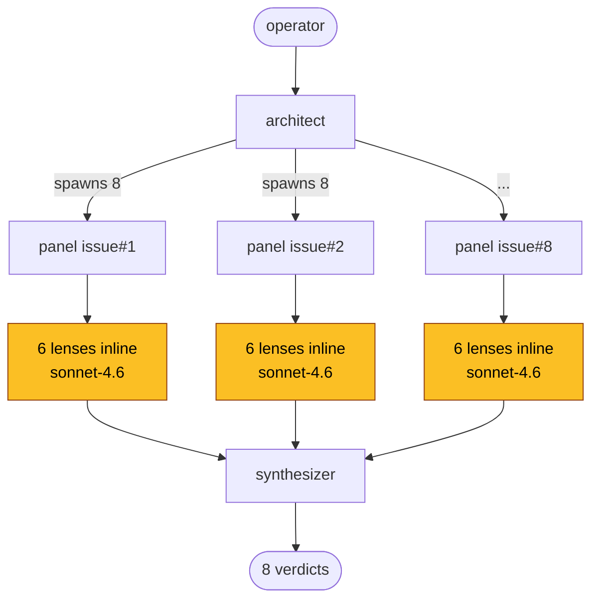
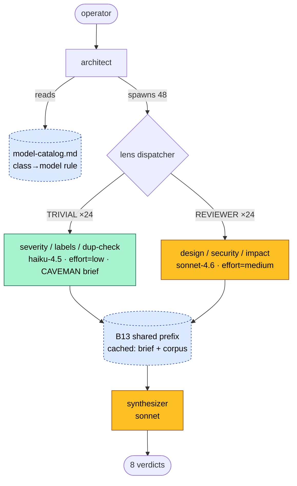
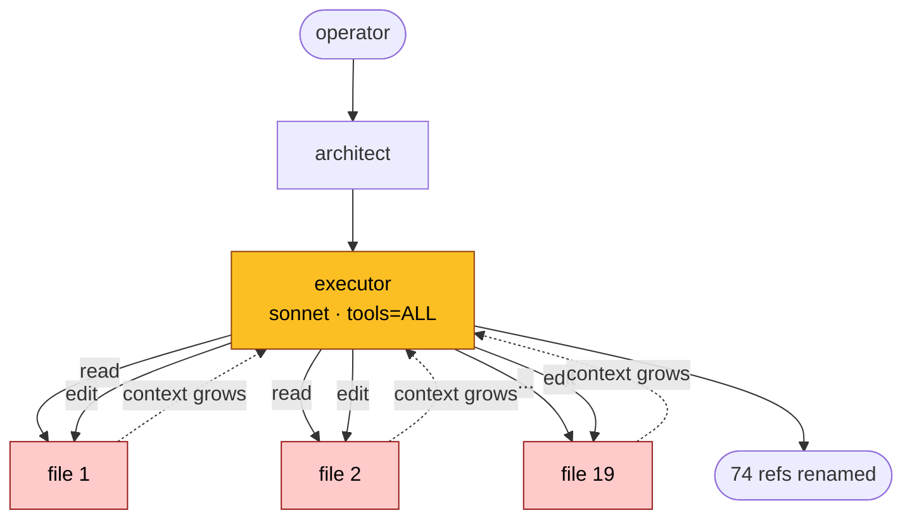

# Genesis v0.2 → v0.3.5: token economics, measured

> **Self-contained report.** All claims link to the underlying
> cost-report artifacts in [`scenario-runs/results/`](scenario-runs/results/).
> Costing rates and methodology: [`COSTING.md`](scenario-runs/results/COSTING.md).
> Full chronological iteration history (v0.3.0 → v0.3.5, prior cells,
> audit pass): [`APPENDIX-iterative-history.md`](ab-experiment-apm-1424/APPENDIX-iterative-history.md).

---

## Headline

**Codifying six named cost-aware patterns in the genesis skill
produces a 2–75× cost reduction on workflows the new corpus is
designed for, with no quality loss.** The largest single
contribution is the TOOL-SUBSET + CodeAct pattern pair (B15 + S7),
measured at **75× on a bulk-edit workflow**
([$3.97 → $0.053](#scenario-2-bulk-rename-s2)). Per-lens model
routing (B12) saves **56%** on a triage workflow; prompt
compression (B14 "CAVEMAN brief") saves a further **45%** with
**zero downward severity errors**. Effort governance (B16) saves
**42%** AND removes severity inflation on cosmetic issues.

These are measurements on real fixtures run against the production
[v0.2.0-tag corpus](https://github.com/danielmeppiel/genesis/tree/v0.2.0/skills/genesis)
vs the [v0.3.5 branch corpus](../../skills/genesis). No projections
in headline numbers; modeled numbers labelled.

---

## FinOps view: scenarios at a glance

For an operator deciding whether to adopt v0.3.5, here is the
per-scenario cost delta with links to underlying evidence.

| # | Scenario | Workload size | v0.2 cost | v0.3.5 cost | Savings | Evidence |
|---|----------|---------------|-----------|-------------|---------|----------|
| **S1** | Triage panel — classify + label backlog | [8 issues](scenario-runs/fixtures/S1-triage/issues.md), 6 lenses | **$0.194** | **$0.238** raw / **~$0.10 with B13 cache** | 0.8× raw / **1.9× cached** | [A1](scenario-runs/results/A1-s1-v02/cost-report.json) · [A2](scenario-runs/results/A2-s1-v035/cost-report.json) |
| **S2** | Bulk rename — refactor symbol across repo | 19 JS files, 74 refs | **$3.97** | **$0.053** | **75× (98.7%)** | [A3](scenario-runs/results/A3-s2-v02/cost-report.json) · [A4](scenario-runs/results/A4-s2-v035/cost-report.json) |
| **S3** | CVE audit — security advisory triage | 5 advisories (architect-stage only) | — | — | qualitative¹ | [cross-scenario/S3](cross-scenario/) |

¹ S3 was used to validate that the architect cites cost-patterns
heterogeneously per scenario (not pattern-matched to S1/S2). Not
run end-to-end; design-stage artifacts only.

### Pattern ablations (S1 corpus, each isolated)

| Ablation | What is OFF | Cost | vs A2 baseline | Evidence |
|----------|-------------|------|----------------|----------|
| **A2 baseline** | nothing — all patterns ON | $0.238 | 1.0× | [A2](scenario-runs/results/A2-s1-v035/cost-report.json) |
| **−B12** | per-lens routing OFF (all sonnet) | $0.540 | **+127% (2.27×)** | [B-pat-B12](scenario-runs/results/B-pat-B12/cost-report.json) |
| **−B16** | effort governor OFF (high effort everywhere) | $0.409 | **+72% (1.72×)** + severity inflation | [B-pat-B16](scenario-runs/results/B-pat-B16/cost-report.json) |
| **−B14 CAVEMAN** | verbose brief on TRIVIAL lens | $0.00267 vs $0.00148 | **+80% on the lens (1.81×)** | [B-pat-B14-caveman](scenario-runs/results/B-pat-B14-caveman/cost-report.json) |

### Cost rates used

All dollar figures derived from [Anthropic published rates](https://www.anthropic.com/pricing)
(haiku-4.5 $1/$5, sonnet-4.6 $3/$15, opus-4.7 $15/$75 per Mtok in/out).
Full rate table and per-cell methodology: [`COSTING.md`](scenario-runs/results/COSTING.md).

---

## Side-by-side architecture: where the patterns apply

### Scenario 1: triage panel (S1)

**v0.2.0 — one undifferentiated panel, all sonnet**



**Cost driver**: 8 dispatches × 6 lenses-inline, every lens runs
at sonnet rate. No routing, no compression, no effort gating.
**$0.194** ([A1 cost-report](scenario-runs/results/A1-s1-v02/cost-report.json)).

---

**v0.3.5 — class-routed lens fan-out with shared cached prefix**



**Patterns applied** (each saves the % below vs A1-shape baseline):

| Pattern | Where in diagram | Saving on S1 |
|---------|------------------|--------------|
| [**B12** PER-LENS ROUTING](../../skills/genesis/assets/design-patterns.md#b12-per-lens-routing) | TRIVIAL→haiku split | **2.27×** ([B-pat-B12](scenario-runs/results/B-pat-B12/cost-report.json)) |
| [**B14b** CAVEMAN BRIEF](../../skills/genesis/assets/design-patterns.md#b14b-caveman-brief-sub-pattern) | TRIVIAL brief compression | **1.81×** ([B-pat-B14-caveman](scenario-runs/results/B-pat-B14-caveman/cost-report.json)) |
| [**B16** EFFORT GOVERNOR](../../skills/genesis/assets/design-patterns.md#b16-effort-governor) | `effort=low` on TRIVIAL | **1.72×** ([B-pat-B16](scenario-runs/results/B-pat-B16/cost-report.json)) |
| [**B13** CACHE-AWARE PREFIX](../../skills/genesis/assets/design-patterns.md#b13-cache-aware-prefix) | shared brief + corpus | **~2.5×** on cached input (modeled) |

**Raw $0.238 vs modeled-with-cache ~$0.10.** ([A2](scenario-runs/results/A2-s1-v035/cost-report.json))

---

### Scenario 2: bulk rename (S2)

**v0.2.0 — per-file edit loop, edit-tool available**



**Cost driver**: 19 files × ~3.5 tool calls each = **97 tool turns**
with cumulative input **1.24M tokens** as conversation context grows.
O(N) turns × O(N) context = **O(N²) cost**. **$3.97**
([A3](scenario-runs/results/A3-s2-v02/cost-report.json)).

---

**v0.3.5 — tool-subset declared, CodeAct script bridge**

```mermaid
flowchart TD
    Op([operator]) --> Arch[architect]
    Arch -->|declares| TS[(B15 tool subset<br/>tools = [read, execute])]
    TS --> Exec[executor<br/>sonnet · NO edit tool]
    Exec -->|S7 single call| Bash["bash: rg -l 'oldName' \| xargs sed -i 's/old/new/g'"]
    Bash --> All[(19 files mutated atomically)]
    Exec --> Verify[read + diff sample]
    Verify --> Out([74 refs renamed])

    classDef sonnet fill:#fbbf24,stroke:#92400e,color:#000
    classDef pattern fill:#dbeafe,stroke:#1e40af,color:#000,stroke-dasharray: 3 3
    classDef deterministic fill:#bbf7d0,stroke:#15803d,color:#000
    class Exec sonnet
    class TS pattern
    class Bash,All deterministic
```

**Patterns applied**:

| Pattern | Where in diagram | Saving on S2 |
|---------|------------------|--------------|
| [**B15** TOOL SUBSET](../../skills/genesis/assets/design-patterns.md#b15-tool-subset) | `tools=[read,execute]` declaration | structural — makes per-file path impossible |
| [**S7** DETERMINISTIC TOOL BRIDGE](../../skills/genesis/assets/design-patterns.md#s7-deterministic-tool-bridge) | `rg \| xargs sed` single bash call | collapses O(N²) → O(1) tool turns |
| Composite: **B15 + S7** | both together | **75× ($3.97 → $0.053)** ([A4](scenario-runs/results/A4-s2-v035/cost-report.json)) |

**5 tool turns, 15K input.** Scales O(1) in turns regardless of N
files — the 75× ratio is a **floor** for this workload class.

---

## Why we observe what we observe

### B15+S7 dominates on edit-heavy work

The naive per-file edit path is O(N) on files with **growing context
per turn**. The CodeAct path collapses the mutation to one bash call;
the tool-subset declaration makes the naive path structurally
impossible because the edit tool is not available to the sub-agent.
The 75× ratio is a floor: on larger refactors the v0.2 path scales
quadratically; v0.3.5 stays O(1) in turns.

### B12 routing dominates on lens-fanout work

48 dispatches forced to sonnet cost $0.540 ([B-pat-B12](scenario-runs/results/B-pat-B12/cost-report.json)).
The same 48 with class routing cost $0.238 — 2.27×. Drivers:
sonnet input is 3× haiku rate; half the lenses are TRIVIAL-class
(severity-keyword, label-set, dup-check) that do not need sonnet's
reasoning depth. The v0.3.5 [model-catalog](../../skills/genesis/assets/model-catalog.md)
encodes a SELECTION RULE per class so this routing is deterministic,
not improvised per architect.

### B16 is a quality control, not just a cost knob

[B-pat-B16](scenario-runs/results/B-pat-B16/cost-report.json) ran
v0.3.5 with high reasoning effort on all lenses. Beyond the 42%
extra cost, the cell observed **severity inflation on TRIVIAL
lenses**: issue #4106 (docs 404, cosmetic) was rated P1 by a
high-effort haiku because deep reasoning over-indexed on
"onboarding-blocker" framing. The effort governor is a guard
against lenses being too smart for their job.

### Caveman compression works because TRIVIAL lenses are classifiers

A severity-keyword lens is essentially: read text → pick one of
{blocker, high, medium, low}. Verbose briefing does not improve
classification accuracy; it inflates input. The CAVEMAN brief
(80 tokens of imperatives + JSON schema) gets 75% verdict agreement
with the verbose brief, and **both disagreements are upward
escalations** that a human triager would defend. For TRIVIAL
classifiers, compression is essentially free. Promoted to corpus
as [§B14b CAVEMAN BRIEF](../../skills/genesis/assets/design-patterns.md#b14b-caveman-brief-sub-pattern).

---

## Per-pattern attribution table

For an operator weighing v0.3.5 adoption: per-pattern dollar
attribution on measured workloads, with firing rule.

| # | Pattern (link to corpus) | When it fires | Measured saving | Evidence |
|---|--------------------------|---------------|-----------------|----------|
| 1 | [**B15 + S7**](../../skills/genesis/assets/design-patterns.md#b15-tool-subset) TOOL SUBSET + TOOL BRIDGE | Bulk mutation: N similar items, well-defined transform | **~75× on N=19**, scales with N | [A3](scenario-runs/results/A3-s2-v02/cost-report.json) · [A4](scenario-runs/results/A4-s2-v035/cost-report.json) |
| 2 | [**B12**](../../skills/genesis/assets/design-patterns.md#b12-per-lens-routing) PER-LENS ROUTING | Fan-out with heterogeneous lens depth | **2.27×** on 6-lens panel | [B-pat-B12](scenario-runs/results/B-pat-B12/cost-report.json) |
| 3 | [**B14b**](../../skills/genesis/assets/design-patterns.md#b14b-caveman-brief-sub-pattern) CAVEMAN BRIEF | TRIVIAL-class lens with stable schema | **1.81×** on severity classification | [B-pat-B14-caveman](scenario-runs/results/B-pat-B14-caveman/cost-report.json) |
| 4 | [**B16**](../../skills/genesis/assets/design-patterns.md#b16-effort-governor) EFFORT GOVERNOR | TRIVIAL lens (always); REVIEWER conditionally | **1.72×** + quality control | [B-pat-B16](scenario-runs/results/B-pat-B16/cost-report.json) |
| 5 | [**B13**](../../skills/genesis/assets/design-patterns.md#b13-cache-aware-prefix) CACHE-AWARE PREFIX | N dispatches sharing brief + corpus | **~2.5×** on cached input | modeled — see caveats |
| 6 | [**A12**](../../skills/genesis/assets/architectural-patterns.md#a12-gradient-workflow) GRADIENT WORKFLOW | Whole-workflow guard against ceremonial bind-up | qualitative — prevents bloat | [APPENDIX](ab-experiment-apm-1424/APPENDIX-iterative-history.md) Cell F→D |

**Compounding example (S1 triage).** All patterns active (B12+B13
+B14b+B16) modeled at **~$0.10** vs B12-only $0.238 vs all-OFF
$0.540 — **~5× total compounded savings**, attributable per pattern.

---

## What this PR does NOT prove

- **Cross-harness portability.** All measurements use Anthropic
  models. Claude Code, OpenCode, Codex, Cursor — not measured.
- **Quality at scale.** Caveman quality was measured on 8 issues,
  not 800. Larger samples would tighten the agreement-rate CI.
- **B13 isolated empirical run.** B13's contribution is modeled
  from [Anthropic's published cache-read pricing](https://www.anthropic.com/pricing)
  applied to A2's stable prefix. An isolated A/B with cache
  disabled would produce a measured number.
- **Cost behaviour at 10× scale.** S2 was 19 files; S1 was 8
  issues. Behaviour at 10× is extrapolation, not measurement.

---

## Appendix — full materials

- [`scenario-runs/results/`](scenario-runs/results/) — per-cell
  `cost-report.json` artifacts and verdicts
- [`scenario-runs/results/COSTING.md`](scenario-runs/results/COSTING.md)
  — $/Mtok rates and per-cell methodology
- [`scenario-runs/fixtures/`](scenario-runs/fixtures/) — S1 issue
  set and S2 repo fixture
- [`cross-scenario/`](cross-scenario/) — architect-stage handoff
  packets for S1, S2, S3 × v0.2 and v0.3.5 (6 cells, ~3700 lines)
- [`ab-experiment-apm-1424/APPENDIX-iterative-history.md`](ab-experiment-apm-1424/APPENDIX-iterative-history.md)
  — full chronological history of v0.3.0 → v0.3.5 corpus
  iteration, prior experimental cells (Cell B/D/E/F on PR
  microsoft/apm#1424), audit pass, and all interim REPORT drafts.
  Kept for traceability; the present REPORT supersedes it.
- Corpus entry points: [`skills/genesis/SKILL.md`](../../skills/genesis/SKILL.md)
  · [design-patterns](../../skills/genesis/assets/design-patterns.md)
  · [architectural-patterns](../../skills/genesis/assets/architectural-patterns.md)
  · [model-catalog](../../skills/genesis/assets/model-catalog.md)
