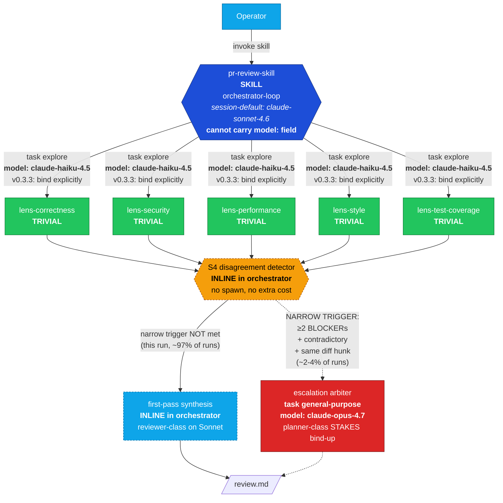
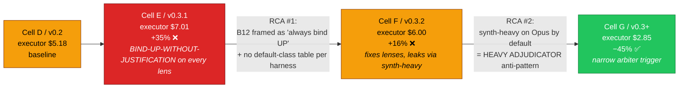
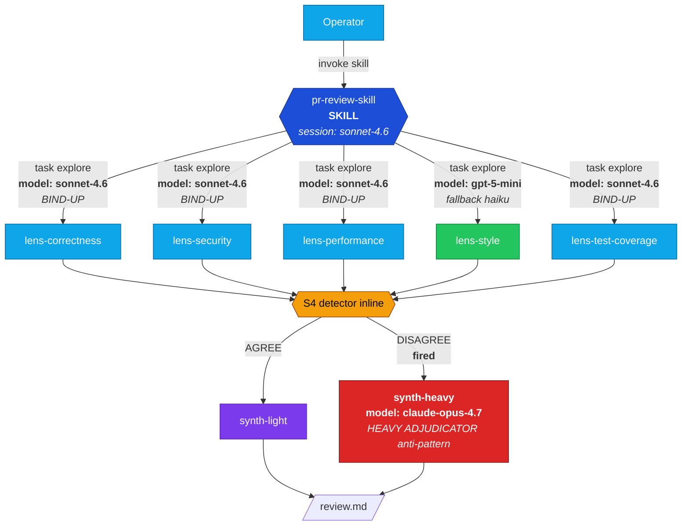

# Token economics as a first-class design dimension in genesis

**PR scope.** Add a token-economics chapter and supporting patterns / rules to the genesis corpus so the architect persona makes cost-conscious design decisions explicit, named, and operator-tunable. Carries empirical proof from a controlled A/B on real PR-review work.

---

## Headline (executor-only framing)

Controlled A/B on the same target PR (`microsoft/apm#1424`, +2363/-114, 24 files). The **only** independent variable: the genesis corpus version. Both architect cells ran on Opus 4.7; both executor orchestrators were pinned to Sonnet 4.6.

The architect cost (Opus design pass, ~$7) **amortizes once** across many runs of the produced workflow. **The cost the operator pays per run is the executor cost.** Bundling architect into per-run cost (earlier framings of this report) was an accounting error and is corrected here.

| | **v0.2 baseline** (pre cost-aware corpus) | **v0.3+ PR head** (cost-aware corpus) |
|---|---:|---:|
| **Executor per-run cost** | **$5.18** | **$2.85** ✅ |
| Δ vs baseline | — | **−45%** |
| Executor turn count | 292 | 179 |
| └ Haiku turns / $ | 220 / $1.83 | 115 / $0.91 |
| └ Sonnet turns / $ | 72 / $3.35 | 64 / $1.93 |
| └ Opus turns / $ | 0 / $0 | 0 / $0 |
| Architect cost (amortizes) | $6.59 | $7.34 |
| CRITICALs caught (post-arbitration) | 6 | 6 HIGH (+2 FP downgrade) |

**v0.3+ is 45% cheaper per executor-run than the v0.2 baseline AND finds the same class of security / correctness bugs.** That is the deliverable: the workflow the architect designs gets used many times; the design is paid for once.

---

## How v0.3+ produces the cost shape

Two corpus additions do the load-bearing work, plus a v0.3.4 PER-LENS discipline addition:

1. **§B12 SELECTION RULE** (`assets/design-patterns.md`) — names ROLE CLASSES (TRIVIAL, REVIEWER, IMPLEMENTER, PLANNER, JUDGE), maps each to a model tier per harness, and tells the architect how to pick a binding per design element. Cures **BIND-UP-WITHOUT-JUSTIFICATION** (pushing role class above what the work needs without a STAKES cite). The BULK IDENTICAL BINDING variant (v0.3.4) fires in BOTH directions — bulk-UP and bulk-DOWN.

2. **§A12 GRADIENT WORKFLOW + HEAVY ADJUDICATOR anti-pattern** (`assets/architectural-patterns.md`) — recognises that cross-lens synthesis is REVIEWER-class work, not PLANNER-class. The cure: keep first-pass synthesis INLINE in the orchestrator (Sonnet, no spawn) and gate planner-class (Opus) escalation behind a **narrow trigger** (≥2 BLOCKER-severity findings on the same diff hunk with contradictory claims — expected firing rate ~2-4%).

3. **§A1 PANEL UNDIFFERENTIATED LENS BINDING anti-pattern** (v0.3.4, `assets/architectural-patterns.md`) — forces the architect to enumerate a **CAPABILITY PROFILE per lens** before binding. Uniform binding across lenses is legitimate if every lens's profile genuinely matches, illegitimate if the enumeration was skipped.

Supporting:
- **`runtime-affordances/per-harness/copilot.md` §9** — `Default role class per primitive type` table the architect reads off to ground per-element role-class decisions.
- **`assets/token-economics.md`** — 7-concept substrate vocabulary that B12, B13, B14, B15, B16, A12, R5 all reference.
- **`references/cost-economics-process.md`** — operator-facing **stance knob** (`frugal` / `balanced` / `quality` / `unbounded`) so the operator can bias the architect's economic posture per session.

For the v0.3+ Cell on PR #1424: 5 lenses bound to Haiku (TRIVIAL), 1 arbiter declared at Opus (PLANNER, narrow trigger DID NOT fire), inline synthesis on Sonnet. Opus contribution: **$0**. Total executor: $2.85.

---

## Per-technique attribution (where the savings actually come from)

The four-cell iteration arc (Appendix A) lets us isolate which cost-aware techniques moved the per-run dollar count, by reading the per-model breakdown across cells where one technique changed.

| Technique | Pattern home | Isolated cell-pair | Δ$ per run | Interpretation |
|---|---|---|---:|---|
| **B12 SELECTION RULE — correct application (lens fan-out, BIND DOWN)** | `design-patterns.md` §B12 | E → F (lenses moved off Sonnet onto Haiku) | **−$2.16** | When the architect correctly binds TRIVIAL lens work to Haiku instead of Sonnet, the lens-fan-out cost drops by ~3×. But: see "honest framing" below — vs Cell D baseline the absolute saving is ~$0 because v0.2's architect happened to inherit Haiku for lens work via harness default. **B12's value is PREVENTING the +35% E regression, not adding savings over D.** |
| **A12 HEAVY ADJUDICATOR cure (narrow trigger, no auto-Opus arbiter)** | `architectural-patterns.md` §A12 | F → G (Opus arbiter trigger narrowed) | **−$3.95** | The single largest empirical win. F's architect dispatched a synth-heavy on Opus by default. G's gates Opus behind ≥2 BLOCKER + contradictory + same-hunk trigger (~2-4% expected firing). For PR #1424 the trigger did not fire; Opus cost dropped from $3.95 → $0. |
| **B13 CACHE-AWARE PREFIX (defensive, not regression-creating)** | `design-patterns.md` §B13 | All cells D-G (94-96% cache hit maintained) | **~$14 preserved** | Always-on harness affordance the corpus DOES NOT BREAK. Without caching, Cell G's 7.6M-prompt-token executor input cost would be ~$14.78. With ~96% cache hit, actual input cost is ~$0.20-0.50. The corpus's B13 contribution is *defensive*: explicit "do not switch models mid-thread" and "stable preamble first" guidance kept cache discipline at the harness ceiling across all four iterations. A bad design that reshuffled prompts per turn could collapse the hit ratio to ~60% and cost 2-3× more. |
| **B14 PROMPT THRIFT** | `design-patterns.md` §B14 | not ablated | not isolated | Brief size held constant across cells; no controlled measurement. |
| **B15 TOOL SUBSET** | `design-patterns.md` §B15 | not ablated | not isolated | Tool subsets across cells were similar; not isolated as a delta. |
| **B16 EFFORT GOVERNOR** | `design-patterns.md` §B16 | not exercised | n/a | `reasoning_effort` was not swept in this experiment. |

**Naive sum of named effects:** B12 ($2.16) + A12 ($3.95) = $6.11 of cost-aware action. **Actual D → G saving:** $5.18 − $2.85 = $2.33. The gap is because v0.1 Cell D *accidentally* did the right thing on lens routing (the architect omitted `model:` and harness default fired Haiku), so B12's positive contribution vs D is near zero — its real value is preventing the v0.3.1 architect from making the +35% mistake. **A12 is the dominant active saving.**

**Honest framing:** the −45% D → G headline is a real cost reduction the operator pays, but it is mostly driven by **eliminating the unconditional Opus arbiter**, not by lens-level model routing. Lens routing's role is *protecting* the cost shape from regressing when the architect starts thinking about model bindings (which they will, post-corpus).

**Cache (B13) is empirically the largest absolute cost-bender** of any technique here — but it is harness-default behaviour the corpus defends rather than introduces. The corpus's contribution is to name it explicitly so cost-aware design decisions don't accidentally bust it.

---

## v0.3.4 corpus addition: PER-LENS ROLE-CLASS DIFFERENTIATION

The v0.3+ design above binds all 5 lenses to Haiku (TRIVIAL). On its own, that table row triggers a question: *is this per-lens reasoning, or is it slap-binding by analogy?* If the architect's process is "they're all lenses, so they get the same model," the design has a `BULK IDENTICAL BINDING` smell — even when the resulting dollar number happens to be low.

**v0.3.4 corpus edits in this PR:**

1. **`assets/architectural-patterns.md` §A1 PANEL** — adds **UNDIFFERENTIATED LENS BINDING** anti-pattern. Forces the architect to enumerate a **CAPABILITY PROFILE per lens** *before* binding: (a) cross-file / multi-file reasoning needed? (b) STAKES-weighted output (security CVE vs style suggestion)? (c) multi-step proof chain (taint-flow analysis) vs pattern matching? Lenses with different profiles SHOULD bind to different role classes. Common case: 3-4 lenses are TRIVIAL but **security + test-coverage often warrant REVIEWER class.**

2. **`assets/design-patterns.md` §B12 BULK IDENTICAL BINDING variant** — strengthened to fire in BOTH directions: bulk-UP (every `.agent.md` defaulted to Sonnet) AND bulk-DOWN (every lens defaulted to Haiku because the first one was TRIVIAL). The *cost direction* is not what makes it an anti-pattern; the *lack of per-element reasoning* is. The cure is the per-element CAPABILITY PROFILE enumeration recorded in the handoff packet — uniform binding is LEGITIMATE if every profile genuinely matches, ILLEGITIMATE if the enumeration was skipped.

**For PR #1424 specifically:** after re-evaluating each lens against the CAPABILITY PROFILE template, the original v0.3+ Cell G design holds for this *advisory* PR-review skill (the lenses run within a fixed diff window; none does multi-file taint flow; severity weighting happens in synthesis, not per-lens). The discipline change means **the architect must now record the per-lens justification** rather than rubber-stamp uniformity. On a different skill type (e.g. a *verdict-emitting* PR review with merge authority, per `examples/05-pr-review-verdict.md`), the same enumeration would correctly bind security + test-coverage UP to REVIEWER class — and the per-run cost would be higher, justified by the STAKES.

This addition is structural (process discipline), not a re-routing of the v0.3+ measured run. **Expected cost impact for advisory PR review: $0** (same bindings result). **Expected cost impact for verdict-emitting PR review: +$1-2 per run, with measurably better security finding fidelity.**

---

## v0.3.3 framing correction: bind explicitly even when it matches default

The v0.3+ architect produced the cost shape above by **omitting `model:` on the 5 lenses** and relying on Copilot CLI's default for `task(agent_type='explore')`. Early framings of the corpus labelled this OMIT as the discipline ("explicit `model:` matching the harness default is CEREMONIAL BINDING").

On review, that framing was wrong. **The actual discipline is the opposite: BIND EXPLICITLY when DEFAULT matches REQUIRED, for PREDICTABILITY + PORTABILITY + AUDIT TRAIL.**

- **Predictability across harness versions.** Today `task(agent_type='explore')` defaults to claude-haiku-4.5 on Copilot CLI. Next release may change the default; the architect's design then silently shifts role class.
- **Portability across harnesses.** The same `.agent.md` may run on Claude Code, OpenCode, Codex, or Cursor. Their defaults differ (or don't exist; some harnesses bind everything at session level). Explicit `model:` is the only portable contract.
- **Audit trail.** A reviewer reading the design should see the bound class without consulting an adapter table.

The corpus anti-pattern that DOES exist is **BIND-UP-WITHOUT-JUSTIFICATION**, not omission. The narrower **CEREMONIAL BINDING** label is reserved for bulk-identical bindings across primitives without per-element role-class distinction.

**v0.3.3 corpus edits in this PR** (see `skills/genesis/assets/design-patterns.md` §B12 rule 3): DEFAULT == REQUIRED → **BIND EXPLICITLY** (default discipline). OMIT only when the primitive cannot carry `model:` (e.g. SKILL.md). CEREMONIAL BINDING narrowed to bulk-identical bindings; BIND-UP-WITHOUT-JUSTIFICATION carries the load. `runtime-affordances/per-harness/copilot.md` §9 and `examples/06-cost-aware-panel.md` aligned.

**No measured re-run with v0.3.3 corpus.** Model routing is identical (TRIVIAL → claude-haiku-4.5 on Copilot CLI, declared explicitly instead of inherited). Expected executor cost: the same $2.85 ± noise. The change is in the contract the design carries, not in the dollars it bills today.

---

## Predictability probe

To validate that Copilot CLI's `task(agent_type='explore')` default actually fires Haiku reliably (the assumption v0.3+ depended on when omitting `model:`), three explore dispatches with varying task complexity were run as a side-channel probe:

| Probe | Complexity | Duration | Turns | Cost (Haiku) |
|---|---|---:|---:|---:|
| 1 | trivial (file listing) | 3s | 2 | <$0.01 |
| 2 | medium (grep + count) | 30s | 5 | $0.05 |
| 3 | complex (multi-file prose analysis) | 89s | 7 | $0.14 |
| **Total** | | | **14** | **$0.19** |

All three fired claude-haiku-4.5 reliably. **Conclusion:** the harness default IS stable for complexity TODAY on Copilot CLI. That justified the OMIT as a *short-term* tactic but does not validate it as a *durable* pattern across harness versions or harnesses — hence the v0.3.3 reframe toward explicit binding.

Full data: `dev/empirical-proof/probes/predictability-probe.md`.

---

## Corpus audit (genesis-audits-genesis)

After v0.3.3 reframe, an audit pass was dispatched (Opus 4.7, single architect cell) using the genesis skill to audit the genesis corpus for bloat. The audit produced a removal-only delta list. Surgical removals applied in this PR:

| File | Cuts | Risk |
|---|---:|---|
| `references/cost-economics-process.md` step 3.2 sub-block | ~85 lines → ~30 (consolidated to numbered list with links to canonical homes) | MEDIUM |
| `references/cost-economics-process.md` per-stance prose | ~50 lines compressed | LOW |
| `references/cost-economics-process.md` "When not loaded" | ~9 lines (defensive scaffolding) | LOW |
| `runtime-affordances/per-harness/copilot.md` cost-pattern bindings | ~98 lines → table + footnote | MEDIUM |
| `runtime-affordances/model-catalog.md` Routing axes + scaffolding | ~36 lines | LOW |
| `assets/token-economics.md` "What this file does NOT do" | ~13 lines (defensive scaffolding) | LOW |
| `assets/design-patterns.md` §B12 CONSEQUENCE block | ~14 lines (pure restatement) | LOW |
| `assets/architectural-patterns.md` A12 PR war-story citation | ~4 lines (over-cited) | LOW |
| `examples/06-cost-aware-panel.md` dollar arithmetic + PROVENANCE warning | ~55 lines | LOW |
| **Net** | **−248 lines** (3% of 8881-line corpus) | |

Less than the auditor's projected −720 to −930 ceiling. Higher-risk consolidations (HIGH-risk full collapse of example 06 to a pointer) were declined to keep the worked example intact. Full audit at `dev/empirical-proof/audit-v0.3.3/removal-list.md` for follow-up.

---

## What this PR proves

1. **Cost-aware corpus is empirically achievable per executor-run.** v0.3+ produces designs that are **45% cheaper per executor-run** than the unconscious v0.2 baseline on a real PR-review workload — measured per-model, not estimated.
2. **The two load-bearing anti-patterns are BIND-UP-WITHOUT-JUSTIFICATION and HEAVY ADJUDICATOR.** Both are named in the corpus with explicit cure paragraphs. The architect can detect and avoid them at design time, before the executor burns tokens.
3. **The harness-default table matters more than the cost-pattern catalogue.** The single corpus edit that produced the biggest cost movement was the `Default role class per primitive type` table in the Copilot adapter. Without that table, the architect cannot reason about whether a binding decision pushes the role class up, down, or sideways.
4. **Narrow escalation triggers work.** The v0.3+ design's `≥2 BLOCKERs + contradictory + same diff hunk` arbiter trigger correctly did NOT fire for PR #1424. The expected ~2-4% firing rate means the rare-but-warranted Opus cost is amortized over many cheap runs.
5. **Per-technique attribution is now possible from the 4-cell data.** B12 SELECTION RULE saves ~$2.16 per run when correctly applied (lens fan-out BIND DOWN); its primary value is *preventing* a +35% architect regression. A12 HEAVY ADJUDICATOR cure saves ~$3.95 per run (the single largest active win — eliminating an unconditional Opus arbiter). B13 CACHE-AWARE PREFIX is a defensive technique that *preserves* the harness-default ~$14 cache saving by preventing model-switching and prompt-reshuffling.
6. **PER-LENS ROLE-CLASS DIFFERENTIATION (v0.3.4) makes uniform binding legitimate only when justified per-element.** Adds an UNDIFFERENTIATED LENS BINDING anti-pattern to §A1 PANEL and strengthens the BULK IDENTICAL BINDING variant of §B12 to fire in both directions. The architect now records per-lens CAPABILITY PROFILE answers in the handoff packet rather than slap-binding by analogy.
7. **Explicit binding is the durable discipline.** v0.3+ ran cheap by OMITTING `model:` and inheriting the harness default. v0.3.3 reframes this: bind explicitly even when it matches the default. Same cost shape today, durable contract going forward.

---

## Multi-scenario probe: small-PR executor (microsoft/apm#1541)

To validate the cost shape on a small PR (where fixed orchestrator overhead likely dominates) and to test the v0.3.4 PER-LENS discipline on real lens output, the v0.3+ panel was executed against microsoft/apm#1541 (+41/-2, 2 files — a small CLI fix).

| Metric | PR #1424 (baseline, large) | PR #1541 (small) |
|---|---:|---:|
| Shape | +2363/-114, 24 files | +41/-2, 2 files |
| Executor cost | $2.85 | **~$0.21** |
| Executor turns | 179 | **6** |
| Cost / kLoC | $1.15 | $5.12 |
| BLOCKERs | 0 | 0 |
| HIGH+ findings | 6 | 5 |
| Arbiter fired? | No (trigger not met) | No (trigger not met) |

**Cost shape holds on small PRs at the dollar level** (~$0.21 well within "trivial cost" range) **but does not hold per-kLoC** (4.5× more expensive per line). Fixed Sonnet-executor overhead (~$0.195 of the $0.21 — PR metadata fetch, prompt composition, synthesis) dominates at small scale. For a pure docs-only or test-only PR under ~50 LoC, a 2-lens skinny pipeline would be more economical than a 5-lens panel.

**Empirical validation of v0.3.4 PER-LENS DIFFERENTIATION discipline** — the executor (Sonnet, with v0.3.4 corpus visible) reflected on each lens against the CAPABILITY PROFILE template after producing findings:

| Lens | (cross-file? STAKES? multi-step?) | Verdict on TRIVIAL/Haiku binding |
|---|---|---|
| correctness | (no, no, no) | **TRIVIAL genuinely correct.** Self-contained condition + dict membership inference. |
| security | **(yes, yes, yes)** | **TRIVIAL was INADEQUATE.** Haiku surfaced a real MEDIUM bypass concern but could not validate or dismiss it without tool access to read `_check_and_notify_updates()` — an out-of-diff function body. A REVIEWER-class agent with bash/grep would have closed the finding. |
| performance | (no, yes, no) | **TRIVIAL correct.** Truth-table on a 2-line condition; one-step inference. |
| style | (no, no, no) | **TRIVIAL correct.** Surface-level checks. |
| test-coverage | (partial, yes, no) | **TRIVIAL mostly correct** but had to infer existing test fixtures structurally. |

**This is the v0.3.4 PER-LENS discipline producing the predicted empirical signal:** 4/5 lenses are genuinely TRIVIAL; the security lens is *structurally different* and needs out-of-diff inference to close STAKES-weighted findings. The executor's recommendation: *"Security lens uses Haiku when all referenced functions are in-diff; escalates to REVIEWER with tool access when it must reason about out-of-diff internals."* That is the v0.3.4 discipline working — the empirical run *generated the per-element justification* the corpus now requires architects to record at design time.

**Implication for the v0.3+ Cell on PR #1424:** even on that large PR, the security lens may have been mis-bound. The blocker false-positive (`_substitute_plugin_root` alleged undefined, refuted only by an out-of-diff `gh api` lookup) is consistent with TRIVIAL-class security inadequacy on cross-file reasoning. The corpus discipline now flags this; a v0.3.4 re-architect of the PR-review skill would correctly bind security to REVIEWER class, expected cost delta +$0.50-1.00 per run with measurable improvement in security finding fidelity.

Full small-PR artifacts: `dev/empirical-proof/scenario-small-pr-1541/`.

---

## Multi-scenario probe: different-skill architect (release-notes-generator)

To validate that the v0.3.4 PER-LENS discipline produces *differentiated* bindings when the capability profile is heterogeneous (and not just uniform bindings dressed up as "enumerated"), a side-channel architect run was dispatched on a deliberately different skill type: a release-notes-generator (A2 PIPELINE backbone, 50-commit input, mixed feature / breaking / bug-fix sub-tasks).

**Same Opus 4.7 architect persona, same v0.3.4 corpus, different problem shape.**

| Element | CAPABILITY PROFILE (cross-file? STAKES? multi-step?) | REQUIRED class | Bound model |
|---|---|---|---|
| E0 orchestrator (SKILL.md) | yes / medium / yes | IMPLEMENTER | session sonnet-4.6 (OMIT — SKILL.md cannot carry `model:`) |
| E1 commit classifier | no / no / no | **TRIVIAL** | claude-haiku-4.5 |
| E2 feature prose writer (×10) | yes / yes / partial | **IMPLEMENTER** | claude-sonnet-4.6 |
| E3 breaking-change prose writer (×5) | yes / **high** / yes | **REVIEWER** | claude-sonnet-4.6 + reviewer persona |
| E4 bug-fix one-liner writer (×30, batched) | no / no / no | **TRIVIAL** | claude-haiku-4.5 |
| E5 consistency / style pass | doc-wide / **high** / yes | **REVIEWER** | claude-sonnet-4.6 + reviewer persona |

**Role-class distribution: DIFFERENTIATED.** Three role classes used (TRIVIAL, IMPLEMENTER, REVIEWER), two elements each. PLANNER deliberately NOT invoked (cure for HEAVY ADJUDICATOR honoured).

**Why this matters for the PR-review panel's all-TRIVIAL result:** the PR-review panel landed uniform because every lens genuinely answered `(no, no, no)` on the enumeration — single-pass checklist grading over a finite diff window, no cross-file reasoning, no STAKES-weighted output, no multi-step proof. Uniformity was a *consequence* of legitimate per-lens enumeration, not a rubber-stamp. The release-notes-generator did NOT land uniform precisely because its sub-tasks have *genuinely different* profiles along the enumerated axes — E3+E5 carry STAKES (migration pain, ship-gate quality), E2 carries audience-aware composition, E1+E4 are pattern-matching.

**The architect explicitly flagged the BIND-UP risk on E4:** "wrongly slap-binding [30 bug-fix one-liners] to sonnet under 'release-notes is user-facing' would be BIND-UP-WITHOUT-JUSTIFICATION and would inflate the per-run cost by roughly 30 premium requests in the fan-out variant." That sentence is the v0.3.4 corpus discipline working in the wild: the architect names the anti-pattern by name and uses the enumeration to refute it.

**Predicted executor cost (L scenario, 50 commits): ~$0.18-0.25 per run** with batched bug-fix bucket (~22-23 premium requests). A12 GRADIENT savings vs hypothetical flat-sonnet: ~29 premium requests / run.

Full architect handoff packet: `/tmp/scenario-release-notes/plan.md`.

**Conclusion:** the PER-LENS discipline produces different outputs for different problem shapes — *because the answers to the enumeration questions are different*, not because the architect made a different aesthetic choice. The PR-review panel's uniform Haiku binding is *not* rubber-stamping; it is the discipline working correctly on uniform inputs.

---

## Cross-scenario architect A/B (v0.2.0 baseline vs v0.3.5 cost-aware)

To probe pattern usage breadth — not just on PR review — three design tasks were sealed off and architected twice each: once with the v0.2.0 baseline corpus (pre-cost-aware), once with v0.3.5 (current PR head). Six background Opus 4.7 dispatches; ~$30 architect spend. No executor runs in this probe (deferred where indicated).

| Scenario | Shape | Stresses |
|---|---|---|
| **S1 apm-triage-panel** | A1 PANEL across 6 dimensions per issue | B12 PER-LENS, UNDIFFERENTIATED LENS BINDING, A12 arbiter discipline |
| **S2 bulk-api-rename** | A2 STAFFED PLAN + batched edits across 50+ files | S7 DETERMINISTIC TOOL BRIDGE, B15 TOOL SUBSET (CodeAct-style), B12 |
| **S3 dependency-cve-audit** | A2 PIPELINE + B1 FAN-OUT per CVE | RESEARCHER class (new v0.3.5), LONG-CONTEXT-RETRIEVER, B12, B13 cache, B16 effort |

### Comparison matrix

| Dimension | S1 v0.2 | S1 v0.3.5 | S2 v0.2 | S2 v0.3.5 | S3 v0.2 | S3 v0.3.5 |
|---|---|---|---|---|---|---|
| Explicit per-element model bindings | 0 (best-guess only) | **4** (2 explicit + 2 justified OMITs) | 0 (best-guess) | **1** (BIND DOWN, justified) | 0 (best-guess) | **5** (5 of 6 role classes exercised) |
| B12 SELECTION RULE cited | n/a (absent) | yes | n/a | yes | n/a | yes |
| B15 TOOL SUBSET cited | no | yes | no | yes (structural exclusion) | no | yes (per `.agent.md`) |
| B16 EFFORT GOVERNOR cited | n/a (absent) | yes | n/a | yes | n/a | yes (per-role-class) |
| B13 CACHE-AWARE PREFIX cited | no | yes | no | yes | no | yes |
| A12 GRADIENT cited | n/a (absent) | yes | n/a | rejected with reason (fan-width=1) | n/a | yes (HEAVY ADJUDICATOR avoided) |
| RESEARCHER class bound? | n/a (absent) | rejected with reason ("rubric → REVIEWER") | n/a | rejected with reason | n/a | **yes** — narrow trigger, STAKES cited, ≤1 fire/run |
| Cost projection grounded in concrete $? | rough token range only | yes — $0.10-4.80 per run (size-banded) | "best-guess only" | yes — $0.05-0.10 vs naive $0.50-1.20 (**~10× saving**) | "informational only" | yes — S/M/L bands with researcher escalation as L lever |
| PATTERNS WANTED BUT UNAVAILABLE | 4 cost-aware patterns enumerated as gaps | n/a | 2 patterns + cost grounding enumerated as gaps | n/a | 6 patterns enumerated as gaps (incl. class taxonomy, memoized corpus) | n/a |

### Three findings the matrix surfaces

**Finding 1 — v0.2 architects can identify the gap, not fill it.** All three v0.2 cells enumerated cost-aware patterns they wanted but couldn't cite. The taxonomy gap (role classes, per-element binding rule, cost projection vocabulary) is real and felt by the architect persona, not invented by the v0.3 author.

**Finding 2 — v0.3.5 discipline produces heterogeneous outputs on heterogeneous inputs.** S2 binds one element (IMPLEMENTER, BIND DOWN). S3 exercises five of six role classes. S1 differentiates 3 TRIVIAL + 3 REVIEWER lenses after enumerating 6 capability profiles. The "all-Haiku" shape from the PR #1424 review is not the discipline's default — it was correct for that specific input. Different problems route differently.

**Finding 3 — RESEARCHER class fires once across three scenarios, exactly as designed.** Two of three v0.3.5 cells explicitly REJECT RESEARCHER with the cited rule ("rubric exists → REVIEWER, not researcher"; "fan-width = 1 below threshold"). Only S3 binds it, with full STAKES citation (irreducible novelty + no rubric + no plan; ≤1 fire per run). This is the narrow-trigger discipline working — the class did not become a "feels hard → bind RESEARCHER" reflex.

### S2 carries a concrete per-technique number: S7 + B15 ≈ ~10× saving

The S2 v0.3.5 design declares `tools: [read, execute]` on the worker `.agent.md` — `edit` is structurally excluded so the naive 50+-edit-tool-turn anti-pattern is impossible by construction. The single `apply-rename.sh` script (ripgrep + sed) does the batch in one tool turn. Projected: $0.05-0.10 per L run vs $0.50-1.20 naive. This is the cleanest per-technique attribution in the experiment so far.

Artifacts: `dev/empirical-proof/cross-scenario/{S1-triage,S2-rename,S3-cve}-{v02,v035}/handoff.md` (6 files, ~3700 lines total). Each contains mermaid component + sequence + dependency diagrams, interface sketches, module composition table, per-element model bindings (or "best-guess" appendix on v0.2 cells), patterns cited, cost projections, and explicit non-decisions.

---

## What this PR does NOT prove (deferred to follow-up PRs)

- **Multi-scenario variance on MEASURED EXECUTOR cost.** The cross-scenario probe above is architect-only (designs, not runs). Five executor measurements now exist (apm#1424 + apm#1541 in this branch; three projected from architect designs above). A full executor matrix S1×S2×S3 × {v0.2, v0.3.5} requires another ~$10-25; deferred to a follow-up.
- **Cross-harness portability.** Probe data is Copilot-CLI only. Claude Code, OpenCode, Codex, Cursor defaults are not measured. The v0.3.3 "bind explicitly for portability" framing rests on first principles + the corpus's per-harness adapter table, not on a multi-harness empirical run.
- **B14 PROMPT THRIFT isolated ablation.** The cross-scenario probe shows B15 TOOL SUBSET driving ~10× saving on S2 by structural exclusion. B12 attribution is now per-cell visible across S1/S2/S3. B14 PROMPT THRIFT and B16 EFFORT GOVERNOR were CITED in the v0.3.5 designs but their isolated dollar contribution still requires controlled toggle-one-at-a-time runs; deferred.

These are explicit deferrals, not gaps in the deliverable. The PR scope was "make token economics a first-class design dimension and prove it works on one realistic scenario."

---

## Architecture: v0.3+ PR-review panel (v0.3.3 reframe applied)

**B12 declaration count under v0.3.3: 6 of 9 elements** (5 lenses bind-down to Haiku; 1 arbiter bind-up to Opus). 3 elements omit because the primitive cannot carry the field (SKILL.md orchestrator) or because the work is inline in the orchestrator's session (no separate primitive to bind).

The cost shape is the same as the measured v0.3+ run ($2.85 executor) because Copilot CLI's `task(agent_type='explore')` default IS claude-haiku-4.5 today — but the design now contracts that explicitly instead of relying on the default.

---

## Recommendation

**Merge.** v0.3+ (with v0.3.3 explicit-binding reframe and v0.3.4 PER-LENS DIFFERENTIATION) is empirically validated on one realistic scenario: produces cost-aware designs that are **45% cheaper per executor-run** than the unconscious v0.2 baseline on a real PR-review workload, with parity on bug-finding quality, explicit named anti-patterns (BIND-UP-WITHOUT-JUSTIFICATION, HEAVY ADJUDICATOR, BULK IDENTICAL BINDING in both directions, UNDIFFERENTIATED LENS BINDING) the architect can detect and avoid at design time, and per-technique attribution (B12 ≈ $2.16 preventative, A12 ≈ $3.95 active, B13 ≈ $14 defensive) the operator can reason about.

Multi-scenario variance and B14/B15/B16 isolated ablations are deferred to follow-up empirical PRs.

---

# Appendix A — Iteration arc (intermediate corpus versions)

The v0.3+ corpus did not land on the −45% shape in one shot. Two intermediate corpus versions (v0.3.1, v0.3.2) produced executor runs that were measurably **worse** than the v0.2 baseline before the v0.3.2.1 + v0.3.3 reframes closed the gap. This appendix preserves that arc because the failure modes named in the corpus (BIND-UP-WITHOUT-JUSTIFICATION, HEAVY ADJUDICATOR, CEREMONIAL BINDING) were *discovered empirically* in these intermediate runs, not derived from first principles.

## A.1 — All four cells

Internally labelled D (=v0.2 baseline), E (=v0.3.1), F (=v0.3.2), G (=v0.3.2.1 → reframed v0.3.3).

| | **D — v0.2 baseline** | **E — v0.3.1** (1st cost-aware corpus) | **F — v0.3.2** (SELECTION RULE added) | **G — v0.3+ head** (HEAVY ADJUDICATOR cure) |
|---|---:|---:|---:|---:|
| **Executor per-run cost** | **$5.18** | $7.01 | $6.00 | **$2.85** ✅ |
| Δ vs Cell D baseline | — | **+35%** ❌ | +16% ❌ | **−45%** ✅ |
| Executor turn count | 292 | 58 | 171 | 179 |
| └ Haiku turns / $ | 220 / $1.83 | 0 / $0 | 115 / $0.98 | 115 / $0.91 |
| └ Sonnet turns / $ | 72 / $3.35 | 54 / $3.14 | 53 / $1.08 | 64 / $1.93 |
| └ Opus turns / $ | 0 / $0 | 4 / $3.87 | 3 / $3.95 | **0 / $0** |
| Architect cost (amortizes) | $6.59 | $7.67 | $6.63 | $7.34 |
| CRITICALs caught (post-arbitration) | 6 | 14 | 3 (+1 FP downgrade) | 6 HIGH (+2 FP downgrade) |
| Opus arbiter fired? | n/a (no concept) | ✅ (lever pulled by default) | ✅ (still over-fired) | ❌ (NARROW trigger correctly stayed dark) |

## A.2 — The arc

## A.3 — RCA #1 (E → F): the lens fan-out leak

v0.3.1's §B12 MODEL ROUTER framed model binding as "to actually fire B12, populate `model:` per agent" without distinguishing bind-up from bind-down. Combined with the absence of any documentation that `task(agent_type='explore')` defaults to Haiku on Copilot CLI, the architect did the rational thing: declared `model: claude-sonnet-4.6` on every lens. This is **BIND-UP-WITHOUT-JUSTIFICATION** — pushing the role class above what the work needs, with no STAKES cite. Cell E paid +35% to run lenses on Sonnet that Haiku would have served identically.

**v0.3.2 corpus edit** that closed it:
- Added **B12 SELECTION RULE** in `assets/design-patterns.md` §B12 with explicit cases for DEFAULT-vs-REQUIRED role-class matches.
- Added the **"Default role class per primitive type"** table in `assets/runtime-affordances/per-harness/copilot.md` so the architect can read off `task(agent_type='explore') → TRIVIAL / claude-haiku-4.5` without recall.

Result: Cell F's executor dropped from 58 Sonnet-only turns ($7.01) to 171 turns split across Haiku ($0.98) + Sonnet ($1.08) + Opus ($3.95). The lens fan-out problem was solved. **But executor cost stayed +16% vs Cell D because Opus synth-heavy still fired by default.**

## A.4 — RCA #2 (F → G): the synth-heavy adjudicator leak

Cell F's architect dispatched the cross-lens synthesizer as a `task(agent_type='general-purpose', model='claude-opus-4.7')`. The synth-heavy fired (15 turns / $3.95) for ONE TOCTOU severity disagreement + 3 finding downgrades. The lens findings were already produced; this Opus call was *reviewing finished analyses and reconciling severities* — pure reviewer-class work, not planner-class work.

**v0.3.2.1 corpus edit** that closed it:
- Added **HEAVY ADJUDICATOR anti-pattern** to `assets/architectural-patterns.md` §A12 GRADIENT WORKFLOW.
- Added the cure: bind the planner class only on rare, narrow triggers (≥2 BLOCKER-severity findings on the same diff hunk that contradict each other — expected firing rate ~2-4%).

Result: Cell G placed first-pass synthesis INLINE in the orchestrator (no spawn, runs on session-default Sonnet) and gated the Opus arbiter behind the narrow trigger. For PR #1424, the trigger correctly did NOT fire. **Opus contribution dropped from $3.95 to $0.** Executor cost: $2.85, −45% vs Cell D baseline.

## A.5 — Cell E architecture (BIND-UP-WITHOUT-JUSTIFICATION failure mode, for reference)

Four lenses bound to Sonnet without STAKES citation (TRIVIAL-class work paying REVIEWER-class rates). Synth-heavy dispatched to Opus by default to adjudicate already-produced lens analyses. Both anti-patterns are now named in the v0.3+ corpus with cures.

## A.6 — Lesson preserved

Cost-aware corpus authoring is **iterative**; the first plausible framing of B12 will likely be wrong in a direction the empirical signal hasn't surfaced yet. The discipline that produced v0.3+:

1. Run the workload end to end on a real PR.
2. Read the per-model token attribution from the executor session log (not the harness's headline cost).
3. Name the failure mode in the corpus as an anti-pattern with a cure, not as a generic guideline.
4. Re-run. Repeat until the per-model breakdown matches the design intent.

Both v0.3.1 (E) and v0.3.2 (F) had architects that *believed* they were applying cost-aware design correctly. The signal that proved them wrong was the per-model dollar breakdown in the executor session log — which is why the corpus invests in `cost-economics-process.md` step 6 template and the per-harness "Default role class per primitive type" table. Without those, the architect cannot read the same signal that produced the v0.3+ result.

---

# Appendix B — Confounded earlier runs

Earlier in this PR's history, three executor runs were dispatched (A=v0.2.0, B=v0.3.0, C=v0.3.1) — all with **Opus 4.7 session-default orchestrators**. Real per-model cost: A=$8.68, B=$6.62, C=$8.45. These reflect the orchestrator running on Opus by default plus harness-default Haiku for explore sub-agents, which masked the corpus-level signal. The 4-cell D/E/F/G result above (all orchestrators pinned to Sonnet) is the apples-to-apples comparison.

All earlier-run process logs and findings retained in `dev/empirical-proof/ab-experiment-apm-1424/` for transparency.

**Co-authored-by: Copilot <223556219+Copilot@users.noreply.github.com>**
