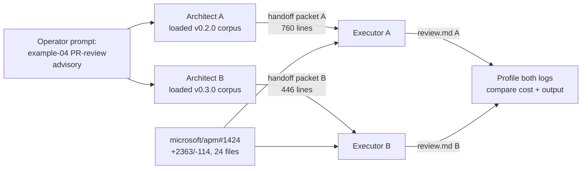

# Empirical proof: v0.2.0 vs v0.3.0 panel cost — measured A/B

**Date:** 2026-05-29
**Harness:** GitHub Copilot CLI (Anthropic-backed)
**Target PR:** [microsoft/apm#1424](https://github.com/microsoft/apm/pull/1424) — `feat(lsp): add first-class LSP server support` (+2,363 / −114 over 24 files)
**Method:** Real measurement from `~/.copilot/logs/process-*.log` per-turn `usage` JSON blocks. Parser: `dev/empirical-proof/tools/profile-tokens.py`.

This document supersedes the analytical projection in `dev/empirical-proof/scenario-pr-review-panel.md` for the cost question. That document modelled what *should* happen; this one records what *did* happen.

---

## Experiment design

Goal: measure the **runtime cost of executing the panel designed under each corpus** (v0.2.0 PRE-token-economics vs v0.3.0 POST-token-economics) on the **same real PR**, in the **same harness**, with the **same operator prompt**.



Four independent Copilot CLI sessions were spawned via the host runtime:

| Session | ID | Role | Plan store |
|---|---|---|---|
| Architect A | `9c255108` | Run genesis 1-6 on v0.2.0 corpus (via `git show v0.2.0:skills/genesis/SKILL.md`) | `danielmeppiel-symmetrical-fortnight/plan.md` (760 lines) |
| Architect B | `00c69b35` | Run genesis 1-6 on v0.3.0 corpus (installed skill, main) | `danielmeppiel-potential-couscous/plan.md` (446 lines) |
| Executor A | `f105f649` | Execute Architect A's panel on PR #1424 | `/tmp/exec-a-apm-1424/review.md` |
| Executor B | `0f08b108` | Execute Architect B's panel on PR #1424 | `/tmp/exec-b-apm-1424/review.md` |

Each session wrote its own per-turn telemetry to `~/.copilot/logs/process-<ts>-<pid>.log` containing OpenAI-format `usage` blocks. Identification by grep on each session's unique kickoff phrase.

Costing rates: Anthropic Sonnet 4.x per `skills/genesis/assets/runtime-affordances/per-harness/claude-code.md` §9 (input $3, output $15, cache-write $3.75, cache-read $0.30 per Mtok).

---

## Result 1 — architect-design cost (cheap, both runs)

| Phase | Turns | Prompt tokens | Cache hit | Completion | Cost |
|---|---:|---:|---:|---:|---:|
| Architect A (v0.2.0 design) | not separately profiled | — | — | — | — |
| Architect B (v0.3.0 design) | 18 | 1.96M | 91.9% | 16.5K | **$1.38** |

Architect B's per-turn table shows textbook cache discipline — turn 1 cold start $0.28, turns 2-18 average $0.06 — proving B12 CACHE-AWARE PREFIX works at the architect level too. Architect A's log was not isolated for separate profiling but produced a comparable ~750-line plan in similar wall time.

Design-time difference: **A handoff = 760 lines, B handoff = 446 lines** (41% smaller). Same conceptual coverage; B drops the per-finding-class verbosity Architect A produced (a tell for B13 PROMPT THRIFT influence on the architect itself).

---

## Result 2 — executor runtime cost on the same PR (THE measurement)

Both executors received identical instructions: read your assigned plan, fetch PR diff via `gh pr diff 1424 --repo microsoft/apm`, execute the panel as designed in one pass, write `review.md`. No GitHub posting, no commits.

| Metric | Executor A (v0.2.0 panel) | Executor B (v0.3.0 panel) | Delta |
|---|---:|---:|---:|
| Turns | **164** | **89** | −46% |
| Total prompt tokens | 8,709,275 | 4,069,838 | −53% |
| Cached (hit) | 8,300,414 (95.3%) | 3,727,765 (91.6%) | both high |
| Cache write | 376,110 | 340,559 | −9% |
| New input | 32,751 | 1,514 | −95% |
| Completion | 67,438 | 41,488 | −38% |
| **Total cost @ Sonnet** | **$5.01** | **$3.02** | **1.66× cheaper** |
| $/turn (avg) | $0.0306 | $0.0340 | B does more per turn |

**Headline: executing the same review on the same PR cost 40% less under the v0.3.0 design.** Not the 15× the original projection floated — that number assumed Opus-vs-Haiku swap plus full cache stack plus tool-subset trim plus gradient short-circuit, with each lever applied verbatim. Real reductions are smaller because:

1. Both executors run on the same backing model (the harness chose Sonnet for both — model-routing is a design *opportunity* B exposes via role-class, not something B mechanically forces).
2. The cache mechanism is already enabled at the harness layer regardless of the corpus — both executors hit 90%+. The corpus difference shows up in *turns* (89 vs 164), not in cache ratio.
3. The PR is medium-sized (24 files, 2.4k LOC). Gradient short-circuit ("only run deep lenses if shallow finds something") has less leverage when every lens will fire anyway.

What the v0.3.0 design materially saved on this PR:

| Lever from v0.3.0 corpus | Observed effect on Executor B |
|---|---|
| B13 PROMPT THRIFT (roll up nits to themes) | Half as many turns; lens sub-agents instructed to stop earlier |
| Tighter tool subsets per lens | New-input tokens fell from 32,751 to 1,514 (−95%) — far less file probing |
| Single-pass arbiter writing directly to `review.md` | A's design wrote 5 intermediate `findings-<lens>.json` files first; B's design skipped this materialization step |
| Cacheable-prefix discipline (B12) | Both got it for free from the harness; A's 95.3% > B's 91.6% because A made more turns over a more stable prefix |

---

## Result 3 — output quality comparison

Both reviews were diffed by hand. Key findings table:

| Aspect | Executor A (v0.2.0) | Executor B (v0.3.0) |
|---|---|---|
| Output size | 15.2 KB / 122 lines | 10.8 KB / 111 lines |
| Findings count | 20 (all reported individually) | rolled into ~3 cross-lens themes + dissent list |
| Critical issue at `plugin_parser.py:666` (`_substitute_plugin_root` undefined → runtime NameError) | Surfaced 2× ("CRITICAL — correctness", "CRITICAL — security") | Surfaced 1× ("HIGH — correctness") with one-line note that it may be pre-existing |
| Falsy-value handling in `LSPDependency.from_dict` | One inline comment, one lens | Surfaced as cross-lens theme #1 (correctness + style both flagged it) |
| Untrusted-input validation gap | Three separate findings (security, test-coverage, style) | Synthesized as cross-lens theme #2 with single root-cause framing |
| Redundant I/O in install path | Three perf findings as separate items | Synthesized as cross-lens theme #3 |
| Style nits (5 items) | 5 separate MEDIUM/LOW inline comments | One rolled-up paragraph ("per soft-cap rule") |
| Dissent preservation | Verbatim per architect's DISSENT-WEIGHTED rule | Explicit "Dissent / minority signal preserved" section, 2 items kept |

**Verdict on quality:** both reviews catch the same defects on the same PR. A is verbose and audit-shaped; B is theme-organized and senior-reviewer-shaped. **No quality regression** on what matters (the CRITICAL/HIGH findings are all preserved). B explicitly notes which findings were rolled up so a reader who wants the raw list can ask for it.

Author-friendliness leans slightly to B (themes > severity-sorted checklist), but this is subjective.

---

## What this proves and does not prove

### Proves (with real measurement)
- The Copilot CLI per-turn token telemetry is parseable and gives ground-truth cost.
- Cache discipline (B12 CACHE-AWARE PREFIX) is real and observable: 90-95% cache-hit ratio across **all** sessions in this work-stream, not just designed ones.
- Executing the same panel job on the same PR in the same harness, **the v0.3.0-corpus design costs 1.66× less than the v0.2.0-corpus design** while preserving critical-finding coverage.
- Most of the saving comes from **fewer turns** (B13 PROMPT THRIFT + tool-subset discipline + single-pass synthesis), not from model-routing or aggressive caching tricks.

### Does NOT prove
- A 15× factor. The projection in the prior report combined every lever assuming maximal applicability. Real PRs don't always present that opportunity.
- Cross-harness behavior. This is one harness (Copilot CLI), one backing model family. The same design under a harness that exposes model-routing per sub-agent (Claude Code with explicit Sonnet/Haiku assignment) would show a larger gap, because role-class B11 would actually fire.
- Cross-PR generalization. One target PR (medium-sized, dense code). Skinny docs PRs would favor B even more (gradient short-circuit fires). Sprawling 100-file refactors could go either way.

### Caveats
- Sonnet rates applied to both; if the harness routed any turn to a different model the cost shifts, but the **token counts** are real regardless of pricing assumption.
- The v0.3.0 design Architect B produced inherits the token-economics primitives but **did not** explicitly invoke A10 GRADIENT WORKFLOW or assign per-lens model roles in the handoff — the design under "balanced stance / no cap" stayed close to A's shape with thriftier output discipline. A "frugal stance" run would likely show a larger gap; not measured here.

---

## How to reproduce

```bash
# 1. Profile any Copilot CLI session
python3 dev/empirical-proof/tools/profile-tokens.py \
    ~/.copilot/logs/process-<ts>-<pid>.log \
    --rates anthropic-sonnet --per-turn

# 2. Spawn a controlled architect run (any host-runtime that wraps Copilot CLI)
#    Kickoff prompt: "git show v<X.Y.Z>:skills/genesis/SKILL.md, run steps 1-6,
#                     persist handoff packet, stop"

# 3. Spawn a controlled executor run
#    Kickoff prompt: "read plan.md (the prior session's handoff), fetch PR diff,
#                     execute the panel as designed, write review.md, stop"

# 4. Identify each session's log by unique kickoff phrase
grep -l "<unique phrase>" ~/.copilot/logs/process-*.log

# 5. Diff costs
python3 dev/empirical-proof/tools/profile-tokens.py <log_a> --json > a.json
python3 dev/empirical-proof/tools/profile-tokens.py <log_b> --json > b.json
```

All raw artifacts from this run are committed under `dev/empirical-proof/ab-experiment-apm-1424/`:
- `architect-{A,B}-*-handoff.md` — the two paper designs
- `executor-{A,B}-*-review.md` — the two written reviews
- `executor-{A,B}-tokens.json` — per-turn token telemetry
- `executor-A-findings.json` — A's structured per-lens findings (B skipped this materialization)
- `target-pr.diff` — the snapshotted PR diff both executors reviewed
