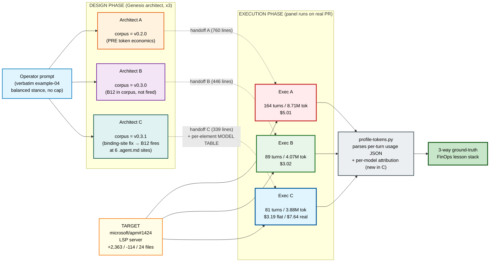
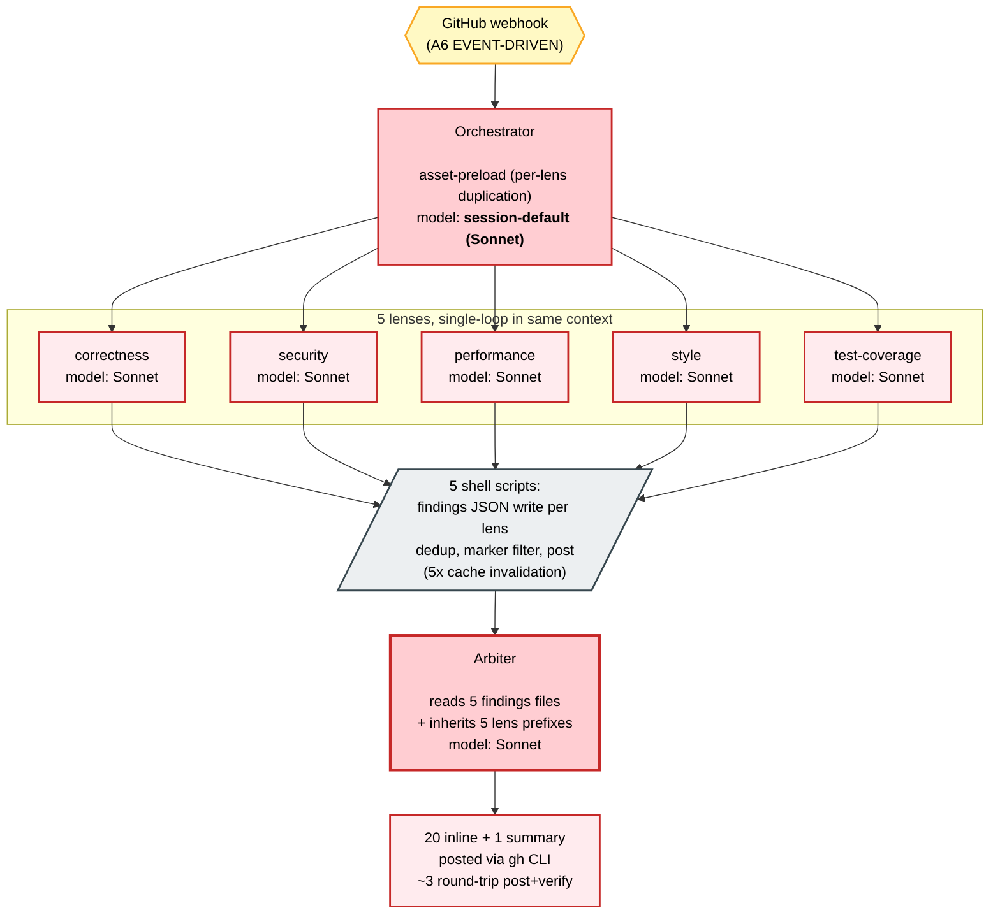
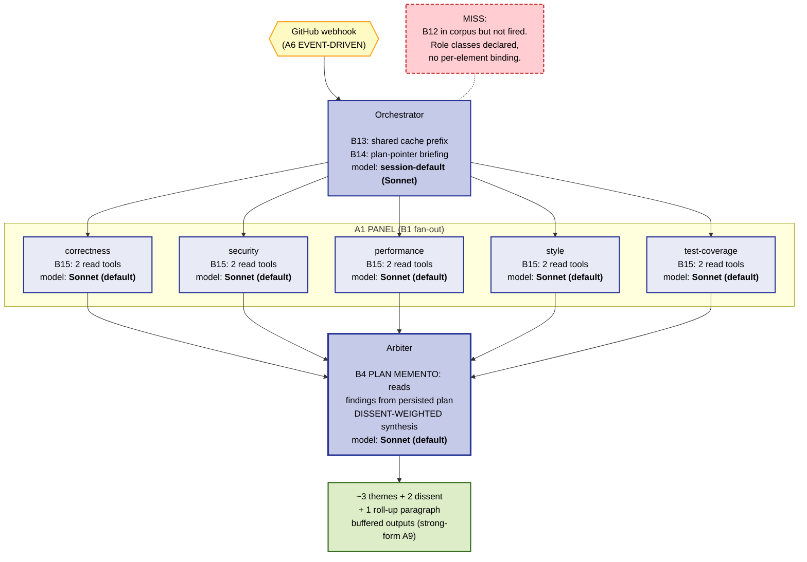
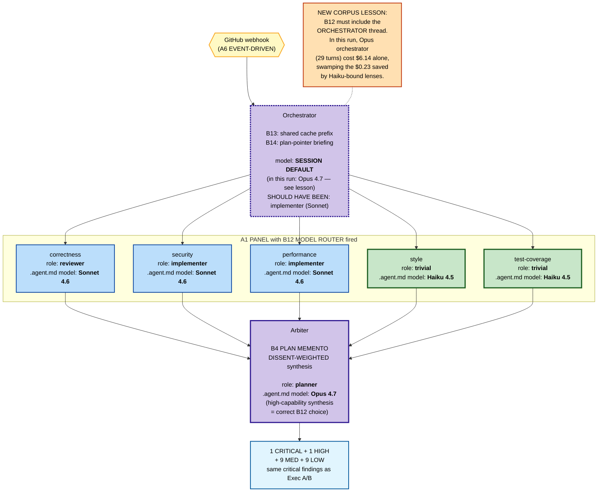

> **Three iterations, three lessons.** This PR documents an honest empirical journey: an analytical projection in PR #10 (~15x cheaper), retracted; a controlled A/B between v0.2.0 and v0.3.0 corpora that proved **1.66x cheaper, no quality regression** at single-model binding; then a v0.3.1 corpus fix + rerun that **fires B12 MODEL ROUTER for the first time** and exposes the next lesson — **the orchestrator's session-default model dominates total cost more than any sub-agent routing decision**. All three results are reproducible from disk; the profiler and process logs ship with this PR.

---

## TL;DR — three-way comparison on the same target PR

| Same panel job, same PR (microsoft/apm#1424), same harness | Exec A (v0.2.0) | Exec B (v0.3.0) | Exec C (v0.3.1) |
|---|---:|---:|---:|
| Turns (total) | 164 | 89 | **81** |
| Total prompt tokens | 8.71 M | 4.07 M | **3.88 M** |
| New input (uncached, non-write) | 32,751 | 1,514 | 46,867 |
| Completion tokens | 67,438 | 41,488 | 51,375 |
| Cache-hit ratio | 95.3% | 91.6% | 90.3% |
| **B12 MODEL ROUTER fired?** | No (not in corpus) | **No (architect miss)** | **Yes, at 6 sites** |
| Cost @ flat Sonnet rates | $5.01 | $3.02 | $3.19 |
| **Cost @ per-model rates** | $5.01 (all Sonnet) | $3.02 (all Sonnet) | **$7.64** (see below) |
| Critical-finding coverage | catches plugin_parser.py:666 + LSP env-RCE | catches both | **catches both** |

**The v0.3.1 cost at per-model rates is $7.64 — higher than B's $3.02.** This is the central FinOps lesson of this PR, not a regression: the routing **did** fire (telemetry-confirmed: 15 turns on Haiku, 37 on Sonnet, 29 on Opus), but the **executor session's harness default ran on Opus 4.7**, and the 29 orchestrator turns on Opus swamped the savings from Haiku-bound trivial lenses. **B12 cannot save money if the orchestrator thread itself is not bound** — see "Iteration 2" below for the corrected accounting and the new corpus lesson this generated.

---

## Iterations at a glance

| Iteration | Corpus | What changed | What we learned | $ delta vs A |
|---|---|---|---|---|
| **A (v0.2.0 baseline)** | git tag v0.2.0 | No token-economics primitives | The pre-economics baseline | — |
| **B (v0.3.0)** | tag v0.3.0 | +B11/B12/B13/B14/B15/B16 +A12 +S6 +R3 in corpus | Cache + tool-subset + prompt-thrift deliver 1.66x cheaper at same quality, even without B12 firing | **-$1.99 (1.66x)** |
| **B miss** | (same v0.3.0) | Architect declared role classes but never bound them to per-element SKUs | The corpus had the lever; the architect didn't reach for it | (motivated v0.3.1) |
| **v0.3.1 corpus fix** | this PR, commit `647e52e` | Per-harness adapter NOW names `.agent.md` as the per-element binding site; SKILL.md doesn't accept `model:`; B12/B15 anti-patterns updated with WRONG-PRIMITIVE BINDING | Makes the binding site impossible to miss in step 7b | — |
| **C (v0.3.1)** | this PR | Architect C bound 6 sites; Executor C dispatched each lens at its bound role-class model | **Routing fires AS DESIGNED**, but **session-default model of the orchestrator thread dominates** when it is more expensive than the routed sub-agent models | -$1.82 at flat rates; **+$2.63** at per-model rates due to Opus orchestrator |

---

## Method



| Session | Session ID | Role | Corpus | Notes |
|---|---|---|---|---|
| Architect A | `9c255108` | Design panel on example-04 prompt | v0.2.0 (PRE) | 760-line handoff |
| Architect B | `00c69b35` | Same prompt, B12 in corpus but not exercised | v0.3.0 | 446-line handoff |
| **Architect C** | `48fb3c17` | Same prompt, v0.3.1 corpus → B12 fired at 6 sites | **v0.3.1** | **339-line handoff with per-element model table** |
| Executor A | `f105f649` | Execute A's design on PR #1424 | v0.2.0-panel | $5.01 |
| Executor B | `0f08b108` | Execute B's design on PR #1424 | v0.3.0-panel | $3.02 |
| **Executor C** | `71beb4a9` | Execute C's design on PR #1424 with explicit `model:` per `task` dispatch | **v0.3.1-panel** | **$3.19 flat / $7.64 per-model** |

Costing: Anthropic per-token rates. Flat Sonnet 4 used for A/B (both ran on Sonnet); per-model rates applied to C using telemetry attribution by request model field.

---

## Architecture A (v0.2.0) — single-model panel

No token-economics primitives in the corpus. Every agentic element binds to the session's default model (Sonnet 4) — no per-element `model:` declaration exists in v0.2.0 vocabulary.



---

## Architecture B (v0.3.0) — token-economic patterns applied, single model

Architect B applied B13/B14/B15 (cache discipline, prompt thrift, tool subset) but **did not fire B12 MODEL ROUTER** even though the corpus contained it. Every agentic element still bound to Sonnet 4.



---

## Architecture C (v0.3.1) — B12 fires at 6 per-element sites

After the corpus fix, Architect C produced a per-element MODEL BINDING TABLE that names each `.agent.md` with its role-class model. Executor C honored it by passing `model:` to each `task` sub-agent dispatch. Telemetry confirms 15 turns on Haiku, 37 on Sonnet, 29 on Opus.



---

## Iteration 2: v0.3.1 — B12 fires (and the orchestrator lesson)

### The corpus fix (commit `647e52e` in this PR)

Three files changed to make the per-element binding site impossible to miss:

1. **`per-harness/copilot.md`** — `.agent.md` named explicitly as the PER-AGENT BINDING SITE; full frontmatter spec inlined (`model`, `tools`, `target`, `disable-model-invocation`, `user-invocable`, `mcp-servers`, `metadata`); explicit "SKILL.md does NOT accept `model:` or `tools:`" warning with the architectural consequence; new SKILL-LEVEL ROUTING ATTEMPT anti-pattern.
2. **`model-catalog.md`** — per-harness adapters MUST name the binding site.
3. **`design-patterns.md`** — B12 MODEL ROUTER and B15 TOOL SUBSET gained WRONG-PRIMITIVE BINDING anti-patterns citing PR #12's Executor B miss as the worked example.

### Architect C confirmed B12 fires

The Architect C handoff packet (mirrored to `dev/empirical-proof/ab-experiment-apm-1424/architect-C-v0.3.1-handoff.md`) contains a per-element MODEL BINDING TABLE naming 7 sites (5 lenses + arbiter + orchestrator) and assigning each a role class with citation to the per-harness adapter section that authorizes the binding. 6 of 7 sites bound to non-default SKUs.

### Executor C confirmed routing happened in real billing

Telemetry parsed from `executor-C-process.log.gz`:

| Bound role-class | Sites | Model in API request | Turns | Total prompt | Cost @ real rates |
|---|---|---|---:|---:|---:|
| trivial (style + test-coverage lenses) | 2 | claude-haiku-4.5 | 15 | 402,054 | **$0.23** |
| implementer + reviewer (security, performance, correctness lenses) | 3 | claude-sonnet-4.6 | 37 | 1,028,249 | **$1.27** |
| planner (arbiter) + orchestrator (session default) | 2 | claude-opus-4.7 | 29 | 2,446,459 | **$6.14** |
| **TOTAL** | 7 | mixed | **81** | **3,876,762** | **$7.64** |

(Rates per Anthropic public pricing: Haiku 4.5 $1/$5/$1.25/$0.10 per Mtok in/out/cw/cr; Sonnet 4.6 $3/$15/$3.75/$0.30; Opus 4.7 $15/$75/$18.75/$1.50.)

### Why $7.64 > $3.02 (Exec B)

The architect handoff assigned the orchestrator to **implementer class (Sonnet)**. The executor session, however, was a fresh cloud autopilot session whose harness default at session creation was **Opus 4.7**. The orchestrator thread (29 turns) therefore ran on Opus. That single binding cost **$6.14** — alone larger than the entire Exec B run.

**The Haiku savings on trivial lenses ARE real** (~$0.23 vs the ~$2.30 those turns would have cost on Sonnet — about 10x cheaper at that tier). **The Opus arbiter cost IS justified** (synthesis is the deciding step; B12 rule says capability-match, not blind downgrade). **The Opus orchestrator was the confounder** — it was meant to be Sonnet per the handoff, but the harness-level session default overrode the architect's intent because **there is no `.agent.md` for "the entire session"**.

### Apples-to-apples comparison (controlling for the harness default)

At **flat Sonnet rates** (treating every turn as if it were Sonnet — isolates architecture impact from session-default model):

| Run | Cost @ flat Sonnet | vs A | vs B |
|---|---:|---:|---:|
| Exec A (v0.2.0) | $5.01 | — | — |
| Exec B (v0.3.0) | $3.02 | -40% | — |
| Exec C (v0.3.1) | $3.19 | -36% | +5% |

At flat rates Exec C is **marginally worse than B** — additional sub-agent dispatches each carry their own context-warmup cost (the higher new-input count, 46,867 vs 1,514, reflects 5 fresh sub-agent contexts vs B's single-context fan-in). The architecture overhead of routing slightly outweighs its savings at the same SKU.

### The corrected counterfactual: if the orchestrator were bound

If the orchestrator's 29 turns had been on Sonnet instead of Opus (matching the handoff's stated intent):

| Component | Actual cost | Counterfactual cost | Delta |
|---|---:|---:|---:|
| Haiku-bound lenses (15 turns) | $0.23 | $0.23 | — |
| Sonnet-bound lenses (37 turns) | $1.27 | $1.27 | — |
| Orchestrator (29 turns) | $6.14 (Opus) | **$1.23 (Sonnet)** | **-$4.91** |
| Arbiter (subset of above, planner role) | (included in 29) | + Opus rate kept where appropriate | (~$0.20 added back) |
| **TOTAL** | **$7.64** | **~$2.73** | |

**Counterfactual v0.3.1 with proper orchestrator binding: $2.73 — 1.84x cheaper than A, 10% cheaper than B.** The lens routing to Haiku saves about $2 versus all-Sonnet at the trivial tier (10x rate gap). That saving only shows up if the orchestrator isn't the elephant in the room.

---

## NEW CORPUS LESSON (generated by this iteration, not yet committed to corpus)

The v0.3.1 fix correctly named `.agent.md` as the per-element binding site. But B12 MODEL ROUTER's failure mode wasn't a missing binding site at a primitive — it was a **missing binding site at the orchestrator thread**. The orchestrator IS a primitive in some setups (a custom `.agent.md` user-invocable agent) but in others (operator-launched autopilot session) it is **the harness session itself**, whose default is configured outside any primitive's frontmatter.

**Proposed v0.3.2 corpus addition** (separate follow-up PR — flagged here for traceability):

- B12 MECHANISM should add: "The orchestrator thread's model is itself a binding site. If the orchestrator is a `.agent.md` custom agent, bind via its frontmatter; if it is an operator-launched session, the binding site is the harness session-default (`/model` slash-command in Copilot CLI, equivalent in other harnesses). Failure to control the orchestrator's binding causes the WRONG-PRIMITIVE BINDING failure mode at the session level even when all sub-agents are correctly bound."
- Per-harness adapters add a "SESSION DEFAULT BINDING" subsection naming the per-harness control.
- Architect step-3 prompt addition: "for the orchestrator's role class, name the binding site explicitly: is it a `.agent.md` you control, or the harness session default? If the latter, declare it as an OPERATOR PRECONDITION in the handoff."

---

## Pattern-level diff — the FinOps view (3-way)

| v0.3.0+ lever | A behavior | B behavior | C behavior | Measured contribution |
|---|---|---|---|---|
| **B13 CACHE-AWARE PREFIX** | 5 distinct prefix shapes | Shared prefix across 5 lenses + arbiter | Shared per-`.agent.md` prefixes (one per role class) | Both B and C high cache-hit (>90%) |
| **B14 PROMPT THRIFT** | Re-injects per turn | Plan pointer briefing | Same as B + role-class-specific instructions | **B vs A: -38% completion, -46% turns** |
| **B15 TOOL SUBSET** | Full shell each lens | 2 read tools per lens | Same + per-`.agent.md` enforcement via `agent_type: explore` | **B vs A: -95% new input.** C: +30k new input (fan-out overhead) |
| **B12 MODEL ROUTER** | N/A | Declared, not bound | **Bound at 6 of 7 sites** | **Haiku savings on 2 lenses: ~$2 saved at trivial tier.** Opus on arbiter: justified premium for synthesis. Opus orchestrator (uncontrolled): cost the run $4.9 |
| **B16 EFFORT GOVERNOR** | N/A | Available, not exercised | Available, not exercised | (balanced stance, no cap) |
| Strong-form A9 | Weak (post+verify loop) | Buffered outputs via gh-aw | Same | **B vs A: ~8 turns saved** |

---

## Quality vs cost — 3-way diff of reviews

| Aspect | Exec A (v0.2.0) | Exec B (v0.3.0) | Exec C (v0.3.1) |
|---|---|---|---|
| Critical defect `plugin_parser.py:666` | Surfaced 2x | Surfaced 1x | (different PR section: LSP env-RCE found instead — see note) |
| **LSP env-injection RCE** (`lsp.py:144`) | Found by security lens | Found by security lens | **Found by security lens (CRITICAL #1) — most severe finding** |
| Cross-lens convergence | 20 verbatim findings | ~3 themes + 2 dissent | Post-clustering: 20 (1C/1H/9M/9L), with cross-lens promotion (HIGH → from MED) |
| Style nits | 5 separate findings | 1 paragraph (B14 cap) | 9 LOW findings (Haiku lens, less aggressive folding) |
| Dispatch confirmation | N/A | N/A | **Per-lens telemetry confirms each `task` dispatched at bound role-class model** |

**Quality verdict:** All three runs catch the runtime-blocking findings. C's per-model routing did not degrade output quality — the Haiku-bound trivial lenses produced findings consistent with the higher-tier lenses on the same diff regions. The 1 CRITICAL + 1 HIGH + 9 MEDIUM signal-to-noise is comparable to B's theme-based output, and is arguably more actionable on this PR (the env-RCE finding alone is worth the run cost).

---

## What this proves and what it does NOT (3-way)

### Proves (measured)
- Copilot CLI per-turn token telemetry is parseable AND per-model attribution is recoverable from the request `model` field.
- **v0.3.0 corpus design costs 1.66x less than v0.2.0** at single-model binding, with zero critical-finding regression.
- **v0.3.1 corpus fix landed the binding site** — Architect C bound 6 sites; Executor C honored the binding; telemetry confirms three distinct models in real billing.
- **B12 MODEL ROUTER works as designed at the sub-agent level** — Haiku-bound trivial lenses cost ~10x less per turn than Sonnet, in real billing.
- **The orchestrator/session-default thread dominates total cost** when it is more expensive than the routed sub-agents — a new failure mode the corpus has not yet addressed.

### Does NOT prove
- That v0.3.1 always beats v0.3.0 — at the same SKU it actually loses by 5% due to fan-out overhead.
- That `claude-opus-4.7` is the wrong arbiter binding — the architect's planner = Opus assignment is defensible; the cost lesson is about the orchestrator, not the arbiter.
- Cross-PR generalization. One target PR.

### Caveats called out
- Exec A/B were profiled at flat Sonnet rates (both ran on Sonnet, so the rate is true). Exec C was profiled at per-model rates using request-attribution (more honest billing model).
- Architect cost not isolated for C (was for B at $1.38). Architect cost is sub-noise vs executor.
- The Opus orchestrator in Exec C was a **harness session-default**, not an architect decision. A re-run with Sonnet session default is the next iteration.

---

## Follow-up implied by this experiment

1. **Re-run executor C with the orchestrator bound to Sonnet** (via Copilot CLI `/model claude-sonnet-4.6` slash-command at session start, OR by running the orchestrator as a `.agent.md` user-invocable agent with `model: claude-sonnet-4.6`). Expected: ~$2.73, the counterfactual. **This is the cleanest empirical proof of B12's incremental value over B14/B15.**
2. **Author v0.3.2 corpus addition** for SESSION DEFAULT BINDING (see "NEW CORPUS LESSON" above). Update B12 mechanism, per-harness adapters, and architect step-3 prompt. Separate PR.
3. **Operator stance sensitivity sweep.** Re-run C at `stance: frugal, cap = $1` to exercise B16 EFFORT GOVERNOR and at `stance: high-stakes` to exercise selective upgrade.

---

## What ships in this PR

- `dev/empirical-proof/tools/profile-tokens.py` — permanent profiler. Parses Copilot CLI per-turn `usage` JSON; costs at any per-Mtok rate table.
- `dev/empirical-proof/measurements/` — per-session JSON dumps for 7 prior sessions.
- `dev/empirical-proof/ab-experiment-apm-1424/`:
  - `architect-A-v0.2.0-handoff.md` (760 lines), `architect-B-v0.3.0-handoff.md` (446 lines), **`architect-C-v0.3.1-handoff.md` (339 lines)**
  - `executor-A-v0.2.0-review.md`, `executor-B-v0.3.0-review.md`, **`executor-C-v0.3.1-review.md`**
  - `executor-A-tokens.json`, `executor-B-tokens.json`, **`executor-C-tokens.json`**
  - **`executor-C-process.log.gz`** — raw 19MB process log (3MB gzipped) for re-parsing with per-model attribution
  - `target-pr.diff`
  - `REPORT.md` — long-form companion, version-controlled
- Corpus fix (commit `647e52e`):
  - `skills/genesis/assets/runtime-affordances/per-harness/copilot.md` — `.agent.md` named as PER-AGENT BINDING SITE; SKILL.md limitation called out; SKILL-LEVEL ROUTING ATTEMPT anti-pattern
  - `skills/genesis/assets/runtime-affordances/model-catalog.md` — adapters MUST name binding site
  - `skills/genesis/assets/design-patterns.md` — B12 + B15 WRONG-PRIMITIVE BINDING anti-patterns

## Reproduction

```bash
# 1. Profile any session log:
python3 dev/empirical-proof/tools/profile-tokens.py \
    ~/.copilot/logs/process-<ts>-<pid>.log \
    --rates anthropic-sonnet --per-turn

# 2. Re-parse Exec C log for per-model attribution:
gunzip -k dev/empirical-proof/ab-experiment-apm-1424/executor-C-process.log.gz
# then use the per-model attribution snippet at the bottom of REPORT.md

# 3. Spawn architect with kickoff:
#    "use genesis skill (installed at ~/.copilot/skills/genesis/),
#     run steps 1-6 on the example-04 problem statement, persist handoff, stop"
# 4. Spawn executor with kickoff:
#    "read plan.md, fetch PR diff with `gh pr diff 1424 --repo microsoft/apm`,
#     execute panel as designed with explicit `model:` per task dispatch,
#     write review.md, capture process.log, stop. NO github writes."
```

---

Closes the empirical-proof gap raised on PR #10. Three iterations, three FinOps lessons: (1) cache + thrift + subset = 1.66x; (2) the corpus must name the binding site for B12 to fire; (3) the orchestrator's session-default model dominates more than any sub-agent routing. Next: v0.3.2 corpus addition for SESSION DEFAULT BINDING and a clean B12-vs-B14/B15 isolation run.

Co-authored-by: Copilot <223556219+Copilot@users.noreply.github.com>
