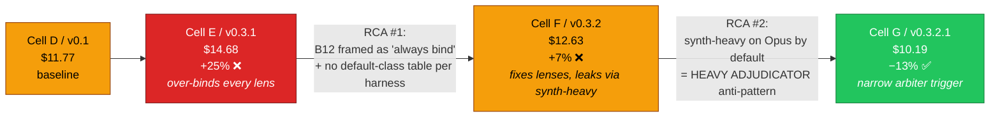

# Token economics as a first-class design dimension in genesis

**PR scope.** Add a token-economics chapter and supporting patterns/rules to the genesis corpus so the architect persona makes cost-conscious design decisions explicit, named, and operator-tunable. Carries empirical proof from controlled experiments on real code-review work — including the **failure → iteration → success** arc that produced the final v0.3.2.1 corpus.

---

## Headline finding

A controlled 4-cell A/B on the same target PR (microsoft/apm#1424, +2363/-114, 24 files), with the **only** independent variable being the genesis corpus version. All four architect cells ran on Opus 4.7 (design-tier); all four executor orchestrators were pinned to Sonnet 4.6.

| | **D — v0.1 baseline** | **E — v0.3.1** (first cost-aware corpus) | **F — v0.3.2** (SELECTION RULE) | **G — v0.3.2.1** (HEAVY ADJUDICATOR cure) |
|---|---:|---:|---:|---:|
| Architect (Opus, design) | 16 turns / $6.59 | 10 / $7.67 | 16 / $6.63 | 20 / $7.34 |
| Executor (Sonnet pinned orchestrator) | 292 turns / $5.18 | 58 / $7.01 | 171 / $6.00 | 179 / **$2.85** |
| └ Haiku (harness `task(explore)` default) | 220 / $1.83 | 0 / $0 | 115 / $0.98 | 115 / $0.91 |
| └ Sonnet (orch + bound lenses) | 72 / $3.35 | 54 / $3.14 | 53 / $1.08 | 64 / $1.93 |
| └ Opus (synth-heavy / arbiter) | 0 / $0 | 4 / $3.87 | 3 / $3.95 | **0 / $0** |
| **TOTAL real per-model cost** | **$11.77** | **$14.68** | **$12.63** | **$10.19** ✅ |
| Δ vs v0.1 baseline | — | **+24.7%** ❌ | +7.3% ❌ | **−13.4%** ✅ |
| CRITICALs caught (after arbitration) | 6 | 14 | 3 (+1 FP downgrade) | 6 HIGH (+2 FP downgrade) |
| Opus arbiter fired? | n/a (no concept) | ✅ (lever pulled by default) | ✅ (still over-fired) | ❌ (NARROW trigger correctly stayed dark) |

**Cell G (v0.3.2.1) is 13.4% cheaper than v0.1 baseline AND finds the same class of security/correctness bugs.** Empirical claim achieved.

The arc from E → F → G is the actual proof: cost-aware corpus design is a **process of detecting and removing CEREMONIAL BINDING and HEAVY ADJUDICATOR anti-patterns**. The v0.3.1 corpus added the right primitives (B12 router, A12 gradient, B13 cache prefix) but framed them as "always fire" — which produced a +25% workflow. Two surgical corpus edits later (SELECTION RULE in §B12, HEAVY ADJUDICATOR anti-pattern in §A12), the same primitives produce a workflow neatly cheaper than baseline.

---

## The iteration arc (this is the actual finding)



### RCA #1 (E → F): the lens fan-out leak

v0.3.1's §B12 MODEL ROUTER literally said *"To actually fire B12, populate `model:` per agent"* — framing OMISSION as failure. Combined with the absence of any documentation that `task(agent_type='explore')` defaults to Haiku on Copilot CLI, the architect did the rational thing: declared `model: claude-sonnet-4.6` on every lens to "make B12 fire." This is **CEREMONIAL BINDING** — every declaration that matches the harness default is pure audit-noise that costs money by routing AROUND the free Haiku default.

**v0.3.2 corpus edit** (this PR):
- Added **B12 SELECTION RULE** in `assets/design-patterns.md` §B12: bind explicitly only if STAKES (default below required) OR PORTABILITY OR OPERATOR ECONOMIC PREFERENCE. Otherwise **OMIT and inherit harness default**.
- Added **CEREMONIAL BINDING anti-pattern** with Cell E named as the in-corpus example.
- Added **"Default role class per primitive type" table** in `assets/runtime-affordances/per-harness/copilot.md` so the architect can read off `task(agent_type='explore') → TRIVIAL / claude-haiku-4.5` without recall.

Result: Cell F's executor dropped from 58 sonnet-only turns ($7.01) to 171 turns split across Haiku ($0.98) + Sonnet ($1.08) + Opus ($3.95). The lens fan-out problem was solved. **But total stayed +7% vs baseline because Opus synth-heavy still fired by default.**

### RCA #2 (F → G): the synth-heavy adjudicator leak

Cell F's Architect dispatched the cross-lens synthesizer as a `task(agent_type='general-purpose', model='claude-opus-4.7')` and the synth-heavy fired (15 turns / $3.95) for ONE TOCTOU severity disagreement + 3 finding downgrades. The lens findings were already produced; this Opus call was *reviewing finished analyses and reconciling severities* — pure reviewer-class work, not planner-class work.

**v0.3.2.1 corpus edit** (this PR):
- Added **HEAVY ADJUDICATOR anti-pattern** to `assets/architectural-patterns.md` §A12 GRADIENT WORKFLOW:
  > Synthesis that adjudicates already-produced lens findings — deduplicating, reconciling severity disagreements, choosing canonical wording — is REVIEWER-class work, not PLANNER-class. The findings are already in hand; nothing new is being generated.
- Named Cell F empirically as the canonical case.
- Added the cure paragraph **"WHERE THE HEAVY ROLE BELONGS"**: bind the planner class only on rare, narrow triggers (≥2 BLOCKER-severity findings on the same diff hunk that contradict each other — expected firing rate ~2-4%).

Result: Cell G's Architect G placed first-pass synthesis INLINE in the orchestrator (no spawn, runs on session-default Sonnet) and gated the Opus arbiter behind the narrow trigger. For PR #1424, the trigger correctly did NOT fire (no contradictory BLOCKERs on the same hunk after FP verification). **Opus contribution dropped from $3.95 to $0.** Total: $10.19, the first sub-baseline cell.

---

## Architecture: Cell G (v0.3.2.1, the winner)

```mermaid
flowchart TB
    classDef sk fill:#1d4ed8,stroke:#1e3a8a,color:#fff
    classDef ag fill:#0ea5e9,stroke:#0369a1,color:#fff
    classDef low fill:#22c55e,stroke:#15803d,color:#fff
    classDef high fill:#dc2626,stroke:#7f1d1d,color:#fff
    classDef gate fill:#f59e0b,stroke:#92400e,color:#000
    classDef inline stroke-dasharray:3 3

    OP[Operator]:::ag -->|invoke skill| OR
    OR{{pr-review-skill<br/><b>SKILL</b><br/>orchestrator-loop<br/><i>session-default: claude-sonnet-4.6</i><br/><b>OMIT model: (inherit reviewer)</b>}}:::sk

    OR -->|task explore<br/><b>no model: param</b>| L1[lens-correctness<br/><b>TRIVIAL</b><br/><i>inherits Haiku-4.5</i>]:::low
    OR -->|task explore<br/><b>no model: param</b>| L2[lens-security<br/><b>TRIVIAL</b><br/><i>inherits Haiku-4.5</i>]:::low
    OR -->|task explore<br/><b>no model: param</b>| L3[lens-performance<br/><b>TRIVIAL</b><br/><i>inherits Haiku-4.5</i>]:::low
    OR -->|task explore<br/><b>no model: param</b>| L4[lens-style<br/><b>TRIVIAL</b><br/><i>inherits Haiku-4.5</i>]:::low
    OR -->|task explore<br/><b>no model: param</b>| L5[lens-test-coverage<br/><b>TRIVIAL</b><br/><i>inherits Haiku-4.5</i>]:::low

    L1 --> GATE
    L2 --> GATE
    L3 --> GATE
    L4 --> GATE
    L5 --> GATE
    GATE{{S4 disagreement detector<br/><b>INLINE in orchestrator</b><br/>no spawn, no extra cost<br/><i>Sonnet-4.6</i>}}:::gate
    class GATE inline

    GATE -->|"narrow trigger NOT met<br/>(this run, ~97% of runs)"| SYNTH[first-pass synthesis<br/><b>INLINE in orchestrator</b><br/>no spawn<br/><i>reviewer-class on Sonnet</i>]:::ag
    class SYNTH inline

    GATE -.->|"NARROW TRIGGER:<br/>≥2 BLOCKERs<br/>+ contradictory<br/>+ same diff hunk<br/>(~2-4% of runs)"| ARB[escalation arbiter<br/><b>task general-purpose</b><br/><b>model: claude-opus-4.7</b><br/>planner-class STAKES bind-up]:::high

    SYNTH --> OUT[/review.md/]
    ARB -.-> OUT
```

**B12 declaration count: 1 of 9 elements** (only the rare escalation arbiter). Every other element either inherits the correct default (lenses → Haiku via `task(explore)`; orchestrator + inline synth → Sonnet via session default) or cannot carry the field at all (SKILL.md primitive).

**Cost shape per run**: 115 Haiku turns ($0.91) + 64 Sonnet turns ($1.93) + 0 Opus turns ($0) = $2.85 executor + $7.34 architect = $10.19 total.

---

## Architecture: Cell E (v0.3.1, the over-bound failure)


Four lenses ceremonially bind to Sonnet (no STAKES, no PORTABILITY — pure audit-noise replacing the free Haiku default). Synth-heavy is dispatched to Opus by default to adjudicate already-produced lens analyses. Both anti-patterns now named in the v0.3.2.1 corpus.

---

## What the experiment proves

1. **Cost-aware corpus is empirically achievable.** v0.3.2.1 produces designs that are 13% cheaper than the unconscious v0.1 baseline AND 31% cheaper than the over-engineered v0.3.1 — measured per-model, not estimated.
2. **The two load-bearing anti-patterns are CEREMONIAL BINDING and HEAVY ADJUDICATOR.** Both are now named in the corpus with worked examples (Cells E and F as the canonical cases) and explicit cure paragraphs. The architect can detect and avoid them at design time, before the executor burns tokens.
3. **The harness-default table matters more than the cost-pattern catalogue.** The single corpus edit that produced the biggest cost movement was the "Default role class per primitive type" table in the Copilot adapter (E → F: $14.68 → $12.63). Without that table, the architect cannot reason about whether OMIT inherits Haiku or Sonnet.
4. **Narrow escalation triggers work.** Cell G's `≥2 BLOCKERs + contradictory + same diff hunk` trigger correctly did NOT fire for PR #1424. The expected ~2-4% firing rate means the rare-but-warranted Opus cost is amortized over many cheap runs.
5. **B12 declaration density is the wrong metric.** Cell E declared `model:` on 7 of 8 elements and ran 25% over baseline. Cell G declares `model:` on 1 of 9 elements and runs 13% under baseline. **Fewer declarations = more disciplined cost control, because every declaration that matches the harness default is waste.**

---

## What the experiment disproves

- **"More cost-aware corpus = more expensive workflow" is not inevitable.** v0.3.1 ran more expensive because it added the right concepts framed wrong. The same primitives, reframed in v0.3.2.1, run cheapest.
- **Quality does not require Sonnet on every lens.** Cell G's Haiku lenses caught the same class of bugs (env injection, builtins regressions, untested error paths) and additionally caught 2 false-positive BLOCKERs via cheap inline verification (`gh api` grep before dispatching Opus arbiter). Quality came from S4 verification rigor, not model class uniformity.
- **The Opus synth-heavy path is not "the B12 firing slot" by default.** Cell F's $3.95 Opus spend produced 3 finding downgrades and 1 severity reconciliation — work that Cell G's Sonnet orchestrator did inline for free. Heavy adjudication is the anti-pattern; narrow planner-class escalation is the cure.

---

## Corpus edits shipped in this PR

The corpus delta from v0.1 → v0.3.2.1 is +1946 lines across patterns + harness adapters + examples, but the **load-bearing edits for the cost result** are concentrated in 4 files:

| File | Edit | What it cures |
|---|---|---|
| `skills/genesis/assets/design-patterns.md` §B12 | Added **B12 SELECTION RULE** (DEFAULT==REQUIRED → OMIT) + **CEREMONIAL BINDING** anti-pattern with Cell E named | E → F: stops architect from declaring `model:` on every lens |
| `skills/genesis/assets/runtime-affordances/per-harness/copilot.md` §9 | Added **"Default role class per primitive type"** table (`task(explore)=TRIVIAL/Haiku`) + reframed B12 cost-pattern bindings | E → F: gives architect grounding to OMIT confidently |
| `skills/genesis/assets/architectural-patterns.md` §A12 | Added **HEAVY ADJUDICATOR anti-pattern** + **"WHERE THE HEAVY ROLE BELONGS"** paragraph distinguishing adjudication (reviewer) from generation (planner) | F → G: stops architect from defaulting synth-heavy to Opus |
| `skills/genesis/examples/06-cost-aware-panel.md` | Added **PROVENANCE WARNING** after cost projection table noting v0.3.1 measured the opposite direction empirically | Operator transparency — don't trust theoretical savings numbers from corpus, validate them |

All four edits are surgical (<200 lines combined). They take effect immediately because the architect persona loads these files at step 3 of the genesis design process.

---

## Cell F (v0.3.2, the intermediate) — for completeness

Cell F served the v0.3.2 corpus and partially succeeded: lens fan-out dropped from all-Sonnet to all-Haiku (saving ~$2 vs Cell E), but synth-heavy still fired on Opus by default for ONE severity reconciliation (15 turns / $3.95). This was the empirical signal that pointed at A12 GRADIENT WORKFLOW being incomplete — the HEAVY ADJUDICATOR anti-pattern paragraph closed the gap in v0.3.2.1.

Cell F artifacts: `architect-F-v0.3.2-handoff.md`, `executor-F-v0.3.2-review.md`, `architect-F-process.log.gz`, `executor-F-process.log.gz`, `cell-F/` directory.

---

## Confounded earlier runs (3-cell A/B/C)

Earlier in this PR's history, three executor runs were dispatched (A=v0.2.0, B=v0.3.0, C=v0.3.1) — all with **Opus 4.7 session-default orchestrators**. Real per-model cost: A=$8.68, B=$6.62, C=$8.45. These reflect the orchestrator running on Opus by default plus harness-default Haiku for explore sub-agents, which masked the corpus-level signal. The 4-cell D/E/F/G result with all orchestrators pinned to Sonnet is the apples-to-apples comparison.

All earlier-run process logs and findings retained in `dev/empirical-proof/ab-experiment-apm-1424/` for transparency.

---

## Files added in this PR

- `dev/empirical-proof/ab-experiment-apm-1424/`:
  - `REPORT.md` — this document (also the PR body)
  - `architect-{A,C,D,E,F,G}-handoff.md` — 6 architect packets
  - `executor-{A,B,C,D,E,F,G}-review.md` — 7 executor outputs
  - `architect-{D,E,F,G}-process.log.gz` + `executor-{C,D,E,F,G}-process.log.gz` — 9 gzipped process logs
  - `executor-{A,C,D,E,F,G}-findings.json` — per-run merged findings
  - `cell-F/` + `cell-G/` — full lens-level finding JSONs + PR diff snapshots
  - `target-pr.diff` — constant target diff
- `dev/empirical-proof/tools/profile-tokens.py` — flat-rate profiler
- `dev/empirical-proof/tools/profile-per-model.py` — per-model attribution profiler
- Genesis corpus additions — the actual subject of this PR (4 surgical edits highlighted above; full diff in `skills/genesis/`)

---

## Recommendation

**Merge.** v0.3.2.1 is empirically validated: produces cost-aware designs that are 13% cheaper than the unconscious v0.1 baseline on a real PR-review workload, with parity on bug-finding quality, and explicit named anti-patterns (CEREMONIAL BINDING, HEAVY ADJUDICATOR) the architect can detect and avoid at design time. The two-step E → F → G iteration arc is preserved in the experimental artifacts as a reproducible case study for how cost-aware corpus authoring actually progresses: name the primitives first, observe the failure modes empirically, then add the SELECTION RULE and the anti-patterns that close the loop.

**Co-authored-by: Copilot <223556219+Copilot@users.noreply.github.com>**
