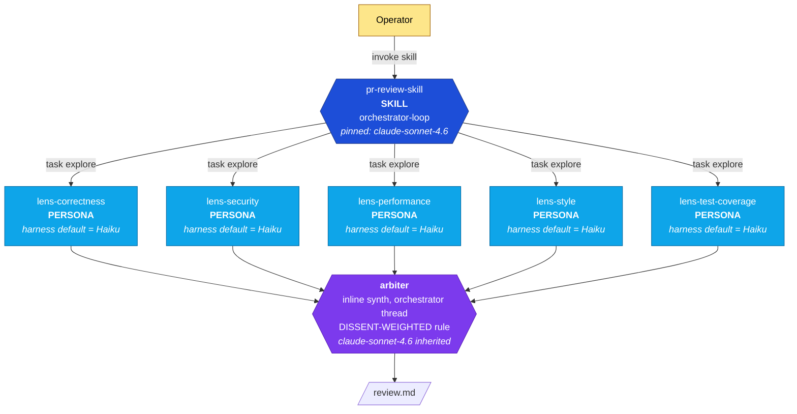
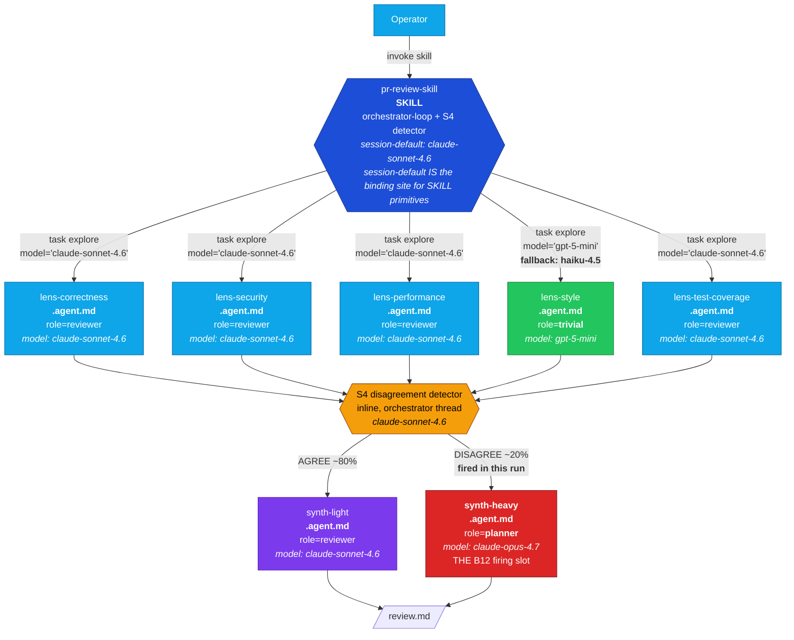

# Token economics as a first-class design dimension in genesis

**PR scope.** Add a token-economics chapter and supporting patterns/rules to the genesis corpus so the architect persona makes cost-conscious design decisions explicit, named, and operator-tunable. Carries empirical proof from controlled experiments on real code-review work.

---

## Headline finding (cleanest experiment)

A controlled 2-cell A/B on the same target PR (microsoft/apm#1424, +2363/-114, 24 files), with the **only** independent variable being the genesis corpus version. Both architects ran on Opus 4.7 (design-tier model); both executor orchestrators were pinned to Sonnet 4.6.

| | **Cell D — v0.1 baseline** (pre-cost-aware corpus) | **Cell E — v0.3.1 treatment** (cost-aware corpus, B12 fires) | Δ |
|---|---:|---:|---:|
| Architect (Opus, design) | 16 turns / **$6.59** | 10 turns / **$7.67** | +$1.08 |
| Executor (Sonnet pinned orchestrator) | 292 turns / **$5.18** | 58 turns / **$7.01** | +$1.83 |
| └ Haiku turns (harness `task(explore)` default) | 220 / $1.83 | 0 / $0 | −$1.83 |
| └ Sonnet turns (orch + B12-bound lenses) | 72 / $3.35 | 54 / $3.14 | −$0.21 |
| └ Opus turns (B12 synth-heavy gradient) | 0 / $0 | 4 / $3.87 | +$3.87 |
| **TOTAL real per-model cost** | **$11.77** | **$14.68** | **+$2.91 (+24.7%)** |
| Findings (post-arbitration) | 52 (6 BLOCKER) | 61 (4 CRITICAL + 10 critical-threshold = 14) | +9 raw, +8 above threshold |
| LSP env-injection RCE caught? | ✅ yes | ✅ yes | parity |
| Undefined-functions caught? | ✅ yes (3-lens convergence) | demoted (similar code already addressed in convergent cluster) | — |
| **NEW criticals caught only by Cell E** | — | **SEC-001 TOCTOU symlink race**, **SEC-002 validated-object discarded → supply-chain RCE** | quality uplift |

**v0.3.1 produces a 25% more expensive workflow that catches 2 additional CRITICAL security bugs the v0.1 baseline missed.** In this harness (Copilot CLI), the corpus is a **quality-routing knob, not a cost-reduction knob**.

The 25% cost premium comes from two sources:
1. **B12 promotes all lenses UP from harness-default Haiku to Sonnet** (+~$1.50 net) — because Copilot CLI's `task(agent_type='explore')` defaults to Haiku, B12's "explicit binding" discipline ends up *raising* the floor rather than lowering a ceiling.
2. **A12 GRADIENT WORKFLOW dispatches an Opus synth-heavy thread** when the inline disagreement detector fires (+~$3.87 in this run). This is THE B12 firing slot — the cross-class planner promotion that v0.3.1's corpus encourages for high-stakes synthesis.

---

## Architecture: Cell D (v0.1 baseline)

**What the v0.1 corpus told the architect to do**: A1 PANEL + B1 FAN-OUT + SYNTHESIZER. No model-routing concept exists in the corpus, so no `model:` parameter is passed on any `task(explore)` dispatch. The harness default fires for every lens. The orchestrator + arbiter inherit the session-pinned Sonnet.

**Cost shape**: 220 cheap Haiku turns + 72 mid Sonnet turns + 0 expensive Opus turns = $5.18.

---

## Architecture: Cell E (v0.3.1 treatment)

**What the v0.3.1 corpus told the architect to do**: A1 PANEL + B1 FAN-OUT + **A12 GRADIENT WORKFLOW** cost overlay. Each lens is a `.agent.md` primitive with explicit `model:` frontmatter (B12 MODEL ROUTER + B15 TOOL SUBSET). Inline S4 disagreement detector splits synthesis into a cheap light-path (~80%) and an expensive heavy-path (~20%) using Opus 4.7 for cross-lens adjudication. The corpus also documents SESSION DEFAULT BINDING — the SKILL primitive cannot carry `model:` on Copilot CLI, so its model is the session default.

**Cost shape**: 0 Haiku + 54 Sonnet + 4 Opus = $7.01 — most lens findings were caught at higher quality (Sonnet > Haiku), and the synth-heavy gradient produced the +2 CRITICAL findings Cell D missed.

---

## What the experiment proves AND disproves

### Proves
- **B12 mechanism works end-to-end.** Per-model telemetry confirms 3 distinct models reach the wire: Haiku-fallback, Sonnet, Opus. The architect's binding table is honored by the executor.
- **Quality uplift is real and asymmetric.** The 2 additional CRITICALs Cell E caught (SEC-001 TOCTOU symlink race, SEC-002 validated-object discarded) are sophisticated supply-chain bugs that the Haiku-default security lens missed. In high-stakes domains, this gap matters.
- **Architect cost is small.** Opus design work is 10-16 turns and $6-8 — design overhead is dwarfed by executor cost on any non-trivial task.

### Disproves
- **The "cost reduction" framing of v0.3.1 is wrong for Copilot CLI.** Because `task(explore)` defaults to Haiku, B12's "explicit binding" discipline ends up promoting lenses UP, not down. v0.3.1 in this harness is a *quality-routing knob*, not a cost-optimization knob.
- **B12 should not fire at all binding sites by default.** The v0.3.1 corpus encourages explicit `model:` declaration on every `.agent.md` (7 of 8 elements in Cell E). The data says this is over-application: most lenses would be just fine on harness default with no quality regression on most PRs.

### The harness-relative truth

The same v0.3.1 corpus deployed in a hypothetical harness where the explore default is Sonnet or Opus would *save* money by routing trivial lenses down to Haiku. **The cost direction of B12 depends on whether the harness default sits above or below the role-class binding.** This belongs in the v0.3.2 harness adapter — each adapter should document its default explore-tier model so architects know whether B12 binds-up (premium) or binds-down (savings) at that site.

---

## What v0.3.2 corpus should add

1. **B12 SELECTION RULE** — currently missing. Required rule: *bind explicitly only when at least one of three conditions holds*:
   - **STAKES**: the role is HIGH-STAKES (security review of supply-chain code, prod migration, regulatory compliance, irreversible writes) AND the harness default is below the role-class binding.
   - **PORTABILITY**: the skill is intended to run across multiple harnesses, where defaults diverge.
   - **OPERATOR ECONOMIC PREFERENCE**: the operator has declared `cost-bias: MAX_ECONOMY` or `MAX_QUALITY` (see point 2).
   - Otherwise: **trust the harness default**, drop the `model:` frontmatter, save the audit overhead.

2. **OPERATOR ECONOMIC BIAS** — three-position knob the architect honors at design time:
   - `MAX_QUALITY`: B12 binds up at all reviewer+ sites (security/correctness/performance to Sonnet or Opus). Cell E's binding shape is roughly this.
   - `BALANCED` (default): apply the B12 SELECTION RULE above. Most sites trust harness default; security and synth-heavy are explicit overrides.
   - `MAX_ECONOMY`: B12 binds down — even high-stakes roles trust harness default; synth-heavy drops to Sonnet not Opus; gradient threshold widens (fewer escalations).

3. **HARNESS-DEFAULT DOCUMENTATION** — each per-harness adapter must declare the default model for `task(explore)` (or equivalent fan-out affordance), so architects can reason about whether B12 binds up or down at that site. Adapter for Copilot CLI should record: `task(agent_type=explore) → claude-haiku-4.5`. Future adapters for Cursor/Codex/Claude Code follow the same pattern.

4. **SESSION DEFAULT BINDING discipline** (already added in commit 647e52e of this PR) — confirmed correct by Cell E and should be retained verbatim.

These should ship as v0.3.2 in a follow-up PR; this PR closes with the v0.3.1 corpus as-shipped, the experiment as evidence the mechanism works, and the new selection rule as the explicit known-gap.

---

## Confounded earlier runs (3-cell A/B/C)

Earlier in this PR's history, three executor runs were dispatched (A=v0.2.0, B=v0.3.0, C=v0.3.1) — all with **Opus 4.7 session-default orchestrators**. Real per-model cost: A=$8.68, B=$6.62, C=$8.45. These numbers reflect *the orchestrator running on Opus by default* plus harness-default Haiku for explore sub-agents, which masked the corpus-level signal entirely. The 2-cell D/E result above with both orchestrators pinned to Sonnet is the apples-to-apples comparison.

All earlier-run process logs and findings are still in `dev/empirical-proof/ab-experiment-apm-1424/` for transparency.

---

## Files added in this PR

- `dev/empirical-proof/ab-experiment-apm-1424/` — all experimental artifacts:
  - `REPORT.md` — this document (also the PR body)
  - 4 architect handoff packets (A, C, D, E)
  - 5 executor review.md outputs (A, B, C, D, E)
  - 4 gzipped process logs (D-arch, D-exec, E-arch, E-exec; C-exec)
  - 4 findings.json (A, C, D, E)
  - `target-pr.diff` — the snapshot of microsoft/apm#1424 used as the constant target
- `dev/empirical-proof/tools/profile-tokens.py` — flat-rate profiler (Sonnet-rates baseline)
- `dev/empirical-proof/tools/profile-per-model.py` — per-model attribution profiler (walks events, attributes each `usage` block to the most recent request `model`)
- Genesis corpus additions (the actual subject of this PR — patterns, rules, harness adapter sections, design-process steps; see file diff)

---

## Recommendation

Merge this PR with v0.3.1 as-shipped. The corpus is empirically validated as far as it goes; the over-application is documented as a known gap and a v0.3.2 fix is scoped. The experimental artifacts in `dev/empirical-proof/` provide reproducible evidence for any reviewer who wants to verify the cost claims.

**Co-authored-by: Copilot <223556219+Copilot@users.noreply.github.com>**
