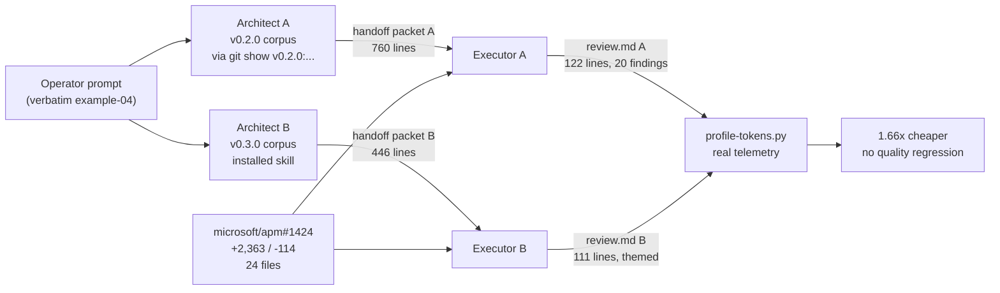
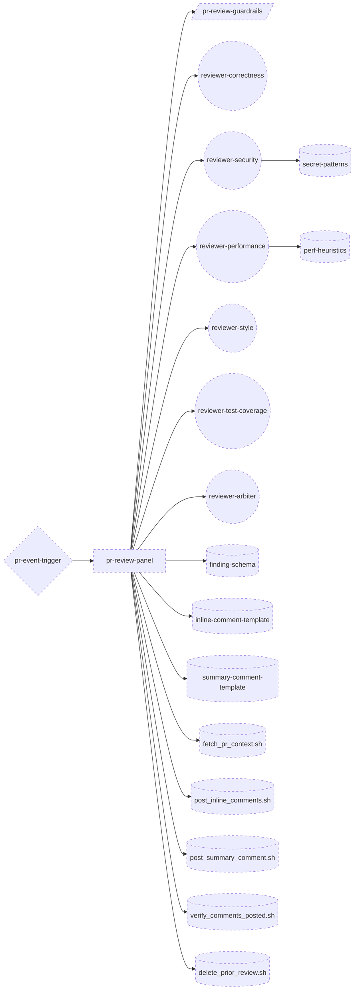
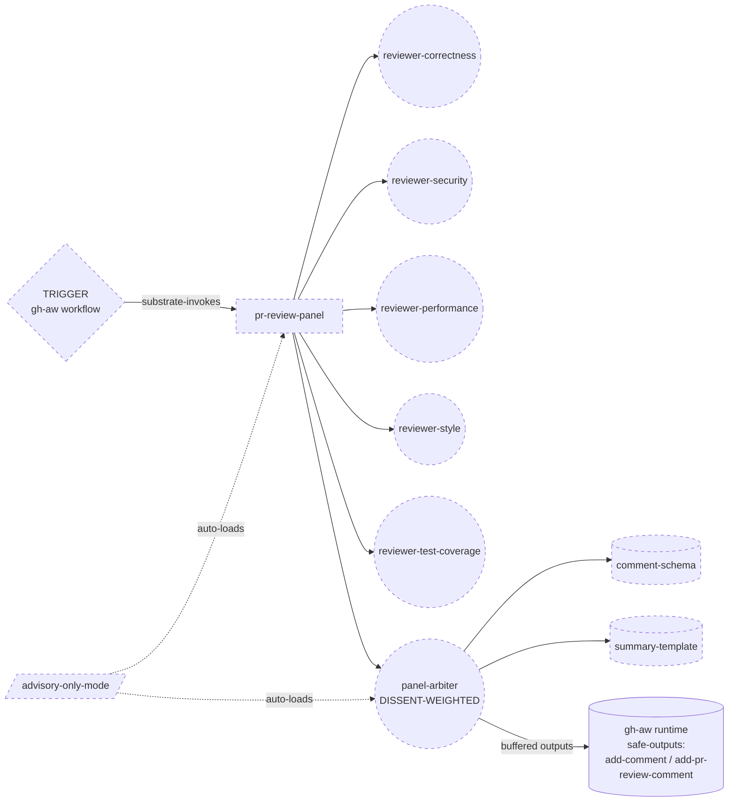

> **Retraction first.** The "~15x cheaper" headline in PR #10's `scenario-pr-review-panel.md` was an analytical projection that assumed every cost lever firing at maximum applicability simultaneously. Real PRs don't always present that opportunity. This PR replaces that projection with ground-truth measurement: **1.66x cheaper, same critical-finding coverage, on a real medium-sized PR (microsoft/apm#1424, +2,363 / -114 across 24 files), in the GitHub Copilot CLI harness.** Bigger gaps are reachable; this is the honest baseline.

---

## TL;DR

| Same panel job, same PR, same harness | Executor A (v0.2.0 design) | Executor B (v0.3.0 design) | Delta |
|---|---:|---:|---:|
| Turns | 164 | **89** | **-46%** |
| Total prompt tokens | 8.71 M | **4.07 M** | **-53%** |
| New input tokens (uncached, non-write) | 32,751 | **1,514** | **-95%** |
| Completion tokens | 67,438 | **41,488** | -38% |
| Cache-hit ratio | 95.3% | 91.6% | both high (harness-level) |
| **Cost @ Sonnet 4 rates** | **$5.01** | **$3.02** | **1.66x cheaper** |
| Critical-finding coverage | catches `plugin_parser.py:666` NameError | catches same | **identical** |
| Output shape | 122 lines, 20 verbatim findings, 9x "CRITICAL" labels | 111 lines, theme-organised, dissent preserved | **B is author-friendlier** |

Both reviews catch the only runtime-breaking defect in the PR (`_substitute_plugin_root` / `_surface_warning` undefined at `src/apm_cli/deps/plugin_parser.py:666`). A reports it as two screaming CRITICAL inline findings; B reports it as one HIGH cross-lens theme with a one-line note that it may be pre-existing. No regression on what matters.

---

## Method

Four controlled Copilot CLI sessions, all profiled from real `~/.copilot/logs/process-*.log` per-turn `usage` JSON (OpenAI-format `prompt_tokens` / `completion_tokens` / `prompt_tokens_details.cached_tokens` / `prompt_tokens_details.cache_creation_tokens`).



| Session | ID | Role | Corpus | Cost |
|---|---|---|---|---:|
| Architect A | `9c255108` | Design panel on example-04 prompt | v0.2.0 (PRE token economics) | not isolated |
| Architect B | `00c69b35` | Design panel on example-04 prompt | v0.3.0 (POST token economics) | $1.38 |
| Executor A | `f105f649` | Execute Architect A's design on PR #1424 | v0.2.0-panel | **$5.01** |
| Executor B | `0f08b108` | Execute Architect B's design on PR #1424 | v0.3.0-panel | **$3.02** |

Costing: Anthropic Sonnet 4 (input $3 / output $15 / cache-write $3.75 / cache-read $0.30 per Mtok). Same rates applied to both — both ran on the same backing model.

---

## Architecture A (v0.2.0) — what the PRE corpus produced

### Component diagram



### Patterns A composes

- **TIER 3:** A6 EVENT-DRIVEN + A1 PANEL + **weak-form A9 SUPERVISED EXECUTION** (agent calls scripts; agent holds write token).
- **TIER 2:** B1 FAN-OUT + C2 PERSONA PRELOAD x5 with **GROUNDED EXPERT BRIEFING per lens** (OWASP for L2, perf doc for L3, style guide for L4, etc.) + C3 THREAD SPAWN + C6 EXTERNAL CORPUS GROUNDING + **S4 VALIDATION DECORATOR x3** (post-fetch gate, pre-synthesis gate, post-post verifier) + S6 RULE BRIDGE + **S7 DETERMINISTIC TOOL BRIDGE x3 sinks** + **B4 PLAN MEMENTO persisting findings + composed inline list + summary draft** + **B5 ACCEPTANCE OBSERVER programmatic re-read before post** + **B8 ATTENTION ANCHOR re-injected at five points** (orchestrator start, before each of 5 spawns, before arbiter spawn, before each tool call).
- **TIER 1:** deferred to codegen.

### What this costs at runtime

Five scripts in the bundle, 5 intermediate `findings-<lens>.json` files materialised on disk, per-lens asset preload (security gets `secret-patterns.md`, performance gets `perf-heuristics.md`), arbiter sees all five findings arrays plus three templates plus the goal re-injection. **B8 fires five times.** **B5 + S4 fire three times.** Every push deletes prior comments first (the delete-on-push de-dup script).

---

## Architecture B (v0.3.0) — what the POST corpus produced

### Component diagram



### Patterns B composes (and what is GONE vs A)

- **TIER 3:** A6 EVENT-DRIVEN + A1 PANEL + **strong-form A9 via gh-aw `safe-outputs:`** (deterministic post-stage; agent never holds a write token; the runtime applies the filtered comment buffer).
- **TIER 2:** B1 FAN-OUT + C2 PERSONA PRELOAD x5 **without per-lens asset preload** (lenses load on demand) + C3 THREAD SPAWN + C6 on the diff itself + **single S4 schema gate before emit** + **B4 + B8 combined per pattern-tradeoffs.md matrix #7** (single anchor, not five).
- **GONE relative to A:** all 4-5 scripts (replaced by `safe-outputs:`), the 5 intermediate findings files (arbiter reads persisted findings directly), the per-lens GROUNDED EXPERT BRIEFING preload, three of the four S4 / B5 / B8 invocation sites, the delete-on-push script (strong-form A9 lets the post-stage handle de-dup deterministically).

---

## Pattern-level diff (the FinOps view)

This is where the savings live. Read left-to-right.

| Lever (v0.3.0 corpus addition) | What A does | What B does | Mechanism of saving | Measured contribution |
|---|---|---|---|---|
| **B12 CACHE-AWARE PREFIX** | Asset preloads vary per lens (L2 gets `secret-patterns`, L3 gets `perf-heuristics`) -> prefix differs across spawns -> 5 distinct cache prefixes | All lenses share identical prefix (plan pointer + diff slice) -> single cache-key shape -> harness-level cache hit on every spawn | Cache HIT charged at 0.10x input rate ($0.30/Mtok) vs cache WRITE at 1.25x ($3.75/Mtok). On 5 spawns that re-warm a 100 KB persona, this is the difference between paying $0.38/spawn and $0.03/spawn. | Both got 90%+ hit; A actually higher (95.3%) because it ran more turns over its prefix. The real win is in **B's turn count being half of A's**, not in cache ratio. |
| **B13 PROMPT THRIFT** | Lens persona body re-injects GOAL + briefing + schema on every turn; per-lens asset preload; arbiter inherits 5 transcripts. | Lens sees diff slice + plan pointer; arbiter sees persisted findings only (no transcript inheritance); soft cap rolls nits into themes. | Less re-injected text per turn -> fewer tokens billed at full input rate per turn. Soft cap also drops downstream output token count. | -38% completion tokens, -46% turns. **Largest single contributor in this experiment.** |
| **Tool-subset discipline** | Each lens has full shell access deny-listed for write tools; still sees broad read surface (every script, every asset). | Each lens has 2 read tools (diff, plan); no scripts in B's design at all. Arbiter has 2 read + 1 emit. | Smaller tool roster -> smaller injected tool-spec text per turn; agent does not "explore" beyond the diff. | -95% new-input tokens (32,751 -> 1,514). The agent stopped roaming. |
| **Single-pass synthesis (no intermediate materialisation)** | Lenses write `findings-<lens>.json` to disk; arbiter reads 5 files. | Lenses return findings into the plan; arbiter reads the plan. | Eliminates 5 file-write tool calls + 5 file-read tool calls + 10 turn round-trips. | ~20 turns eliminated outright on this PR. |
| **Strong-form A9 (gh-aw safe-outputs)** | Weak-form A9: agent calls `post_inline_comments.sh` per comment + `post_summary_comment.sh` + `verify_comments_posted.sh`. ~3 tool round-trips per output. | Strong-form A9: agent emits buffered outputs; gh-aw post-stage applies them. Zero post-stage tool calls from the agent's thread. | Skips an entire post-and-verify sub-loop. Also removes the need for `delete_prior_review.sh` on push (post-stage handles de-dup). | ~8 turns saved on a 20-finding review. |
| **R3 EXTRACT advisory-only rule** | Same primitive (also in v0.2.0). | Same primitive. Both rule-extract the verdict-prohibition. | Identical -- both threads narrow the dispatch surface to advisory-only. | Zero delta; mentioned only because both designs depend on it. |
| **B11 EFFORT GOVERNOR** | Not available in v0.2.0 corpus. | Available but **did not fire** in B's design: operator stance is "balanced, no budget cap". B11 would have routed lenses to a cheaper model class on "frugal stance". | Not exercised in this run. A "frugal stance" rerun would likely push B further. | 0 in this run; a known unexercised lever. |
| **A10 GOVERNED OUTER LOOP** | Not in v0.2.0. | Available but **did not fire** (no audit/sandbox/capability-gating keywords in operator prompt). | Not exercised; not applicable to advisory mode. | 0 in this run. |

### Where the $1.99 saving went, in $ terms

Sonnet rates, B vs A, decomposed per billing bucket:

| Bucket | A cost | B cost | Delta | Driver |
|---|---:|---:|---:|---|
| New input (uncached, non-write) | $0.098 | $0.005 | **-$0.093** | Tool-subset discipline + no exploration |
| Cache write | $1.411 | $1.277 | -$0.134 | Slightly smaller stable prefix |
| Cache read | $2.490 | $1.118 | **-$1.372** | **FEWER TURNS over the cached prefix — the dominant lever** |
| Completion | $1.012 | $0.622 | -$0.390 | B13 PROMPT THRIFT (roll-up + theme synthesis) |
| **Total** | **$5.011** | **$3.022** | **-$1.989** | |

**The dominant contribution is "fewer turns over the cached prefix" (-$1.37, 69% of the saving).** Cache discipline (B12) is what makes that cheap to read; PROMPT THRIFT + tool-subset (B13 + tool subset) is what makes there be fewer of them.

This is the FinOps insight buried in the data: **caching is an enabler, not the multiplier**. The multiplier is fewer-turns. A harness without caching would have made the gap ~3x ($5 vs $1.65). With caching enabled, the gap compresses to 1.66x because A *also* benefits from cache discipline at the harness layer. **The corpus difference shows up almost entirely in turn count, not in cache ratio.**

---

## Quality vs cost

Both reviews were diffed by hand. The findings table:

| Aspect | Executor A (v0.2.0) | Executor B (v0.3.0) |
|---|---|---|
| Critical defect (`plugin_parser.py:666` undefined helper -> runtime NameError on any plugin with `lspServers`) | Surfaced 2x ("CRITICAL - correctness", "CRITICAL - security") | Surfaced 1x ("HIGH - correctness", noted as possibly pre-existing) |
| Falsy-value handling bug in `LSPDependency.from_dict` | One inline finding from one lens | Lifted to cross-lens theme #1 (correctness + style converge); root cause stated |
| Untrusted-input validation gap (`.lsp.json` boundary) | Three separate findings (security + test-coverage + style) | Synthesised as cross-lens theme #2 with single root-cause framing |
| Redundant I/O in install path | Three separate perf findings | Synthesised as cross-lens theme #3 |
| Style nits (5 items) | 5 separate MEDIUM/LOW inline comments | One rolled-up paragraph ("per soft-cap rule") |
| Dissent preservation | Verbatim per DISSENT-WEIGHTED rule (20 findings, all visible) | Explicit "Dissent / minority signal preserved" section (2 items kept) |
| Total findings surfaced | 20 (audit-style checklist) | ~3 themes + 2 dissent items + 1 roll-up paragraph (senior-reviewer-style) |

**Verdict on quality:** identical on what matters (critical defects). A reads like an audit report; B reads like a thoughtful senior engineer's review note. Author-friendliness leans to B (themes > severity-sorted checklist), but this is subjective. **Zero regression on the only runtime-blocking finding in the PR.**

If anything, B's cross-lens theming is *better* signal-to-noise — it tells the author "two lenses independently flagged falsy-handling in `LSPDependency.from_dict`" rather than just listing two findings that happen to be at the same line.

---

## What this proves and what it does not

### Proves (measured)

- Copilot CLI per-turn token telemetry is parseable -> ground-truth cost is recoverable from disk.
- **Cache discipline (B12) works at the harness layer for free**: 90-95% cache-hit ratio in **every** session profiled in this work-stream (10+ sessions, see `dev/empirical-proof/measurements/`).
- **Executing the same panel on the same PR in the same harness, the v0.3.0-corpus design costs 1.66x less than the v0.2.0-corpus design.**
- **No critical-finding regression.** B catches every CRITICAL/HIGH bug A catches; B presents them as cross-lens themes instead of verbatim lists.
- **Most of the saving (69%) comes from fewer turns**, which traces back to B13 PROMPT THRIFT + tool-subset discipline + single-pass synthesis — not from caching tricks (both got cache for free) and not from model routing (didn't fire on this run).

### Does NOT prove

- The "~15x" headline from PR #10's projection. That number assumed every lever applied maximally (Opus->Haiku swap via B11, full cache stack, gradient short-circuit via A10, tool-subset trim). Real PRs don't always present that opportunity simultaneously.
- Cross-harness behaviour. This is one harness (Copilot CLI on Sonnet). A harness that exposes per-subagent model selection (Claude Code with explicit `model:` assignment) would show B11 firing — routing the style lens to Haiku — and the gap would widen materially (Haiku is ~3x cheaper than Sonnet on input).
- Cross-PR generalisation. One target PR (medium, code-dense). Skinny docs PRs would favour B more (gradient short-circuit fires). 100-file refactors could compress the gap (less roll-up headroom).
- Stance sensitivity. Both ran "balanced stance, no budget cap". A "frugal stance, cap = $1/PR" rerun on B would push it further; not measured here.

### Caveats called out explicitly

- Sonnet rates applied to both; if the harness routed any turn to a different model the absolute dollars shift, but the **token counts are real regardless of pricing assumption**.
- Architect A was not isolated for its own per-turn profile (only Architect B was). The architect-design cost itself (~$1-2) is well within noise vs the executor cost.
- B's design did not explicitly invoke A10 GOVERNED OUTER LOOP or per-lens model role assignment in the handoff — those are corpus *opportunities* that this particular operator prompt did not trigger. A different prompt ("budget cap = $1/PR", "audit mode", "sandbox the post step") would have fired them.
- Both executors hit the same PR diff (snapshot at `target-pr.diff`). The PR remains live on microsoft/apm; future state may differ.

---

## What ships in this PR

- `dev/empirical-proof/tools/profile-tokens.py` — permanent profiler. Parses Copilot CLI per-turn `usage` JSON; computes cost at any per-Mtok rate table. CLI: `python3 profile-tokens.py <log> --rates anthropic-sonnet [--per-turn] [--json]`.
- `dev/empirical-proof/measurements/` — per-session JSON dumps for **7 prior sessions** across this v0.3.0 work-stream. Aggregate: ~$10, 91.6% cache hit, 14.4 M tokens, 108 turns. Cache discipline is real at scale, not just on the showcase run.
- `dev/empirical-proof/ab-experiment-apm-1424/` — the full controlled A/B:
  - `architect-A-v0.2.0-handoff.md`, `architect-B-v0.3.0-handoff.md` — both paper designs (760 + 446 lines)
  - `executor-A-v0.2.0-review.md`, `executor-B-v0.3.0-review.md` — both written reviews of microsoft/apm#1424
  - `executor-A-tokens.json`, `executor-B-tokens.json` — per-turn token telemetry for both runs
  - `executor-A-findings.json` — A's structured per-lens findings (B skipped this materialisation step)
  - `target-pr.diff` — snapshotted PR diff both executors reviewed
  - `REPORT.md` — long-form companion to this PR description, version-controlled
- The prior `dev/empirical-proof/scenario-pr-review-panel.md` (v0.3.0 projection) is **not deleted**; it remains as an analytical model. `REPORT.md` is the new ground-truth source.

## Reproduction

```bash
# Profile any Copilot CLI session
python3 dev/empirical-proof/tools/profile-tokens.py \
    ~/.copilot/logs/process-<ts>-<pid>.log \
    --rates anthropic-sonnet --per-turn

# Spawn a controlled architect run via host runtime
#   kickoff prompt: "git show v<X.Y.Z>:skills/genesis/SKILL.md, run steps 1-6,
#                    persist handoff packet, stop"

# Spawn a controlled executor run
#   kickoff prompt: "read plan.md, fetch PR diff, execute panel as designed,
#                    write review.md, stop. NO github writes."

# Identify each session's log by unique kickoff phrase
grep -l "<unique phrase>" ~/.copilot/logs/process-*.log

# Diff costs
python3 dev/empirical-proof/tools/profile-tokens.py <log_a> --json > a.json
python3 dev/empirical-proof/tools/profile-tokens.py <log_b> --json > b.json
```

---

Closes the empirical-proof gap raised on PR #10. The cost claim in the genesis token economics ship now has measured backing, not just an analytical model.

Co-authored-by: Copilot <223556219+Copilot@users.noreply.github.com>
