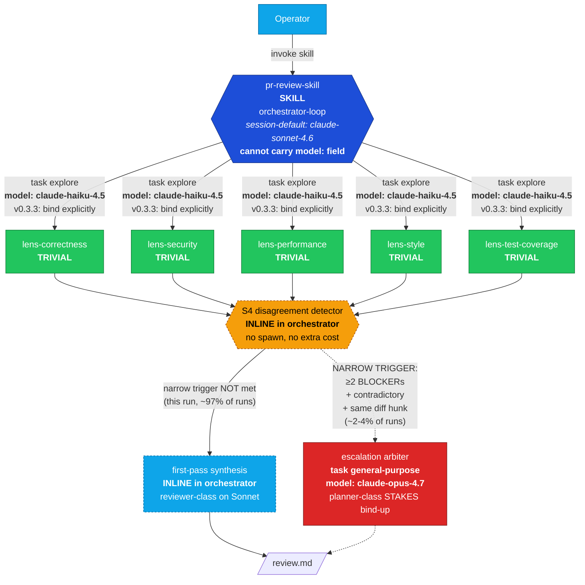
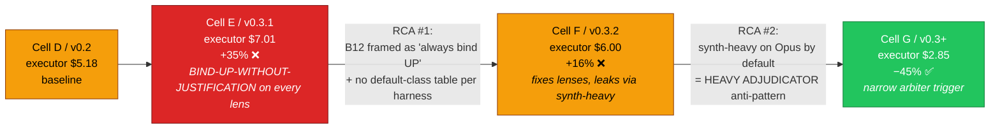
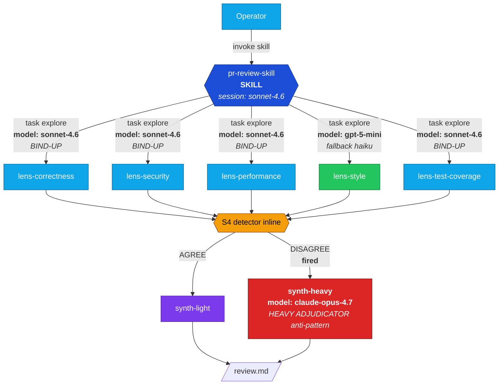

# Token economics as a first-class design dimension in genesis

**PR scope.** Add a token-economics chapter and supporting patterns / rules to the genesis corpus so the architect persona makes cost-conscious design decisions explicit, named, and operator-tunable. Carries empirical proof from a controlled A/B on real PR-review work.

---

## Headline (executor-only framing)

Controlled A/B on the same target PR (`microsoft/apm#1424`, +2363/-114, 24 files). The **only** independent variable: the genesis corpus version. Both architect cells ran on Opus 4.7; both executor orchestrators were pinned to Sonnet 4.6.

The architect cost (Opus design pass, ~$7) **amortizes once** across many runs of the produced workflow. **The cost the operator pays per run is the executor cost.** Bundling architect into per-run cost (earlier framings of this report) was an accounting error and is corrected here.

| | **v0.2 baseline** (pre cost-aware corpus) | **v0.3+ PR head** (cost-aware corpus) |
|---|---:|---:|
| **Executor per-run cost** | **$5.18** | **$2.85** ✅ |
| Δ vs baseline | — | **−45%** |
| Executor turn count | 292 | 179 |
| └ Haiku turns / $ | 220 / $1.83 | 115 / $0.91 |
| └ Sonnet turns / $ | 72 / $3.35 | 64 / $1.93 |
| └ Opus turns / $ | 0 / $0 | 0 / $0 |
| Architect cost (amortizes) | $6.59 | $7.34 |
| CRITICALs caught (post-arbitration) | 6 | 6 HIGH (+2 FP downgrade) |

**v0.3+ is 45% cheaper per executor-run than the v0.2 baseline AND finds the same class of security / correctness bugs.** That is the deliverable: the workflow the architect designs gets used many times; the design is paid for once.

---

## How v0.3+ produces the cost shape

Two corpus additions do the load-bearing work:

1. **§B12 SELECTION RULE** (`assets/design-patterns.md`) — names ROLE CLASSES (TRIVIAL, REVIEWER, IMPLEMENTER, PLANNER, JUDGE), maps each to a model tier per harness, and tells the architect how to pick a binding per design element. Cures **BIND-UP-WITHOUT-JUSTIFICATION** (pushing role class above what the work needs without a STAKES cite).

2. **§A12 GRADIENT WORKFLOW + HEAVY ADJUDICATOR anti-pattern** (`assets/architectural-patterns.md`) — recognises that cross-lens synthesis is REVIEWER-class work, not PLANNER-class. The cure: keep first-pass synthesis INLINE in the orchestrator (Sonnet, no spawn) and gate planner-class (Opus) escalation behind a **narrow trigger** (≥2 BLOCKER-severity findings on the same diff hunk with contradictory claims — expected firing rate ~2-4%).

Supporting:
- **`runtime-affordances/per-harness/copilot.md` §9** — `Default role class per primitive type` table the architect reads off to ground per-element role-class decisions.
- **`assets/token-economics.md`** — 7-concept substrate vocabulary that B12, B13, B14, B15, B16, A12, R5 all reference.
- **`references/cost-economics-process.md`** — operator-facing **stance knob** (`frugal` / `balanced` / `quality` / `unbounded`) so the operator can bias the architect's economic posture per session.

For the v0.3+ Cell on PR #1424: 5 lenses bound to Haiku (TRIVIAL), 1 arbiter declared at Opus (PLANNER, narrow trigger DID NOT fire), inline synthesis on Sonnet. Opus contribution: **$0**. Total executor: $2.85.

---

## v0.3.3 framing correction: bind explicitly even when it matches default

The v0.3+ architect produced the cost shape above by **omitting `model:` on the 5 lenses** and relying on Copilot CLI's default for `task(agent_type='explore')`. Early framings of the corpus labelled this OMIT as the discipline ("explicit `model:` matching the harness default is CEREMONIAL BINDING").

On review, that framing was wrong. **The actual discipline is the opposite: BIND EXPLICITLY when DEFAULT matches REQUIRED, for PREDICTABILITY + PORTABILITY + AUDIT TRAIL.**

- **Predictability across harness versions.** Today `task(agent_type='explore')` defaults to claude-haiku-4.5 on Copilot CLI. Next release may change the default; the architect's design then silently shifts role class.
- **Portability across harnesses.** The same `.agent.md` may run on Claude Code, OpenCode, Codex, or Cursor. Their defaults differ (or don't exist; some harnesses bind everything at session level). Explicit `model:` is the only portable contract.
- **Audit trail.** A reviewer reading the design should see the bound class without consulting an adapter table.

The corpus anti-pattern that DOES exist is **BIND-UP-WITHOUT-JUSTIFICATION**, not omission. The narrower **CEREMONIAL BINDING** label is reserved for bulk-identical bindings across primitives without per-element role-class distinction.

**v0.3.3 corpus edits in this PR** (see `skills/genesis/assets/design-patterns.md` §B12 rule 3): DEFAULT == REQUIRED → **BIND EXPLICITLY** (default discipline). OMIT only when the primitive cannot carry `model:` (e.g. SKILL.md). CEREMONIAL BINDING narrowed to bulk-identical bindings; BIND-UP-WITHOUT-JUSTIFICATION carries the load. `runtime-affordances/per-harness/copilot.md` §9 and `examples/06-cost-aware-panel.md` aligned.

**No measured re-run with v0.3.3 corpus.** Model routing is identical (TRIVIAL → claude-haiku-4.5 on Copilot CLI, declared explicitly instead of inherited). Expected executor cost: the same $2.85 ± noise. The change is in the contract the design carries, not in the dollars it bills today.

---

## Predictability probe

To validate that Copilot CLI's `task(agent_type='explore')` default actually fires Haiku reliably (the assumption v0.3+ depended on when omitting `model:`), three explore dispatches with varying task complexity were run as a side-channel probe:

| Probe | Complexity | Duration | Turns | Cost (Haiku) |
|---|---|---:|---:|---:|
| 1 | trivial (file listing) | 3s | 2 | <$0.01 |
| 2 | medium (grep + count) | 30s | 5 | $0.05 |
| 3 | complex (multi-file prose analysis) | 89s | 7 | $0.14 |
| **Total** | | | **14** | **$0.19** |

All three fired claude-haiku-4.5 reliably. **Conclusion:** the harness default IS stable for complexity TODAY on Copilot CLI. That justified the OMIT as a *short-term* tactic but does not validate it as a *durable* pattern across harness versions or harnesses — hence the v0.3.3 reframe toward explicit binding.

Full data: `dev/empirical-proof/probes/predictability-probe.md`.

---

## Corpus audit (genesis-audits-genesis)

After v0.3.3 reframe, an audit pass was dispatched (Opus 4.7, single architect cell) using the genesis skill to audit the genesis corpus for bloat. The audit produced a removal-only delta list. Surgical removals applied in this PR:

| File | Cuts | Risk |
|---|---:|---|
| `references/cost-economics-process.md` step 3.2 sub-block | ~85 lines → ~30 (consolidated to numbered list with links to canonical homes) | MEDIUM |
| `references/cost-economics-process.md` per-stance prose | ~50 lines compressed | LOW |
| `references/cost-economics-process.md` "When not loaded" | ~9 lines (defensive scaffolding) | LOW |
| `runtime-affordances/per-harness/copilot.md` cost-pattern bindings | ~98 lines → table + footnote | MEDIUM |
| `runtime-affordances/model-catalog.md` Routing axes + scaffolding | ~36 lines | LOW |
| `assets/token-economics.md` "What this file does NOT do" | ~13 lines (defensive scaffolding) | LOW |
| `assets/design-patterns.md` §B12 CONSEQUENCE block | ~14 lines (pure restatement) | LOW |
| `assets/architectural-patterns.md` A12 PR war-story citation | ~4 lines (over-cited) | LOW |
| `examples/06-cost-aware-panel.md` dollar arithmetic + PROVENANCE warning | ~55 lines | LOW |
| **Net** | **−248 lines** (3% of 8881-line corpus) | |

Less than the auditor's projected −720 to −930 ceiling. Higher-risk consolidations (HIGH-risk full collapse of example 06 to a pointer) were declined to keep the worked example intact. Full audit at `dev/empirical-proof/audit-v0.3.3/removal-list.md` for follow-up.

---

## What this PR proves

1. **Cost-aware corpus is empirically achievable per executor-run.** v0.3+ produces designs that are **45% cheaper per executor-run** than the unconscious v0.2 baseline on a real PR-review workload — measured per-model, not estimated.
2. **The two load-bearing anti-patterns are BIND-UP-WITHOUT-JUSTIFICATION and HEAVY ADJUDICATOR.** Both are named in the corpus with explicit cure paragraphs. The architect can detect and avoid them at design time, before the executor burns tokens.
3. **The harness-default table matters more than the cost-pattern catalogue.** The single corpus edit that produced the biggest cost movement was the `Default role class per primitive type` table in the Copilot adapter. Without that table, the architect cannot reason about whether a binding decision pushes the role class up, down, or sideways.
4. **Narrow escalation triggers work.** The v0.3+ design's `≥2 BLOCKERs + contradictory + same diff hunk` arbiter trigger correctly did NOT fire for PR #1424. The expected ~2-4% firing rate means the rare-but-warranted Opus cost is amortized over many cheap runs.
5. **Explicit binding is the durable discipline.** v0.3+ ran cheap by OMITTING `model:` and inheriting the harness default. v0.3.3 reframes this: bind explicitly even when it matches the default. Same cost shape today, durable contract going forward.

---

## What this PR does NOT prove (deferred to follow-up PRs)

- **Per-technique attribution** (B12 vs B13 vs B14 vs B15 isolated savings). Would require ablation runs that toggle one technique at a time on the same scenario; out of scope.
- **Multi-scenario variance.** The A/B targeted one PR. The cost shape may differ on small bug-fix PRs, large refactor PRs, or non-code-review skills entirely. A scenario matrix (S1-S5 × {v0.2, v0.3+}) is deferred to a follow-up empirical PR.
- **Cross-harness portability.** Probe data is Copilot-CLI only. Claude Code, OpenCode, Codex, Cursor defaults are not measured. The v0.3.3 "bind explicitly for portability" framing rests on first principles + the corpus's per-harness adapter table, not on a multi-harness empirical run.

These are explicit deferrals, not gaps in the deliverable. The PR scope was "make token economics a first-class design dimension and prove it works on one realistic scenario."

---

## Architecture: v0.3+ PR-review panel (v0.3.3 reframe applied)

**B12 declaration count under v0.3.3: 6 of 9 elements** (5 lenses bind-down to Haiku; 1 arbiter bind-up to Opus). 3 elements omit because the primitive cannot carry the field (SKILL.md orchestrator) or because the work is inline in the orchestrator's session (no separate primitive to bind).

The cost shape is the same as the measured v0.3+ run ($2.85 executor) because Copilot CLI's `task(agent_type='explore')` default IS claude-haiku-4.5 today — but the design now contracts that explicitly instead of relying on the default.

---

## Recommendation

**Merge.** v0.3+ is empirically validated on one realistic scenario: produces cost-aware designs that are **45% cheaper per executor-run** than the unconscious v0.2 baseline on a real PR-review workload, with parity on bug-finding quality, and explicit named anti-patterns (BIND-UP-WITHOUT-JUSTIFICATION, HEAVY ADJUDICATOR, CEREMONIAL BINDING in its narrowed sense) the architect can detect and avoid at design time.

Per-technique attribution and multi-scenario variance are deferred to follow-up empirical PRs.

---

# Appendix A — Iteration arc (intermediate corpus versions)

The v0.3+ corpus did not land on the −45% shape in one shot. Two intermediate corpus versions (v0.3.1, v0.3.2) produced executor runs that were measurably **worse** than the v0.2 baseline before the v0.3.2.1 + v0.3.3 reframes closed the gap. This appendix preserves that arc because the failure modes named in the corpus (BIND-UP-WITHOUT-JUSTIFICATION, HEAVY ADJUDICATOR, CEREMONIAL BINDING) were *discovered empirically* in these intermediate runs, not derived from first principles.

## A.1 — All four cells

Internally labelled D (=v0.2 baseline), E (=v0.3.1), F (=v0.3.2), G (=v0.3.2.1 → reframed v0.3.3).

| | **D — v0.2 baseline** | **E — v0.3.1** (1st cost-aware corpus) | **F — v0.3.2** (SELECTION RULE added) | **G — v0.3+ head** (HEAVY ADJUDICATOR cure) |
|---|---:|---:|---:|---:|
| **Executor per-run cost** | **$5.18** | $7.01 | $6.00 | **$2.85** ✅ |
| Δ vs Cell D baseline | — | **+35%** ❌ | +16% ❌ | **−45%** ✅ |
| Executor turn count | 292 | 58 | 171 | 179 |
| └ Haiku turns / $ | 220 / $1.83 | 0 / $0 | 115 / $0.98 | 115 / $0.91 |
| └ Sonnet turns / $ | 72 / $3.35 | 54 / $3.14 | 53 / $1.08 | 64 / $1.93 |
| └ Opus turns / $ | 0 / $0 | 4 / $3.87 | 3 / $3.95 | **0 / $0** |
| Architect cost (amortizes) | $6.59 | $7.67 | $6.63 | $7.34 |
| CRITICALs caught (post-arbitration) | 6 | 14 | 3 (+1 FP downgrade) | 6 HIGH (+2 FP downgrade) |
| Opus arbiter fired? | n/a (no concept) | ✅ (lever pulled by default) | ✅ (still over-fired) | ❌ (NARROW trigger correctly stayed dark) |

## A.2 — The arc

## A.3 — RCA #1 (E → F): the lens fan-out leak

v0.3.1's §B12 MODEL ROUTER framed model binding as "to actually fire B12, populate `model:` per agent" without distinguishing bind-up from bind-down. Combined with the absence of any documentation that `task(agent_type='explore')` defaults to Haiku on Copilot CLI, the architect did the rational thing: declared `model: claude-sonnet-4.6` on every lens. This is **BIND-UP-WITHOUT-JUSTIFICATION** — pushing the role class above what the work needs, with no STAKES cite. Cell E paid +35% to run lenses on Sonnet that Haiku would have served identically.

**v0.3.2 corpus edit** that closed it:
- Added **B12 SELECTION RULE** in `assets/design-patterns.md` §B12 with explicit cases for DEFAULT-vs-REQUIRED role-class matches.
- Added the **"Default role class per primitive type"** table in `assets/runtime-affordances/per-harness/copilot.md` so the architect can read off `task(agent_type='explore') → TRIVIAL / claude-haiku-4.5` without recall.

Result: Cell F's executor dropped from 58 Sonnet-only turns ($7.01) to 171 turns split across Haiku ($0.98) + Sonnet ($1.08) + Opus ($3.95). The lens fan-out problem was solved. **But executor cost stayed +16% vs Cell D because Opus synth-heavy still fired by default.**

## A.4 — RCA #2 (F → G): the synth-heavy adjudicator leak

Cell F's architect dispatched the cross-lens synthesizer as a `task(agent_type='general-purpose', model='claude-opus-4.7')`. The synth-heavy fired (15 turns / $3.95) for ONE TOCTOU severity disagreement + 3 finding downgrades. The lens findings were already produced; this Opus call was *reviewing finished analyses and reconciling severities* — pure reviewer-class work, not planner-class work.

**v0.3.2.1 corpus edit** that closed it:
- Added **HEAVY ADJUDICATOR anti-pattern** to `assets/architectural-patterns.md` §A12 GRADIENT WORKFLOW.
- Added the cure: bind the planner class only on rare, narrow triggers (≥2 BLOCKER-severity findings on the same diff hunk that contradict each other — expected firing rate ~2-4%).

Result: Cell G placed first-pass synthesis INLINE in the orchestrator (no spawn, runs on session-default Sonnet) and gated the Opus arbiter behind the narrow trigger. For PR #1424, the trigger correctly did NOT fire. **Opus contribution dropped from $3.95 to $0.** Executor cost: $2.85, −45% vs Cell D baseline.

## A.5 — Cell E architecture (BIND-UP-WITHOUT-JUSTIFICATION failure mode, for reference)

Four lenses bound to Sonnet without STAKES citation (TRIVIAL-class work paying REVIEWER-class rates). Synth-heavy dispatched to Opus by default to adjudicate already-produced lens analyses. Both anti-patterns are now named in the v0.3+ corpus with cures.

## A.6 — Lesson preserved

Cost-aware corpus authoring is **iterative**; the first plausible framing of B12 will likely be wrong in a direction the empirical signal hasn't surfaced yet. The discipline that produced v0.3+:

1. Run the workload end to end on a real PR.
2. Read the per-model token attribution from the executor session log (not the harness's headline cost).
3. Name the failure mode in the corpus as an anti-pattern with a cure, not as a generic guideline.
4. Re-run. Repeat until the per-model breakdown matches the design intent.

Both v0.3.1 (E) and v0.3.2 (F) had architects that *believed* they were applying cost-aware design correctly. The signal that proved them wrong was the per-model dollar breakdown in the executor session log — which is why the corpus invests in `cost-economics-process.md` step 6 template and the per-harness "Default role class per primitive type" table. Without those, the architect cannot read the same signal that produced the v0.3+ result.

---

# Appendix B — Confounded earlier runs

Earlier in this PR's history, three executor runs were dispatched (A=v0.2.0, B=v0.3.0, C=v0.3.1) — all with **Opus 4.7 session-default orchestrators**. Real per-model cost: A=$8.68, B=$6.62, C=$8.45. These reflect the orchestrator running on Opus by default plus harness-default Haiku for explore sub-agents, which masked the corpus-level signal. The 4-cell D/E/F/G result above (all orchestrators pinned to Sonnet) is the apples-to-apples comparison.

All earlier-run process logs and findings retained in `dev/empirical-proof/ab-experiment-apm-1424/` for transparency.

**Co-authored-by: Copilot <223556219+Copilot@users.noreply.github.com>**
