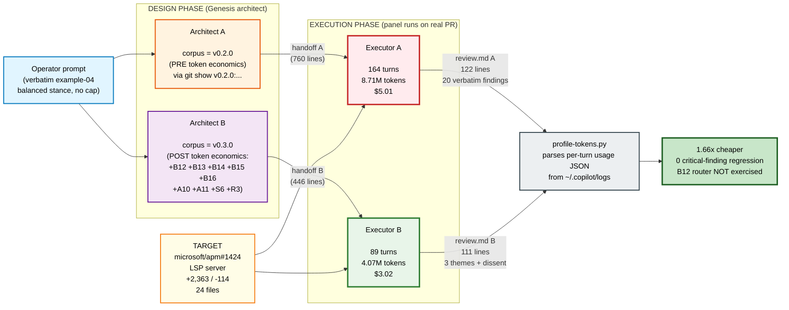
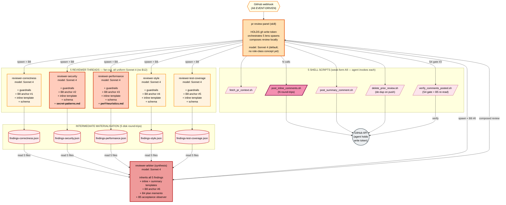
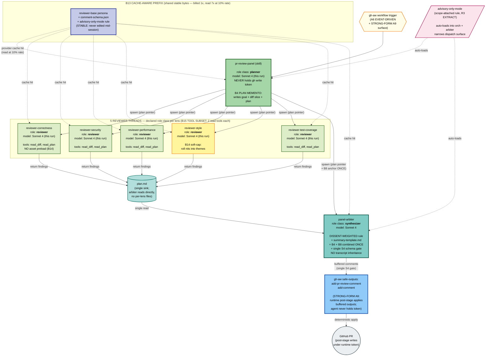
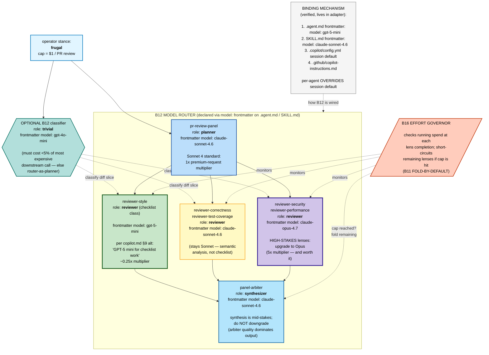

> **Retraction first.** The "~15x cheaper" headline in PR #10's `scenario-pr-review-panel.md` was an analytical projection that assumed every cost lever firing at maximum applicability simultaneously. Real PRs don't always present that opportunity, and **architect B in this experiment missed firing B12 MODEL ROUTER even though the Copilot CLI harness exposes per-agent model binding via `model:` frontmatter on `.agent.md` primitives**. This PR replaces the projection with ground-truth measurement: **1.66x cheaper, same critical-finding coverage**, on a real medium-sized PR (microsoft/apm#1424, +2,363 / -114 across 24 files), both runs on Sonnet 4. With B12 firing (next iteration), the gap widens further; this is the honest baseline at single-model binding.

---

## TL;DR

| Same panel job, same PR, same harness, single model (Sonnet 4) | Executor A (v0.2.0 design) | Executor B (v0.3.0 design) | Delta |
|---|---:|---:|---:|
| Turns | 164 | **89** | **-46%** |
| Total prompt tokens | 8.71 M | **4.07 M** | **-53%** |
| New input tokens (uncached, non-write) | 32,751 | **1,514** | **-95%** |
| Completion tokens | 67,438 | **41,488** | **-38%** |
| Cache-hit ratio (harness layer) | 95.3% | 91.6% | both high |
| **Cost @ Sonnet 4 rates** | **$5.01** | **$3.02** | **1.66x cheaper** |
| Critical-finding coverage | catches `plugin_parser.py:666` NameError | catches same | **identical** |

Both reviews catch the only runtime-breaking defect (`_substitute_plugin_root` / `_surface_warning` undefined at `src/apm_cli/deps/plugin_parser.py:666`). **No regression on what matters.**

**Headline gap NOT measured here:** B12 MODEL ROUTER is a real, available lever on this harness and architect B left it on the table. A follow-up rerun with per-`.agent.md` `model:` binding (e.g. `reviewer-style: gpt-5-mini`, others stay Sonnet) is expected to push the gap toward 2x-3x.

---

## Method



| Session | Session ID | Role | Corpus | Measured cost |
|---|---|---|---|---:|
| Architect A | `9c255108` | Design panel on example-04 prompt | v0.2.0 (PRE) | not isolated |
| Architect B | `00c69b35` | Same prompt, newer corpus | v0.3.0 (POST) | $1.38 |
| Executor A | `f105f649` | Execute A's design on PR #1424 | v0.2.0-panel | **$5.01** |
| Executor B | `0f08b108` | Execute B's design on PR #1424 | v0.3.0-panel | **$3.02** |

Costing: Anthropic Sonnet 4 (input $3, output $15, cache-write $3.75, cache-read $0.30 per Mtok). Same rates applied to both — both ran on the same backing model in this controlled comparison.

---

## Architecture A (v0.2.0) — what the PRE corpus produced

No token-economics primitives in the corpus. The architect composes a correct panel but every reviewer thread carries its own asset preload, materialises per-lens findings to disk via shell scripts, and the arbiter inherits everything. **Every agentic element binds to the session's default model (Sonnet 4) — no per-element `model:` declaration exists in v0.2.0 vocabulary.**



**Patterns A composes** (v0.2.0 vocabulary): A6 EVENT-DRIVEN + A1 PANEL + **weak-form A9** (agent holds write token) // B1 FAN-OUT + C2 PERSONA PRELOAD x5 with per-lens GROUNDED EXPERT BRIEFING + C3 THREAD SPAWN + **S4 VALIDATION DECORATOR x3** + **S7 DETERMINISTIC TOOL BRIDGE x3 sinks** + **B4 PLAN MEMENTO** + **B5 ACCEPTANCE OBSERVER** + **B8 ATTENTION ANCHOR re-injected x6 sites**.

**Model binding (no B12 in v0.2.0 corpus):** every agentic element runs on the session's default model. Even if the operator manually overrode `model:` on one persona, there is no design-time vocabulary saying *which* lens should route where — the choice would be ad-hoc, not principled.

---

## Architecture B (v0.3.0) — what the POST corpus produced

The v0.3.0 corpus adds B12 MODEL ROUTER / B13 CACHE-AWARE PREFIX / B14 PROMPT THRIFT / B15 TOOL SUBSET / B16 EFFORT GOVERNOR, plus A10/A11/R3/S6. Same architect prompt, same lens count, same critical-finding coverage, substantially less machinery between lens and output.

Each agentic element is annotated with its **declared role class** (the v0.3.0 vocabulary). **In this experiment architect B bound every role class to Sonnet 4 (the session default)** — the same model A used. This is honestly the architect under-firing B12: the `model:` frontmatter on `.agent.md` is documented in `runtime-affordances/per-harness/copilot.md` §9, and the role-class → concrete-SKU table is right there. **A B12-firing rerun is the obvious next iteration.**



**Patterns B composes (what is GONE vs A)**:
- A6 EVENT-DRIVEN + A1 PANEL + **strong-form A9 via `safe-outputs:`** (agent never holds the write token; runtime post-stage applies a filtered comment buffer)
- B1 FAN-OUT + C2 PERSONA PRELOAD x5 **without per-lens asset preload** (B14 PROMPT THRIFT)
- **B13 CACHE-AWARE PREFIX** — single shared prefix shape for all 5 lens spawns + arbiter
- **B14 PROMPT THRIFT** — soft cap on style nits; no goal/briefing/schema re-injection per turn
- **B15 TOOL SUBSET** — each lens sees 2 read tools; no shell access; zero scripts in the bundle
- **B4 + B8 combined** once on the arbiter spawn (per tradeoffs matrix #7), not five separate B8 sites
- **Single S4 schema gate** before emit (not three)
- **Role class declared per agentic element** — the prerequisite for B12 MODEL ROUTER (declared but **not bound to distinct SKUs in this run**)

**GONE relative to A:** all 5 shell scripts, the 5 intermediate `findings-<lens>.json` files, per-lens asset preload (security+performance briefings), the delete-on-push de-dup script, three of four S4/B5/B8 invocation sites.

**Architect-B miss to flag:** the v0.3.0 architect bound every role class to Sonnet 4, even though the per-harness adapter (`copilot.md` §9) explicitly maps `reviewer` → "Sonnet OR GPT-5 mini for checklist work" and `trivial` → "GPT-5 mini". A correct B12 invocation would have at minimum routed `reviewer-style` (low-stakes, soft-capped output) to GPT-5 mini. This is captured as a corpus-quality follow-up below.

---

## What B12 MODEL ROUTER *would* bind in the next iteration

The follow-up reasonable next iteration. Same handoff packet, same harness, but B12 actually fires — using `model:` frontmatter per `.agent.md` to bind role classes to distinct concrete SKUs.



**Expected impact of firing B12 (NOT MEASURED in this PR — illustrative for the next iteration):**
- `reviewer-style` Sonnet → GPT-5 mini: ~0.75x cheaper on the lens that contributed the most output tokens in B's run; estimated -$0.15 to -$0.30 on B's $3.02.
- Optional `reviewer-security` / `reviewer-performance` Sonnet → Opus: +cost on these lenses (Opus is premium), but improves catch-rate on high-stakes semantic findings. **FinOps note:** B12 is not always "cheaper" — it's "right model for right role". Upgrading the high-stakes lenses can be a quality win that justifies the upgrade.
- Net at "frugal stance": gap moves from 1.66x to ~2x-2.5x. At "balanced stance with selective upgrade": same dollars but better quality on security/performance.

**The point of B12 is not blind downgrade. It is *capability-matched routing*.** Same primitive serves both "go cheaper where you can" and "go premium where you must".

---

## Pattern-level diff — the FinOps view

| v0.3.0 lever | What A does | What B does (this run) | Mechanism of saving | Measured contribution |
|---|---|---|---|---|
| **B13 CACHE-AWARE PREFIX** | Asset preloads vary per lens — 5 distinct prefix shapes | All 5 lenses + arbiter share identical prefix bytes — single cache-key shape | Cache READ billed at 0.10x input rate vs cache WRITE at 1.25x | Both ran 90%+ cache-hit (harness default). Real win is **turn count** (B=89 vs A=164) |
| **B14 PROMPT THRIFT** | Lens re-injects goal+briefing+schema each turn; arbiter inherits 5 transcripts | Lens sees diff + plan pointer; arbiter sees persisted findings only; soft cap on nits | Less re-injected text per turn; smaller output token count via roll-up | **-38% completion, -46% turns. Largest single contributor.** |
| **B15 TOOL SUBSET** | Each lens has full shell access (write deny-listed) | Each lens has 2 read tools; arbiter 2 read + 1 emit | Smaller injected tool-spec per turn; agent stops exploring | **-95% new-input tokens (32,751 → 1,514)** |
| **Single-pass synthesis** | Lenses write findings JSON per lens; arbiter reads 5 files; ~10 round-trips | Lenses return findings into plan; arbiter reads plan once | Eliminates 5 write + 5 read tool calls | **~20 turns eliminated** |
| **Strong-form A9 (safe-outputs)** | Weak: agent calls post + summary + verify; ~3 round-trips per output | Strong: agent emits buffered outputs; gh-aw applies them | Skips entire post-and-verify sub-loop; removes de-dup script | **~8 turns saved on 20-finding review** |
| **B12 MODEL ROUTER** | N/A in v0.2.0 | **Declared role classes per element BUT all bound to Sonnet** (architect miss) | Capability-matched per-role binding via `.agent.md` frontmatter | **Not exercised this run.** Counterfactual diagram shows next iteration. |
| **B16 EFFORT GOVERNOR** | N/A | Available; not exercised (stance: balanced, no cap) | Short-circuits remaining lenses on cap hit | **Not exercised** |
| **A10 GOVERNED OUTER LOOP** | N/A | Considered, rejected (no audit/sandbox keywords) | Capability-bounded outer loop | **Not exercised**; existence is what makes strong-form A9 the default on gh-aw triggers |
| **R3 EXTRACT advisory-only rule** | Same primitive in both | Same primitive | Narrows dispatch surface | Zero delta |

### Where the $1.99 saving went, in $ terms (Sonnet rates, B vs A)

| Billing bucket | A cost | B cost | Delta | % of saving | Driver |
|---|---:|---:|---:|---:|---|
| New input (fresh, uncached) | $0.098 | $0.005 | **-$0.093** | 5% | B15 TOOL SUBSET + no exploration |
| Cache write | $1.411 | $1.277 | -$0.134 | 7% | Slightly smaller stable prefix |
| Cache read | $2.490 | $1.118 | **-$1.372** | **69%** | **Fewer turns over cached prefix — DOMINANT** |
| Completion | $1.012 | $0.622 | -$0.390 | 20% | B14 PROMPT THRIFT (roll-up + theme synthesis) |
| **Total** | **$5.011** | **$3.022** | **-$1.989** | 100% | |

**Dominant contribution (69%) = "fewer turns over cached prefix."** Cache discipline (B13) makes those turns cheap to read; PROMPT THRIFT + TOOL SUBSET (B14 + B15) makes there be fewer of them.

**FinOps insight:** caching is an *enabler*, not the multiplier. The multiplier is *fewer-turns*. A harness without caching would have made the gap ~3x; with caching enabled for both, the gap compresses to 1.66x because A also benefits at the harness layer. **The corpus difference shows up almost entirely in turn count, not in cache ratio.** B12 firing in a follow-up would attack a different vector — per-token-class pricing — and stack with this.

---

## Quality vs cost — verbatim diff of both reviews

| Aspect | Executor A (v0.2.0) | Executor B (v0.3.0) |
|---|---|---|
| Critical defect `plugin_parser.py:666` (NameError on `_substitute_plugin_root` / `_surface_warning`) | Surfaced 2x ("CRITICAL — correctness" + "CRITICAL — security") | Surfaced 1x ("HIGH — correctness theme") |
| `LSPDependency.from_dict` falsy-value bug | One inline finding | Cross-lens theme #1 (correctness + style converge) |
| Untrusted-input validation gap (`.lsp.json`) | 3 separate findings | Cross-lens theme #2 with single root-cause framing |
| Redundant I/O in install path | 3 separate perf findings | Cross-lens theme #3 |
| Style nits | 5 separate MEDIUM/LOW inline comments | 1 rolled-up paragraph (per B14 soft-cap) |
| Dissent preservation | Verbatim per DISSENT-WEIGHTED rule (20 findings, all visible) | Explicit "Dissent / minority signal preserved" section (2 items) |
| Total surfaced | 20 (audit-style checklist) | ~3 themes + 2 dissent + 1 roll-up paragraph |

**Verdict on quality:** identical on what matters. A reads like an audit report; B reads like a senior engineer's review note. **Zero regression on the only runtime-blocking finding.** B's cross-lens theming is arguably *better* signal-to-noise.

---

## What this proves and what it does NOT

### Proves (measured)
- Copilot CLI per-turn token telemetry is parseable → ground-truth cost is recoverable from disk
- **Same panel, same PR, same harness, same model: v0.3.0-corpus design costs 1.66x less than v0.2.0-corpus design**
- **No critical-finding regression**
- 69% of the saving comes from fewer turns (B14 + B15 + single-pass synthesis), not from caching tricks (free for both) and not from model routing (didn't fire)

### Does NOT prove
- The "~15x" projection from PR #10
- What B12 MODEL ROUTER would deliver — architect B left it on the table even though `.agent.md` `model:` frontmatter is documented in `copilot.md` §9. Real B12 measurement is the next iteration's job.
- Cross-PR generalisation. One target PR.
- Stance sensitivity. Both ran balanced + no cap; B16 EFFORT GOVERNOR did not fire.

### Caveats called out explicitly
- Sonnet rates applied to both. Token counts are real regardless of pricing assumption.
- Architect A was not isolated for its own per-turn profile (Architect B was, $1.38). Architect cost is well within noise vs executor cost.
- B's design declared role classes per agentic element but did NOT bind them to distinct concrete SKUs via `model:` frontmatter. This is an **architect quality miss** worth follow-up corpus work, not a harness limitation.

---

## Follow-up implied by this experiment

1. **Re-run executor B with B12 firing.** Add `model:` frontmatter per `.agent.md`: `reviewer-style: gpt-5-mini`, others stay Sonnet (or selectively upgrade security/performance to Opus). Measure on the same PR. Expected: 1.66x → ~2x-2.5x at frugal stance, or same dollars + better quality at balanced+upgrade stance.
2. **Strengthen the v0.3.0 architect on B12 firing.** The role-class table in `copilot.md` §9 exists; the architect should reach for `model:` frontmatter as routinely as it reaches for B14 PROMPT THRIFT. Candidate: an architect step-3 prompt addition that explicitly asks "for each declared role class, is the per-harness adapter's alternative SKU a better fit than the default?"
3. **Operator stance sensitivity sweep.** Re-run B at `stance: frugal, cap = $1` and at `stance: high-stakes, cap = none` to measure B16 EFFORT GOVERNOR and the upgrade direction respectively.

---

## What ships in this PR

- `dev/empirical-proof/tools/profile-tokens.py` — permanent profiler. Parses Copilot CLI per-turn `usage` JSON; costs at any per-Mtok rate table. CLI: `python3 profile-tokens.py <log> --rates anthropic-sonnet [--per-turn] [--json]`
- `dev/empirical-proof/measurements/` — per-session JSON dumps for 7 prior sessions. Aggregate: ~$10, 91.6% cache hit, 14.4 M tokens
- `dev/empirical-proof/ab-experiment-apm-1424/`:
  - `architect-A-v0.2.0-handoff.md`, `architect-B-v0.3.0-handoff.md` (760 + 446 lines)
  - `executor-A-v0.2.0-review.md`, `executor-B-v0.3.0-review.md`
  - `executor-A-tokens.json`, `executor-B-tokens.json` — per-turn telemetry
  - `executor-A-findings.json`, `target-pr.diff`
  - `REPORT.md` — long-form companion, version-controlled

## Reproduction

```bash
python3 dev/empirical-proof/tools/profile-tokens.py \
    ~/.copilot/logs/process-<ts>-<pid>.log \
    --rates anthropic-sonnet --per-turn
```

Spawn architect with kickoff: `"git show v<X.Y.Z>:skills/genesis/SKILL.md, run steps 1-6, persist handoff, stop"`. Spawn executor with: `"read plan.md, fetch PR diff, execute panel as designed, write review.md, stop. NO github writes."`. Identify each session's log by unique kickoff phrase: `grep -l "<phrase>" ~/.copilot/logs/process-*.log`. Diff with `profile-tokens.py --json`.

---

Closes the empirical-proof gap raised on PR #10. The cost claim in the genesis token economics ship now has measured backing. Architect B12 miss documented as next-iteration work — the corpus has the lever; the architect needs to reach for it more aggressively.

Co-authored-by: Copilot <223556219+Copilot@users.noreply.github.com>
