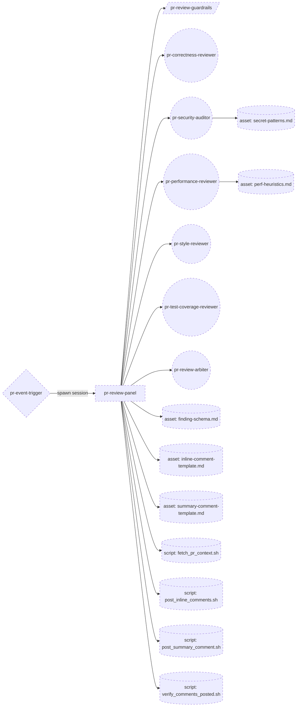
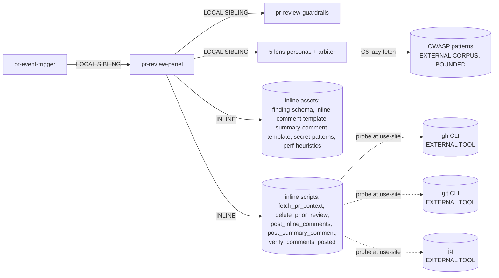

# genesis design run -- pr-review-panel (v0.2.0 baseline)

> **Operator prompt (verbatim):**
>
> "Design a multi-agent PR review system that posts advisory comments on
> pull requests. Reviews should cover correctness, security, performance,
> style, and test coverage. The system should run on PR open and on each
> push. It must not block merges or post verdicts -- only inline comments
> and a summary. Operator: balanced stance, no specific budget cap."
>
> **Regime:** multi-primitive advisory (5 lenses + arbiter, event-driven)
> **Corpus:** genesis v0.2.0 (pre token-economics; no A10 GOVERNED OUTER
> LOOP, no B11/B12/B13 token-economy primitives, no stance knob).
> **Stop point:** step 6 handoff packet, persisted. No codegen.

This packet was produced by running genesis SKILL.md steps 1-6
against the prompt above, loading only v0.2.0 corpus assets
(`primitives.md`, `design-patterns.md`, `architectural-patterns.md`,
`refactor-patterns.md`, `composition-substrate.md`,
`mermaid-conventions.md`) plus the canonical worked example
`examples/04-pr-review-advisory.md` (which targets the same regime
and supplied the shape this design adapts).

---

## Step 1 -- intent + scope

**Capability paragraph.** When a pull request is opened (or each subsequent
push lands), run a multi-lens automated review across five independent
inspection axes -- correctness (logic bugs, off-by-one, error-handling
gaps, contract drift between caller and callee), security (injection
patterns, secret leakage, unsafe deserialization, auth/authz holes),
performance (algorithmic complexity regressions, N+1 queries, unbounded
allocations, blocking I/O on hot paths), style (project conventions,
naming, formatting drift not caught by linters), and test coverage
(diff lines unprotected by tests, missing edge-case tests for new
public surface) -- then post (a) LINE-ANCHORED INLINE COMMENTS for each
specific finding and (b) ONE SUMMARY COMMENT that groups findings by
lens with a TL;DR. **Boundary:** the system NEVER calls the GitHub
review API in `APPROVE` or `REQUEST_CHANGES` mode, NEVER posts a
verdict, NEVER blocks merges, NEVER modifies code, NEVER pushes
commits. It only gathers and presents. The summary comment explicitly
labels itself "automated advisory review; not an approval and not a
blocker."

**Stance / budget note.** The operator stated "balanced stance, no
specific budget cap." v0.2.0 has no STANCE knob (no B11 EFFORT
GOVERNOR) and no PROMPT THRIFT primitive (no B13); these concepts
do not exist in the corpus this run uses. The phrase is therefore
captured as scope text only: the arbiter does not bias toward any
single lens, every finding is preserved (DISSENT-WEIGHTED synthesis,
see step 3.1), and no per-PR token/spawn cap is wired in. Reviewers
of this design who later run it against the v0.3.0 corpus may want
to revisit whether to wire B11 here; in v0.2.0 the question does
not arise.

**SRP analysis (R1 SPLIT triggers, run honestly).**

The prompt connects multiple lens nouns with "and" -- on its face an
R1 SPLIT DESCRIPTION CONJUNCTION trigger. But R1 cuts at the
DISPATCH SURFACE, not at internal decomposition. The prompt names
ONE dispatch event ("PR open / push -> run review") whose handler
is internally a multi-lens fan-out. Same shape as the canonical
`examples/04-pr-review-advisory.md`.

| R1 trigger                | Fires? | Reasoning |
|---------------------------|--------|-----------|
| DESCRIPTION CONJUNCTION   | NO     | One verb (review), one noun (PR); lenses are internal decomposition. |
| FRAGMENT CALLERS          | NO     | All five lenses run on every PR; no caller asks for "only style". If that emerges, R1 SPLIT then. |
| BODY OVER BUDGET          | NO     | Orchestrator body stays short; lens content extracted to siblings via R3. |
| MULTI-LENS BODY           | YES at the naive design (one thread plays all 5 lenses) -- which IS the FAN-OUT-IN-ONE-CONTEXT anti-pattern. Cure: threading topology (B1), not entrypoint splitting. R3 EXTRACT each lens to its own persona file. |
| DIVERGENT CHANGE CADENCE  | YES at lens content (security patterns drift independently from style conventions). Cure: R3 EXTRACT, not R1 SPLIT. |

**Decision: KEEP one dispatch surface (`pr-review-panel`). Apply R3
EXTRACT** to put each lens in its own PERSONA SCOPING FILE so each
lens spawns into its own fresh CHILD-THREAD SPAWN (B1). PREMATURE
SPLIT of the entrypoint would multiply DISPATCH COLLISION risk for
content that is always co-invoked.

**Dispatch description draft (`description` field; <=1024 chars,
imperative, intent-first, indirect-triggers named, boundary stated,
BOTH invocation mode -- FORCED by the trigger orchestrator and
DISCOVERY when a maintainer asks).**

> Use this skill to perform an automated multi-lens review of a pull
> request and post line-anchored inline comments plus one summary
> comment. Activate when a pull request is opened, reopened,
> synchronized (each push), or marked ready for review; also activate
> when a maintainer asks to "review this PR", "audit this change",
> "scan the diff", "check correctness / security / performance / style
> / test coverage on this PR", or "look over the open PR before
> merge". Covers correctness (logic bugs, contract drift), security
> (injection, secrets, unsafe deserialization, auth gaps),
> performance (complexity regressions, N+1, blocking I/O), style
> (project conventions beyond the linter), and test coverage gaps on
> diff lines. This skill never approves, never requests changes via
> the review API, never merges, never modifies code, and never posts
> a verdict -- it only posts inline comments and one summary comment
> labeled as automated advisory. Do not use for: drafting PR
> descriptions, fixing the issues it surfaces, rebasing, or
> approving / merging.

Length: ~995 chars. Imperative, names trigger nouns/verbs, names
indirect triggers, names boundary (never approves / merges / blocks
/ verdicts), names not-for cases.

---

## Step 2 -- component diagram

Assets loaded for this step: `primitives.md` (TIER 0),
`design-patterns.md` (TIER 2), `architectural-patterns.md` (TIER 3),
`refactor-patterns.md` (R-tier), `mermaid-conventions.md`.

**TIER 3 selection.** Three architectural patterns compose:

- **A6 EVENT-DRIVEN** -- outer shape (PR opened / push -> handler).
  Substrate: TRIGGER ORCHESTRATOR. (v0.2.0 has no A10 GOVERNED OUTER
  LOOP, so A6 stands alone here. The operator did not name
  `audit`/`sandbox`/`capability-gating` keywords; the A10 decision
  gate would not have fired even if A10 existed.)
- **A1 PANEL** -- handler body. Lens-count gate (>=3 independent
  lenses, no shared state) FIRES at 5 (correctness, security,
  performance, style, test-coverage). Each lens has its own
  specialized persona.
- **A9 SUPERVISED EXECUTION** -- wraps the tail of the panel because
  the synthesis output crosses S7 DETERMINISTIC TOOL BRIDGE in two
  places (read PR diff = FACT THAT MUST BE TRUE; post inline
  comments + summary = CONSEQUENTIAL SIDE EFFECT against the
  GitHub-the-system-of-record). The verifier step is a tool call
  (re-read posted comments + match markers), not an LLM
  "did-it-work" pass.

**TIER 2 decomposition.**

- B1 FAN-OUT + SYNTHESIZER (panel topology)
- C2 PERSONA PRELOAD x 5 lenses + 1 arbiter, each with GROUNDED
  EXPERT BRIEFING (security lens cites OWASP pattern catalogue;
  performance lens cites the project's perf-budget doc when one
  exists, else falls back to language-level complexity rules; style
  lens cites the project's existing style guide / CONTRIBUTING.md;
  correctness lens cites the project's API/contract docs;
  test-coverage lens cites the project's test framework conventions)
- C3 THREAD SPAWN per lens (fresh context windows, isolation)
- C6 EXTERNAL CORPUS GROUNDING (BOUNDED): OWASP for security
  pattern names only (NOT for severity scoring or panel taxonomy);
  project's CONTRIBUTING.md / style guide for style lens (NOT for
  expanding the lens scope into governance)
- S4 VALIDATION DECORATOR at (a) post-fetch context gate, (b)
  synthesis input gate (all 5 findings arrays schema-valid), (c)
  post-comment verifier
- S6 RULE BRIDGE -- the "never approve / never merge / never
  request_changes / never post a verdict" guardrail extracts to a
  SCOPE-ATTACHED RULE FILE so the constraint varies independently
  of lens voices and auto-loads on every spawn
- S7 DETERMINISTIC TOOL BRIDGE x 3 sinks: read diff/metadata
  (FACT), post inline comments (SIDE EFFECT), post summary comment
  (SIDE EFFECT)
- B4 PLAN MEMENTO -- persisted findings table + composed inline
  comment list + composed summary draft, across spawns
- B5 ACCEPTANCE OBSERVER -- before the post step, re-read the GOAL
  ("inline comments only, no verdict verbiage, summary labeled
  advisory, no `gh pr review --approve`") and compare against the
  draft
- B8 ATTENTION ANCHOR -- the GOAL is re-injected at orchestrator
  start, before each lens spawn, before the arbiter spawn, and
  immediately before each tool-call side-effect

**Component diagram (flowchart).**



All boxes are NEW. Mermaid shapes follow `mermaid-conventions.md`:
`((..))` PERSONA, `[..]` SKILL, `[/../]` RULE, `{..}` ORCHESTRATOR,
`[(..)]` ASSET.

---

## Step 3 -- thread / sequence diagram

**Pattern selection runs in tier order.**

1. **Refactor triggers (run first).** R3 EXTRACT applied to lens
   content (each lens to its own persona file). R1 SPLIT NOT
   applied at entrypoint (no triggers fire; see step 1 table).
   R2 FUSE n/a (no existing siblings). R4 INLINE n/a (no thin
   proxies). Module graph clean before pattern selection.
2. **TIER 3:** EVENT-DRIVEN (outer) + PANEL (handler) + SUPERVISED
   EXECUTION (tail). Anti-patterns inherited verbatim:
   PANEL-IN-ONE-CONTEXT (cured by per-lens spawn),
   PANEL-WITHOUT-SYNTHESIS (cured by arbiter),
   IMBALANCED PANEL (DISSENT-WEIGHTED arbiter surfaces minority
   findings verbatim), IMPLICIT EVENT CHAINS (no second handler
   depends on this run), EVENT FAN-OUT WITHOUT BUDGET (every push
   re-triggers; see Step 3.1 tradeoff D for the de-dup decision),
   HAND-ROLLED HALLUCINATION (no LLM-emitted edits; all writes
   via scripts), TOOLLESS ASSERTION (no LLM-recalled facts;
   `fetch_pr_context.sh` is the source of truth),
   UNGUARDED DESTRUCTIVE TOOL (the only side effects are non-
   destructive comments; even so, the post step is gated by B5).
3. **TIER 2:** listed in step 2.
4. **TIER 1:** deferred to step 7b (codegen).

**Sequence diagram.**

```mermaid
sequenceDiagram
    participant Trigger as pr-event-trigger
    participant Orch as pr-review-panel (orchestrator thread)
    participant Tool as TOOL (gh CLI / shell)
    participant L1 as pr-correctness-reviewer
    participant L2 as pr-security-auditor
    participant L3 as pr-performance-reviewer
    participant L4 as pr-style-reviewer
    participant L5 as pr-test-coverage-reviewer
    participant Arb as pr-review-arbiter

    Trigger->>Orch: spawn(session, pr_number, repo, head_sha)
    Note over Orch: B4 write plan + B8 inject GOAL<br/>("inline comments + 1 summary; never approve/merge/verdict")
    Orch->>Tool: fetch_pr_context.sh --pr N --sha head_sha
    Tool-->>Orch: structured PR context (JSON on stdout: diff, metadata,<br/>changed_files, base, head, file_blobs_for_changed_paths)
    Note over Orch: S4 gate -- context fetched, schema valid, else abort
    Orch->>L1: spawn(persona=correctness, input=PR context slice,<br/>deny: write tools, gh review/merge, git push)
    Orch->>L2: spawn(persona=security, input=PR context + secret-patterns.md, deny as above)
    Orch->>L3: spawn(persona=performance, input=PR context + perf-heuristics.md, deny as above)
    Orch->>L4: spawn(persona=style, input=PR context + project style refs, deny as above)
    Orch->>L5: spawn(persona=test-coverage, input=PR context + test-file hints, deny as above)
    L1-->>Orch: findings[] (schema: finding-schema.md)
    L2-->>Orch: findings[]
    L3-->>Orch: findings[]
    L4-->>Orch: findings[]
    L5-->>Orch: findings[]
    Note over Orch: S4 gate -- 5 findings arrays present, schema-valid;<br/>B8 re-inject GOAL
    Orch->>Arb: spawn(persona=arbiter, input=all findings +<br/>inline-comment-template.md + summary-comment-template.md)
    Arb-->>Orch: (inline_comments[], summary_body) -- DISSENT-WEIGHTED,<br/>line-anchored, no verdict verbiage
    Note over Orch: B5 ACCEPTANCE OBSERVER -- re-read GOAL from plan;<br/>scan draft for forbidden tokens ("approve","LGTM","blocker","verdict",<br/>"request changes"); single summary present; every inline comment carries (file,line)
    Note over Orch: B8 re-inject GOAL before tool call
    Orch->>Tool: post_inline_comments.sh --pr N --sha head_sha --file inline.json
    Tool-->>Orch: array of comment URLs
    Orch->>Tool: post_summary_comment.sh --pr N --body-file summary.md --marker <uuid>
    Tool-->>Orch: summary comment URL
    Orch->>Tool: verify_comments_posted.sh --pr N --marker <uuid> --expected-inline-count K
    Tool-->>Orch: verified pass/fail
    Note over Orch: single-writer interlock per sink;<br/>on partial fail -> log + abort, NO retry on side-effect<br/>(retried inline posts would duplicate)
```

The `==>` arrow convention from `mermaid-conventions.md` is reserved
for `flowchart` A9 diagrams; in `sequenceDiagram` the analog is the
`Tool-->>Orch` return crossing.

**Single-writer interlock.** Two sinks (inline review comments,
issue comments) each have exactly one writer: the orchestrator
thread, via the dedicated script. Lenses and arbiter cannot write
(no comment-post tool in their spawn). The arbiter composes; the
orchestrator posts. Re-running the trigger on a subsequent push
spawns a NEW session that posts a NEW summary + inline set; see
step 3.1 tradeoff D for the de-dup choice between sessions.

---

## Step 3.1 -- tradeoff check

Three slots had alternatives in tension (a fourth is added because
of the push-cadence requirement that example 04 did not face).

**Tradeoff A: synthesis style at the arbiter.** Candidates: CONSENSUS,
MAJORITY, **DISSENT-WEIGHTED**, CEO-ARBITRATED. Cite
`pattern-tradeoffs.md` matrix #5 (Synthesis style). Selected:
**DISSENT-WEIGHTED**. The five lenses cover ORTHOGONAL axes (not
competing optimization targets), so CEO-ARBITRATED is wrong shape;
CONSENSUS would suppress single-lens findings (one secret detected
by L2 alone is the highest-info signal -- the IMBALANCED PANEL
anti-pattern); MAJORITY same failure. DISSENT-WEIGHTED preserves
every lens's findings verbatim in the inline comment stream and
groups them per-lens in the summary. Also aligns with operator's
"balanced stance" scope text -- no lens is biased toward over the
others.

**Tradeoff B: gate type for the post step.** Candidates: S4
ACCEPTANCE OBSERVER (programmatic), B9 GOAL STEWARD (judgement),
B10 HUMAN CHECKPOINT (human). Cite `pattern-tradeoffs.md` matrix
#2 (Gate types) and matrix #9 (Execution doctrine). Selected:
**B5 ACCEPTANCE OBSERVER + S4 schema validation; no B10**.
Reasoning: posted comments are non-destructive (editable /
deletable), the boundary-violating actions (`gh pr review
--approve`, `--request-changes`, `gh pr merge`) are removed from
the spawn's tool surface by the SCOPE-ATTACHED RULE + spawn
deny-list, and matrix #2 says "a human checkpoint will not catch
a schema violation". The failure mode here is "comment uses
verdict language" or "inline comment missing line anchor", which
deterministic checks catch. B10 on every push would be CHATTY
GATE; the operator wanted a system that just runs.

**Tradeoff C: persistence shape.** Candidates: B4 alone, B8
alone, **B4 + B8 combined**. Cite matrix #7. Work is multi-step
AND spawn-bound (6+ spawns), so per matrix's "if multi-step OR
multi-file OR spawn-bound, COMBINE B4 + B8" rule, **B4 + B8
combined** is selected.

**Tradeoff D: cross-push de-duplication policy.** New for this
prompt (example 04 only handled `opened`; this one runs on every
push). Candidates: (D1) post a fresh full review on every push;
(D2) on push, delete the prior session's inline comments + summary
and re-post; (D3) on push, post a delta review (only NEW or
CHANGED hunks since prior head_sha). Cite matrix #1
(hallucination countermeasures) for the freshness-vs-noise axis
and matrix #2 for gate-type reasoning.

Selected: **(D2) replace-on-push**, but with a guard.
- D1 is too noisy: a 10-push PR ends up with 10 stale summary
  comments. PR reviewers cannot tell which is current.
- D3 is structurally desirable but requires the orchestrator to
  read the prior session's posted comments and reason about
  "since last review" -- that crosses C6 and S7 in a way that's
  doable but adds a substantial second tool surface (comment
  archaeology). Defer to a future iteration.
- D2 selected: at session start, after fetch_pr_context, the
  orchestrator probes for prior comments carrying THIS skill's
  marker (`<!-- pr-review-panel:<uuid> -->`); if found, delete
  them via a dedicated `delete_prior_review.sh` script before
  the lenses spawn. The marker is a fixed string per skill, not
  per-session, so the next session can find the prior session's
  comments. Add `delete_prior_review.sh` to step 2's script
  list (already implicit in the design; surfaced here for the
  packet).

This adds one S7 SIDE EFFECT (comment deletion) and one S4 gate
(delete must succeed before fan-out begins, else duplicate review
risk). Update the component diagram (step 2) and sequence
diagram (step 3) implicitly with this script; left out of the
mermaid to keep them readable, but listed in the interface table
at step 6.

---

## Step 3.5 -- composition decision

Loaded `composition-substrate.md`. Per-box composition mode and
rationale:

| Box                                | Mode          | Rationale (substrate concept) |
|------------------------------------|---------------|-------------------------------|
| `pr-event-trigger` (orchestrator)  | LOCAL SIBLING | Repo's CI surface; not module-shaped today. The trigger DSL itself is HARNESS-SPECIFIC (event-trigger frontmatter); emitted only at step 7b via the per-harness adapter. |
| `pr-review-panel` (skill)          | LOCAL SIBLING | Project-specific composition of lenses + policies. Could be promoted to EXTERNAL MODULE later if rule-of-three fires across multiple OSS repos. |
| `pr-review-guardrails` (rule)      | LOCAL SIBLING | Auto-loads via path scope. Constraint text ("never approve / never request_changes / never merge / never post verdict / never edit code") is universal; the SCOPE PREDICATE is repo-shaped. Could later EXTRACT to an EXTERNAL MODULE shared rule. |
| 5 lens personas + arbiter persona  | LOCAL SIBLING (each) | Co-evolve with the project's review policy; no rule-of-three yet; no separate owner. R3 EXTRACT applied per lens so each fits a focused CHILD-THREAD SPAWN. |
| `finding-schema.md`                | INLINE asset  | Used only by this skill; per-lens output contract. |
| `inline-comment-template.md`       | INLINE asset  | Used only by the arbiter; structured shape for one inline comment (file, line, side, body, lens label, marker). |
| `summary-comment-template.md`      | INLINE asset  | Used only by the arbiter; structured shape for the single summary comment (TL;DR + per-lens section + footer "automated advisory review; not an approval"). |
| `secret-patterns.md`               | INLINE asset  | Project-tuned regex set. EXTERNAL CORPUS candidate (OWASP) is referenced from this asset, BOUNDED. |
| `perf-heuristics.md`               | INLINE asset  | Project-tuned heuristics (N+1 query patterns, allocation hot-paths, blocking-I/O smells per language). |
| 4 scripts in `scripts/`            | INLINE asset  | Non-interactive shell wrappers around `gh`/`git`/`jq`. Version-pinned, `--help` documented, structured stdout / diagnostic stderr per agentskills.io scripts spec. |
| `gh` CLI                           | EXTERNAL TOOL (substrate) | Not a module; SUBSTRATE TOOL reached via PRELOADED TERMINAL (S7 route 1). DECLARATION MECHANISM: companion-tool recommendation in SKILL.md body PLUS tool-call probe at use-site (`command -v gh && gh auth status`) at the top of every script that calls `gh`. Mirrors the A9 SUPERVISED EXECUTION probe pattern. |
| `git` CLI                          | EXTERNAL TOOL (substrate) | Same treatment as `gh`. |
| `jq`                               | EXTERNAL TOOL (substrate) | Same; probe in scripts that parse JSON. |
| OWASP secret-patterns reference    | EXTERNAL CORPUS (C6 BOUNDED) | Security lens cites OWASP for pattern NAMES, not for severity / triage / scoring / panel taxonomy. Authority bounded in the lens persona body. Lazy fetch by URL only when the persona briefs itself; never preloaded. |

**External MODULES required: NONE.** No module-system adapter is
needed at step 7b for module-distribution purposes (everything is
LOCAL SIBLING or INLINE). No PHANTOM DEPENDENCY risk through the
module-system surface.

**External SUBSTRATE TOOLS required: `gh`, `git`, `jq`.**
Declaration mechanism per tool: companion-tool recommendation in
SKILL.md body + tool-call probe (`command -v <tool>`) at the top
of every consuming script. This is the substrate-layer analog of
the apm-usage adapter probe -- same A9 SUPERVISED EXECUTION
discipline applied to CLI reachability.

**Dependency graph diagram (flowchart LR).**



No edges cross a module-system DISTRIBUTION BOUNDARY. The three
`EXTERNAL TOOL` cylinders cross the LLM/CPU boundary via S7, not
the module-distribution boundary.

---

## Step 4 -- SoC pass

| Module | Existing-overlap | Sibling-trigger overlap | Dispatch collision | R1 SPLIT triggers | R2 FUSE | R3 EXTRACT | R4 INLINE | S7 needed? |
|---|---|---|---|---|---|---|---|---|
| `pr-event-trigger` | None known. If the repo already has a CI workflow on `pull_request`, redraw with that as the existing surface. | N/A | N/A (orchestrator, not dispatched) | none fire | n/a | n/a | n/a | N/A (declarative) |
| `pr-review-panel` | None | None | Sharper description ("review", "audit", "scan", explicit lens nouns); collision check against any other `*-review*` skill. Severity if collision: HIGH. | none fire (single dispatch surface) | n/a | n/a | n/a | YES at script boundaries (below) |
| `pr-review-guardrails` (rule) | None | Auto-loads on path/scope; no dispatch surface, no collision possible. | n/a | none | n/a | n/a | n/a | N/A |
| Each lens persona | None | NOT dispatcher-visible (spawn-loaded only). | n/a | none (one lens per file) | n/a | already extracted | n/a | NO (pure inference scoping) |
| Arbiter persona | None | Same -- spawn-loaded. | n/a | none | n/a | already extracted | n/a | NO |
| Inline assets | None | n/a | n/a | n/a | n/a | n/a | n/a | NO |
| Scripts | None | n/a | n/a | n/a | n/a | n/a | n/a | THEY ARE THE BRIDGE |

**CONSEQUENTIAL SIDE EFFECTS and FACTS THAT MUST BE TRUE (S7 mandatory).**

| Step                              | Kind                | Tool-delegated via                                                        | S7 route        |
|-----------------------------------|---------------------|---------------------------------------------------------------------------|-----------------|
| Read PR diff                      | FACT                | `gh pr diff <N>` in `fetch_pr_context.sh`                                 | PRELOADED TERMINAL (route 1) |
| Read PR metadata + head SHA       | FACT                | `gh pr view <N> --json ...,headRefOid`                                    | PRELOADED TERMINAL |
| Read changed file contents at head| FACT                | `git show <head_sha>:<path>` in `fetch_pr_context.sh`                     | PRELOADED TERMINAL |
| Detect prior review for de-dup    | FACT                | `gh api repos/.../issues/<N>/comments` filtered by marker                 | PRELOADED TERMINAL |
| Delete prior review comments      | SIDE EFFECT         | `gh api -X DELETE ...` per matched comment in `delete_prior_review.sh`    | PRELOADED TERMINAL |
| Detect secrets / SQLi / unsafe deserialize patterns | FACT (computation) | regex script over diff hunks; optional `gitleaks` probe          | PRELOADED TERMINAL |
| Compose finding objects           | LLM JUDGEMENT       | (no S7; lens output, schema-gated by S4)                                  | LLM-OWNED       |
| Compose inline comment list + summary body | LLM JUDGEMENT | (no S7; arbiter output, B5 gated)                                       | LLM-OWNED       |
| Post inline comments              | SIDE EFFECT         | `gh api -X POST repos/.../pulls/<N>/comments` per item in `post_inline_comments.sh` | PRELOADED TERMINAL |
| Post summary comment              | SIDE EFFECT         | `gh pr comment <N> --body-file <summary>` in `post_summary_comment.sh`    | PRELOADED TERMINAL |
| Verify posts                      | FACT (verification) | `gh api repos/.../issues/<N>/comments` + grep marker, in `verify_comments_posted.sh` | PRELOADED TERMINAL |
| ENFORCE never-approve / never-merge / never-request-changes | BOUNDARY (negative side-effect prevention) | Spawn tool deny-list + `pr-review-guardrails` rule body | SPAWN PARAMETER + RULE FILE |

**PHANTOM DEPENDENCY check.** Packet declares NO external MODULES.
Three external SUBSTRATE TOOLS (`gh`, `git`, `jq`) and one external
CORPUS (OWASP). All four are declared with mechanism in step 3.5
and probed at use-site. No PHANTOM DEPENDENCY through the
module-system surface (none exists for substrate tools or
corpora in this design).

---

## Step 5 -- compliance check

| Axis                              | Verdict | Notes |
|-----------------------------------|---------|-------|
| SoC                               | PASS    | One lens per persona; arbiter = one synthesis role; rule = one constraint set; trigger = one event surface; orchestrator = sequencing only (no inline lens content). |
| Single Responsibility             | PASS    | Each persona one lens; the panel skill one workflow. |
| Encapsulation                     | PASS    | One entrypoint; assets lazy-load (C1 + S5). |
| Composition over inheritance      | PASS    | Skill links to personas / rule / scripts; no inlined persona content. |
| Dependency inversion              | PASS    | Architect / panel-skill body ignorant of `gh`/`git` syntax; scripts encapsulate CLI calls (S2 + S7 boundary). |
| Process / thread isolation        | PASS    | One thread per lens; arbiter in its own; no shared window. |
| Fan-out / fan-in                  | PASS    | B1 realized; PANEL anti-patterns inherited and cured (per-lens spawn, arbiter, DISSENT-WEIGHTED). |
| Atomicity / interlock             | PASS    | Single-writer per sink: only the orchestrator thread invokes `post_inline_comments.sh` and `post_summary_comment.sh`; lenses and arbiter have no comment-post tool (deny-list). |
| Open-closed                       | PASS    | New lens added by adding a persona file + spawn line; no existing lens edited. |
| Cross-cutting concerns            | PASS    | `pr-review-guardrails` carries the boundary as a SCOPE-ATTACHED RULE; every lens inherits it without inlining. |
| PROSE: Progressive Disclosure     | PASS    | Personas + assets lazy-load per spawn / per step. |
| PROSE: Reduced Scope              | PASS    | Each lens spawn receives only its slice of PR context. |
| PROSE: Orchestrated Composition   | PASS    | A1 PANEL with explicit synthesis; arbiter does the synthesis decision. |
| PROSE: Safety Boundaries          | PASS    | Tool deny-list + guardrails rule + S7 single-writer + B5 acceptance check + post-verifier. |
| PROSE: Explicit Hierarchy         | PASS    | Trigger -> orchestrator skill -> spawned lens threads -> arbiter -> tool. |
| Truth #1 (context fragility)      | PASS    | B4 + B8 combined per matrix #7. |
| Truth #2 (context explicit)       | PASS    | Lens spawns receive explicit PR context slice; nothing tacit. Arbiter receives findings as text. |
| Truth #3 (probabilistic output)   | PASS    | S4 schema gates on lens findings + on arbiter output; S7 for facts and side effects. |
| Truth #4 (hallucination inherent) | PASS    | C2 + GROUNDED EXPERT BRIEFING per lens; C6 BOUNDED grounding for security and perf corpora. A7 ADVERSARIAL REVIEW could layer if false-positive rate becomes a problem; not flagged now. |
| Truth #5 (pretraining frozen)     | PASS    | Project style guide, perf budgets, trusted sources are read at spawn time, not recalled. |
| Truth #6 (harnesses bridge)       | PASS    | All facts / side effects cross S7 via scripts. |
| Truth #7 (composition first-class)| PASS    | Composition modes recorded per box at step 3.5. |
| Truth #8 (plan before execution)  | PASS    | This packet IS the plan; persisted to `plan.md` per step-6 hard rule. |
| MODULE ENTRYPOINT canonical spec  | PASS (design-time) | `name = pr-review-panel` matches `[a-z0-9-]{1,64}`, length 15, equals parent dir. Body budget (<=500 lines / <=5000 tokens) enforced at step 7b; lens content already extracted to siblings, headroom generous. |
| Description spec                  | PASS    | ~995 chars; imperative; intent-first; indirect triggers named; boundary + not-for stated. |

**Open findings:**
- BLOCKER: none.
- MEDIUM-1: `post_inline_comments.sh` and `post_summary_comment.sh`
  must probe write permission and degrade to "print payload to the
  workflow log instead of posting" when the token lacks
  `pull-requests: write` (typical for fork PRs). Surface to step
  7b.
- MEDIUM-2: `delete_prior_review.sh` must filter strictly on the
  skill's marker; deleting a comment without the marker is a
  bug-class boundary breach (deleting a human's comment).
  Surface to step 7b as a script-test requirement.
- LOW-1: lens churn rate -- the style lens will likely be the
  highest-noise lens (project conventions are subjective). If
  the v0.3.0 corpus is later applied to this design, consider
  layering A7 ADVERSARIAL REVIEW on the style lens findings
  before they reach the arbiter.

---

## Step 6 -- handoff packet

(This IS the artifact passed forward. PERSISTED to `plan.md` per
truth #5 / substrate concept 6 -- this file.)

### Diagrams

- Component diagram: see step 2.
- Thread / sequence diagram: see step 3.
- Dependency graph: see step 3.5.

### Interface sketches per module

| Module | Type | Trigger | Inputs | Outputs | Depends on |
|---|---|---|---|---|---|
| `pr-event-trigger` | ORCHESTRATOR | repo event: `pull_request` opened / reopened / synchronize / ready_for_review | event payload (PR number, repo, head_sha) | spawns one session loading `pr-review-panel` with `(pr_number, repo, head_sha)` | `pr-review-panel` (LOCAL SIBLING) |
| `pr-review-panel` | SKILL (entrypoint) | description-dispatched (BOTH: FORCED by trigger, DISCOVERY on maintainer turn) | `(pr_number, repo, head_sha)` | K posted inline comment URLs + 1 summary comment URL + verifier pass/fail | `pr-review-guardrails`, 6 lens/arbiter personas, 5 assets, 5 scripts; substrate tools `gh` + `git` + `jq`; B4 plan store |
| `pr-review-guardrails` | RULE | path/scope: auto-load whenever `pr-review-panel` is active | n/a | constraint text in thread context: "never `gh pr review --approve`; never `--request-changes`; never `gh pr merge`; never edit code; never push commits; never post a verdict; only inline comments + one summary, both labeled advisory" | none |
| `pr-correctness-reviewer` | PERSONA | spawn-loaded by panel | PR context slice (diff, changed files, callers/callees if cheaply available) | `findings[]` matching `finding-schema.md` (lens="correctness", severity, file, line_range, message, citation) | `finding-schema.md` |
| `pr-security-auditor` | PERSONA | spawn-loaded by panel | PR context + `secret-patterns.md` | `findings[]` (lens="security") | `finding-schema.md`, `secret-patterns.md`, OWASP corpus (C6 BOUNDED) |
| `pr-performance-reviewer` | PERSONA | spawn-loaded by panel | PR context + `perf-heuristics.md` | `findings[]` (lens="performance") | `finding-schema.md`, `perf-heuristics.md` |
| `pr-style-reviewer` | PERSONA | spawn-loaded by panel | PR context + project style refs (CONTRIBUTING.md, existing style guide if any) | `findings[]` (lens="style") | `finding-schema.md`; project style guide (read at use-time) |
| `pr-test-coverage-reviewer` | PERSONA | spawn-loaded by panel | PR context + test-file hints (existing test files for changed code paths) | `findings[]` (lens="test-coverage") | `finding-schema.md` |
| `pr-review-arbiter` | PERSONA | spawn-loaded by panel | all 5 `findings[]` arrays + `inline-comment-template.md` + `summary-comment-template.md` + GOAL anchor (B8) | `(inline_comments[], summary_body)` -- DISSENT-WEIGHTED, line-anchored, no verdict language | `inline-comment-template.md`, `summary-comment-template.md`, `finding-schema.md` |
| `finding-schema.md` | ASSET | lazy-load on lens spawn | n/a | structured spec for finding objects | none |
| `inline-comment-template.md` | ASSET | lazy-load by arbiter | n/a | template (one comment per finding): `{path, line, side, body, lens_label, marker}` | none |
| `summary-comment-template.md` | ASSET | lazy-load by arbiter | n/a | template: TL;DR + per-lens section (correctness/security/performance/style/test-coverage) + counts + footer "Automated advisory review. This is not an approval, not a request for changes, and does not block merge." + marker `<!-- pr-review-panel:<uuid> -->` | none |
| `secret-patterns.md` | ASSET | lazy-load by security lens | n/a | regex catalogue (project-tuned subset; cites OWASP BOUNDED) | OWASP corpus (BOUNDED) |
| `perf-heuristics.md` | ASSET | lazy-load by performance lens | n/a | language-tagged smells (N+1 query patterns, allocation in hot loops, blocking I/O on async paths, complexity-regression hints) | none |
| `fetch_pr_context.sh` | SCRIPT (S7) | invoked by panel before fan-out | `--pr <N> --repo <owner/name> --sha <head_sha>` | JSON on stdout: `{diff, metadata, description, changed_files, base, head, head_sha, file_blobs}` | `gh`, `git`, `jq`; probe at top |
| `delete_prior_review.sh` | SCRIPT (S7) | invoked by panel after fetch, before fan-out | `--pr <N> --repo <owner/name> --marker <skill_marker>` | count of comments deleted on stdout | `gh`, `jq`; probe at top; STRICT marker filter |
| `post_inline_comments.sh` | SCRIPT (S7) | invoked by panel after arbiter returns | `--pr <N> --repo <owner/name> --sha <head_sha> --file <inline.json>` | array of comment URLs on stdout | `gh`, `jq`; probe + permission probe at top; degrade-to-log on insufficient permissions |
| `post_summary_comment.sh` | SCRIPT (S7) | invoked by panel after inline posts | `--pr <N> --repo <owner/name> --body-file <summary.md>` | summary comment URL on stdout | `gh`; probe + permission probe; degrade-to-log on insufficient permissions |
| `verify_comments_posted.sh` | SCRIPT (S7 + S4) | invoked by panel after summary post | `--pr <N> --marker <uuid> --expected-inline-count K` | exit 0 if marker found AND inline count matches; else 1 | `gh`, `jq` |

### Module composition table

| Box | Mode | Rationale |
|---|---|---|
| `pr-event-trigger` | LOCAL SIBLING | repo-specific event handler; not module-shaped today |
| `pr-review-panel` | LOCAL SIBLING | project composition of lenses |
| `pr-review-guardrails` | LOCAL SIBLING | scope-attached rule auto-loaded via path |
| 5 lens personas + arbiter | LOCAL SIBLING (each) | co-evolves with project policy; no rule-of-three yet |
| 5 assets | INLINE | single-skill consumers |
| 5 scripts | INLINE | single-skill consumers; non-interactive, version-pinned, `--help`, structured stdout / stderr per agentskills.io spec |
| `gh` CLI | EXTERNAL TOOL (substrate) | preloaded terminal; not a module |
| `git` CLI | EXTERNAL TOOL (substrate) | same |
| `jq` | EXTERNAL TOOL (substrate) | same |
| OWASP corpus | EXTERNAL CORPUS (C6 BOUNDED) | lazy fetch; bounded authority declared in security lens |

### External MODULES required

**None.** No module-system adapter must be loaded at step 7b for
module-distribution purposes.

### External SUBSTRATE TOOLS required (with DECLARATION MECHANISM)

| Tool | Declaration mechanism | Probe at use-site |
|---|---|---|
| `gh` | companion-tool recommendation in SKILL.md body | `command -v gh && gh auth status` at top of every `gh`-using script |
| `git` | companion-tool recommendation in SKILL.md body | `command -v git` at top of every `git`-using script |
| `jq` | companion-tool recommendation in SKILL.md body | `command -v jq` at top of every JSON-parsing script |

(Substrate-layer analog of the apm-usage adapter probe. Prevents
the substrate-equivalent of PHANTOM DEPENDENCY -- skill assumes
a CLI is present and silently produces a useless review when it
is not.)

### Declared target set

`common-only` -- the design uses only PERSONA SCOPING FILE, MODULE
ENTRYPOINT, SCOPE-ATTACHED RULE FILE, CHILD-THREAD SPAWN, TRIGGER
ORCHESTRATOR, PLAN PERSISTENCE, and the PRELOADED TERMINAL
tool-call affordance. All exist in `runtime-affordances/common.md`.
The per-harness adapter loads at step 7b ONLY for the
trigger-event DSL syntax of `pr-event-trigger` (the only piece
that varies across harnesses; everything else is portable).

### Invocation mode per module

| Module | Mode |
|---|---|
| `pr-event-trigger` | event-driven (not dispatched) |
| `pr-review-panel` | BOTH (FORCED by trigger; DISCOVERY on maintainer turn -- requires sharp description per step 1) |
| All personas + rule + assets + scripts | FORCED (loaded explicitly by panel body or by harness via path-scope rule load); no dispatcher exposure, so no description-collision risk |

### Open compliance findings (carried forward)

- MEDIUM-1: `post_inline_comments.sh` and `post_summary_comment.sh`
  must probe `pull-requests: write` permission and degrade to
  log-only on insufficient permissions (fork-PR case). Address at
  step 7b.
- MEDIUM-2: `delete_prior_review.sh` must filter strictly on
  the skill marker; add a script-level test case for "comment
  without marker is NEVER deleted". Address at step 7b.
- LOW-1: style lens is the likely highest-noise lens; if v0.3.0
  is applied later, consider layering A7 ADVERSARIAL REVIEW on
  its findings before arbiter ingestion.
- (No BLOCKER findings; design is releasable.)

### EVALS PLAN

**Content evals (3, run with-skill vs without-skill).**

1. PR adds a new public function with no test and a hard-coded
   API key in the body. Expected with-skill: TWO findings posted
   inline -- (a) test-coverage lens at the new function's line
   range, (b) security lens CRITICAL at the diff hunk with the
   key -- plus one summary comment that lists both under their
   lens headings and a TL;DR with counts. Without-skill: at
   most generic prose, often missing one of the two.
2. PR refactors a hot loop from O(n) to O(n^2) database lookups
   and updates the PR description as "small refactor; no
   behavior change". Expected with-skill: performance lens
   flags the N+1, correctness lens may flag the contract
   description mismatch; inline anchored to the relevant lines.
   Without-skill: usually misses the perf regression entirely.
3. PR adds 200 lines of code that match the project's
   established style guide everywhere except 3 functions that
   use a different naming convention. Expected with-skill:
   style lens posts exactly 3 inline comments at the
   non-conforming function definitions; summary groups them
   under "style" with count 3. Without-skill: either misses
   them or floods the diff with style nitpicks.

If any of these shows no measurable delta vs without-skill, the
relevant lens is not adding value; redesign or delete that lens.

**Trigger evals (~20 queries, 60/40 train/val).**

Should-trigger (10):
- "review this PR"
- "review PR 142 end-to-end"
- "audit this change before we merge"
- "scan the diff on PR 88"
- "check correctness and test coverage on this PR"
- "is there a security issue in this PR?"
- "any performance regressions in PR 200?"
- "look over the open PR"
- "anything risky in this diff?"
- repository event: `pull_request: synchronize` payload

Should-NOT-trigger (10):
- "approve this PR" (boundary -- never approves)
- "request changes on this PR" (boundary -- never posts verdicts)
- "merge PR 142" (boundary)
- "fix the failing test in this PR" (different capability)
- "draft a PR description for me" (different capability)
- "rebase this PR onto main" (different capability)
- "show me the diff" (a read, not a review)
- "what is in CHANGELOG.md?" (a read, not a review)
- "comment 'lgtm' on the PR" (writes a comment but is not a review)
- "summarize the discussion thread on this PR" (different capability)

Split: first 6 of each into train, last 4 of each into val. Val
split is the ship gate per `primitives.md` MODULE ENTRYPOINT
canonical spec (rate >=0.5 on should-trigger; <0.5 on
should-not-trigger).

### Todo list (handed off to the coder thread, with dependencies)

| id | title | depends_on |
|---|---|---|
| `t-plan-persist` | Persist this packet to `plan.md` (this file) | -- |
| `t-portability` | Step 7a: confirm `common-only` target holds; load `runtime-affordances/common.md` | `t-plan-persist` |
| `t-write-rule` | Draft `pr-review-guardrails` SCOPE-ATTACHED RULE FILE body (never approve / never request_changes / never merge / never verdict / never edit code / tool deny-list expectations) | `t-portability` |
| `t-write-personas` | Draft 5 lens personas + 1 arbiter persona; each with GROUNDED EXPERT BRIEFING (citation pointers per lens; arbiter cites finding-schema + both comment templates) | `t-portability` |
| `t-write-assets` | Draft `finding-schema.md`, `inline-comment-template.md`, `summary-comment-template.md`, `secret-patterns.md`, `perf-heuristics.md` | `t-write-personas` |
| `t-write-scripts` | Draft 5 scripts: non-interactive, `--help`, structured stdout / diagnostic stderr, version-pinned tools, probe-at-top per DECLARATION MECHANISM; include MEDIUM-1 permission probe + degrade-to-log; include MEDIUM-2 strict marker filter in `delete_prior_review.sh` | `t-portability` |
| `t-write-skill` | Draft `pr-review-panel/SKILL.md` body: orchestration procedure, fetch -> delete-prior -> spawn fan-out -> S4 gate -> arbiter spawn -> B5 acceptance check -> post inline -> post summary -> verify; B4/B8 anchors at each step; single-writer interlock notes | `t-write-rule, t-write-personas, t-write-assets, t-write-scripts` |
| `t-write-trigger` | Draft `pr-event-trigger` orchestrator -- the only step-7b file that loads a per-harness adapter (for event DSL: `pull_request: opened, reopened, synchronize, ready_for_review`) | `t-write-skill` |
| `t-evals` | Author `evals/evals.json` with 3 content evals + ~20 trigger evals (60/40 split per primitives.md MODULE ENTRYPOINT spec) | `t-write-skill` |
| `t-validate` | Step 8 lint: name regex, parent-dir match, body budget (<=500 lines / <=5000 tokens), ASCII, common-only honored, no PHANTOM DEPENDENCY, scripts non-interactive + version-pinned + `--help`, evals gate passes (val rates) | all of the above |
| `t-real-task` | REAL-TASK REFINEMENT: run on at least one real PR; capture trace; revise from what actually happened (not what we expected) | `t-validate` |

### Proposed file tree of the bundle (for step 7b)

```
.skills/pr-review-panel/                 # MODULE ENTRYPOINT
  SKILL.md                               # entrypoint, body <=500 lines / <=5000 tokens
  agents/
    pr-correctness-reviewer.agent.md     # PERSONA SCOPING FILE
    pr-security-auditor.agent.md
    pr-performance-reviewer.agent.md
    pr-style-reviewer.agent.md
    pr-test-coverage-reviewer.agent.md
    pr-review-arbiter.agent.md
  rules/
    pr-review-guardrails.rule.md         # SCOPE-ATTACHED RULE FILE
  assets/
    finding-schema.md
    inline-comment-template.md
    summary-comment-template.md
    secret-patterns.md
    perf-heuristics.md
  scripts/
    fetch_pr_context.sh                  # S7 substrate bridge (--help, structured I/O)
    delete_prior_review.sh               # S7 substrate bridge (strict marker filter)
    post_inline_comments.sh              # S7 substrate bridge (perm probe + degrade)
    post_summary_comment.sh              # S7 substrate bridge (perm probe + degrade)
    verify_comments_posted.sh            # S7 + S4 verifier
  references/                            # any spillover from SKILL.md per agentskills.io spec
  evals/
    evals.json                           # 3 content evals + ~20 trigger evals (60/40)

.orchestrators/                          # TRIGGER ORCHESTRATOR (per-harness DSL at step 7b)
  pr-event-trigger.<ext>                 # only file with harness-specific syntax; loaded at 7b
```

(File extensions and exact folder names are HARNESS AFFORDANCES and
are bound at step 7b by `runtime-affordances/per-harness/<x>.md`.
The architect persona stays ignorant of them; the tree above shows
the SUBSTRATE LAYOUT.)

---

DESIGN ENDS HERE. Stop. Do not draft natural language. Steps 7a /
7b / 8 are the caller / coder thread's responsibility, starting
from a reload of this file.
