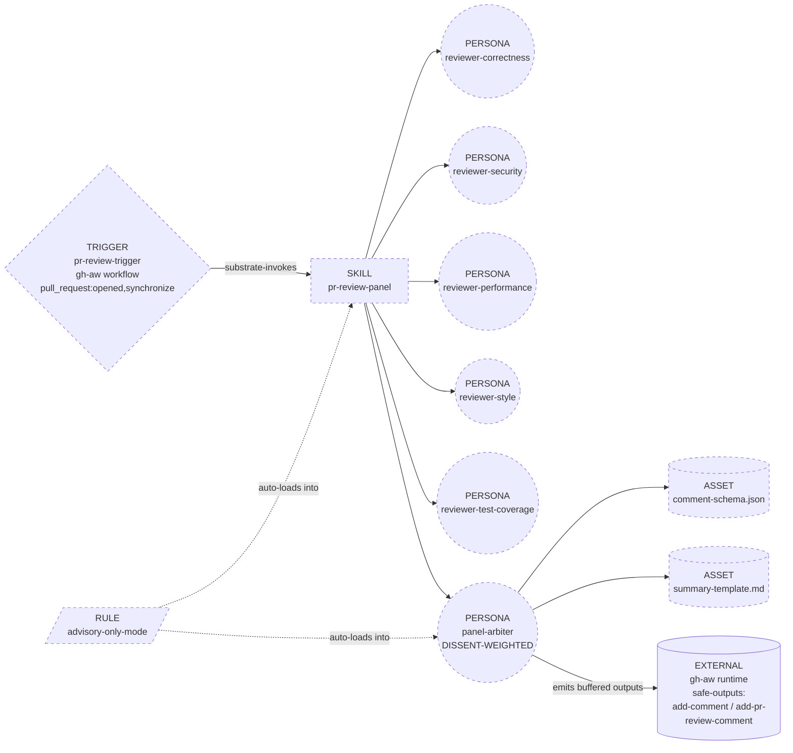
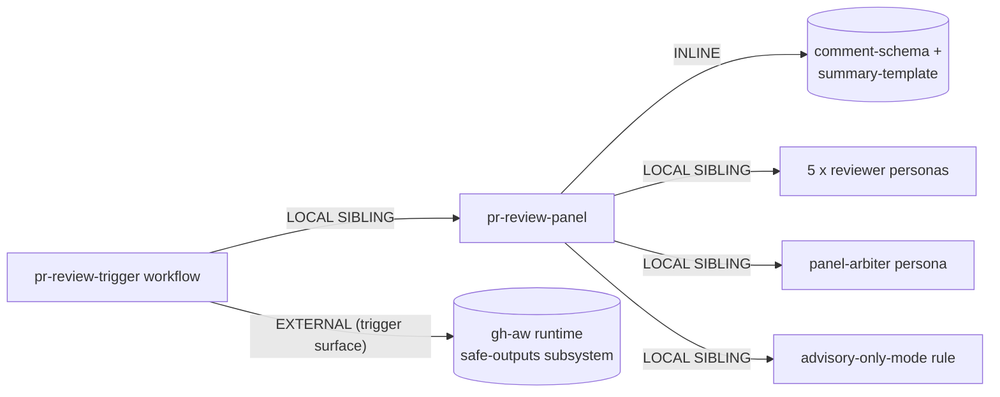

# Handoff packet: multi-agent PR review (advisory mode)

Produced by running genesis steps 1-6 on the operator prompt. Step 7
(codegen / natural-language module bodies) is OUT OF SCOPE for this
session.

## Step 1 - intent + scope

CAPABILITY. Run a multi-lens advisory review on every pull request
event (open + push). Each lens (correctness, security, performance,
style, test coverage) inspects the diff in its own fresh context.
Findings are synthesized into one DISSENT-WEIGHTED report which is
externalized as inline review comments plus a single summary comment
on the PR.

TRIGGER. GitHub `pull_request` event with activity types `opened`
and `synchronize` (every push to the PR branch re-fires).

BOUNDARY (what it does NOT do).
- Does NOT post a verdict, score, label, or pass/fail signal.
- Does NOT block, gate, or interact with branch protection / merge
  queues.
- Does NOT mutate code, files, branches, or any GitHub state other
  than posting comments to the triggering PR.
- Does NOT carry state between PRs (no cross-session memory; the
  trigger creates a fresh session every push).

OPERATOR STANCE. Balanced (no severity weighting toward any single
lens); no budget cap on lens depth or comment count.

DISPATCH DESCRIPTION (drafted, <= 1024 chars; INVOCATION MODE =
SUBSTRATE-INVOKED, not dispatcher-matched -- the gh-aw trigger
surface IS the matcher).

> "Use this skill when a pull request is opened or updated to run an
> advisory multi-lens review. Spawn one isolated thread per lens
> (correctness, security, performance, style, test coverage), grounded
> on the actual diff hunks, then synthesize findings with a
> dissent-weighted arbiter and post inline comments plus one summary
> comment. Do not post verdicts, scores, approval state, labels, or
> any signal that interacts with branch protection or merge queues.
> Reviewers must cite the diff lines they read; ungrounded prose is
> rejected at the synthesis gate. Use also when an operator asks to
> add 'PR review agents', 'multi-agent code review', 'reviewer
> personas on PR open', or 'panel-of-experts pull request feedback'."

(Indirect-trigger clause is present so the dispatcher matches even
when the user does not name the skill by its file handle. SR: single
responsibility -- one capability, one trigger surface, one
externalization mode.)

## Step 2 - component diagram



All boxes are new (greenfield). `gh-aw runtime` is existing
substrate (the per-trigger-surface adapter; not authored here).

## Step 3 - thread / sequence diagram

```mermaid
sequenceDiagram
    participant Trig as gh-aw trigger surface
    participant Orch as pr-review-panel (root session)
    participant Diff as TOOL: gh CLI / GH API (diff fetch)
    participant R1 as child: reviewer-correctness
    participant R2 as child: reviewer-security
    participant R3 as child: reviewer-performance
    participant R4 as child: reviewer-style
    participant R5 as child: reviewer-test-coverage
    participant Arb as child: panel-arbiter
    participant Plan as PLAN PERSISTENCE
    participant SafeOut as safe-outputs (deterministic post-stage)

    Trig->>Orch: spawn session (PR number, SHA, repo)
    Orch->>Diff: fetch diff hunks + changed files
    Diff-->>Orch: structured diff (C6 EXTERNAL CORPUS GROUNDING)
    Orch->>Plan: write GOAL + advisory-only constraint + diff slice (B4)
    par fan-out
        Orch->>R1: spawn (lens=correctness, plan pointer)
        Orch->>R2: spawn (lens=security, plan pointer)
        Orch->>R3: spawn (lens=performance, plan pointer)
        Orch->>R4: spawn (lens=style, plan pointer)
        Orch->>R5: spawn (lens=test-coverage, plan pointer)
    end
    R1-->>Orch: findings (cited lines)
    R2-->>Orch: findings (cited lines)
    R3-->>Orch: findings (cited lines)
    R4-->>Orch: findings (cited lines)
    R5-->>Orch: findings (cited lines)
    Note over Orch: single-writer interlock --<br/>only Orch writes to Plan
    Orch->>Plan: persist N x findings artifacts
    Orch->>Arb: spawn (plan pointer; goal anchor re-injected B8)
    Arb->>Plan: read findings + advisory-only rule
    Arb-->>Orch: dissent-weighted synthesis (inline comments + summary)
    Orch->>Orch: S4 schema check on comment payload
    Orch->>SafeOut: emit buffered outputs (NO write token held)
    SafeOut->>Trig: deterministic post-stage applies filtered comments
```

THREAD RULES.
- One writer per sink (the orchestrator is the only writer to
  `Plan`; each reviewer writes only to its own return value).
- Reviewers run in fresh child threads; the arbiter runs in its own
  fresh child thread with no reviewer transcript -- it sees the
  PERSISTED findings only (cures stale-context refinement).
- The arbiter is the ONLY thread that loads `summary-template.md`
  and `comment-schema.json`; reviewers stay narrow.

## Step 3.1 - tradeoff check (alternatives in tension)

Three slots had >=2 candidates; matrices cited.

| Slot | Candidates | Picked | Matrix / row |
|---|---|---|---|
| Synthesis style | CONSENSUS, MAJORITY, DISSENT-WEIGHTED, CEO-ARBITRATED | **DISSENT-WEIGHTED** | tradeoffs #5, row "DISSENT-WEIGHTED -- preferred default for technical reviews; surfaces minority high-info signal" |
| Externalization | gh CLI from agent thread (weak-form A9) vs `safe-outputs:` (strong-form A9) | **safe-outputs (strong-form A9)** | A9 PREFERENCE RULE -- "when the trigger surface offers strong-form A9, USE IT". Even though the operator did not say "no-token", the trigger surface is gh-aw and weak-form on a strong-form-capable surface is flagged in review. |
| Goal-drift cure | B4 alone vs B4 + B8 vs A8 + B9 steward loop | **B4 + B8** | tradeoffs #7, row "B4 + B8 combined -- DEFAULT for spawn-bound work". A8 + B9 is rejected: the work is single-round (advisory, no refinement loop), and B9 steward would imply a verdict authority the operator forbade. |

A10 GOVERNED OUTER LOOP was CONSIDERED and REJECTED at the
selection gate: operator named none of `audit / auditable /
compliance / sandbox / no-token / "must not hold" / capability-
gating / governed`. The "no verdict, no merge block" constraint is
BEHAVIORAL (advisory mode), not capability-bounded. A6 EVENT-DRIVEN
is sufficient; strong-form A9 composes inside it via safe-outputs
without escalating the macro shape.

## Step 3.5 - composition decision + dependency graph

Per-box composition mode:

| Box | Mode | Rationale |
|---|---|---|
| `pr-review-panel` (skill) | LOCAL SIBLING (in this project's source tree) | Greenfield, single consumer (the gh-aw trigger). Rule of three not met. |
| `reviewer-correctness` ... `reviewer-test-coverage` (5 personas) | LOCAL SIBLING each | One lens per persona. No reuse pressure outside this skill yet. |
| `panel-arbiter` (persona) | LOCAL SIBLING | Same scope as reviewer personas. |
| `advisory-only-mode` (rule file) | LOCAL SIBLING, scope-attached | Cross-cutting hard constraint; auto-loads into orch + arbiter threads via path / context scope. |
| `comment-schema.json`, `summary-template.md` | INLINE assets under `pr-review-panel/assets/` | Tightly coupled to the arbiter's output shape; not shared. |
| `pr-review-trigger` (gh-aw workflow) | LOCAL SIBLING under `.github/workflows/` | The trigger surface is gh-aw; the workflow file lives where the runtime expects it. |
| gh-aw runtime + `safe-outputs:` | EXTERNAL (per-trigger-surface substrate) | Owned by upstream gh-aw; consumed via the trigger-surface adapter at step 7b. |



EXTERNAL MODULES REQUIRED. None at the MODULE-SYSTEM layer (no
`apm` deps, no third-party skill / persona pulled in). The only
external is the gh-aw trigger surface itself, which is consumed via
the per-trigger-surface adapter at step 7b, not declared as a
manifest dependency.

DECLARATION MECHANISM. N/A for a module-system dep (none).
For the gh-aw trigger-surface dependency: declared in the workflow
file's frontmatter (`on:`, `permissions:`, `safe-outputs:`) at the
trigger surface's own distribution surface. Step 8 lint must verify
the workflow file declares `safe-outputs:` and does NOT grant the
agent a write-scoped `GITHUB_TOKEN`.

## Step 4 - SoC pass

- Any existing module covering this? No (greenfield project).
- Sibling description collision? No siblings yet; dispatch
  description is sharp on the noun "pull request" + verb "review"
  + boundary "advisory only".
- R1 SPLIT triggers on the orchestrator? No -- single capability
  (run advisory review), one trigger noun (PR event), one boundary.
- R2 FUSE on the 5 reviewer personas? Rejected -- they are 5
  distinct lenses, not lockstep co-invoked tiny siblings. Each
  earns its own dispatcher-invisible (sub-thread) entry.
- R3 EXTRACT on `advisory-only-mode`? APPLIED. The hard constraint
  is cross-cutting (orchestrator AND arbiter both need it) and is
  the precise statement most at risk of drift across rounds.
  Inlining it into the orchestrator body would re-tempt the arbiter
  to add a verdict. Extracted as a SCOPE-ATTACHED RULE FILE.
- R4 INLINE on the arbiter? Rejected -- it is not a thin proxy;
  it owns the dissent-weighted synthesis decision and is the only
  thread that holds the output schema.
- Consequential side effect on a system of record? YES -- posting
  PR comments. Crosses S7 DETERMINISTIC TOOL BRIDGE. Realized via
  gh-aw `safe-outputs:` (strong-form A9 SUPERVISED EXECUTION). Not
  weak-form (no `gh pr comment` call from agent prose).
- Toolless precondition risk? YES -- the agent must know the PR
  number, head SHA, base SHA, and the actual diff. All sourced from
  tool calls (gh CLI / GH API) at session start; not from LLM
  recall.

## Step 5 - compliance check

PROSE 5-axis.
- Progressive Disclosure: the 5 reviewer personas load lazily per
  spawn; the arbiter loads `comment-schema.json` only at the
  synthesis step.
- Reduced Scope: each child thread sees only its lens + the diff
  slice it must review.
- Orchestrated Composition: orchestrator owns the fan-out; arbiter
  owns the fan-in. No worker spawns peer workers.
- Safety Boundaries: S4 schema check before emit; safe-outputs
  filter at runtime; advisory-only rule auto-loaded.
- Explicit Hierarchy: trigger -> orchestrator -> reviewers ->
  arbiter -> safe-outputs. One direction, no cycles.

Seven durable LLM truths.
- #1 CONTEXT FINITE -> B4 + B8 (combined).
- #2 CONTEXT EXPLICIT -> all hand-offs through plan artifacts;
  arbiter does not inherit reviewer transcripts.
- #3 OUTPUT PROBABILISTIC -> S7 bridge for comment posting; S4
  schema gate before emit.
- #4 HALLUCINATION INHERENT -> C2 PERSONA PRELOAD with GROUNDED
  EXPERT BRIEFING on each reviewer (must cite diff lines).
- #5 PRETRAINING FROZEN -> C6 EXTERNAL CORPUS GROUNDING on the
  diff itself (fetched from gh API; not recalled).
- #6 HARNESSES BRIDGE -> the design is harness-agnostic on the
  inference axis; reaches only into the gh-aw per-trigger-surface
  adapter at step 7b.
- #7 DISTRIBUTION HYGIENE -> no maintainer-only assets bundled
  with the skill (evals will live in a contributor-only dir).

MODULE ENTRYPOINT canonical spec.
- `name`: `pr-review-panel` -- passes regex, will match parent dir.
- Description: drafted at step 1, ~880 chars (well under 1024).
  Imperative, intent-first, indirect triggers named.
- SKILL.md body budget: not yet drafted; reserve <= 500 lines /
  5000 tokens for step 7b. The 5 reviewer persona bodies and the
  arbiter body live in sibling files, not in SKILL.md.

OPEN FINDINGS.
- (MEDIUM) The strong-form A9 path is realizable only on gh-aw.
  If the operator's substrate is not gh-aw, step 7b must degrade
  to weak-form A9 with engineered token isolation (separate bot
  account, scoped token in a sealed env var, post-stage in a
  dedicated job) AND document the residual risk in the SKILL.md
  body. Flag is non-blocking; the prompt did not pin a substrate,
  so gh-aw is the assumed canonical realization.
- (LOW) The "no budget cap" stance means a 50-file PR could
  produce a long inline-comment storm. Step 7b body should include
  a SOFT cap on comments per reviewer per PR (e.g. top-N findings
  by severity, others rolled into the summary) without escalating
  to a hard verdict. This is a calibration knob, not a BLOCKER.

No BLOCKERs. Design proceeds to step 6 packet.

## Step 6 - handoff packet (this section is the plan; persisted here)

INTERFACE SKETCH (per module).

1. `pr-review-panel` (SKILL, substrate-invoked by gh-aw)
   - Trigger description: see step 1.
   - Inputs (from trigger context): `pr_number`, `head_sha`,
     `base_sha`, `repo`, `event_action` (opened|synchronize).
   - Process: fetch diff -> persist plan -> fan-out 5 reviewers
     -> persist findings -> spawn arbiter -> S4 schema check on
     arbiter output -> emit to safe-outputs.
   - Outputs: structured buffered outputs consumed by
     `safe-outputs:` (N inline `add-pr-review-comment` entries +
     1 `add-comment` summary).
   - Depends on: 5 reviewer personas (LOCAL SIBLING),
     panel-arbiter persona (LOCAL SIBLING), advisory-only-mode
     rule (LOCAL SIBLING, auto-loaded), comment-schema and
     summary-template (INLINE assets).

2. `reviewer-correctness`, `reviewer-security`,
   `reviewer-performance`, `reviewer-style`,
   `reviewer-test-coverage` (5 PERSONAS, identical shape)
   - Inputs: diff slice + plan pointer (NOT other reviewers'
     output).
   - Process: read diff hunks for the lens; emit findings as
     JSON list `{file, line, severity, body, cited_hunk_id}`.
   - Outputs: findings list; ungrounded entries (missing
     `cited_hunk_id`) rejected by the arbiter's S4 gate.
   - Hard rule: do not propose code fixes that imply a verdict
     ("must change before merge"); use advisory phrasing.

3. `panel-arbiter` (PERSONA, synthesizer)
   - Inputs: 5 persisted findings artifacts + advisory-only rule
     + comment-schema + summary-template + goal anchor (B8).
   - Process: DISSENT-WEIGHTED synthesis -- dedupe near-duplicate
     findings across lenses; preserve minority/dissent in summary;
     drop ungrounded entries; format inline comments + one summary.
   - Outputs: validated JSON matching `comment-schema.json`.

4. `advisory-only-mode` (RULE, scope-attached)
   - Scope: the orchestrator and arbiter threads.
   - Content: the verdict-prohibition clause, the no-merge-block
     clause, the comment-only externalization clause. Named
     anti-patterns the rule must reject ("approving the PR",
     "blocking", "score / grade / pass / fail", "requesting
     changes" in the GitHub-API sense).

5. `pr-review-trigger` (gh-aw workflow / TRIGGER ORCHESTRATOR)
   - Trigger declaration: `on: pull_request: [opened,
     synchronize]`.
   - Substrate fields populated: SANDBOXING (gh-aw default),
     CAPABILITY_GATING (`safe-outputs:` enumerating only
     `add-comment` and `add-pr-review-comment`), AUDIT_SURFACE
     (Actions logs).
   - Inference harness: not pinned (orthogonal axis); the design
     is harness-agnostic on the inference side.

MODULE COMPOSITION TABLE.

| Module | Mode | Distribution surface declaration |
|---|---|---|
| pr-review-panel | LOCAL SIBLING | n/a (top-level skill) |
| 5 reviewer personas | LOCAL SIBLING | linked from SKILL.md body |
| panel-arbiter | LOCAL SIBLING | linked from SKILL.md body |
| advisory-only-mode | LOCAL SIBLING, scope-attached | rule scope file (path / context predicate) |
| comment-schema, summary-template | INLINE | under `pr-review-panel/assets/` |
| pr-review-trigger | LOCAL SIBLING | `.github/workflows/<file>.yml` |
| gh-aw runtime + safe-outputs | EXTERNAL (trigger surface) | declared in workflow frontmatter (`on:`, `permissions:`, `safe-outputs:`) |

EXTERNAL MODULES REQUIRED (drives step 7b adapter loading).
- None at the MODULE-SYSTEM (apm) layer. Step 7b does NOT need to
  load a module-system adapter.
- gh-aw is consumed via `runtime-affordances/per-trigger-surface/
  gh-aw.md` at step 7b; this is a per-trigger-surface adapter
  load, not a module-system dep, and does not require the apm
  adapter dance.

DECLARED TARGET SET.
- per-trigger-surface: `gh-aw` (canonical strong-form realization).
- per-inference-harness: `common-only` (any harness gh-aw
  dispatches into can run this skill; substrate orthogonality
  rule applies).

INVOCATION MODE PER MODULE.
- pr-review-panel: SUBSTRATE-INVOKED (the trigger IS the matcher;
  dispatcher does not match it). Also tagged DISCOVERY for the
  human-typed case ("review this PR with the panel").
- 5 reviewer personas: FORCED (spawned by the orchestrator with
  explicit persona load; no dispatcher match).
- panel-arbiter: FORCED (same).
- advisory-only-mode: scope-attached (loaded by harness path/
  context match; not dispatched).
- pr-review-trigger: SUBSTRATE-LEVEL (workflow declaration, not a
  module dispatched into a thread).

OPEN COMPLIANCE FINDINGS.
- (MEDIUM) substrate degradation if non-gh-aw -- see step 5.
- (LOW) comment-volume soft cap -- see step 5.

TODO LIST (one entry per module to draft + validation).

| id | title | deps |
|---|---|---|
| T1 | Drafting `pr-review-panel/SKILL.md` body | (none) |
| T2 | Drafting `reviewer-correctness.persona.md` | T1 |
| T3 | Drafting `reviewer-security.persona.md` | T1 |
| T4 | Drafting `reviewer-performance.persona.md` | T1 |
| T5 | Drafting `reviewer-style.persona.md` | T1 |
| T6 | Drafting `reviewer-test-coverage.persona.md` | T1 |
| T7 | Drafting `panel-arbiter.persona.md` (DISSENT-WEIGHTED synthesis) | T2..T6 |
| T8 | Drafting `advisory-only-mode` scope-attached rule file | T1 |
| T9 | Drafting `comment-schema.json` + `summary-template.md` assets | T7 |
| T10 | Drafting `pr-review-trigger` gh-aw workflow with `safe-outputs: [add-comment, add-pr-review-comment]` | T1, T8 |
| T11 | Authoring content evals (2-3) -- with_skill vs without_skill on sample PRs | T10 |
| T12 | Authoring trigger evals (~20, 60/40 split) for the dispatch description | T1 |
| T13 | Step 8 validation: structural lint + evals gate + real-PR refinement | T1..T12 |

EVALS PLAN.

Content evals (2-3, exercised twice -- skill loaded and not):
- E1: "Here is a PR adding a new auth middleware [diff snippet
  with a subtle SQL injection]". Expected delta with_skill: the
  security reviewer flags the injection on the exact line; the
  arbiter surfaces it in the summary; NO verdict / approval
  language anywhere.
- E2: "PR touches 30 files, mostly formatting + one logic change
  in a hot loop". Expected delta: the performance reviewer flags
  the loop; the style reviewer collapses formatting comments
  into the summary (soft cap); no merge-block phrasing.
- E3: "Trivial typo-fix PR". Expected delta: bounded comment
  count; arbiter produces a one-line summary, no inline noise.
  Without the skill: baseline harness likely produces a single
  generic review comment.

Trigger evals (~20 queries, 60/40 train/val):
- 10 SHOULD-TRIGGER: "review this PR with multiple agents", "run
  the advisory panel on PR 42", "set up multi-agent code review",
  "we want correctness + security + perf reviewers on every push",
  "add panel-of-experts feedback to pull requests", "post inline
  review comments from specialist personas", etc.
- 10 SHOULD-NOT-TRIGGER (near-miss):
  - "merge this PR" (action, not review).
  - "approve PR 42" (verdict; advisory mode forbids).
  - "run the security scanner on main" (not PR-scoped; not
    panel-shaped).
  - "review my design doc" (not a PR).
  - "summarize the diff for me in chat" (one-shot, no panel).
  - "open a PR for this branch" (creation, not review).
  - "rebase and force-push" (write op, unrelated).
  - "comment 'LGTM' on PR 42" (single canned comment, not panel).
  - "set up branch protection rules" (governance, not review).
  - "add a CODEOWNERS file" (review routing, not panel agent).
- Ship gate: validation split rate >= 0.5 on should-trigger AND
  < 0.5 on should-not-trigger.

PERSISTENCE. This packet IS persisted at `./plan.md` (session
working area, portable slot per genesis substrate concept 6).
DESIGN ENDS HERE; step 7 (codegen) is OUT OF SCOPE per the
operator's instruction for this controlled experiment.
