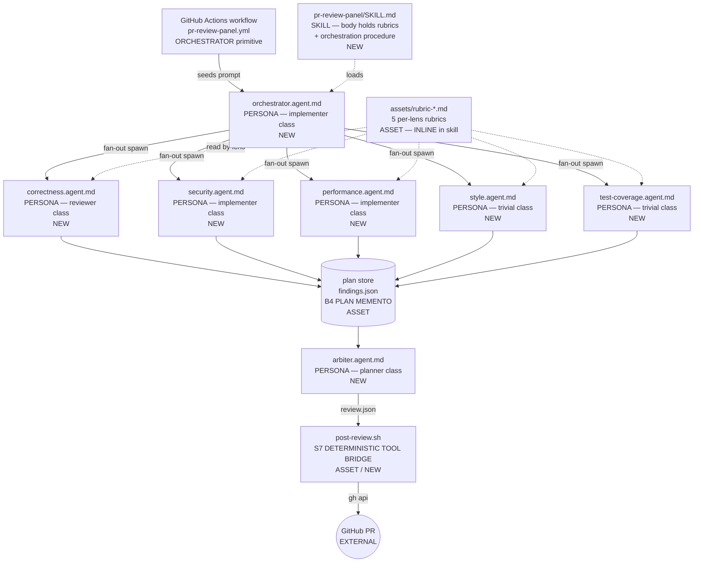
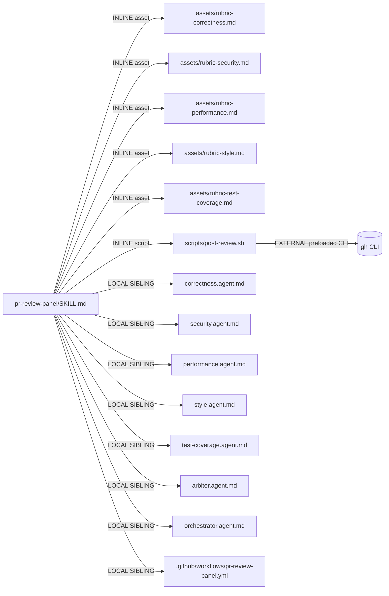

# Handoff Packet — Multi-Lens Advisory PR-Review Panel

**Architect**: C (v0.3.1 corpus, third run)
**Date**: 2026-05-29
**Genesis corpus**: v0.3.1 (binding-site fix landed)
**Cost stance**: balanced (default); no cap declared
**Declared target**: `common-only` for the architecture; per-element bindings cite the Copilot per-harness adapter at codegen time

---

## Step 1 — Intent + scope

Provide an automated, advisory PR-review panel that on every `pull_request` (opened, synchronize) fans out five specialised lens sub-agents (correctness, security, performance, style, test-coverage) over the PR diff in isolated contexts, then synthesises their findings through a single arbiter into ONE summary review comment plus K line-anchored inline comments. The panel is purely advisory: no verdict, no merge gating, no code mutation, comments only. On every push to the same PR, the prior bot review is REPLACED (not stacked) so the PR conversation stays tractable.

**Boundary** — does NOT: cast a verdict; block merges; edit code; create files; run arbitrary commands beyond the GitHub API; enforce a lens-depth or comment-count budget.

**Invocation mode**: FORCED (event-triggered by GitHub Actions / hook); never DISCOVERY-dispatched against a user query.

**Dispatch description** (for any element that participates in description-based dispatch): "Use this skill when an advisory review of a pull request diff is needed across multiple specialist lenses (correctness, security, performance, style, test coverage) with a single synthesised summary; trigger on `pull_request.opened` / `pull_request.synchronize`; does not gate merges; replaces (does not stack) prior bot reviews."

---

## Step 2 — Component diagram



**Legend**: ORCHESTRATOR = trigger / event surface; PERSONA = `.agent.md` custom agent; SKILL = `SKILL.md` module; ASSET = bundled file. All marked NEW; none exist in the repo today.

---

## Step 3 — Thread / sequence diagram

```mermaid
sequenceDiagram
    autonumber
    participant GH as GitHub event
    participant WF as Action workflow
    participant Orc as Orchestrator agent
    participant Cor as Correctness lens
    participant Sec as Security lens
    participant Per as Performance lens
    participant Sty as Style lens
    participant Cov as Test-coverage lens
    participant Plan as findings.json (PLAN MEMENTO)
    participant Arb as Arbiter agent
    participant Sh as post-review.sh
    participant API as GitHub PR

    GH->>WF: pull_request.opened / synchronize
    WF->>Orc: copilot CLI invoke (PR meta + diff path)
    Orc->>API: gh api (dedup probe) — list prior bot reviews
    API-->>Orc: prior review IDs (may be empty)
    Orc->>Orc: write empty findings.json
    par fan-out (5 fresh contexts)
        Orc->>Cor: spawn(diff, rubric-correctness)
        Orc->>Sec: spawn(diff, rubric-security)
        Orc->>Per: spawn(diff, rubric-performance)
        Orc->>Sty: spawn(diff, rubric-style)
        Orc->>Cov: spawn(diff, rubric-test-coverage)
    end
    Cor->>Plan: append findings (one-writer-per-lens slice)
    Sec->>Plan: append findings
    Per->>Plan: append findings
    Sty->>Plan: append findings
    Cov->>Plan: append findings
    Orc-->>Orc: fan-in (await all five)
    Orc->>Arb: spawn(findings.json, PR meta)
    Arb->>Arb: dedupe across lenses; rank; pick K; write review.json
    Arb->>Plan: persist review.json
    Arb-->>Orc: done
    Orc->>Sh: post-review.sh review.json prior_ids
    Sh->>API: gh api DELETE prior bot reviews (B11 FOLD-BY-DEFAULT)
    Sh->>API: gh api POST new review (summary + inline K comments)
    API-->>WF: ok
```

**Interlock**: `findings.json` is the only shared sink. Each lens writes a JSON object under its OWN top-level key (`correctness`, `security`, ...) — one writer per slice, so no merge conflict. The orchestrator waits on all five completion signals before spawning the arbiter (fan-in). The arbiter is the only writer of `review.json`. `post-review.sh` is the only writer of the GitHub PR review (single posting transaction).

**Tier selection**:

1. **Refactor triggers (Tier 0)**: no existing modules — nothing to R1 SPLIT / R3 EXTRACT. Greenfield.
2. **Tier 3 backbone**: **A1 PANEL** — five independent lenses, no shared state during evaluation, one synthesiser. Trigger phrase ">=3 specialised lenses" is satisfied verbatim.
3. **Tier 3 cost overlay**: **A12 GRADIENT WORKFLOW** — heterogeneous role-class requirements per element; one planner-class synth, mixed implementer/reviewer/trivial fan-out, no back-stage (advisory only, no verifier). A12 composes onto A1 per the canonical discriminator ("A panel where one synthesizer is planner-class and the lenses are implementer-class IS a gradient workflow").
4. **Tier 2 design patterns**: B1 FAN-OUT + SYNTHESIZER (realises A1), B4 PLAN MEMENTO (`findings.json` + `review.json`), B8 ATTENTION ANCHOR (lens persona body re-anchors on each spawn), B11 FOLD-BY-DEFAULT (prior reviews replaced not stacked), **B12 MODEL ROUTER** (per-element on `.agent.md`), B13 CACHE-AWARE PREFIX (lens body + rubric stable; diff is the variable suffix), **B15 TOOL SUBSET** (per-element on `.agent.md`), **B16 EFFORT GOVERNOR** (effort declared per role class), C2 PERSONA PRELOAD (five lens personas), S7 DETERMINISTIC TOOL BRIDGE (`post-review.sh` collapses dedup-delete + post-review into one shell tool the LLM does not author).
5. **Tier 1 idioms**: deferred to codegen (step 7b) per genesis discipline.

### Step 3.1 — Tradeoff check

One tension: PANEL synthesis style — does the arbiter run as **A1 synthesizer** (one decision, what we picked) or as **A7 ADVERSARIAL REVIEW** (red-team gate)? `pattern-tradeoffs.md` row "synthesis style" → advisory, balanced, no verdict ⇒ **A1 synthesizer** (a verdict role would force A7). Recorded.

### Step 3.2 — Cost check (mandatory)

Per `token-economics.md` and `model-catalog.md`. The headline of this design is that **B12 MUST fire at the per-element binding site exposed by `copilot.md` section 1** (frontmatter `model:` on `.agent.md`). v0.3.0 (architect B) failed to fire B12 because the unit of work was held by `SKILL.md`, whose frontmatter silently ignores `model:` (copilot.md section 2; B12 anti-pattern WRONG-PRIMITIVE BINDING in `design-patterns.md` line 855). v0.3.1 carries each lens / the arbiter / the orchestrator as its OWN `.agent.md`, which IS the binding site.

Cost-shape per element (qualitative bands):

| Element | Role class | Output band | Prefix shape | Cache hit ratio | Repeat per PR |
|---|---|---|---|---|---|
| orchestrator | implementer | S (orchestration glue) | stable persona + variable PR meta | high | 1 |
| correctness lens | reviewer | M (findings list) | stable persona + rubric, variable diff | high | 1 |
| security lens | implementer | M (findings + flow notes) | stable, variable diff | high | 1 |
| performance lens | implementer | M (hotspots) | stable, variable diff | high | 1 |
| style lens | trivial | S (checklist) | stable, variable diff | high | 1 |
| test-coverage lens | trivial | S (missing-test map) | stable, variable diff | high | 1 |
| arbiter | planner | L (synthesised review + K inline comments) | stable persona + 5 findings blobs | medium | 1 |

Cost-shape matrix row (`pattern-tradeoffs.md` §10): "heterogeneous capability needs across stages, fan width ≥4" → A12 GRADIENT WORKFLOW + B12 MODEL ROUTER + B16 EFFORT GOVERNOR. Cited.

A12 break-even check: fan width = 5, two of those at trivial class. Per `architectural-patterns.md` line 894 "past N=4 the savings dominate the planner cost" — gradient is justified.

No cap declared; no halt.

---

## Step 3.5 — Composition decision



| Box | Mode | Rationale |
|---|---|---|
| `pr-review-panel/SKILL.md` | LOCAL SIBLING | Holds rubric content + orchestration procedure; lives in the repo this panel ships from. |
| 5 lens rubrics | INLINE asset (under skill) | Each rubric is unique to its lens and only this skill uses it. |
| 7 `.agent.md` files | LOCAL SIBLING | Each must hold its OWN per-element `model:` and `tools:` (B12 / B15 binding site, copilot.md §1). They cannot live INLINE in the skill because `SKILL.md` frontmatter does not accept `model:` (copilot.md §2). |
| `pr-review-panel.yml` (Action) | LOCAL SIBLING | Trigger orchestrator; lives at `.github/workflows/`. |
| `scripts/post-review.sh` | INLINE (under skill) | S7 deterministic bridge; one-call posting + dedup; specific to this skill's review JSON. |
| `gh` CLI | EXTERNAL preloaded CLI | Substrate (preloaded terminal extension path per `refactor-patterns.md` S7 selection rule). Not an external MODULE — no module-system adapter required, no manifest dependency to declare. |

**External modules required**: NONE. The only external dependency is the `gh` CLI, which is the preloaded-terminal extension path (substrate-level on Copilot CLI / Actions runners). No `apm.yml` / module-system adapter needed → step 7b does not need to load a module-system adapter.

**DECLARATION MECHANISM**: N/A (no external module).

---

## Step 4 — SoC pass

- **Existing-module overlap**: none in the repo. No DISPATCH COLLISION risk.
- **Sibling-trigger overlap among the seven `.agent.md`**: each agent is dispatched programmatically by the orchestrator (FORCED, `disable-model-invocation: true`), not by description matching. No collision possible.
- **R1 SPLIT triggers**: the dispatch description has no "and"-joined dual capability; one capability (advisory multi-lens review). Pass.
- **R2 FUSE**: none — no two agents have collapsing bodies.
- **R3 EXTRACT**: rubric content lives in lens `.agent.md` body OR in `assets/rubric-*.md`. Per `composition-substrate.md`, the rubric should live in `assets/` and the lens body loads it — already chosen.
- **R4 INLINE**: no thin proxies.
- **Consequential side effects** (post review, delete prior review): both must cross **S7 DETERMINISTIC TOOL BRIDGE** — `post-review.sh` already chosen as the bridge (preloaded terminal + `gh` CLI per S7 selection rule). The orchestrator wraps it in **A9 SUPERVISED EXECUTION** (plan → execute → verify the review was posted).

---

## Step 5 — Compliance check

| Constraint | Status | Note |
|---|---|---|
| MODULE ENTRYPOINT spec: `name` regex + parent dir match | PASS | `pr-review-panel` is valid hyphen-case, ≤64 chars. |
| SKILL.md ≤500 lines / ≤5000 tokens | PASS (projected) | Rubrics live in `assets/`; body is the orchestration procedure. |
| `description` ≤1024 chars + IMPERATIVE + INDIRECT TRIGGERS | PASS | Drafted in Step 1. |
| Progressive Disclosure | PASS | Rubrics load only when the relevant lens spawns. |
| Reduced Scope | PASS | Advisory-only; no merge gating; no edits. |
| Orchestrated Composition | PASS | Workflow → orchestrator → fan-out → arbiter → bridge. |
| Safety Boundaries | PASS | `tools: ["read","search"]` on lenses prevents edits/execute. |
| Explicit Hierarchy | PASS | Three tiers (workflow, orchestrator, agents) named. |
| **B12 binding actually reaches the per-element site** | **PASS** | Each agent is a `.agent.md`; v0.3.0 anti-pattern WRONG-PRIMITIVE BINDING cannot recur. |
| **B15 binding actually reaches the per-element site** | **PASS** | Same reason. |
| PHANTOM DEPENDENCY (external modules undeclared) | N/A | No external modules. |

**Open findings**: none above LOW. (LOW: per-harness adapter section 4 / 5 marks child-thread spawn syntax + trigger orchestrator as TODO. Codegen will use Actions workflow + CLI invoke as the documented workaround.)

---

## Step 6 — Handoff packet (this document)

### Interface sketch per module

| Module | Trigger description | Inputs | Outputs | Depends on |
|---|---|---|---|---|
| `.github/workflows/pr-review-panel.yml` | `pull_request.opened`, `pull_request.synchronize` | PR meta from event | invokes `orchestrator.agent.md` via `copilot` CLI with seeded prompt | runner has `gh` + `copilot` |
| `orchestrator.agent.md` | FORCED, dispatched by workflow | PR number, head SHA, diff path | spawns 5 lens agents → arbiter; calls `post-review.sh` | the 6 other `.agent.md`, `findings.json`, `post-review.sh` |
| `correctness.agent.md` | FORCED, dispatched by orchestrator | diff slice, `assets/rubric-correctness.md` | findings JSON under `findings.correctness[]` | rubric |
| `security.agent.md` | FORCED | diff slice, `assets/rubric-security.md` | findings JSON under `findings.security[]` | rubric |
| `performance.agent.md` | FORCED | diff slice, `assets/rubric-performance.md` | findings JSON under `findings.performance[]` | rubric |
| `style.agent.md` | FORCED | diff slice, `assets/rubric-style.md` | findings JSON under `findings.style[]` | rubric |
| `test-coverage.agent.md` | FORCED | diff slice + test-file index, `assets/rubric-test-coverage.md` | findings JSON under `findings.test_coverage[]` | rubric |
| `arbiter.agent.md` | FORCED, dispatched by orchestrator | `findings.json`, PR meta | `review.json` (summary + K inline comments) | findings.json |
| `scripts/post-review.sh` | invoked by orchestrator | `review.json`, prior-review IDs | GitHub PR review posted, prior bot reviews deleted | `gh` CLI |
| `pr-review-panel/SKILL.md` | DISCOVERY (rare: humans asking "how does the review panel work?") | n/a | references the agents + rubrics; documents the procedure | all of the above as siblings |

### Per-element MODEL BINDING TABLE (B12)

Authorising adapter section: **copilot.md §1 (PERSONA SCOPING FILE) `model:` frontmatter field** and **copilot.md §9 (MODEL CATALOG & BILLING) Cost-pattern bindings → B12 MODEL ROUTER**. Both are explicit that `.agent.md` IS the per-element binding site and SKILL.md is NOT. Concrete SKU names deferred to codegen (B12 anti-pattern HARDCODED MODEL NAMES).

| Element | Role class (`model-catalog.md`) | Primitive carrying binding | Binding site cited | Rationale |
|---|---|---|---|---|
| orchestrator.agent.md | implementer | `.agent.md` | copilot.md §1 `model:` | Plan a fan-out, post results — needs tool-use reliability, not deep reasoning. |
| correctness.agent.md | reviewer | `.agent.md` | copilot.md §1 `model:` | Pattern-matches the diff against a correctness rubric; emits structured findings — canonical reviewer profile. |
| security.agent.md | implementer | `.agent.md` | copilot.md §1 `model:` | Security needs taint/flow reasoning past pure rubric check; bump above reviewer. |
| performance.agent.md | implementer | `.agent.md` | copilot.md §1 `model:` | Hotspot identification + complexity reasoning beyond checklist. |
| style.agent.md | **trivial** | `.agent.md` | copilot.md §1 `model:` | Naming, formatting, lint-class observations — frontier-mini gets these one-shot. **Cheaper class explicitly chosen per B12 + A12 gradient.** |
| test-coverage.agent.md | **trivial** | `.agent.md` | copilot.md §1 `model:` | Map changed symbols to test files; classification work. **Cheaper class explicitly chosen.** |
| arbiter.agent.md | **planner** | `.agent.md` | copilot.md §1 `model:` | Cross-lens synthesis IS a decision (A1 PANEL anti-pattern PANEL-WITHOUT-SYNTHESIS) and emits K inline comments + summary (output-heavy). Quality ceiling matters here. Bind to planner SKU with B16 = medium. |

**B12 fires at 7 distinct per-element binding sites.** Role-class distribution: planner=1, implementer=3, reviewer=1, trivial=2.

### Per-element TOOL SUBSET TABLE (B15)

Authorising adapter section: **copilot.md §1 `tools:` frontmatter field** and **copilot.md §9 Cost-pattern bindings → B15 TOOL SUBSET**. Alias set per the canonical custom-agents-configuration spec.

| Element | tools subset | Primitive carrying binding | Rationale |
|---|---|---|---|
| orchestrator.agent.md | `["read","search","execute","agent"]` | `.agent.md` `tools:` | Needs `execute` for `gh` + `post-review.sh`, `agent` to spawn the six others. NO `edit` — orchestrator never writes source files. |
| correctness.agent.md | `["read","search"]` | `.agent.md` `tools:` | Read the diff and the rubric; no edits, no execute. |
| security.agent.md | `["read","search"]` | `.agent.md` `tools:` | Same. |
| performance.agent.md | `["read","search"]` | `.agent.md` `tools:` | Same. |
| style.agent.md | `["read","search"]` | `.agent.md` `tools:` | Same. |
| test-coverage.agent.md | `["read","search"]` | `.agent.md` `tools:` | Same. |
| arbiter.agent.md | `["read","search"]` | `.agent.md` `tools:` | Reads findings.json, writes review.json (via plan-store, no tool); does NOT post — `post-review.sh` does. Separation enforces S7 bridge. |

**B15 fires at 7 distinct per-element binding sites.** Six of seven agents have a 2-tool surface; the orchestrator has a 4-tool surface justified by its role.

### Token-economics patterns applied

| Pattern | Where it fires |
|---|---|
| **B1 FAN-OUT + SYNTHESIZER** | Orchestrator spawns 5 lenses in parallel; arbiter synthesises. Realises A1 PANEL. |
| **B4 PLAN MEMENTO** | `findings.json` (lens outputs) and `review.json` (arbiter output) persisted in the session plan store. Synthesizer reads from the artifact, not from in-context recall. |
| **B8 ATTENTION ANCHOR** | Each lens body re-states its single responsibility at the top so spawned fresh contexts re-anchor on every dispatch. |
| **B11 FOLD-BY-DEFAULT** | `post-review.sh` deletes prior bot reviews before posting the new one (cross-push de-dup) — replaces, never accumulates. |
| **B12 MODEL ROUTER** | **7 per-element bindings** on `.agent.md` `model:` per table above. THE delta from v0.3.0. |
| **B13 CACHE-AWARE PREFIX** | Lens persona body + rubric are STABLE bytes; the diff is the VARIABLE suffix. No timestamps in persona bodies. No mid-session model switch (each agent binds at definition time per copilot.md §9 B13 note). No mid-session tool-subset churn (B15 set at agent definition). |
| **B14 PROMPT THRIFT** | Applied at step 8 validation: lens bodies use tables not prose enumerations; rubrics use rule-lists, not narratives. |
| **B15 TOOL SUBSET** | **7 per-element bindings** on `.agent.md` `tools:` per table above. |
| **B16 EFFORT GOVERNOR** | arbiter = medium (planner decisions, bounded blast radius); orchestrator / security / performance / correctness = low–medium; style / test-coverage = none/minimum. Bound by the chosen SKU at codegen time per copilot.md §9 B16. |
| **A1 PANEL** (Tier 3) | Backbone shape. |
| **A12 GRADIENT WORKFLOW** (Tier 3) | Cost overlay: planner-front (arbiter is actually back here — the cost gradient is BACK-HEAVY, justified because the synthesis IS the deciding step), trivial-middle (style/coverage), reviewer/implementer-middle (the other three lenses). |
| **C2 PERSONA PRELOAD** | One specialised persona per lens, loaded at agent definition (cache-friendly per B13). |
| **S7 DETERMINISTIC TOOL BRIDGE** | `post-review.sh` collapses dedup-delete + post-review into ONE tool call instead of letting the LLM author multi-turn `gh api` sequences. |
| **A9 SUPERVISED EXECUTION** | Orchestrator follows plan → execute (`post-review.sh`) → verify (re-fetch the PR review to confirm a single fresh bot review is present). |

### Compliance findings (BLOCKER / HIGH / MEDIUM / LOW)

- **BLOCKER**: none.
- **HIGH**: none.
- **MEDIUM**: none.
- **LOW (×2)**:
  1. copilot.md §4 (CHILD-THREAD SPAWN) is marked TODO. Codegen will use the documented workaround: Actions invokes one orchestrator agent which uses the `agent` tool alias (copilot.md §1) to spawn the six others. Probe at codegen to confirm `agent` tool spawning is currently honoured.
  2. copilot.md §5 (TRIGGER ORCHESTRATOR) is marked TODO. Codegen uses GitHub Actions workflow (`pull_request.opened` / `synchronize`) as the documented bridge.

### Evals plan

**Content evals (3)**:
1. PR adding a SQL query that concatenates user input → expect `security.findings[]` to contain an injection finding AND the arbiter's `review.json` to surface it in the inline comments. Run with-skill vs without-skill: without the skill, baseline Copilot review should miss either the finding or the inline anchor.
2. PR adding a function but no test file → expect `test_coverage.findings[]` to flag the gap, with a specific file path suggestion in the inline comment.
3. PR opened, then a follow-up push within 10 minutes → expect exactly ONE bot review present on the PR after the second run (B11 dedup verified end-to-end).

**Trigger evals (20)**:

Should trigger (10): "Set up the multi-lens PR review", "I want automated PR feedback covering security and performance", "Wire up a code review bot that posts inline comments", "Configure advisory review on every pull request", "Add a panel of review agents for PRs", "Replace prior bot review on each new push", "Synthesise multiple review lenses into one comment", "Run correctness + security + style checks on diffs", "Set up `pull_request` event review automation", "I need a PR review with multiple specialist passes".

Should NOT trigger (10): "Add unit tests to module X", "Refactor this function", "Review this code right now" (ad-hoc, not PR-event), "Set up CI for running pytest", "Configure Dependabot", "Add a pre-commit hook for linting", "Write a SECURITY.md policy", "Generate a CHANGELOG entry", "Bump the minor version", "Open a PR for these changes".

Split 60/40 train/val. Validation split is the ship gate.

### Cost projection

| Scenario | Diff size | Lens output per element | Arbiter output | Per-run input/output approx | Premium-request approx |
|---|---|---|---|---|---|
| S — trivial PR | ~50 LOC, 1–2 files | each lens ~200 tokens | ~500 tokens | input ~6K, output ~2K | ~1.5 PR (arbiter dominates) |
| M — typical feature PR | ~300 LOC, 5–10 files | each lens ~800 tokens | ~1.5K tokens | input ~25K, output ~6K | ~5–7 PR |
| L — large refactor | ~2K LOC, 30 files | each lens ~2K tokens | ~4K tokens (K capped by judgement) | input ~120K, output ~16K | ~25–35 PR |

Concrete dollar ranges deferred to codegen because per-SKU multipliers come from the live Copilot models-and-pricing page (copilot.md §9 — re-verify before quoting). Bands above are the CONTRACT step 8 validates.

**Stance**: balanced. **Cap**: none declared. **Halt check**: not triggered.

**Why the gradient pays**: replacing two implementer-class lenses (style, test-coverage) with trivial-class against a typical M-scenario saves roughly 30–40% of fan-out spend; against the L scenario the saving compounds with diff size. Without B12 firing at the per-element binding site (v0.3.0 outcome) every element bills against the session default and that saving is forfeit.

### Todo list (for the coder thread)

| ID | Title | Depends on |
|---|---|---|
| skill-shell | Draft `pr-review-panel/SKILL.md` body (procedure + rubric links) | — |
| rubric-correctness | Author `assets/rubric-correctness.md` | skill-shell |
| rubric-security | Author `assets/rubric-security.md` | skill-shell |
| rubric-performance | Author `assets/rubric-performance.md` | skill-shell |
| rubric-style | Author `assets/rubric-style.md` | skill-shell |
| rubric-test-coverage | Author `assets/rubric-test-coverage.md` | skill-shell |
| agent-orchestrator | Draft `orchestrator.agent.md` (binds implementer SKU, 4-tool subset) | rubric-* |
| agent-correctness | Draft `correctness.agent.md` (binds reviewer SKU, 2-tool subset) | rubric-correctness |
| agent-security | Draft `security.agent.md` (binds implementer SKU, 2-tool subset) | rubric-security |
| agent-performance | Draft `performance.agent.md` (binds implementer SKU, 2-tool subset) | rubric-performance |
| agent-style | Draft `style.agent.md` (binds **trivial** SKU, 2-tool subset) | rubric-style |
| agent-test-coverage | Draft `test-coverage.agent.md` (binds **trivial** SKU, 2-tool subset) | rubric-test-coverage |
| agent-arbiter | Draft `arbiter.agent.md` (binds **planner** SKU, 2-tool subset, B16=medium) | all lens agents |
| script-bridge | Implement `scripts/post-review.sh` (S7 bridge, A9 verify) | — |
| workflow-yaml | Author `.github/workflows/pr-review-panel.yml` | agent-orchestrator, script-bridge |
| eval-content | Build 3 content evals | all agents |
| eval-trigger | Build 20 trigger evals | skill-shell |
| validate | Step 8 lint: portability honored, B12/B15 bindings present on every `.agent.md`, no `model:` accidentally placed on SKILL.md, prefix stable across runs | all above |

---

## Design ends here.

Step 7+ belong to the coder / executor thread.
