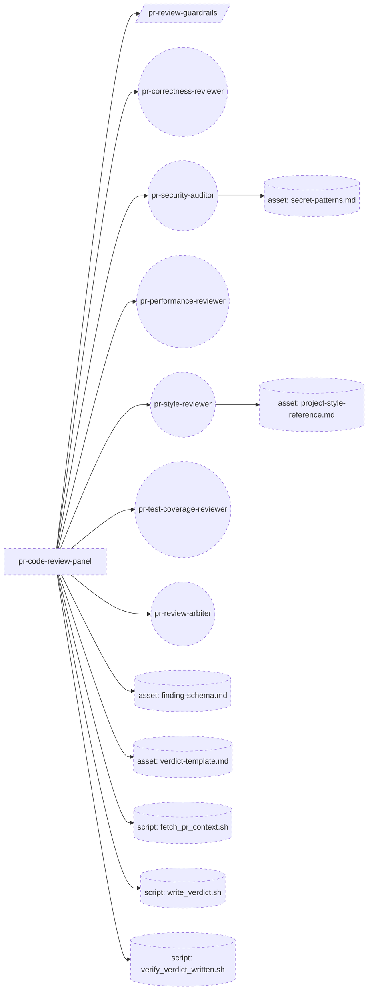
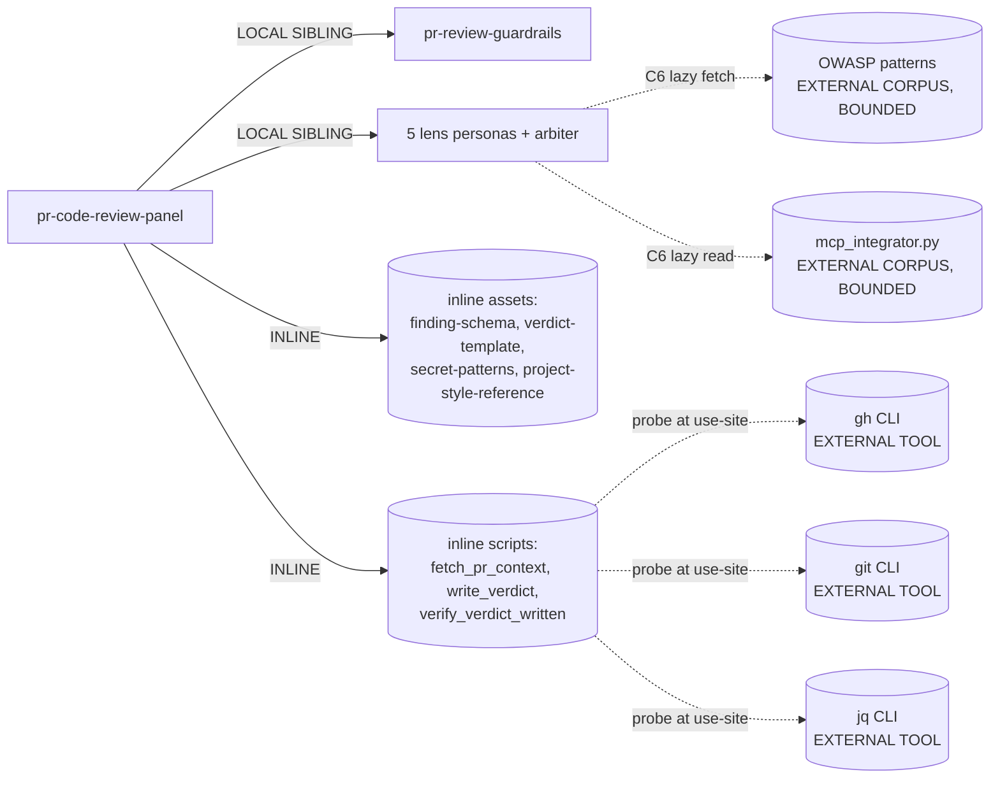

# genesis design run -- pr-code-review-panel (target: microsoft/apm#1424)

> Architect run: D (re-run on Opus). Corpus: genesis v0.1 (pre-cost-aware).
> Process: SKILL.md 8-step, halted at step 6 per hard rule.
> Loaded assets at steps 1-6: `primitives.md`, `design-patterns.md`,
> `architectural-patterns.md`, `refactor-patterns.md`,
> `mermaid-conventions.md`, `composition-substrate.md`,
> `pattern-tradeoffs.md`, `runtime-affordances/common.md`, and the
> worked example `examples/04-pr-review-advisory.md` as the
> nearest-shape reference.

---

## Step 1 -- intent + scope

**Capability paragraph.** Given a specific pull request on a GitHub
repository (target reference: microsoft/apm#1424 -- "feat(lsp): add
first-class LSP server support to install pipeline", 2363
additions / 114 deletions across 24 files), run a multi-lens
automated code review across five INDEPENDENT inspection axes --
CORRECTNESS (logic bugs, control-flow gaps, contract violations,
state-machine errors, lockfile drift cases), SECURITY (injection /
path-traversal / unsafe deserialization / secret leakage / unsafe
external execution of declared LSP servers), PERFORMANCE
(algorithmic complexity, redundant I/O, transitive collection /
deduplication efficiency, blocking calls in install pipeline),
STYLE (consistency with the existing MCP-mirror pattern, Python
idioms, naming, module layout, docstring conventions), and
TEST-COVERAGE (presence and quality of tests for new public
surface, edge-case coverage, fixture realism, asserting
behaviour vs implementation) -- and SYNTHESIZE one advisory
verdict artifact with line-anchored findings, dissent preserved.
Boundary: this workflow NEVER approves, NEVER requests changes
via the GitHub review API, NEVER merges, NEVER posts to GitHub,
NEVER modifies code. It produces a single markdown verdict
artifact in the session working area. It is a presenter, not an
approver, and not a comment poster (this run is a closed-loop
design experiment; the produced artifact stays local).

**SRP / R1 SPLIT analysis.** Same shape as the canonical
`apm-review-panel` and the `pr-review-advisory` worked example:
ONE dispatch surface ("review this PR's code") that internally
fans out into multiple INDEPENDENT lenses. R1 triggers checked:

| R1 trigger              | Fires? | Reasoning |
|-------------------------|--------|-----------|
| DESCRIPTION CONJUNCTION | NO     | One verb (review) one noun (PR code). The five lenses are internal decomposition, not five capabilities at the dispatch surface. |
| FRAGMENT CALLERS        | NO     | All five lenses run on every PR review request; no caller asks for "just security". |
| BODY OVER BUDGET        | NO     | Orchestrator body is short; per-lens content lives in sibling persona files (R3 EXTRACT applied). |
| MULTI-LENS BODY         | NO at the entrypoint (cure is threading topology B1, not primitive split); YES at the *naive* one-thread variant which we explicitly reject. |
| DIVERGENT CHANGE CADENCE | YES at lens content (security heuristics, perf heuristics, style rules all drift independently) -- cured by R3 EXTRACT to one persona per lens, not by R1 SPLIT at the entrypoint. |

Decision: KEEP one entrypoint `pr-code-review-panel`. R3 EXTRACT each
lens to its own PERSONA SCOPING FILE. PREMATURE SPLIT into five
sibling skills would multiply dispatcher-collision risk for content
that is always co-invoked.

**Dispatch description draft (frontmatter `description`, <=1024 chars,
imperative, intent-first, indirect triggers named, BOTH mode).**

> Use this skill to perform a thorough multi-lens code review of a
> specific pull request, producing a single advisory verdict
> artifact with line-anchored findings. Activate when a user asks
> to "review this PR", "audit this change", "do a code review on
> PR <N>", "check correctness / security / performance / style /
> tests on this PR", "look at this diff before merge", or names a
> repo + PR number alongside any review verb. Covers five
> independent lenses: correctness (logic, contracts, state
> machines), security (injection, path traversal, unsafe
> deserialization, secret leakage, unsafe external execution),
> performance (complexity, redundant I/O, blocking calls), style
> (consistency with existing patterns, idioms, naming, layout),
> and test-coverage (presence + edge-case quality of tests for the
> new public surface). This skill never approves, never requests
> changes via the review API, never merges, never modifies code,
> and never posts to GitHub -- it only gathers findings and writes
> one local verdict markdown file. Do not use for: posting PR
> review comments, drafting PR descriptions, fixing surfaced
> issues, or shipping releases.

Length: ~995 chars. Imperative, intent-first, indirect triggers
named, boundary stated, not-for cases listed.

---

## Step 2 -- component diagram

Patterns loaded: `primitives.md`, `design-patterns.md`,
`architectural-patterns.md`, `refactor-patterns.md`,
`mermaid-conventions.md`.

**TIER 3 selection.**
- **A1 PANEL** as the body shape: lens-count gate (>=3 independent
  lenses, no shared state) fires at 5. Inherit anti-patterns:
  PANEL-IN-ONE-CONTEXT (cured by per-lens B1 spawn),
  PANEL-WITHOUT-SYNTHESIS (cured by arbiter persona),
  IMBALANCED PANEL (cured by DISSENT-WEIGHTED arbiter -- see
  step 3.1).
- **A9 SUPERVISED EXECUTION** wraps the panel's tail because:
  (a) reading the PR diff is a FACT-THAT-MUST-BE-TRUE -- crosses
  S7 DETERMINISTIC TOOL BRIDGE via `gh` CLI; (b) writing the
  verdict artifact to disk is a CONSEQUENTIAL SIDE EFFECT (file
  system write); verifier step re-reads the artifact and checks
  template compliance.
- NO A6 EVENT-DRIVEN trigger this run: the workflow is invoked
  on-demand by a user / experiment harness with `(pr_url)` as
  input, not by a `pull_request` GitHub event. Drop the trigger
  orchestrator box that the advisory example shows.

**TIER 2 decomposition.**
- B1 FAN-OUT + SYNTHESIZER (panel topology, five lens spawns +
  one arbiter spawn).
- C2 PERSONA PRELOAD x 5 lenses + 1 arbiter, each with
  GROUNDED EXPERT BRIEFING -- each lens persona body cites the
  corpus it reads from (security cites OWASP secret-pattern
  catalogue and `secret-patterns.md`; style cites the project's
  existing MCP-mirror pattern via `mcp_integrator.py` as the
  reference shape; test-coverage cites pytest conventions; etc.).
- C3 CHILD-THREAD SPAWN per lens (fresh window, isolation).
- S4 VALIDATION DECORATOR at two gates: (a) lens findings
  arrive matching `finding-schema.md`; (b) verdict artifact
  matches `verdict-template.md` before completion.
- S6 RULE BRIDGE: `pr-review-guardrails` scope-attached rule
  carries the "never approve / never merge / never edit code /
  never post to GitHub" constraint set so every lens persona
  inherits it without inlining; varies independently of lens
  voices.
- S7 DETERMINISTIC TOOL BRIDGE for: PR fetch (`gh pr view/diff`),
  per-file content reads (`gh api` or `git show`), verdict
  write (`tee`/script), verifier read-back (`cat` + grep marker).
- B4 PLAN MEMENTO: persisted findings table + verdict draft is
  the plan artifact across spawns.
- B8 ATTENTION ANCHOR: re-inject GOAL ("five lenses, line-
  anchored, dissent preserved, never post, never approve, single
  artifact") before each spawn and before the verifier tool call.
- C6 EXTERNAL CORPUS GROUNDING (BOUNDED): security lens grounds
  against OWASP pattern names; correctness lens grounds against
  the project's existing MCP integrator code shape as the
  invariant-by-mirror reference; style lens grounds against
  PEP-8 + project layout. Each declaration states what the
  corpus is authoritative FOR (e.g. OWASP authoritative for
  pattern NAMES, not for severity scoring).

**TIER 1 (idioms).** Deferred to step 7b (codegen). Not selected
at design time per SKILL.md step 3 tier-order rule.

**Component diagram (flowchart, mermaid).**



All boxes NEW. Shapes per `mermaid-conventions.md`:
`((..))` PERSONA, `[..]` SKILL, `[/../]` RULE, `[(..)]` ASSET.
13 nodes -- well under the 25-node god-module ceiling.

---

## Step 3 -- thread / sequence diagram

**Pattern selection in tier order.**

1. **Refactor triggers (run first).** R3 EXTRACT applied at lens
   content (one persona per lens). R1 SPLIT NOT applied at the
   entrypoint (no triggers fire). R2 FUSE not applicable.
   R4 INLINE not applicable. Module graph clean before pattern
   selection.
2. **TIER 3.** A1 PANEL (body) + A9 SUPERVISED EXECUTION (tail).
   Inheriting anti-patterns: PANEL-IN-ONE-CONTEXT, PANEL-WITHOUT-
   SYNTHESIS, IMBALANCED PANEL, PLAN-AND-PRAY, VERIFY-WITH-LLM-
   ONLY, HARNESS-LLM CONFLATION. All cured by the topology below.
3. **TIER 2.** Listed at step 2.
4. **TIER 1.** Deferred.

**Sequence diagram (mermaid).**

```mermaid
sequenceDiagram
    participant User as user / harness
    participant Orch as pr-code-review-panel (orchestrator)
    participant Tool as TOOL (gh / git / shell)
    participant L1 as pr-correctness-reviewer
    participant L2 as pr-security-auditor
    participant L3 as pr-performance-reviewer
    participant L4 as pr-style-reviewer
    participant L5 as pr-test-coverage-reviewer
    participant Arb as pr-review-arbiter

    User->>Orch: invoke(pr_url = microsoft/apm#1424)
    Note over Orch: B4 write plan + B8 inject GOAL ("5 lenses, line-anchored, dissent preserved, never post, never approve, single local artifact")
    Orch->>Tool: fetch_pr_context.sh --pr 1424 --repo microsoft/apm
    Tool-->>Orch: structured PR context (JSON: diff, metadata, file list, per-file blobs, base+head SHAs)
    Note over Orch: S4 gate -- context schema valid, 24 files present, total diff bytes within budget; else abort
    Orch->>L1: spawn(persona=correctness, input=PR context slice, deny: write tools, gh review/merge/comment)
    Orch->>L2: spawn(persona=security, input=PR context + secret-patterns.md, deny as above)
    Orch->>L3: spawn(persona=performance, input=PR context slice + lockfile / install pipeline files, deny as above)
    Orch->>L4: spawn(persona=style, input=PR context + project-style-reference.md + existing mcp_integrator.py for mirror comparison, deny as above)
    Orch->>L5: spawn(persona=test-coverage, input=PR context + map of new public surface to test files, deny as above)
    L1-->>Orch: findings[] (schema: finding-schema.md)
    L2-->>Orch: findings[]
    L3-->>Orch: findings[]
    L4-->>Orch: findings[]
    L5-->>Orch: findings[]
    Note over Orch: S4 gate -- 5 findings arrays present, schema-valid; B8 re-inject GOAL
    Orch->>Arb: spawn(persona=arbiter, input=all 5 findings arrays + verdict-template.md + GOAL anchor)
    Arb-->>Orch: synthesized verdict body (DISSENT-WEIGHTED, line-anchored, per-lens section)
    Note over Orch: B5 ACCEPTANCE OBSERVER -- compare draft against GOAL (no approve/merge verbiage, no GitHub post verbs, one artifact, anchors present)
    Note over Orch: B8 re-inject GOAL before tool call
    Orch->>Tool: write_verdict.sh --path <session>/verdict.md --body-file <draft>  (S7 SIDE EFFECT, single-writer)
    Tool-->>Orch: write receipt (path + sha)
    Orch->>Tool: verify_verdict_written.sh --path <session>/verdict.md --marker <uuid>
    Tool-->>Orch: verified pass/fail
    Note over Orch: single-writer interlock on verdict.md sink; on fail -> abort, no retry on side-effect
```

---

## Step 3.1 -- tradeoff check

Two slots had alternatives in tension. Cite per `pattern-tradeoffs.md`.

**Tradeoff A: synthesis style at the arbiter.** Candidates:
CONSENSUS, MAJORITY, **DISSENT-WEIGHTED**, CEO-ARBITRATED. Matrix
#5 (Synthesis style). Selected: **DISSENT-WEIGHTED**. Reasoning:
the five lenses cover ORTHOGONAL axes (not competing optimization
targets), ruling out CEO-ARBITRATED; CONSENSUS would block on any
disagreement and the task is gather-and-present, not block;
MAJORITY would suppress single-lens findings -- e.g. a security
issue spotted only by L2, or a state-machine bug spotted only by
L1, is the highest-information signal (the canonical IMBALANCED
PANEL anti-pattern). DISSENT-WEIGHTED preserves every lens's
findings verbatim in per-lens sections of the verdict.

**Tradeoff B: gate type for the write-verdict step.** Candidates:
S4 ACCEPTANCE OBSERVER (programmatic-internal), B9 GOAL STEWARD
(judgement-internal), B10 HUMAN CHECKPOINT (judgement-external).
Matrix #2 (Gate types) and matrix #9 (Execution doctrine).
Selected: **B5 ACCEPTANCE OBSERVER + S4 schema validation, NO B10
HUMAN CHECKPOINT**. Reasoning: writing a local markdown verdict is
not irreversible (a wrong file can be overwritten or deleted), the
action is bounded by `pr-review-guardrails` (no `gh review/merge/
comment` tools available in the spawn -- deny-list at spawn time),
and matrix #2 says "a human checkpoint will not catch a schema
violation" -- the failure mode here is "verdict missing per-lens
section" or "verdict claims approval", which deterministic checks
catch. B10 would be CHATTY GATE on every run. The boundary that
genuinely IS irreversible (`gh pr review --approve`, `gh pr
comment`, `gh pr merge`, `git push`, any code-edit tool) is
enforced upstream via tool-deny-list at spawn time, not via
runtime checkpoint.

**Tradeoff C: plan persistence shape.** Candidates: B4 alone vs
B8 alone vs **B4 + B8 combined**. Matrix #7 (Plan persistence).
Selected: **B4 + B8 combined** -- the work is multi-step AND
spawn-bound (six spawns: 5 lenses + arbiter), so per the matrix's
"if multi-step OR spawn-bound, COMBINE B4 + B8" selection rule,
combine.

**No tradeoff for THIS run on the trigger surface:** the
`pr-opened-trigger` orchestrator from worked example 04 is
EXCLUDED -- this is on-demand invocation, not event-driven. That
is a STRUCTURAL choice (different intent: design experiment, not
CI automation), not a tradeoff between alternative gates.

---

## Step 3.5 -- composition decision

Loaded `composition-substrate.md`. Per-box mode and rationale:

| Box                                | Mode             | Rationale (substrate concept) |
|------------------------------------|------------------|-------------------------------|
| `pr-code-review-panel` (skill)     | LOCAL SIBLING    | Project-specific configuration of lenses for THIS experiment. Promotable later if rule-of-three fires across repos. |
| `pr-review-guardrails` (rule)      | LOCAL SIBLING    | Repo-/experiment-scoped guardrail; the "never approve/post/merge" line is invariant but scope predicate is local. Auto-loads via path scope without skill having to invoke it. |
| 5 lens personas + arbiter          | LOCAL SIBLING    | Co-evolve with experiment's review policy; no rule-of-three yet; no different owner. R3 EXTRACT applied per lens (one persona per file) to keep CHILD-THREAD SPAWN payload focused. |
| `finding-schema.md`                | INLINE asset     | Used only by this skill; defines per-lens output contract. |
| `verdict-template.md`              | INLINE asset     | Used only by arbiter; defines artifact shape. |
| `secret-patterns.md`               | INLINE asset     | Project-tuned regex set used only by security lens. Could later be EXTERNAL MODULE if rule-of-three fires. |
| `project-style-reference.md`       | INLINE asset     | Captures "mirror the MCP pattern" invariants for the style lens; specific to this PR's domain (LSP vs MCP). Could be EXTERNAL CORPUS via C6 if scope grows. |
| 3 scripts in `scripts/`            | INLINE asset     | Thin shell wrappers; non-interactive, version-pinned, `--help`-documented, structured stdout / diagnostics stderr per agentskills.io scripts conventions. |
| `gh` CLI                           | EXTERNAL TOOL    | NOT a module-system module; SUBSTRATE TOOL via PRELOADED TERMINAL (S7 route 1 -- preloaded CLI exists). Declaration: companion-tool recommendation in SKILL.md body + tool-call probe at use-site (`command -v gh && gh auth status`). |
| `git` CLI                          | EXTERNAL TOOL    | Same treatment as `gh`. |
| `jq` CLI                           | EXTERNAL TOOL    | Same; used by fetch/verify scripts. |
| OWASP secret-pattern reference     | EXTERNAL CORPUS  | C6 EXTERNAL CORPUS GROUNDING (BOUNDED). Security lens cites OWASP for pattern NAMES, NOT for severity / triage / scoring. Authority bounded explicitly in lens persona body. |
| Existing `mcp_integrator.py`       | EXTERNAL CORPUS  | C6 BOUNDED. Style lens cites it as the MIRROR REFERENCE for shape consistency (since the PR explicitly mirrors MCP). Authority bounded to "structural symmetry expectations"; NOT authoritative for Python style writ large. |

**External MODULES required: NONE.** No module-system adapter is
needed at step 7b.

**Dependency graph diagram (flowchart LR, mermaid).**



No edges cross a module-system distribution boundary. EXTERNAL TOOL
cylinders cross the LLM/CPU boundary via S7, not the module-
distribution boundary.

---

## Step 4 -- SoC pass

| Module | Existing-overlap | Sibling-trigger overlap | Dispatch collision | R1 SPLIT triggers | R2 FUSE | R3 EXTRACT | R4 INLINE | S7 needed? |
|---|---|---|---|---|---|---|---|---|
| `pr-code-review-panel` | None known in this experiment scope. Collision check at install time against any `pr-review*` skill (e.g. the canonical `apm-review-panel` if installed) -- SHARPEN description (drafted at step 1) to distinguish "code review with lenses correctness/security/performance/style/test-coverage" from any installed sibling. Severity if collision found: HIGH. | None (single dispatch surface) | Description sharpened; lens-set named explicitly to distinguish. | none fire | n/a | n/a | n/a | YES at script boundaries |
| `pr-review-guardrails` (rule) | None | Auto-loads on path scope; rules not dispatched. | n/a | none | n/a | n/a | n/a | N/A |
| Each lens persona | None | Lenses NOT dispatcher-visible (spawn-loaded). | n/a | none (one lens per file) | n/a | already extracted (R3) | n/a | NO -- pure inference scoping |
| Arbiter persona | None | Spawn-loaded only | n/a | none | n/a | already extracted | n/a | NO |
| Inline assets | None | n/a | n/a | n/a | n/a | n/a | n/a | NO |
| Scripts | None | n/a | n/a | n/a | n/a | n/a | n/a | THEY ARE THE BRIDGE |

**W6 / W6.2 -- CONSEQUENTIAL SIDE EFFECTS and FACTS THAT MUST BE
TRUE (these MUST cross S7).**

| Step                              | Kind                | Tool-delegated via                                                  | Substrate route (S7) |
|-----------------------------------|---------------------|---------------------------------------------------------------------|----------------------|
| Read PR diff                      | FACT                | `gh pr diff 1424 --repo microsoft/apm` inside `fetch_pr_context.sh` | PRELOADED TERMINAL (route 1) |
| Read PR metadata + body           | FACT                | `gh pr view 1424 --repo microsoft/apm --json ...`                   | PRELOADED TERMINAL |
| Read individual file blobs        | FACT                | `gh api repos/microsoft/apm/contents/<path>?ref=<head_sha>` or `git show`; per the 24 changed files | PRELOADED TERMINAL |
| Read reference file `mcp_integrator.py` | FACT          | `gh api .../contents/src/apm_cli/integration/mcp_integrator.py?ref=<base_sha>` | PRELOADED TERMINAL |
| Detect secrets / smell patterns   | FACT (computation)  | regex script over diff hunks; OPTIONAL `gitleaks` if probe finds it | PRELOADED TERMINAL |
| Compose finding objects per lens  | LLM JUDGEMENT       | (no S7; lens persona output)                                        | LLM-OWNED |
| Compose verdict body              | LLM JUDGEMENT       | (no S7; arbiter persona output)                                     | LLM-OWNED |
| Write the verdict artifact        | SIDE EFFECT         | `write_verdict.sh` (`tee` + sha output)                             | PRELOADED TERMINAL |
| Verify artifact written + valid   | FACT (verification) | `verify_verdict_written.sh` (`cat` + grep marker + template lint)   | PRELOADED TERMINAL |
| ENFORCE no GH post / no approve / no merge / no code edit | BOUNDARY (negative side-effect prevention) | Tool-deny-list at spawn time + `pr-review-guardrails` rule body | SPAWN PARAMETER + RULE FILE |

**W6.3 -- PHANTOM DEPENDENCY check.**

Handoff packet declares NO external MODULES. It declares three
external SUBSTRATE TOOLS (`gh`, `git`, `jq`) and two external
CORPORA (OWASP, existing `mcp_integrator.py` shape). For each, the
DECLARATION MECHANISM:

- `gh`: companion-tool recommendation in SKILL.md body + tool-call
  probe at use-site (`command -v gh && gh auth status` at top of
  every `gh`-using script).
- `git`: companion-tool recommendation + `command -v git` probe.
- `jq`: companion-tool recommendation + `command -v jq` probe in
  scripts that parse JSON.
- OWASP corpus: C6 BOUNDED scope declared in the security lens
  persona body ("authoritative for pattern NAMES; NOT authoritative
  for severity, triage, or this panel's overall taxonomy").
- `mcp_integrator.py` reference: C6 BOUNDED scope declared in style
  lens persona body ("authoritative for structural symmetry
  expectations of the new LSP module; NOT authoritative for Python
  style writ large -- defer those to PEP-8 and project layout").

No PHANTOM DEPENDENCY through the module-system surface (no modules
declared).

---

## Step 5 -- compliance check

| Axis                                     | Verdict | Notes |
|------------------------------------------|---------|-------|
| SoC                                      | PASS    | Each lens = one specialty; arbiter = one synthesis role; rule = one constraint set. |
| Single Responsibility                    | PASS    | Each persona one lens; panel skill one workflow. |
| Encapsulation                            | PASS    | One entrypoint; assets lazy-load (C1 + S5). |
| Composition over inheritance             | PASS    | Skill links to personas / rule / scripts; no inlined persona content. |
| Dependency inversion                     | PASS    | Architect / skill body is ignorant of `gh` / `git` syntax; scripts encapsulate CLI calls (S2 + S7). |
| Process / thread isolation               | PASS    | One thread per lens; arbiter in own thread; no shared window. |
| Fan-out / fan-in                         | PASS    | B1 realized; PANEL anti-patterns inherited and cured. |
| Atomicity / interlock                    | PASS    | Single-writer interlock on `verdict.md` sink: only orchestrator invokes `write_verdict.sh`. Arbiter cannot write (no tool). Lenses cannot write (deny-list). |
| Open-closed                              | PASS    | New lens added by adding a persona file + spawn line; existing lenses untouched. |
| Cross-cutting concerns                   | PASS    | `pr-review-guardrails` carries never-approve/post/merge constraints as SCOPE-ATTACHED RULE; lens personas inherit without inlining. |
| **PROSE: Progressive Disclosure**        | PASS    | Personas + assets lazy-load per spawn / per step. |
| **PROSE: Reduced Scope**                 | PASS    | Each lens spawn receives only its PR context slice. |
| **PROSE: Orchestrated Composition**      | PASS    | A1 PANEL with explicit synthesis. |
| **PROSE: Safety Boundaries**             | PASS    | Tool deny-list + guardrails rule + S7 single-writer interlock + B5 acceptance check before write. |
| **PROSE: Explicit Hierarchy**            | PASS    | User -> orchestrator skill -> spawned lens threads -> arbiter -> tool. |
| Truth #1 (context fragility)             | PASS    | B4 + B8 combined per matrix #7. |
| Truth #2 (context explicit)              | PASS    | Lens spawns receive explicit PR context slice; nothing tacit. Arbiter receives findings as text; does not load lens personas. |
| Truth #3 (probabilistic output)          | PASS    | S4 schema gate on findings; S4 template lint on verdict; S7 for all facts and side effects. |
| Truth #4 (hallucination inherent)        | PASS    | C2 + GROUNDED EXPERT BRIEFING per lens; C6 BOUNDED grounding for security and style-mirror corpora. A7 ADVERSARIAL REVIEW could layer later if false-positive rate becomes a problem (not flagged now). |
| Truth #5 (pretraining frozen)            | PASS    | Project style reference + secret patterns READ from project files at spawn time, not recalled. |
| Truth #6 (harnesses bridge)              | PASS    | All facts + side effects cross S7; bridge explicit in scripts. |
| Truth #7 (composition first-class)       | PASS    | Composition modes recorded per box at step 3.5. |
| Truth #8 (plan before execution)         | PASS    | Handoff packet IS the plan; persisted at end of this step. |
| MODULE ENTRYPOINT canonical spec         | PASS (design-time) | `name = pr-code-review-panel` matches `[a-z0-9-]`, length 21, no leading/trailing/consecutive hyphens. Body budget enforced at step 7b (lens content already R3-extracted; headroom generous). |
| Description <=1024 chars, imperative, intent-first, indirect triggers named, boundary stated | PASS | Drafted at step 1, ~995 chars. |

**Open findings.**

- **MEDIUM:** dispatch-collision risk against any installed
  `*-review*` skill (e.g. the canonical `apm-review-panel` or the
  worked-example `pr-review-advisory`). Mitigation: the description
  explicitly names "code review with lenses correctness / security /
  performance / style / test-coverage" and the "never posts to
  GitHub" boundary. Step 7b should re-run dispatch eval against any
  installed sibling.
- **MEDIUM:** the PR is large (24 files, 2477 total churn). The
  `fetch_pr_context.sh` script must chunk per-file blob reads and
  the orchestrator must hand each lens a focused slice (not the full
  blob dump) to avoid CONTEXT-WINDOW EXHAUSTION in the lens spawn.
  Suggested slicing: correctness + style + test-coverage lenses
  receive ALL 24 file diffs but only EXCERPTED blobs (changed
  hunks + N lines context); security lens additionally receives
  per-file blobs for any file matching secret-pattern triggers;
  performance lens additionally receives full blobs of
  `lsp_integrator.py`, `plugin_parser.py`, `lockfile.py`,
  `pipeline.py` (the algorithmic-complexity surface).
- **No BLOCKER findings.** Design is releasable.

---

## Step 6 -- handoff packet (THIS IS THE PLAN; PERSISTED)

### Diagrams

- Component diagram: step 2.
- Thread / sequence diagram: step 3.
- Dependency graph: step 3.5.

### Interface sketches per module

| Module | Type | Trigger | Inputs | Outputs | Depends on |
|---|---|---|---|---|---|
| `pr-code-review-panel` | SKILL (entrypoint) | description-dispatched; BOTH mode (forced by user invoke, discoverable on "review PR" turn) | `(pr_url)` e.g. `https://github.com/microsoft/apm/pull/1424` | one verdict.md path + verifier pass/fail | `pr-review-guardrails`, 5 lens personas + arbiter, 4 assets, 3 scripts; substrate tools `gh` / `git` / `jq`; B4 plan store |
| `pr-review-guardrails` | RULE | path/scope: auto-load whenever `pr-code-review-panel` is active OR scope = "PR review work" | n/a | constraint text into thread context | none |
| `pr-correctness-reviewer` | PERSONA | spawn-loaded | PR context slice (all 24 file diffs, excerpted blobs, base+head SHAs) + GOAL anchor | `findings[]` per `finding-schema.md` -- logic bugs, contract violations, control-flow gaps, state-machine errors, lockfile drift cases | `finding-schema.md` |
| `pr-security-auditor` | PERSONA | spawn-loaded | PR context slice + `secret-patterns.md` + per-file blobs for hits + GOAL anchor | `findings[]` -- injection, path traversal, unsafe deserialization, secret leakage, unsafe external execution risks (relevant: `.lsp.json` write at project root, LSP server commands invoked by Claude Code) | `finding-schema.md`, `secret-patterns.md`, OWASP corpus (C6 BOUNDED) |
| `pr-performance-reviewer` | PERSONA | spawn-loaded | PR context slice + full blobs of `lsp_integrator.py`, `plugin_parser.py`, `lockfile.py`, `pipeline.py` + GOAL anchor | `findings[]` -- algorithmic complexity (e.g. transitive collection + dedup), redundant I/O, blocking calls in install pipeline | `finding-schema.md` |
| `pr-style-reviewer` | PERSONA | spawn-loaded | PR context slice + `project-style-reference.md` + reference blob of existing `mcp_integrator.py` + GOAL anchor | `findings[]` -- mirror-symmetry violations vs MCP pattern, PEP-8 issues, naming, module layout, docstring conventions | `finding-schema.md`, `project-style-reference.md`, `mcp_integrator.py` (C6 BOUNDED) |
| `pr-test-coverage-reviewer` | PERSONA | spawn-loaded | PR context slice + map of new public surface (functions, classes, public methods in `lsp/`, `models/dependency/lsp.py`, `plugin_parser.py`, `integration/lsp_integrator.py`) -> test files + GOAL anchor | `findings[]` -- missing tests for new public surface, edge cases not covered (fork-style PR scenarios, malformed `.lsp.json`, dedup boundary, transitive-collection cycles, lockfile drift cases), fixture realism, behaviour-vs-implementation testing | `finding-schema.md` |
| `pr-review-arbiter` | PERSONA | spawn-loaded after fan-in | all 5 `findings[]` arrays + `verdict-template.md` + GOAL anchor (B8) | structured verdict body (DISSENT-WEIGHTED, per-lens section, line-anchored, top-level summary, explicit "ADVISORY ONLY -- never approved, never posted" footer) | `verdict-template.md`, `finding-schema.md` |
| `finding-schema.md` | ASSET | lazy-load on lens spawn | n/a | schema spec for finding objects: `{lens, severity ∈ {BLOCKER, HIGH, MEDIUM, LOW, NIT}, file, line_range, message, citation, suggested_fix?}` | none |
| `verdict-template.md` | ASSET | lazy-load by arbiter | n/a | template: TL;DR header + per-lens section (verbatim findings, dissent preserved) + line-anchored findings table + footer "ADVISORY ONLY -- not an approval; not posted to GitHub" | none |
| `secret-patterns.md` | ASSET | lazy-load by security lens | n/a | regex catalogue (project-tuned subset of OWASP) | OWASP corpus (BOUNDED) |
| `project-style-reference.md` | ASSET | lazy-load by style lens | n/a | "mirror MCP" invariants + PEP-8 quick-ref + project layout conventions | none |
| `fetch_pr_context.sh` | SCRIPT (S7) | invoked by panel before fan-out | `--pr <N> --repo <owner/name>` | JSON on stdout: `{diff, metadata, description, changed_files, per_file_blobs_excerpted, full_blobs_for_perf_surface, base_sha, head_sha}` | `gh`, `git`, `jq`; probe at top |
| `write_verdict.sh` | SCRIPT (S7) | invoked by panel after arbiter returns | `--path <session>/verdict.md --body-file <draft>` | `{path, sha}` on stdout | basic POSIX shell; probe `tee` + write-permission at top |
| `verify_verdict_written.sh` | SCRIPT (S7, S4-style) | invoked by panel after write | `--path <session>/verdict.md --marker <uuid> --template <verdict-template.md>` | exit 0 if marker present + template sections all present, 1 otherwise | `jq`; probe at top |

### Module composition table

| Box | Mode | Rationale |
|---|---|---|
| `pr-code-review-panel` | LOCAL SIBLING | project / experiment-specific |
| `pr-review-guardrails` | LOCAL SIBLING | scope-attached rule; auto-loads via path scope |
| 5 lens personas + arbiter | LOCAL SIBLING (each) | co-evolve with experiment policy; no rule-of-three yet |
| 4 assets | INLINE | single-skill consumers |
| 3 scripts | INLINE | single-skill consumers; non-interactive, version-pinned where applicable, `--help` documented, structured stdout / stderr |
| `gh` / `git` / `jq` CLIs | EXTERNAL TOOL (substrate) | preloaded terminal route; not module-system modules |
| OWASP corpus | EXTERNAL CORPUS (C6 BOUNDED) | bounded authority declared in security lens body |
| `mcp_integrator.py` reference | EXTERNAL CORPUS (C6 BOUNDED) | bounded authority declared in style lens body |

### External MODULES required

**None.** No module-system adapter needed at step 7b for module-
distribution purposes.

### External SUBSTRATE TOOLS required (DECLARATION MECHANISM)

| Tool | Declaration mechanism | Probe at use-site |
|---|---|---|
| `gh` | companion-tool recommendation in SKILL.md body | `command -v gh && gh auth status` at top of every `gh`-using script |
| `git` | companion-tool recommendation in SKILL.md body | `command -v git` at top of every `git`-using script |
| `jq` | companion-tool recommendation in SKILL.md body | `command -v jq` at top of scripts that parse JSON |

### Declared target set

`common-only`. The design uses PERSONA SCOPING FILE, MODULE
ENTRYPOINT, SCOPE-ATTACHED RULE FILE, CHILD-THREAD SPAWN, PLAN
PERSISTENCE, and the PRELOADED TERMINAL tool-call affordance. All
exist in `runtime-affordances/common.md`. No per-harness adapter
load needed at step 7b for this design (no event trigger).

### Invocation mode per module

| Module | Mode |
|---|---|
| `pr-code-review-panel` | BOTH (forced when user explicitly invokes; DISCOVERY when a user says "review the PR" with a PR URL) -- relies on sharper description |
| All personas + rule + assets + scripts | FORCED (loaded explicitly by panel body or by harness via path-scope rule load) -- no dispatcher exposure |

### Open compliance findings (carried forward)

- **MEDIUM (dispatch collision):** address at step 7b by running
  dispatch eval against any installed sibling `*-review*` skill.
- **MEDIUM (context-slice budget):** `fetch_pr_context.sh` must
  excerpt per-file blobs and the orchestrator must hand each lens
  the slicing recipe defined at step 5; failure mode is context
  exhaustion in the lens spawn for a 24-file PR.
- **No BLOCKER findings.**

### EVALS PLAN

**Content evals (2-3, run with-skill vs without-skill on the same
PR -- microsoft/apm#1424 as the regression case).**

1. **Security lens regression case.** Without the skill, ask the
   model "any security concerns in this PR?" -- expected: shallow,
   generic prose, missing the LSP-server-execution surface. With
   the skill: structured finding pointing at the place where the
   LSP server command is invoked and the trust boundary (`.lsp.json`
   read by Claude Code).
2. **Test-coverage regression case.** Without the skill, "is this
   PR well tested?" -- expected: shallow yes/no. With the skill:
   per-symbol mapping from new public surface to test file, with
   gap list (e.g. malformed `.lsp.json`, dedup boundary, transitive
   cycles).
3. **Style / mirror-symmetry regression case.** Without the skill,
   "any style concerns?" -- expected: generic Python-style nits.
   With the skill: explicit comparison to existing
   `mcp_integrator.py` shape, naming-parity findings, layout
   parity findings.

If with-skill vs without-skill is indistinguishable on these
cases, the skill is not adding value -- redesign or delete.

**Trigger evals (~20 queries, 60/40 train/val).**

Should-trigger queries (10):
1. "Review microsoft/apm#1424 thoroughly."
2. "Do a code review on PR 1424 in microsoft/apm."
3. "Audit this change: https://github.com/microsoft/apm/pull/1424"
4. "Check correctness, security, performance, style, and tests on
   this PR."
5. "Look at this diff before merge -- microsoft/apm PR 1424."
6. "Run a multi-lens review on PR #1424."
7. "I want a thorough five-lens code review of this PR."
8. "Inspect microsoft/apm pull/1424 for bugs, security, and tests."
9. "Code-review this PR end-to-end."
10. "Give me a structured advisory verdict on PR 1424."

Near-miss should-NOT-trigger queries (10):
1. "Draft the PR description for #1424." (PR description authoring,
   not code review.)
2. "Fix the issues in PR 1424." (Code modification, not review.)
3. "Approve PR 1424." (Approval action, explicitly excluded by
   boundary.)
4. "Merge microsoft/apm#1424." (Merge action, excluded.)
5. "Post a review comment on PR 1424 saying LGTM." (GitHub posting,
   excluded by boundary.)
6. "What does this PR do?" (Summary, not review.)
7. "Open a PR for this branch." (Authoring, not review.)
8. "Cherry-pick a commit from PR 1424." (Git operation.)
9. "Show me the latest commits on main." (Repo inspection.)
10. "Release notes for the next version." (Release process, not
    PR review.)

Validation split (4 queries): mix of the above; ship gate at
>=0.5 should-trigger AND <0.5 should-NOT.

### TODO LIST (one entry per module to draft + validation)

| ID | Title | Depends on |
|---|---|---|
| t1 | Draft `pr-review-guardrails` rule body | -- |
| t2 | Draft `finding-schema.md` asset | -- |
| t3 | Draft `verdict-template.md` asset | t2 |
| t4 | Draft `secret-patterns.md` asset | -- |
| t5 | Draft `project-style-reference.md` asset (capture mirror-MCP invariants) | -- |
| t6 | Draft `pr-correctness-reviewer` persona body | t2 |
| t7 | Draft `pr-security-auditor` persona body | t2, t4 |
| t8 | Draft `pr-performance-reviewer` persona body | t2 |
| t9 | Draft `pr-style-reviewer` persona body | t2, t5 |
| t10 | Draft `pr-test-coverage-reviewer` persona body | t2 |
| t11 | Draft `pr-review-arbiter` persona body | t2, t3 |
| t12 | Draft `fetch_pr_context.sh` (probe + chunked blob excerpts + perf-surface full-blob carve-out) | -- |
| t13 | Draft `write_verdict.sh` (probe + single-writer + sha return) | -- |
| t14 | Draft `verify_verdict_written.sh` (probe + marker + template-section lint) | t3 |
| t15 | Draft `pr-code-review-panel` SKILL.md body (orchestrator: load guardrails, fetch context, fan out to 5 lenses, fan in, spawn arbiter, B5 acceptance check, write verdict, verify) | t1, t2, t3, t4, t5, t6, t7, t8, t9, t10, t11, t12, t13, t14 |
| t16 | Step 7a portability check (verify common-only target holds) | t15 |
| t17 | Step 7b natural-language drafting pass (RELOAD PLAN before each module and each spawn) | t16 |
| t18 | Step 8 validation: structural lint + EVALS GATE (content + trigger) + REAL-TASK REFINEMENT against microsoft/apm#1424 | t17 |

---

## End of handoff packet

DESIGN ENDS HERE per SKILL.md step 6. Step 7+ is the executor's
responsibility. The executor MUST RELOAD this plan before each
module body and before each spawn (truth #1; substrate concept 6;
patterns B4 + B8).

### Pattern citations summary (for reviewer reproducibility)

- A1 PANEL (architectural-patterns.md): body shape. Anti-patterns
  inherited: PANEL-IN-ONE-CONTEXT, PANEL-WITHOUT-SYNTHESIS,
  IMBALANCED PANEL.
- A9 SUPERVISED EXECUTION (architectural-patterns.md): tail
  wrapping the side-effect write + verifier.
- B1 FAN-OUT + SYNTHESIZER (design-patterns.md): threading topology
  realizing A1.
- B4 PLAN MEMENTO + B8 ATTENTION ANCHOR combined (design-
  patterns.md), selected per `pattern-tradeoffs.md` matrix #7.
- C2 PERSONA PRELOAD x 6 with GROUNDED EXPERT BRIEFING (design-
  patterns.md).
- C3 CHILD-THREAD SPAWN per lens (design-patterns.md).
- C6 EXTERNAL CORPUS GROUNDING (BOUNDED) for OWASP and existing
  `mcp_integrator.py` reference.
- S4 VALIDATION DECORATOR at two gates.
- S6 RULE BRIDGE (guardrails).
- S7 DETERMINISTIC TOOL BRIDGE (route 1 -- preloaded terminal) for
  every FACT and SIDE EFFECT.
- B5 ACCEPTANCE OBSERVER (matrix #2) at the pre-write gate; NO
  B10 HUMAN CHECKPOINT (CHATTY GATE avoidance).
- DISSENT-WEIGHTED arbiter (matrix #5) selected over CONSENSUS /
  MAJORITY / CEO-ARBITRATED.
- R3 EXTRACT applied at lens content (one persona per lens). R1
  SPLIT explicitly NOT applied at the entrypoint.

### Notes on what was NOT used (and why)

- **NO MODEL ROUTING.** The v0.1 corpus contains no B12 MODEL
  ROUTER and no cost-aware pattern bindings. The architect did not
  invent one. Executor uses whatever single model the harness
  serves; all six spawns (5 lenses + 1 arbiter) use the same
  inference backend. If a future corpus version introduces model
  routing, redesign at that point.
- **NO A6 EVENT-DRIVEN trigger.** This is on-demand invocation,
  not a CI event handler. The trigger orchestrator from worked
  example 04 is intentionally absent.
- **NO A7 ADVERSARIAL REVIEW layered on the arbiter.** Deferred --
  could add later if false-positive rate becomes a problem. Not
  flagged now.
- **NO A8 ALIGNMENT LOOP.** Not a creative-iteration artifact;
  the verdict is a one-shot synthesis.
