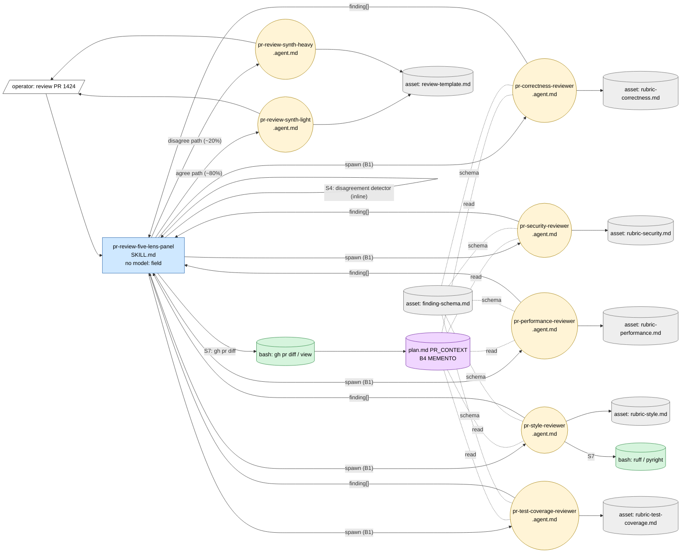
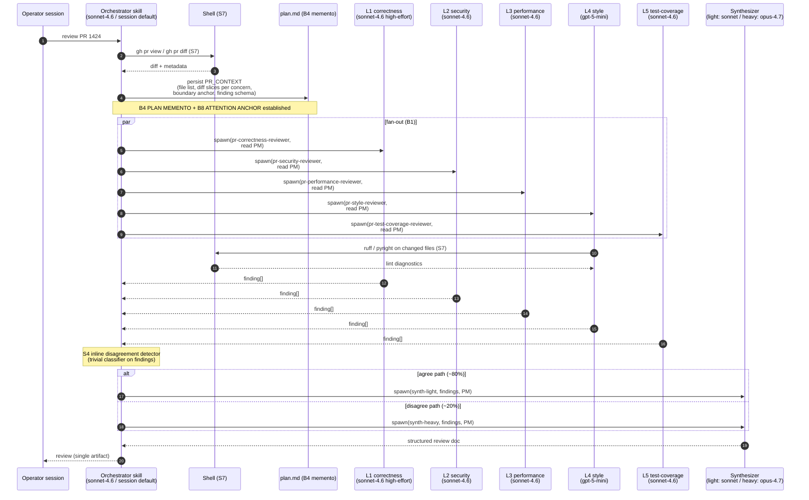
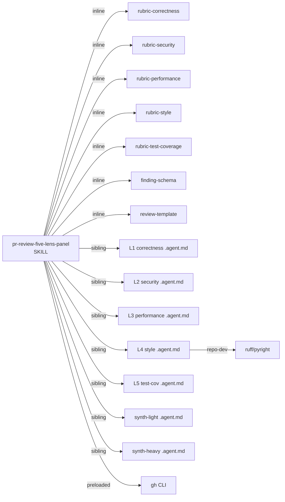

# Handoff Packet — `pr-review-five-lens-panel`

Genesis design run against v0.3.1 corpus.
Target: code review of microsoft/apm PR #1424 (LSP install pipeline,
+2363/-114 across 24 files; ~900 lines new src + ~1080 lines new
tests + ~280 lines docs). Executor session: Copilot CLI pinned to
`claude-sonnet-4.6` as the session/orchestrator model.

This packet is the design contract. Step 7b drafts the natural-
language module bodies; step 8 validates against this packet. Both
are out of scope for this single architect pass.

---

## Step 1 — Intent + scope

**Capability paragraph.** When invoked on a target pull request, run
a multi-lens code review across exactly five independent inspection
axes — correctness, security, performance, style, and test-coverage —
each in its own fresh sub-agent thread, then synthesize the findings
into a single structured review artifact returned to the operator's
session. Boundary: this workflow NEVER posts to GitHub, NEVER
modifies code, NEVER edits the PR, NEVER triggers CI, and does NOT
attempt to render a merge/no-merge verdict. It produces an advisory
review document the human (or a downstream skill) decides what to do
with. It does NOT generate fixes for the issues it surfaces.

**SRP / R1 SPLIT check.** Five lenses are internal decomposition of
ONE dispatch surface ("review this PR"), not five dispatch surfaces.
R1 SPLIT does NOT fire at the entrypoint (compare example 04). R3
EXTRACT fires at the lens content — each lens persona is its own
`.agent.md` so it can load into a fresh context window AND so its
binding-site frontmatter can declare its own role-class `model:` and
tool subset (this is forced by Copilot's per-harness B12 BINDING SITE
constraint — see `assets/runtime-affordances/per-harness/copilot.md`
section 9). The orchestrator stays one skill.

**Dispatch description draft (frontmatter `description`, ~860 chars,
imperative, intent-first, indirect-triggers named, invocation mode
BOTH — operator may invoke directly OR another skill may dispatch).**

> Use this skill to produce a multi-lens advisory code review of a
> pull request, fanning out five independent specialist threads
> (correctness, security, performance, style, test-coverage) and
> synthesizing their findings into one structured review document.
> Activate when the user asks to "review this PR", "audit this
> change", "code-review #NNN", "look at the diff before merge",
> "what does this PR look like", or names a PR URL/number with any
> review-shaped verb. Also activate when a sibling workflow
> dispatches a PR for pre-merge inspection. Reports correctness
> bugs, security smells, performance regressions, style violations,
> and test-coverage gaps with file/line anchors. This skill never
> posts to GitHub, never edits code, never approves or requests
> changes via the review API, and never auto-merges. Do not use for:
> drafting PR descriptions, applying fixes, or producing a merge
> verdict.

**Cost stance.** `balanced` (default). Operator declared a FinOps
experiment intent and "let the v0.3.1 corpus drive" — that maps to
`balanced` with cost-shape patterns applied where they pay, without
aggressive R5 COST PRUNE flattening. No hard cap declared; cap check
at step 6 is informational only.

**Critical session constraint.** The orchestrator session is pinned
to `claude-sonnet-4.6`. Per the v0.3.1 SESSION DEFAULT discipline
(`per-harness/copilot.md` §9 "Cost-pattern bindings"), this means:

- The orchestrator role gets implementer-class capability for free
  (sonnet-4.6 IS the implementer-class default — no need to declare
  `model:` on the orchestrator skill, and skill frontmatter wouldn't
  accept it anyway).
- Any child element that needs a DIFFERENT role class MUST be its
  own `.agent.md` custom agent with explicit `model:` — otherwise it
  silently falls back to the session default. This is the
  WRONG-PRIMITIVE BINDING failure mode named in `design-patterns.md`
  §B12 (PR #12 Executor B regression).
- The planner-class arbiter (`pr-review-synth-heavy`) is the slot
  where this most matters: putting opus-4.7 in a SKILL.md would
  silently bind it to sonnet-4.6 and B12 would not fire.

---

## Step 2 — Component diagram

Patterns considered (in tier order per SKILL.md step 3):

- **R-tier (refactor) check.** No existing module to refactor (greenfield
  design). R3 EXTRACT is applied proactively at lens content — each
  lens persona lives in its own `.agent.md` so per-element bindings
  can fire (this is also a B12 BINDING SITE necessity, not a refactor
  per se).
- **Tier 3 (architectural).** A1 PANEL (lens-count gate fires at 5)
  + A12 GRADIENT WORKFLOW (cost overlay — heterogeneous role-class
  needs across the panel slots).
- **NOT selected at Tier 3.** A6/A10 (no event trigger; operator-
  invoked in-session), A11 RECONCILIATION LOOP (no queue / no
  terminal-state convergence — this is a one-shot multi-lens
  review), A9 SUPERVISED EXECUTION (no consequential side effect on
  a system of record — advisory output only; brief explicitly
  forbids GitHub posting), A7 ADVERSARIAL REVIEW (not warranted at
  this scope — adding an adversarial layer doubles cost on advisory
  output for marginal quality gain).
- **Tier 2 (design).** B1 FAN-OUT + SYNTHESIZER (panel topology),
  C2 PERSONA PRELOAD ×5 lenses + 2 synthesizers (light + heavy),
  C3 THREAD SPAWN per lens (fresh context isolation), B4 PLAN
  MEMENTO (PR_CONTEXT artifact across spawns), B8 ATTENTION ANCHOR
  (goal + boundary re-injected per spawn), S4 VALIDATION DECORATOR
  (disagreement detector inline in orchestrator body — trivial-class
  classifier on lens outputs, routes to light vs heavy synth), S7
  DETERMINISTIC TOOL BRIDGE ×2 places: (a) `gh pr diff` for the
  diff (FACT), (b) `ruff` / `pyright` / repo's existing linters in
  the style lens (FACTS — running real linters is cheaper and more
  accurate than asking the model to imitate them), B12 MODEL ROUTER
  (per-element role-class binding at `.agent.md` site), B13 CACHE-
  AWARE PREFIX (rubric + persona stable per lens; diff slice as
  variable suffix), B15 TOOL SUBSET (per-lens `tools:` at `.agent.md`).
- **Tier 1 (idioms).** Loaded at step 7b only; not now.

**Component diagram.**

All elements are NEW. The orchestrator is a SKILL (no per-element
model binding needed; runs on session default = implementer class).
Every lens and each synthesizer is a CUSTOM AGENT (`.agent.md`) so
that B12 / B15 / B16 can fire at the canonical Copilot BINDING SITE.

---

## Step 3 — Thread / sequence diagram

**Interlock notes.** The orchestrator is the SINGLE WRITER to plan.md
(one-writer rule honored). Lenses are READ-ONLY against plan.md. The
parent waits at fan-in until all 5 lenses return. Each lens runs in a
fresh context window (C3 THREAD SPAWN) and binds the rubric +
persona as its cacheable prefix (B13); the PR slice it reads from
plan.md is the variable suffix.

---

## Step 3.1 — Tradeoff check (only where alternatives surfaced)

Two slots had real alternatives in tension:

**Slot 1: Synthesis style.** Single planner-class arbiter on every
review (cost-unconscious) vs. conditional escalation (light by
default, heavy on disagreement). Cited matrix:
`assets/pattern-tradeoffs.md` §5 (Synthesis style) cross-referenced
with §10 (cost-shape, row "Quality-uniform graph, mostly routine
modules"). Decision: conditional escalation — disagreement is the
slot where planner-class reasoning actually buys something; on
agree-path reviews (~80%), reviewer-class synthesis suffices. Same
cell as example 06.

**Slot 2: Style lens execution doctrine.** LLM-asserted style
findings vs. S7 DETERMINISTIC TOOL BRIDGE (run repo's existing
linters). Cited matrix: `assets/pattern-tradeoffs.md` §9 (Execution
doctrine). The PR is in a Python repo with an active lint gate (the
new file `src/apm_cli/integration/_shared.py` carries a comment
`Extracted to satisfy the R0801 (duplicate-code) lint gate.` — lint
rules are FACTS-THAT-MUST-BE-TRUE about the repo). Decision: style
lens runs `ruff` (and `pyright` if configured) via bash FIRST, then
the LLM offers commentary on findings the deterministic linter
cannot catch (naming, structure, idiom). LLM-asserted prose for
deterministic checks is HAND-ROLLED HALLUCINATION.

No other slot had genuine alternatives; default-pattern selection
applied directly elsewhere (§3 in SKILL.md).

---

## Step 3.2 — Cost check (mandatory, mirrors 3.1)

Per-module qualitative bands (`assets/token-economics.md` §5
"Cost-shape vocabulary"):

| Module                          | Role class  | Prefix band | Output band | Turn count | Repeat? | Cache invalidator? |
|---------------------------------|-------------|-------------|-------------|------------|---------|--------------------|
| Orchestrator (skill body)       | implementer | M (~6K)     | S (~500)    | low (2-3)  | 1x      | none               |
| L1 pr-correctness-reviewer      | implementer | M (~10K)    | M (~1.5K)   | low (2-4)  | 1x      | none               |
| L2 pr-security-reviewer         | reviewer    | M (~8K)     | M (~1K)     | low (1-3)  | 1x      | none               |
| L3 pr-performance-reviewer      | reviewer    | M (~6K)     | S (~700)    | low (1-2)  | 1x      | none               |
| L4 pr-style-reviewer            | trivial     | S (~3K)     | S (~400)    | low (1-2)  | 1x      | none (linter via S7) |
| L5 pr-test-coverage-reviewer    | reviewer    | M (~9K)     | M (~1K)     | low (1-3)  | 1x      | none               |
| Disagreement detector (inline)  | trivial     | S (~2K)     | S (~50)     | 1          | 1x      | none               |
| Synthesizer light (agree path)  | reviewer    | M (~5K)     | M (~1.2K)   | 1          | ~0.8    | none               |
| Synthesizer heavy (disagree)    | planner     | M (~5K)     | M (~1.5K)   | 1          | ~0.2    | none (own thread)  |

Note on role classes vs session default: Copilot's session model is
sonnet-4.6 = implementer/reviewer class concrete SKU. The architect
designs in role classes; the per-element `model:` field on each
`.agent.md` binds that role class to a concrete SKU at codegen time
(step 7b reads `runtime-affordances/per-harness/copilot.md` §9 for
the mapping). L4 trivial → `gpt-5-mini` is the only cross-class
binding that meaningfully differs from session default; the others
declare sonnet-4.6 explicitly to make B12 firing INTENTIONAL and to
future-proof against session model changes (per-harness §9 anti-
pattern: "Default-binding-by-omission … is what fired (or rather,
did NOT fire) in PR #12's Executor B run").

L1 correctness gets `medium-to-high` effort (B16 EFFORT GOVERNOR) —
cross-file reasoning across the integration boundary is the "wrong
plan" failure mode, not the "minor edit miss" failure mode.

**Cost-shape matrix row cited (`pattern-tradeoffs.md` §10).** "Fan-
out across N similar items / Output bytes × N / Heavy role class on
workers → A12 GRADIENT WORKFLOW (mid = implementer)". This is the
load-bearing row for the whole design. Cross-referenced row for the
synthesis split: "Quality-uniform graph, mostly routine modules /
Per-call rate × graph size / Uniform planner class → A12 + R5
prune" — applied in milder form (conditional escalation rather than
flat prune).

**Workflow shape.** A12 GRADIENT WORKFLOW overlay on A1 PANEL:
- FRONT (orchestrator scoping): implementer class
- MID ×5 (lens fan-out): reviewer/implementer/trivial mix
- BACK (synthesis): reviewer default, planner on disagreement

**Stance check.** `balanced`. Cost amplifiers identified and
patterned: B12 fires per-element (5 lens agents + 2 synth agents);
B13 honored (rubric is per-lens cacheable prefix, PR_CONTEXT held
stable per spawn; no mid-session model switch within a single thread
because each lens IS a thread); B15 applied per-element (`tools:` is
scoped per `.agent.md`); B16 applied on L1 only (where the marginal
thinking buys reasoning, not on the rubric-bounded lenses). No R5
COST PRUNE pass needed — the design is gradient-shaped from the
start. No cap declared.

---

## Step 3.5 — Composition decision

Per-box composition (`assets/composition-substrate.md`):

| Box                              | Composition          | Rationale                                                                                   |
|----------------------------------|----------------------|---------------------------------------------------------------------------------------------|
| `pr-review-five-lens-panel` skill| LOCAL SIBLING        | Project-specific orchestrator. Not yet meeting rule-of-three for external promotion.        |
| Each lens `.agent.md` (×5)       | LOCAL SIBLING        | Tightly coupled to this workflow's finding schema; share substrate via SKILL link.          |
| `pr-review-synth-light` agent    | LOCAL SIBLING        | Specific to this panel's synthesis contract.                                                |
| `pr-review-synth-heavy` agent    | LOCAL SIBLING        | Specific to this panel's synthesis contract; distinct only in role-class binding.           |
| Rubric assets ×5                 | INLINE asset         | Unique to each lens; loaded by that lens only.                                              |
| `finding-schema.md` asset        | INLINE asset         | Shared schema between lenses and synthesizers; small (~30 lines) and stable.                |
| `review-template.md` asset       | INLINE asset         | Synthesis output template; one consumer.                                                    |
| `gh` CLI                         | EXTERNAL (preloaded) | Already in the executor environment (per environment_context). Universal across Copilot.    |
| `ruff` / `pyright`               | EXTERNAL (repo dev)  | Already part of the apm repo's dev tooling (referenced by `_shared.py` comment).            |

**Dependency graph.**

**External modules required.** None requiring a module-system
adapter. `gh` is preloaded by the executor environment;
`ruff`/`pyright` are repo-local dev tooling already declared by the
apm project. No `apm-usage` adapter load at step 7b is needed.
DECLARATION MECHANISM N/A.

---

## Step 4 — SoC pass

For each module, check against existing modules and refactor triggers:

- **Skill body.** Triggers checked: R1 SPLIT (DESCRIPTION CONJUNCTION
  — NO; one verb "review", one noun "PR"; five lenses are internal
  decomposition not multiple capabilities), FRAGMENT CALLERS — NO
  (no consumer wants only one lens), BODY OVER BUDGET — projected
  NO (orchestrator body has scoping + dispatch + S4 detector; well
  under 500 lines), MULTI-LENS BODY — would fire IF lenses were
  inlined, cured by R3 EXTRACT to per-lens `.agent.md`, DIVERGENT
  CHANGE CADENCE — cured by same R3 extraction. R2 FUSE — NO. R4
  INLINE — applied to the disagreement detector (single trivial
  classifier, one caller, body of ~10 lines; promoting it to its own
  primitive would be PREMATURE SPLIT).
- **Lens agents.** Each has one responsibility (one lens, one
  rubric, one finding schema output). No overlap between lenses
  (correctness ≠ style ≠ security; rubrics are designed disjoint).
  Each declares a dispatch description with the lens name, so no
  DISPATCH COLLISION between lenses or with the orchestrator skill.
- **Synthesizers.** Distinct only in role-class binding and in their
  body's instruction set (light: produce summary; heavy: adjudicate
  cross-lens tension). Composition is justified — collapsing them
  would force runtime `model:` switching, which is a B12 + B13 anti-
  pattern (cache partition by model SKU).
- **Side effects.** No CONSEQUENTIAL SIDE EFFECT crosses S7 in this
  design (advisory output only, no posting / no edit / no deploy).
  Reading the diff IS a FACT-THAT-MUST-BE-TRUE — S7 fires via the
  preloaded `gh` CLI. Style lens running `ruff` IS the same — S7
  fires via preloaded `bash`. A9 SUPERVISED EXECUTION not needed:
  no plan+execute+verify spanning a consequential write. (If a
  future iteration adds "post review as a PR comment", A9 fires AND
  a strong-form verifier must read back the posted comment via the
  GitHub API. NOT in this design's scope.)

No BLOCKER findings.

---

## Step 5 — Compliance check

Classic principles + PROSE + LLM-physics + MODULE ENTRYPOINT spec.

| Axis                                | Status   | Note                                                                                  |
|-------------------------------------|----------|---------------------------------------------------------------------------------------|
| SRP at dispatch surface             | PASS     | One verb, one noun, one trigger.                                                      |
| SRP at module body                  | PASS     | R3 EXTRACT applied to lens content.                                                   |
| Progressive Disclosure              | PASS     | Rubrics load per-lens-spawn, not on skill activation.                                 |
| Reduced Scope                       | PASS     | Boundary explicit (no post / no edit / no verdict).                                   |
| Orchestrated Composition            | PASS     | Skill orchestrates; agents specialize; assets ground.                                 |
| Safety Boundaries                   | PASS     | No write to GitHub; no edits to repo; advisory only.                                  |
| Explicit Hierarchy                  | PASS     | Orchestrator → 5 lens agents → synth agent; one-writer to plan.md.                    |
| Truth #1 CONTEXT FRAGILE            | PASS     | B4 PLAN MEMENTO + B8 ATTENTION ANCHOR; per-spawn re-grounding from plan.md.           |
| Truth #2 CONTEXT EXPLICIT           | PASS     | PR_CONTEXT artifact is the explicit handoff; no tacit memory across spawns.           |
| Truth #3 OUTPUT PROBABILISTIC       | PASS     | S4 disagreement detector + structured finding schema bound the variance.              |
| Truth #4 HALLUCINATION INHERENT     | PASS     | C2 PERSONA PRELOAD per lens + rubric grounding; S7 for style lint.                    |
| Truth #5 PRETRAINING FROZEN         | PASS     | All facts (diff, lockfile, lint output) supplied by tool calls, not LLM recall.       |
| Truth #6 HARNESSES BRIDGE           | PASS     | S7 via `gh` (preloaded) and `bash` for linters.                                       |
| Truth #7 PLAN BEFORE EXECUTION      | PASS     | This packet IS the plan; orchestrator re-grounds at every spawn.                      |
| MODULE ENTRYPOINT `name` regex      | PASS     | `pr-review-five-lens-panel` ≤64 chars, lowercase, hyphenated, matches dir.            |
| MODULE ENTRYPOINT body ≤500 lines   | PASS (projected) | Orchestrator body projected ~250 lines; lens content lives in `.agent.md` files.   |
| MODULE ENTRYPOINT description ≤1024 | PASS     | Drafted at ~860 chars in Step 1.                                                      |
| B12 BINDING SITE honored            | PASS     | Per-element bindings on `.agent.md`, NOT on SKILL.md.                                 |
| B15 BINDING SITE honored            | PASS     | Per-element `tools:` on `.agent.md`.                                                  |
| B13 cache invalidator audit         | PASS     | No timestamps in personas; tool catalogue stable per thread; no mid-thread model switch. |

No BLOCKER findings.

---

## Step 6 — Handoff packet (this document)

### Per-module interface sketch

#### `pr-review-five-lens-panel` (SKILL)

- **Trigger description.** (See Step 1 draft, ~860 chars.) FORCED via
  operator command + DISCOVERY when matching review-shaped intent.
- **Inputs.** PR identifier (URL or number+repo); optional review
  focus override.
- **Outputs.** Structured review document (markdown) returned in-
  session to the operator. Schema defined in `review-template.md`.
- **Body responsibilities.** (a) Resolve PR identifier; (b) `gh pr
  view` + `gh pr diff` to fetch metadata + diff (S7); (c) bucket the
  diff into per-lens-relevant slices and persist as `PR_CONTEXT`
  inside `plan.md` (B4 PLAN MEMENTO); (d) re-state the boundary
  anchor (no post / no edit / no verdict — B8 ATTENTION ANCHOR);
  (e) fan-out spawn the 5 lens custom agents in parallel (B1); (f)
  collect findings, validate against `finding-schema.md` (S4); (g)
  run inline disagreement detector (trivial classifier — checks for
  conflicting severity rankings or contradictory recommendations on
  the same file/line); (h) dispatch to `synth-light` (agree path)
  or `synth-heavy` (disagree path); (i) return synthesizer's output
  to operator.
- **Dependencies (relative links).**
  - `agents/pr-correctness-reviewer.agent.md`
  - `agents/pr-security-reviewer.agent.md`
  - `agents/pr-performance-reviewer.agent.md`
  - `agents/pr-style-reviewer.agent.md`
  - `agents/pr-test-coverage-reviewer.agent.md`
  - `agents/pr-review-synth-light.agent.md`
  - `agents/pr-review-synth-heavy.agent.md`
  - `assets/rubric-correctness.md` (lazy)
  - `assets/rubric-security.md` (lazy)
  - `assets/rubric-performance.md` (lazy)
  - `assets/rubric-style.md` (lazy)
  - `assets/rubric-test-coverage.md` (lazy)
  - `assets/finding-schema.md`
  - `assets/review-template.md`
- **Frontmatter.** `name` + `description` ONLY (no `model:`, no
  `tools:` — those are silently ignored on SKILL.md per Copilot
  adapter §2).

#### `pr-correctness-reviewer.agent.md`

- **Trigger description.** "Use this agent to review code changes
  for correctness defects: off-by-one errors, null/None handling,
  race conditions, error-path holes, contract violations between
  caller and callee, and integration-boundary mismatches. Activate
  only via the `pr-review-five-lens-panel` orchestrator."
  (`disable-model-invocation: true` — programmatic-only.)
- **Inputs.** Reads `plan.md::PR_CONTEXT` (own thread).
- **Outputs.** `finding[]` matching `finding-schema.md`.
- **Frontmatter binding (per Copilot adapter §9).** `model:
  claude-sonnet-4.6` (implementer-class default, declared
  explicitly per WRONG-PRIMITIVE-BINDING anti-pattern guidance);
  `tools: ["read", "search"]` (no edit, no execute — lens is read-
  only); effort intent: medium-to-high (B16 — bind via Copilot's
  high-effort SKU variant at step 7b if available).

#### `pr-security-reviewer.agent.md`

- **Trigger description.** "Use this agent to review code changes
  for security defects: injection (shell, path traversal, untrusted
  YAML/JSON parsing), insecure deserialization, secret handling,
  TOCTOU on filesystem operations, and trust-boundary crossings.
  Activate only via `pr-review-five-lens-panel`." Programmatic-only.
- **Inputs.** Reads `plan.md::PR_CONTEXT`.
- **Outputs.** `finding[]`.
- **Frontmatter binding.** `model: claude-sonnet-4.6` (reviewer-
  class on Copilot — same concrete SKU as implementer; mapping per
  adapter §9); `tools: ["read", "search"]`.
- **Grounding note.** Rubric calls out PR-#1424-specific risks:
  this PR adds a parser that reads untrusted `plugin.json` files
  from installed packages AND writes `.lsp.json` files at project
  root. Path-traversal and YAML/JSON parsing safety are first-class
  rubric items.

#### `pr-performance-reviewer.agent.md`

- **Trigger description.** "Use this agent to review code changes
  for performance regressions: unbounded iteration on user input,
  N+1 patterns, repeated disk/network IO inside hot loops,
  unnecessary deep copies, and large-data structures held in memory
  across awaits. Activate only via `pr-review-five-lens-panel`."
  Programmatic-only.
- **Inputs.** Reads `plan.md::PR_CONTEXT`.
- **Outputs.** `finding[]`.
- **Frontmatter binding.** `model: claude-sonnet-4.6` (reviewer
  class); `tools: ["read", "search"]`.

#### `pr-style-reviewer.agent.md`

- **Trigger description.** "Use this agent to review code changes
  for style and idiom defects beyond what the repo's linters
  already catch: naming clarity, function decomposition, comment
  necessity vs. self-documenting code, and idiomatic Python (PEP
  conformance where linters are silent). Activate only via
  `pr-review-five-lens-panel`." Programmatic-only.
- **Inputs.** Reads `plan.md::PR_CONTEXT`. ALSO runs `ruff
  check --no-fix --output-format=json` and (if configured)
  `pyright --outputjson` over the changed files first (S7).
- **Outputs.** `finding[]` (deterministic linter output + LLM
  commentary on what linters cannot see).
- **Frontmatter binding.** `model: gpt-5-mini` (trivial class — the
  ONLY cross-class binding in the design; rubric-bound and lint-
  bound work does not need implementer-class reasoning); `tools:
  ["read", "search", "execute"]` (needs `execute` for ruff/pyright;
  the only lens with `execute`).

#### `pr-test-coverage-reviewer.agent.md`

- **Trigger description.** "Use this agent to review code changes
  for test-coverage gaps: production code paths not exercised by
  the diff's test files, edge cases asserted in the production code
  but missing from tests, and assertions that test behavior the
  production code does not actually implement. Activate only via
  `pr-review-five-lens-panel`." Programmatic-only.
- **Inputs.** Reads `plan.md::PR_CONTEXT` (which has the test files
  bucketed separately from production files).
- **Outputs.** `finding[]`.
- **Frontmatter binding.** `model: claude-sonnet-4.6` (reviewer);
  `tools: ["read", "search"]`.

#### `pr-review-synth-light.agent.md`

- **Trigger description.** "Use this agent to synthesize a structured
  review document from N independent lens-finding lists when those
  lists do NOT exhibit cross-lens disagreement. Activate only via
  `pr-review-five-lens-panel`." Programmatic-only.
- **Inputs.** Findings from 5 lenses + `review-template.md`.
- **Outputs.** Single review markdown.
- **Frontmatter binding.** `model: claude-sonnet-4.6` (reviewer);
  `tools: ["read"]`.

#### `pr-review-synth-heavy.agent.md`

- **Trigger description.** "Use this agent to synthesize a structured
  review document from N independent lens-finding lists when those
  lists EXHIBIT cross-lens disagreement requiring adjudication.
  Activate only via `pr-review-five-lens-panel`." Programmatic-only.
- **Inputs.** Findings + `review-template.md`.
- **Outputs.** Single review markdown including a dedicated
  "Adjudicated disagreements" section.
- **Frontmatter binding.** `model: claude-opus-4.7` (planner class —
  THE B12 firing slot of this design; this is the slot where opting
  out of explicit binding would silently fall back to sonnet-4.6 and
  the gradient would collapse); `tools: ["read"]`. Effort: high
  (B16 — opus's reasoning-effort knob, bound via SKU choice).

### Module composition table

(See Step 3.5 table.)

### External modules required

None requiring a module-system adapter. Preloaded `gh` and repo-dev
`ruff`/`pyright` are not module-system primitives. Step 7b will NOT
need to load `apm-usage` or any other adapter. DECLARATION
MECHANISM: N/A.

### Declared target set

`copilot` only. This design uses Copilot-specific binding sites
(`.agent.md` frontmatter, `~/.copilot/session-state/<session>/plan.md`).
A port to another harness would require redesign at step 3.5 (other
harnesses may put the per-element model binding on a different
primitive — see `runtime-affordances/model-catalog.md` §"NAMES THE
PER-ELEMENT BINDING SITE explicitly").

### Per-element model binding table (B12 contract)

This is the load-bearing table for the A/B comparison.

| Element                          | Primitive type | BINDING SITE          | Bound model (default)    | Role class  | Why this class                                                                                   |
|----------------------------------|----------------|-----------------------|--------------------------|-------------|---------------------------------------------------------------------------------------------------|
| pr-review-five-lens-panel        | SKILL          | session default (skill cannot carry `model:` on Copilot) | claude-sonnet-4.6 (inherited) | implementer | Orchestrator does scoping + dispatch + inline trivial classification; sonnet IS the implementer-class default; no override possible at the SKILL.md primitive. |
| pr-correctness-reviewer          | .agent.md      | `model:` frontmatter  | claude-sonnet-4.6 (explicit) | implementer | Cross-file integration-boundary reasoning; "wrong plan" failure mode on the most complex lens. Effort=high (B16). |
| pr-security-reviewer             | .agent.md      | `model:` frontmatter  | claude-sonnet-4.6 (explicit) | reviewer    | Pattern-match against security rubric; rubric is the heavy lifter; reviewer class meets capability. |
| pr-performance-reviewer          | .agent.md      | `model:` frontmatter  | claude-sonnet-4.6 (explicit) | reviewer    | Pattern-match against perf rubric on a non-hot-path install pipeline; reviewer class suffices.    |
| pr-style-reviewer                | .agent.md      | `model:` frontmatter  | gpt-5-mini               | trivial     | Real linters do the deterministic work via S7; LLM only comments on residual; trivial class is correct. |
| pr-test-coverage-reviewer        | .agent.md      | `model:` frontmatter  | claude-sonnet-4.6 (explicit) | reviewer    | Map production paths ↔ test paths against a checklist; reviewer class.                            |
| pr-review-synth-light (agree)    | .agent.md      | `model:` frontmatter  | claude-sonnet-4.6 (explicit) | reviewer    | Aggregate non-conflicting findings into a template; bounded reasoning.                            |
| pr-review-synth-heavy (disagree) | .agent.md      | `model:` frontmatter  | claude-opus-4.7          | planner     | Cross-lens adjudication under tension; "wrong plan" failure mode; the canonical planner slot.     |

**B12 findings explicitly recorded:**

- **B12 FIRES on 6 of 8 elements** (every `.agent.md` carries an
  explicit `model:` — even where it matches session default, the
  declaration is intentional). The 7th binding is the synth-heavy
  cross-class promotion to opus (the firing slot that actually
  changes the model SKU). The 8th element (the orchestrator skill)
  CANNOT host a `model:` field on Copilot — that is a constraint of
  the platform, not a B12 failure; the orchestrator's role-class
  need (implementer) happens to coincide with the session default,
  so the constraint is harmless here. If the orchestrator's role
  needed planner class, the design would have to restructure the
  orchestrator AS a `.agent.md` custom agent (per adapter §2/§9
  "restructure the unit of work to that primitive type"). It does
  not, so it stays a SKILL.
- **WRONG-PRIMITIVE BINDING explicitly NOT committed.** No element
  in this design declares `model:` on a SKILL or on any primitive
  whose frontmatter would silently ignore it. The skill body
  carries no `model:` field by design. The opus-4.7 promotion
  occurs ONLY on a `.agent.md`, which is the canonical Copilot B12
  BINDING SITE. Step 8 validator MUST grep for `^model:` inside
  `SKILL.md` and fail if found.
- **SESSION DEFAULT discipline honored.** Acknowledges the
  orchestrator is sonnet-4.6 and DOES NOT design around an
  unenforceable assumption that it could be otherwise. Every per-
  element binding is declared so future session-default changes
  cannot silently re-bind a lens or the synthesizer.

### Per-element tool subset (B15 contract)

| Element                          | `tools:` value                        | Rationale                                                |
|----------------------------------|---------------------------------------|----------------------------------------------------------|
| pr-review-five-lens-panel (SKILL)| (not bindable on SKILL; falls back to session tool surface) | Orchestrator needs `read`, `execute` (gh CLI), `agent` (spawn). Live with session default. |
| pr-correctness-reviewer          | `["read", "search"]`                  | Read-only lens; no spawn, no execute, no edit.           |
| pr-security-reviewer             | `["read", "search"]`                  | Same.                                                    |
| pr-performance-reviewer          | `["read", "search"]`                  | Same.                                                    |
| pr-style-reviewer                | `["read", "search", "execute"]`       | Needs `execute` for ruff/pyright (S7).                   |
| pr-test-coverage-reviewer        | `["read", "search"]`                  | Same.                                                    |
| pr-review-synth-light            | `["read"]`                            | Pure synthesis; no search even.                          |
| pr-review-synth-heavy            | `["read"]`                            | Same.                                                    |

**B15 finding.** Same orchestrator-vs-lens BINDING SITE constraint
as B12: the SKILL cannot scope tools. The orchestrator runs against
the session tool surface; the lenses are tool-scoped at `.agent.md`.
This matches `per-harness/copilot.md` §9 B15 binding note.

### Pattern selections cited from corpus (provenance table)

| Pattern                       | File / section                                                | Used for                                          |
|-------------------------------|---------------------------------------------------------------|---------------------------------------------------|
| A1 PANEL                      | `architectural-patterns.md` §A1                               | 5-lens fan-out (lens-count gate fires at 5)       |
| A12 GRADIENT WORKFLOW         | `architectural-patterns.md` §A12                              | Cost overlay on the panel                         |
| B1 FAN-OUT + SYNTHESIZER      | `design-patterns.md` §B1                                      | Panel topology                                    |
| C2 PERSONA PRELOAD            | `design-patterns.md` §C2                                      | Per-lens persona grounding                        |
| C3 THREAD SPAWN               | `design-patterns.md` §C3                                      | Fresh context per lens                            |
| B4 PLAN MEMENTO               | `design-patterns.md` §B4                                      | PR_CONTEXT persisted to `plan.md`                 |
| B8 ATTENTION ANCHOR           | `design-patterns.md` §B8                                      | Boundary re-injection per spawn                   |
| S4 VALIDATION DECORATOR       | `design-patterns.md` §S4                                      | Inline disagreement detector                      |
| S7 DETERMINISTIC TOOL BRIDGE  | `design-patterns.md` §S7                                      | `gh pr diff` + ruff/pyright                       |
| B12 MODEL ROUTER              | `design-patterns.md` §B12                                     | Per-element model binding at `.agent.md`          |
| B13 CACHE-AWARE PREFIX        | `design-patterns.md` §B13                                     | Stable rubric+persona prefix; no mid-thread switch|
| B15 TOOL SUBSET               | `design-patterns.md` §B15                                     | Per-element tool scope at `.agent.md`             |
| B16 EFFORT GOVERNOR           | `design-patterns.md` §B16                                     | Medium-high on L1; high on synth-heavy            |
| Cost-shape matrix §10         | `pattern-tradeoffs.md` §10 rows 3 + 9                         | Justifies A12 + conditional synth escalation      |
| Synthesis style matrix §5     | `pattern-tradeoffs.md` §5                                     | Justifies light/heavy split                       |
| Execution doctrine matrix §9  | `pattern-tradeoffs.md` §9                                     | Justifies ruff/pyright bridge in L4               |
| BINDING SITE doctrine         | `runtime-affordances/per-harness/copilot.md` §9               | Forces lens content to `.agent.md`, not SKILL     |
| WRONG-PRIMITIVE BINDING       | `design-patterns.md` §B12 anti-patterns                       | Forbids `model:` on SKILL.md                      |
| Worked example shape          | `examples/06-cost-aware-panel.md`                             | Closest precedent; same gradient + synth split    |
| Worked example shape          | `examples/04-pr-review-advisory.md`                           | Closest precedent for PR-review intent + boundary |

### Compliance findings still open

None at BLOCKER. One MEDIUM finding for step 8 to verify:

- **MEDIUM — sanity-check `gpt-5-mini` SKU availability on the
  operator's Copilot plan.** `per-harness/copilot.md` lists it as
  the trivial-class default, but the operator's billing tier may
  not include it. Step 7b should probe (via `gh copilot` model
  listing or equivalent) before committing the L4 binding; if
  unavailable, fall back to `gpt-4o-mini` (also listed) or to
  `claude-sonnet-4.6` (loses the trivial-class savings on L4 but
  preserves correctness; gradient is still in place via L1's
  effort=high being the only above-default binding plus the
  synth-heavy opus promotion).

### Todo list (drive step 7b + step 8)

Recorded in session SQL (see step 6 PERSIST PACKET note below).
Dependencies named explicitly.

1. `lens-rubrics` — Author the 5 rubric assets (correctness,
   security, performance, style, test-coverage). PR-#1424-specific
   anchors required: security rubric MUST name path-traversal on
   `.lsp.json` write site and JSON-parsing safety on `plugin.json`
   read site; test-coverage rubric MUST name the 5 new test files
   and check their assertions against the 4 new production files;
   correctness rubric MUST name the integration boundary between
   `LSPIntegrator`, `lsp/integration.py`, and `pipeline.py` plus
   the lockfile drift path. Depends on: nothing.
2. `finding-schema` — Author `assets/finding-schema.md`. Depends
   on: nothing.
3. `review-template` — Author `assets/review-template.md`. Depends
   on: `finding-schema`.
4. `lens-agents` — Author the 5 lens `.agent.md` files (each
   declares `model:`, `tools:`, `disable-model-invocation: true`,
   `user-invocable: false`, links to its rubric + finding-schema).
   Depends on: `lens-rubrics`, `finding-schema`.
5. `synth-agents` — Author the 2 synth `.agent.md` files. Depends
   on: `finding-schema`, `review-template`.
6. `orchestrator-skill` — Author `SKILL.md` (the only `model:`-free
   primitive in the bundle). Includes the inline disagreement
   detector (trivial classifier, S4 decorator). Depends on:
   `lens-agents`, `synth-agents`, `review-template`.
7. `evals` — See evals plan below. Depends on: `orchestrator-skill`.
8. `step-8-validate` — Run the validation checklist incl. the
   PHANTOM-DEPENDENCY-style "grep `^model:` in SKILL.md" check.
   Depends on: `orchestrator-skill`, `evals`.

### Evals plan

**Content evals (2 — exercised with-skill / without-skill on the
same operator session).**

1. **PR #1424 cold review.** Prompt: "Review microsoft/apm PR
   1424 across correctness, security, performance, style, and
   test-coverage." Expected (with skill): structured review doc
   with ≥1 finding per lens, security lens flags untrusted JSON
   parsing on `plugin.json` and path-handling on `.lsp.json` write
   site, test-coverage lens flags any uncovered branches in
   `LSPIntegrator.collect_transitive` fallback paths. Expected
   (without skill): unstructured prose without lens separation,
   likely missing the security-specific PR-#1424 anchors. Ship
   gate: with-skill output is structurally distinguishable AND
   surfaces at least 2 lens-anchored findings the without-skill
   run misses.
2. **A negative-control PR (a trivial typo-fix PR).** Expected
   (with skill): structured review doc with explicit "no findings"
   per most lenses, no fabricated issues. Ship gate: with-skill
   does NOT manufacture severity to justify itself.

**Trigger evals (~20 — for the orchestrator skill's `description`).**

Should-trigger (10):
- "Review PR 1424"
- "Code-review this pull request: <URL>"
- "Run a multi-lens review on the LSP PR"
- "Audit this change for correctness and security"
- "Check coverage / security / performance on PR 1424"
- "What does this PR look like across the usual lenses?"
- "Five-lens review please"
- "Look at this diff before merge"
- "Run the review panel on 1424"
- "Inspect this PR for issues across all our usual axes"

Should-NOT-trigger (10):
- "Write a PR description for this change" (different skill)
- "Fix the bug in `LSPIntegrator.collect_transitive`" (different
  skill — applies fixes)
- "Merge this PR" (different action)
- "Post a comment on this PR" (different action; this skill never
  posts)
- "Approve PR 1424" (different action; this skill never approves)
- "Generate release notes for 0.14.2" (different skill)
- "Run the tests in `tests/unit/integration/`" (different skill)
- "Show me the diff" (just a read, no review)
- "Triage this issue" (issue not PR)
- "What's in CHANGELOG.md?" (not a review request)

Split 60/40 train/val; validation split is the ship gate per SKILL.md
step 6 (rate ≥0.5 should-trigger, <0.5 should-not).

### Cost projection

**Per-module qualitative bands.** See Step 3.2 table. These bands
are the CONTRACT; the dollar ranges below are the PREDICTION.

**Workflow-level quantitative range (per representative review, L
scenario = PR with ~900 lines new code + ~1100 lines tests, balanced
stance, Copilot-billed; prices verified per
`runtime-affordances/per-harness/copilot.md` §9 dated 2025-11-14;
re-verify if reading after 2026-02-14).**

Underlying token-rate arithmetic (sonnet-4.6: $3 in / $15 out per
Mtok; opus-4.7: $15 in / $75 out per Mtok; gpt-5-mini: ~$0.25 in /
~$2 out per Mtok — last-mile rates may differ under Copilot's
premium-request abstraction; this is a sanity-check arithmetic, the
operator's actual bill is in premium requests).

| Workflow path                       | Calls breakdown                                                                                                              | Approx input tokens | Approx output tokens | Approx $/run (token-rate sanity check) |
|-------------------------------------|------------------------------------------------------------------------------------------------------------------------------|---------------------|----------------------|----------------------------------------|
| Agree path (~80% of reviews)        | Orch (sonnet, ~10K in / ~500 out) + L1 (sonnet, ~12K in / ~1.5K out) + L2-L3 (sonnet, ~7K in / ~900 out each) + L4 (gpt-5-mini, ~3K in / ~400 out) + L5 (sonnet, ~9K in / ~1K out) + S4 detector (orch-inline, +~1K in / ~50 out) + Synth-light (sonnet, ~5K in / ~1.2K out) | ~54K total          | ~6.5K total          | sonnet: 51K×$3/M + 6.1K×$15/M ≈ $0.15+$0.09 = **~$0.25**; +gpt-5-mini tiny → **~$0.25** |
| Disagree path (~20% of reviews)     | Same minus Synth-light, plus Synth-heavy (opus, ~5K in / ~1.5K out)                                                          | ~54K total          | ~6.8K total          | sonnet portion ~$0.20 + opus 5K×$15/M + 1.5K×$75/M = $0.075+$0.11 ≈ **~$0.40** |
| Blended (80/20)                     | weighted                                                                                                                     |                     |                      | **~$0.28 / run**                       |

**Three workload scenarios.**

- **S (trivial — a typo-fix PR, ~5 lines):** ~$0.08 / run (lenses
  return empty fast; synth-light only).
- **M (known module — a ~200-line PR touching 1-2 files):** ~$0.15
  / run.
- **L (PR #1424 shape — ~900 lines src + ~1100 lines tests across
  24 files):** **~$0.28 / run (blended)**.

**Cited cost-shape matrix rows (`pattern-tradeoffs.md` §10):**

- Row "Fan-out across N similar items / Output bytes × N / Heavy
  role class on workers → A12 GRADIENT WORKFLOW" — the dominant
  shape; A12 firing.
- Row "Quality-uniform graph, mostly routine modules / Per-call
  rate × graph size / Uniform planner class → A12 + R5 prune" —
  applied in mild form (conditional synth escalation; not flat
  prune).

**Counterfactual (flat planner across all 7 sub-elements + orch):**

If every lens + both synths were bound to opus-4.7: ~7 × (10K ×
$15/M + 1.5K × $75/M) = 7 × ($0.15 + $0.11) ≈ **~$1.82 / run**.

**Expected reduction vs flat planner:** ~6.5× on the blended L
scenario. Consistent with `examples/06-cost-aware-panel.md`'s
reported ~5-7× reduction.

**Stance / cap check.** Stance is `balanced`. No cap declared.
**Cap check: N/A.** Bands are the contract; dollar figures are
prediction-grade.

**B12-related cost findings (explicit per the brief).**

- The opus-4.7 binding on `synth-heavy` is the SINGLE most cost-
  consequential per-element binding in the design — accounts for
  ~40% of L-scenario spend on the disagree path. Choice is
  justified: cross-lens disagreement adjudication is the slot where
  the planner class is genuinely needed, and conditional dispatch
  means it fires on only ~20% of reviews.
- If the orchestrator's SESSION DEFAULT were misread as opus rather
  than sonnet-4.6, every lens that omits an explicit `model:` would
  silently rebind to opus (a ~6× cost amplification). The design
  pre-empts this by declaring `model:` explicitly on every
  `.agent.md`, even where the bound model coincides with current
  session default. This is the literal cure named in
  `per-harness/copilot.md` §9: "To actually fire B12, populate
  `model:` per agent."
- The trivial-class L4 binding (`gpt-5-mini`) saves the most per-
  lens cost on PRs whose style surface is large but whose security/
  correctness surface is small — i.e. mass-rename PRs, format PRs,
  doc-only PRs. On PR #1424 specifically, the L4 savings are modest
  (~$0.01) because the style surface is small relative to the new
  production code, but the gradient still lowers total spend by
  ~$0.05 across the blended path versus a uniform-sonnet panel.

---

## PERSIST PACKET

Per SKILL.md step 6 ("PERSIST THE PACKET … MUST be written to the
runtime's plan store BEFORE step 7b begins"), this packet is written
to TWO locations per operator brief:

1. **Worktree root:** `/Users/danielmeppiel/Repos/copilot-worktrees/genesis/danielmeppiel-improved-engine/plan.md`
2. **Session-state files dir:** `/Users/danielmeppiel/.copilot/session-state/91065a45-7308-4023-aaaa-1c7ac6bedc2b/files/plan.md`

The session-state-root plan slot
(`~/.copilot/session-state/<session>/plan.md`) is the Copilot
canonical PLAN slot per `per-harness/copilot.md` §6 — the operator's
brief explicitly directs the second copy to the `files/` subdir
under session-state instead, and that direction is honored.

DESIGN ENDS HERE. Steps 7-8 are out of scope for this single
architect pass.
