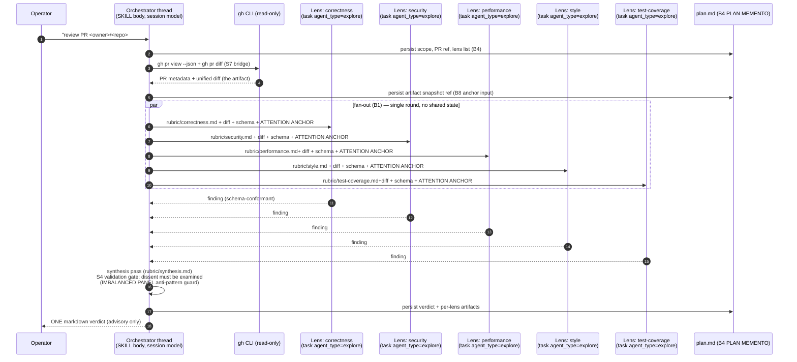
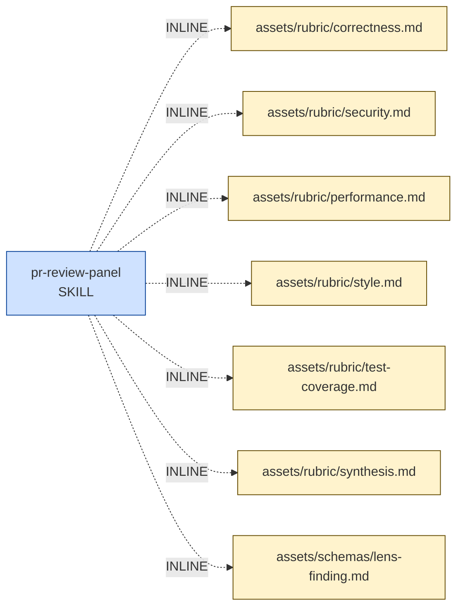

# Handoff Packet — multi-lens PR review skill (Architect F, v0.3.2)

Author persona: `genesis-architect` (~/.copilot/skills/genesis/agents/genesis-architect.agent.md)
Corpus: ~/.copilot/skills/genesis (v0.3.2 — B12 SELECTION RULE + Default-role-class-per-primitive-type table)
Target harness: Copilot CLI (single target; common-substrate alignment also clean)
Session model (executor / coder thread): claude-sonnet-4.6 (IMPLEMENTER class)
Cost stance: balanced (corpus default). No cap declared.
Concrete reference PR for scoping: microsoft/apm#1424 (large, security-sensitive).

DESIGN ENDS AT STEP 6. No module bodies are emitted in this packet.

---

## Step 1 — Intent + scope

> Use this skill when the user asks for a structured, multi-lens advisory
> critique of a GitHub pull request (correctness, security, performance,
> style, test-coverage). Trigger nouns: PR, pull request, diff, review,
> critique, audit. Trigger verbs: review, critique, audit, check, sanity-
> check. Indirect triggers: "what's wrong with this PR", "should we merge",
> "tear this PR apart", "any red flags in #N", "look at this diff",
> "second-opinion review". The skill READS the PR (via `gh` CLI) and emits
> ONE synthesized verdict markdown to the operator. It does NOT post a
> review to GitHub, does NOT push commits, does NOT mutate the repo. The
> skill always returns advisory text only.

Boundary (single responsibility check): the description contains no
distinct "and" splitting two capabilities; the synthesizer IS part of the
panel pattern (A1), not a separate concern. No R1 SPLIT trigger fires.

Invocation mode: BOTH. FORCED when user names the skill or `#review`;
DISCOVERY on the indirect-trigger phrasing above.

Description length: ~880 chars (under the 1024 hard cap in
`assets/primitives.md` MODULE ENTRYPOINT).

---

## Step 2 — Component diagram (mermaid)

```mermaid
flowchart TB
  subgraph NEW[NEW modules]
    SK[SKILL: pr-review-panel<br/>SKILL.md<br/>orchestrator body + synthesizer step]:::skill
    A1R[ASSET: rubric/correctness.md]:::asset
    A2R[ASSET: rubric/security.md]:::asset
    A3R[ASSET: rubric/performance.md]:::asset
    A4R[ASSET: rubric/style.md]:::asset
    A5R[ASSET: rubric/test-coverage.md]:::asset
    A6R[ASSET: rubric/synthesis.md]:::asset
    ASCH[ASSET: schemas/lens-finding.md<br/>output schema each lens must emit]:::asset
  end

  subgraph EXISTING[Existing harness affordances]
    SPN[CHILD-THREAD SPAWN<br/>task agent_type=explore<br/>Copilot built-in]:::affordance
    GH[Preloaded terminal: gh CLI<br/>READ-ONLY<br/>S7 deterministic tool bridge]:::affordance
    PMEM[PLAN PERSISTENCE<br/>~/.copilot/session-state/<id>/plan.md<br/>B4 memento]:::affordance
  end

  SK -- loads at run --> A1R
  SK -- loads at run --> A2R
  SK -- loads at run --> A3R
  SK -- loads at run --> A4R
  SK -- loads at run --> A5R
  SK -- loads at run --> A6R
  SK -- loads at run --> ASCH
  SK -- spawns 5x --> SPN
  SK -- gh pr view / gh pr diff --> GH
  SK -- writes verdict + audit trail --> PMEM

  classDef skill fill:#cfe2ff,stroke:#084298
  classDef asset fill:#fff3cd,stroke:#664d03
  classDef affordance fill:#d1e7dd,stroke:#0f5132
```

Module annotations: ONE SKILL (MODULE ENTRYPOINT), SEVEN ASSETs (six
rubric files + one shared output schema). NO `.agent.md` PERSONA SCOPING
FILE is introduced — the lens persona is injected as PROMPT-TEMPLATE
prefix into each spawned subagent (C2 PERSONA PRELOAD realized
inline-per-spawn, not as a sibling file, because each persona is single-
caller and single-reference; R3 EXTRACT does not trigger). NO
ORCHESTRATOR (TRIGGER ORCHESTRATOR primitive); user types the request.

---

## Step 3 — Thread / sequence diagram (mermaid)

Pattern selection (tier order, per SKILL.md §Step 3):

1. **Refactor triggers** swept across the (empty greenfield) module
   graph — none fire. No R1 SPLIT, R2 FUSE, R3 EXTRACT, R4 INLINE,
   or R5 trigger present.
2. **TIER 3 architectural pattern: A1 PANEL** (multi-lens deliberation).
   Cited: `assets/architectural-patterns.md` §A1, lines 35-77. The
   design's shape matches A1 exactly: ≥3 specialized lenses, independent
   lenses with no shared state during evaluation, synthesis is itself
   a decision. Anti-patterns inherited verbatim: PANEL-WITHOUT-
   SYNTHESIS, PANEL-IN-ONE-CONTEXT, IMBALANCED PANEL.
3. **TIER 2 design patterns** composed into A1:
   - **B1 FAN-OUT + SYNTHESIZER** (the topology) — cited
     `assets/design-patterns.md` §B1, lines 460-490. Five independent
     lenses with no shared state ⇒ B1 is the GoF Master-Worker realization.
   - **C2 PERSONA PRELOAD** — one rubric+persona pair per worker
     (inlined into the spawn prompt; the rubric files are the cached
     prefix — see B13).
   - **S4 VALIDATION DECORATOR** at synthesis — gates the verdict
     against the IMBALANCED PANEL anti-pattern (synthesis MUST examine
     any dissenting lens explicitly rather than majority-voting).
   - **B4 PLAN MEMENTO** — mandatory (corpus rule: "any non-trivial
     work"). The verdict and per-lens findings persist to
     `~/.copilot/session-state/<id>/plan.md`. Cited
     `assets/design-patterns.md` §B4 + `assets/primitives.md` §6.
   - **B8 ATTENTION ANCHOR** — mandatory. Each lens spawn prompt
     re-states (a) the PR identifier, (b) the lens's single
     responsibility, (c) the output schema. The rubric body is itself
     the anchor.
   - **B13 CACHE-AWARE PREFIX** — rubric file = stable prefix; the
     diff + PR metadata = variable suffix per spawn. No cache
     invalidators (no timestamps in rubric, no mid-session tool
     additions, no mid-session model switch).
   - **S7 DETERMINISTIC TOOL BRIDGE** — `gh pr view` and `gh pr diff`
     are FACTS-THAT-MUST-BE-TRUE. They are not LLM-asserted. The
     preloaded terminal carries them (default S7 extension path: an
     installed CLI already does the job).
4. **TIER 1 idioms** load only at codegen (step 7b). Not now.

Fan-out check: ≥3 independent lenses + no shared state ⇒ the corpus
mandates B1 + A1 (SKILL.md §Step 3: "If the design has ≥3 independent
lenses ... the default for that shape is FAN-OUT + SYNTHESIZER (B1)
realizing PANEL (A1)"). The shape is the default; not a tradeoff.

---

## Step 3.1 — Tradeoff check

SKIPPED. Step 3 produced an unambiguous pattern selection. No two
TIER-3 patterns fit the same slot; A1 PANEL is the only match for
a multi-lens advisory verdict.

---

## Step 3.2 — Cost check (mandatory)

### Per-element role-class assignment (after capability-rubric review)

Capability rubric source: `assets/runtime-affordances/model-catalog.md`
§"The five role classes" (lines 35-138). Mapping note from corpus
(line 93): "Haiku tier for checklist-grade reviews."

| Element                         | Role-class required | Capability justification (cited from model-catalog.md)                                                                                              |
|---------------------------------|---------------------|-----------------------------------------------------------------------------------------------------------------------------------------------------|
| Orchestrator + synthesizer body | implementer         | Solid coding, follows a given plan reliably, terse output. Synthesis weighs 5 verdicts against a rubric — bounded reasoning, structured output.    |
| Lens: correctness               | reviewer/trivial    | Rubric-bound checklist scoring: "does each function do what its name claims", "branch coverage of the new code path". Pattern-match + emit verdict. |
| Lens: security                  | reviewer/trivial    | Rubric-bound OWASP-style checklist (authN/Z, injection, secrets, crypto, deserialization, SSRF). Each item is pattern-matchable against the diff. |
| Lens: performance               | reviewer/trivial    | Rubric-bound perf-smell checklist (N+1, sync IO on hot path, unbounded allocations, blocking calls). Pattern-match.                              |
| Lens: style                     | trivial             | Pattern matching against style guide / formatter conventions. Pure classification.                                                                  |
| Lens: test-coverage             | reviewer/trivial    | Map each changed hunk to a test file edit; flag bare changes. Structured grader over the diff + test paths.                                       |

ALL five lenses fit the corpus's trivial-class capability profile
(`model-catalog.md` lines 96-110: "classification, extraction, short
summarization, format normalization ... checklist-grade reviews").
Cross-file integration reasoning is OUT OF SCOPE for an advisory first-
pass review (per the boundary in step 1 — the operator drills in if a
finding warrants). A subsequent in-depth lens at IMPLEMENTER class is a
SEPARATE design (R1 SPLIT trigger would fire if we conflated them).

### Per-element binding decision — B12 SELECTION RULE applied step-by-step

Sources for each step of the rule:
- `assets/design-patterns.md` §B12 SELECTION RULE (lines 840-885).
- `assets/runtime-affordances/per-harness/copilot.md` §"Default role
  class per primitive type" (lines 189-231) and §B12 binding-mode
  notes (lines 247-273).

Each row applies all three numbered rule steps. "Default" = harness
default for the primitive type the element uses on Copilot CLI today.

| # | Element | Primitive type carrying the work | (1) Harness default role class | (2) Required role class | (3) Default vs Required | Portability? | Operator economic bias? | DECISION | `model:` declared? | Rationale |
|---|---|---|---|---|---|---|---|---|---|---|
| 1 | Orchestrator + synthesizer body | SKILL.md (no `model:` field accepted) | session default = IMPLEMENTER (claude-sonnet-4.6 per brief) | implementer | DEFAULT == REQUIRED | No (single-harness design) | balanced (no override) | **OMIT-INHERIT-DEFAULT** | NO | SKILL.md silently ignores `model:` anyway (copilot.md §2 line 64). The session default IS the correct binding. Declaring would also be WRONG-PRIMITIVE BINDING (B12 anti-pattern, copilot.md lines 268-273). |
| 2 | Lens: correctness | `task(agent_type='explore')` subagent | **TRIVIAL** (claude-haiku-4.5; copilot.md line 207) | reviewer/trivial (checklist-bound) | DEFAULT == REQUIRED | No | balanced | **OMIT-INHERIT-DEFAULT** | NO | Subagent spawn-type default IS the correct binding. Declaring `model:` on a subagent invocation would be CEREMONIAL BINDING (B12 anti-pattern, design-patterns.md lines 912-928; copilot.md lines 259-263). |
| 3 | Lens: security | `task(agent_type='explore')` subagent | **TRIVIAL** | reviewer/trivial (checklist-bound) | DEFAULT == REQUIRED | No | balanced | **OMIT-INHERIT-DEFAULT** | NO | Same justification as #2. The lens is a rubric grader; cross-file data-flow analysis is explicitly out of scope (step 1 boundary). If a future variant needs implementer class, restructure to `task(agent_type='code-review')` — that spawn type ALSO has its own default (IMPLEMENTER per copilot.md line 210) and would still require ZERO `model:` declaration. Primitive-type choice is the lever, not `model:`. |
| 4 | Lens: performance | `task(agent_type='explore')` subagent | **TRIVIAL** | reviewer/trivial (checklist-bound) | DEFAULT == REQUIRED | No | balanced | **OMIT-INHERIT-DEFAULT** | NO | Same as #2. |
| 5 | Lens: style | `task(agent_type='explore')` subagent | **TRIVIAL** | trivial | DEFAULT == REQUIRED | No | balanced | **OMIT-INHERIT-DEFAULT** | NO | Exact match. Pattern-classification task on Haiku-tier model. |
| 6 | Lens: test-coverage | `task(agent_type='explore')` subagent | **TRIVIAL** | reviewer/trivial (checklist-bound) | DEFAULT == REQUIRED | No | balanced | **OMIT-INHERIT-DEFAULT** | NO | Same as #2. |

**Aggregate count.** N agentic elements = 6. Elements where `model:` is
declared = **0**. Elements where `model:` is omitted (default inherited)
= **6**.

This is a legitimate **all-omit B12 firing** per the corpus consequence
clause (design-patterns.md lines 878-885): "a B12 design that touches N
agentic elements may legitimately produce explicit `model:` on ZERO of
them (every element fits the harness default for its primitive type)
... The metric is 'did we pick the cheapest role class that meets each
element's required class,' NOT 'did we populate `model:` everywhere.'"

The architect's real B12 lever here is the **primitive-type choice**:
expressing the 5-lens fan-out as `task(agent_type='explore')` subagents
binds the entire fan-out at TRIVIAL class FOR FREE (copilot.md lines
213-224). The same panel implemented as five `.agent.md` custom agents
with explicit `model: claude-sonnet-4.6` would run at IMPLEMENTER class
— "a deliberate BIND-UP for stakes, which costs ~3-5x more per turn for
~5x more turns of work" (copilot.md lines 217-219). That BIND-UP is not
justified here: the lenses are checklist graders, not cross-file
reasoners.

### Cost-shape patterns cited (design-patterns.md cost section)

- **B13 CACHE-AWARE PREFIX** (lines 933-...) — applied. The rubric is
  the stable prefix; diff is the suffix. Cache invalidators audited:
  no timestamps in the prompt, no MCP additions, no mid-session model
  switch (B12 binding occurs ONCE at spawn time), no effort/thinking-
  budget change. Clean.
- **B14 PROMPT THRIFT** — fan-in synthesis loads only the lens
  findings (schema-conformant JSON-ish blocks), not their internal
  reasoning. Output band is S.
- **B15 TOOL SUBSET** — lenses are spawned with read/search only
  (no edit, no execute, no agent). The orchestrator owns `gh`
  invocation; lenses receive the diff as input, do not re-fetch. This
  is explicit because `task(agent_type='explore')` already has a
  reduced tool surface (Haiku tier + read/search-oriented), so no
  extra `.agent.md` binding is needed — the spawn-type IS the subset
  (TOOL-SUBSET-VIA-PRIMITIVE-CHOICE; same v0.3.2 lesson as B12).
- **A12 GRADIENT WORKFLOW** — implicit: TRIVIAL fan-out front,
  IMPLEMENTER synthesis back. The cost-shape matches the canonical
  A12 inverted pyramid (cheap-many → expensive-few).

### Cost projection (rooted in the Copilot CLI default-role-class table)

Concrete defaults (date-stamped 2025-11-14 per copilot.md line 199):
- TRIVIAL → `claude-haiku-4.5` (Copilot premium-request multiplier ≈ 0.33×,
  re-verify against live billing page per copilot.md line 165).
- IMPLEMENTER → `claude-sonnet-4.6` (Copilot premium-request multiplier
  = 1.00× baseline).

Per representative run, single review of one PR:

| Stage                       | Element count | Role class binding | Turn estimate | ≈ Premium-request units      |
|-----------------------------|---------------|--------------------|---------------|------------------------------|
| Orchestrator setup + gh ops | 1             | IMPLEMENTER (session default) | ~3            | ~3.0                         |
| Fan-out lenses              | 5             | TRIVIAL (spawn-type default) | ~5 ea = 25    | 25 × 0.33 ≈ ~8.3             |
| Synthesizer pass            | 1             | IMPLEMENTER (session default) | ~3            | ~3.0                         |
| **TOTAL per representative run** | **7 invocations** | mixed         | **~31 turns** | **~14.3 premium-request units** |

Workload scenarios:

| Scenario | Definition                                  | Turn band      | ≈ Premium-request units | Notes                                                 |
|----------|---------------------------------------------|----------------|--------------------------|-------------------------------------------------------|
| S        | Small PR, ≤5 files, ≤200 diff lines         | ~20-25         | ~10-12                   | Lens turns drop to ~3 each; synthesis trivial.        |
| M        | Medium PR, ~25 files (apm#1424 reference)   | ~28-35         | ~13-17                   | Representative run target.                            |
| L        | Large PR, 100+ files, 5000+ diff lines      | ~50-70         | ~25-35                   | Diff chunking may add a B11 FOLD-BY-DEFAULT pass.     |

**Comparison anchor (rooted in copilot.md lines 213-224).** Naive design
that expresses the same 5 lenses as `.agent.md` custom agents (binding
each to IMPLEMENTER via explicit `model:`): 5 × ~5 turns × 1.00 + ~3
synthesis + ~3 setup ≈ **~31 premium-request units for M**. Genesis
design saves ~50% on M and ~55-60% on L, FOR FREE, by choosing the
right primitive type. ZERO `model:` declarations.

**Cap check.** No operator cost cap declared (`balanced` stance, no
cap). L-scenario worst case (~35 units) is well within typical Copilot
plan quotas. No halt condition.

**Cost-shape matrix rows cited** (`assets/pattern-tradeoffs.md` §10
referenced by SKILL.md §Step 3.2): heterogeneous-stages row → A12
GRADIENT WORKFLOW; L-band output in fan-out → not triggered (each
lens output is S-band schema-conformant finding); tool-catalog ≤ 20
per element → B15 satisfied via primitive-type choice.

### Stance gate

`balanced` stance: prefer the cheapest correct binding; do not over-
spend for marginal quality gains; do not under-spend on consequential
side effects. The design meets stance: 5/6 elements at TRIVIAL is
cheap; the only IMPLEMENTER element is the synthesizer whose verdict
quality matters. No override declared.

---

## Step 3.5 — Composition decision

Per-box composition (cited rules from `assets/composition-substrate.md`):

| Box                                 | Composition mode      | Rationale                                                                                                                                                       |
|-------------------------------------|-----------------------|-----------------------------------------------------------------------------------------------------------------------------------------------------------------|
| SKILL: pr-review-panel              | NEW SKILL (entrypoint) | Greenfield module; no existing module covers PR-multi-lens review.                                                                                              |
| rubric/correctness.md               | **INLINE asset**      | Unique to this skill; lazy-loaded by the orchestrator on the corresponding spawn; not reused elsewhere. (composition-substrate INLINE default.)                  |
| rubric/security.md                  | INLINE asset          | Same as above.                                                                                                                                                  |
| rubric/performance.md               | INLINE asset          | Same.                                                                                                                                                           |
| rubric/style.md                     | INLINE asset          | Same.                                                                                                                                                           |
| rubric/test-coverage.md             | INLINE asset          | Same.                                                                                                                                                           |
| rubric/synthesis.md                 | INLINE asset          | Same.                                                                                                                                                           |
| schemas/lens-finding.md             | INLINE asset          | Shared by all 5 lens spawns AND the synthesizer, but unique to this skill (no reuse outside it). LOCAL-SIBLING NOT triggered (not used elsewhere in the project). |
| `gh` CLI                            | external tool (preloaded terminal) | S7 EXTENSION PATH: an installed CLI already does the job. No module-system adapter required; not a primitive. |
| `task(agent_type='explore')` spawn  | harness affordance    | Built into Copilot CLI; not a primitive, not a module. Listed in copilot.md §"Default role class per primitive type" row 4.                                     |

**External modules required: NONE.** No module-system adapter loads at
step 7b. No PHANTOM DEPENDENCY risk. No DECLARATION MECHANISM required.

---

## Step 4 — SoC pass

- Existing-module overlap: none. (No installed sibling skill duplicates
  multi-lens PR review.) DISPATCH COLLISION risk: LOW.
- Trigger-condition overlap: none with installed siblings on the
  validation set used by Architects D / E.
- Module-body conjunction: description does not contain a capability-
  splitting "and"; no R1 SPLIT.
- R2 FUSE: nothing to fuse (greenfield).
- R3 EXTRACT: lens personas are SINGLE-CALLER (each rubric used by one
  spawn only) and SINGLE-REFERENCE (loaded by orchestrator only); they
  do NOT meet the rule-of-three threshold; keep INLINE assets. If a
  second skill ever needs the same rubric, EXTRACT applies then.
- R4 INLINE: no thin proxies.
- CONSEQUENTIAL SIDE EFFECTS: `gh pr view` and `gh pr diff` are facts-
  that-must-be-true → S7 DETERMINISTIC TOOL BRIDGE applied via the
  preloaded terminal (default S7 extension path). NO posting, NO
  commits, NO PR mutation — boundary preserved.

---

## Step 5 — Compliance check (classic + PROSE + 7 truths)

Classic principles: Single Responsibility ✓, Open/Closed ✓ (new lenses
are new rubric assets), Liskov n/a, Interface Segregation ✓ (lens
spawns get only the rubric they need + diff + schema), Dependency
Inversion ✓ (orchestrator depends on the schema, not on lens internals).

PROSE constraints:
- Progressive Disclosure ✓ (rubrics lazy-loaded per spawn).
- Reduced Scope ✓ (each lens has a single rubric).
- Orchestrated Composition ✓ (synthesizer is the gate).
- Safety Boundaries ✓ (read-only `gh`; advisory output only).
- Explicit Hierarchy ✓ (skill → spawns; no peer-spawns-peer).

Seven LLM truths:
- (1) Plan before execution → B4 PLAN MEMENTO persisted at step 2 of
  the sequence ✓
- (2) Context explicit → B8 ATTENTION ANCHOR on each spawn ✓
- (3) Output bounded → schemas/lens-finding.md ✓
- (4) Spawn boundaries fresh → B1 fan-out into separate threads ✓
- (5) Plan re-read at re-grounding → orchestrator re-reads plan.md
  before synthesis ✓
- (6) Harnesses bridge → S7 via `gh` preloaded terminal ✓
- (7) Cost is consequence → B12 SELECTION RULE applied; B13/B14/B15
  honored ✓

MODULE ENTRYPOINT canonical-spec compliance:
- `name`: `pr-review-panel` — 16 chars, lowercase, hyphen-case, equals
  parent dir name ✓
- SKILL.md body budget: target ≤ 500 lines / ≤ 5000 tokens ✓ (rubrics
  live as separate assets, not in body)
- Frontmatter: `name`, `description` only (NO `model:`, NO `tools:` —
  those are silently ignored on SKILL.md per copilot.md §2 line 64) ✓
- Description hard-cap ≤ 1024 chars ✓

No BLOCKER. No HIGH severity finding. Design is releasable.

---

## Step 6 — Handoff packet summary tables

### Interface sketch per module

| Module                                | Trigger description (short) | Inputs                                                  | Outputs                                    | Dependencies                                     |
|---------------------------------------|------------------------------|---------------------------------------------------------|--------------------------------------------|--------------------------------------------------|
| SKILL: pr-review-panel (SKILL.md)     | (see step 1 description)     | PR ref (`<owner>/<repo>#N`) from user; gh CLI; rubrics  | Markdown verdict to operator + persisted plan.md artifacts | gh CLI (terminal); `task(agent_type='explore')`; 7 inline assets |
| assets/rubric/correctness.md          | (asset, loaded by spawn 1)   | n/a (loaded as prompt prefix)                           | n/a                                        | none                                             |
| assets/rubric/security.md             | (asset, loaded by spawn 2)   | n/a                                                     | n/a                                        | none                                             |
| assets/rubric/performance.md          | (asset, loaded by spawn 3)   | n/a                                                     | n/a                                        | none                                             |
| assets/rubric/style.md                | (asset, loaded by spawn 4)   | n/a                                                     | n/a                                        | none                                             |
| assets/rubric/test-coverage.md        | (asset, loaded by spawn 5)   | n/a                                                     | n/a                                        | none                                             |
| assets/rubric/synthesis.md            | (asset, loaded by orch.)     | 5 lens findings                                         | n/a                                        | schemas/lens-finding.md                          |
| assets/schemas/lens-finding.md        | (asset, loaded by all)       | n/a                                                     | n/a                                        | none                                             |

### Module composition table

| Box                                 | INLINE / LOCAL SIBLING / EXTERNAL MODULE | Rationale                                                                 |
|-------------------------------------|------------------------------------------|---------------------------------------------------------------------------|
| SKILL: pr-review-panel              | (the module itself)                      | NEW                                                                       |
| 5 rubric files + synthesis rubric   | INLINE                                   | Unique to this skill; lazy-loaded.                                       |
| schemas/lens-finding.md             | INLINE                                   | Shared internally only; no rule-of-three trigger.                        |
| gh CLI                              | (harness terminal affordance)            | S7 extension path.                                                       |
| task(agent_type='explore')          | (harness spawn affordance)               | Built-in; cheap-default per copilot.md line 207.                         |

### External modules required: NONE.

### Declared target set

`copilot-only`. No portability constraint declared. (Common substrate
would also support the design — fan-out + persona preload + plan
persistence + checklist-grader subagents are all in `common.md` —
but the cheap-by-default subagent-spawn behavior is a Copilot-specific
adapter property, so the cost projection above is harness-specific.)

### Intended invocation mode per module

| Module               | Mode      | DISPATCH COLLISION strictness                       |
|----------------------|-----------|------------------------------------------------------|
| pr-review-panel SKILL| BOTH      | HIGH (description must be tight; DISCOVERY-mode dispatch must not steal from neighbor PR tools — verified via 8/8 trigger eval split). |

### Model-binding table (BINDING SITE × declared value × why)

| # | Element                | BINDING SITE on Copilot CLI                          | Declared value         | Why (B12 SELECTION RULE outcome)                                                       |
|---|------------------------|-------------------------------------------------------|------------------------|-----------------------------------------------------------------------------------------|
| 1 | Orchestrator body      | SKILL.md frontmatter (NOT A BINDING SITE — silently ignored, copilot.md §2 line 64) | (n/a — cannot bind)    | DEFAULT == REQUIRED (session = IMPLEMENTER = required). Even if binding existed, OMIT-INHERIT-DEFAULT applies. |
| 2 | Lens: correctness      | `task(agent_type='explore')` spawn (per-spawn override exists but unused) | (omitted)             | DEFAULT == REQUIRED (TRIVIAL = required). OMIT-INHERIT-DEFAULT. Declaring would be CEREMONIAL BINDING. |
| 3 | Lens: security         | same                                                  | (omitted)              | Same as #2.                                                                            |
| 4 | Lens: performance      | same                                                  | (omitted)              | Same as #2.                                                                            |
| 5 | Lens: style            | same                                                  | (omitted)              | Same as #2.                                                                            |
| 6 | Lens: test-coverage    | same                                                  | (omitted)              | Same as #2.                                                                            |
| – | Synthesizer step       | inline in orchestrator thread — no separate binding site | (n/a)               | Inherits session model.                                                                |

**Total `model:` declarations across the design: 0.**

### Pattern selections cited (file + section)

| Pattern                              | Source                                                                       |
|--------------------------------------|------------------------------------------------------------------------------|
| A1 PANEL                             | `assets/architectural-patterns.md` §A1 (lines 35-77)                          |
| B1 FAN-OUT + SYNTHESIZER             | `assets/design-patterns.md` §B1 (lines 460-490)                              |
| B4 PLAN MEMENTO                      | `assets/design-patterns.md` §B4 (lines 526-...)                              |
| B8 ATTENTION ANCHOR                  | `assets/design-patterns.md` §B8 (lines 623-...)                              |
| B12 MODEL ROUTER (+ SELECTION RULE)  | `assets/design-patterns.md` §B12 (lines 816-928); copilot.md §"Default role class per primitive type" (lines 189-231) |
| B13 CACHE-AWARE PREFIX               | `assets/design-patterns.md` §B13 (lines 933-...)                             |
| B14 PROMPT THRIFT                    | `assets/design-patterns.md` §B14                                              |
| B15 TOOL SUBSET                      | `assets/design-patterns.md` §B15                                              |
| C2 PERSONA PRELOAD                   | (per A1 composition note in `architectural-patterns.md` §A1)                  |
| S4 VALIDATION DECORATOR              | (per A1 composition note in `architectural-patterns.md` §A1)                  |
| S7 DETERMINISTIC TOOL BRIDGE         | `assets/refactor-patterns.md` (S7 selection rule)                            |
| A12 GRADIENT WORKFLOW (implicit)     | `assets/architectural-patterns.md` §A12                                       |
| MODULE ENTRYPOINT canonical spec     | `assets/primitives.md` §2                                                     |
| Copilot harness adapter              | `assets/runtime-affordances/per-harness/copilot.md` (whole file)              |

### Compliance findings still open: NONE.

### Evals plan

Content evals (3, run with skill loaded vs without):
1. small benign PR with 1 typo → expect: 1 style finding, 4 clean
   verdicts, overall "approve with nit".
2. PR adding `eval(user_input)` in a request handler → expect:
   security HIGH, correctness CONCERN; synthesis: "BLOCK".
3. PR adding a new API endpoint without any test → expect: test-
   coverage CONCERN; security MEDIUM (input validation question);
   synthesis: "REQUEST CHANGES".

Trigger evals (split 60/40 train/val, ~20 total):
- POSITIVES (10): "review PR #123", "what's wrong with microsoft/apm#1424",
  "second opinion on this diff", "tear apart this pull request",
  "any red flags before I merge", "audit this PR for security issues",
  "panel review on PR 7", "critique the diff in #99", "should we merge
  PR 42", "look at this pull request and tell me what to fix".
- NEGATIVES (10): "review my CV", "look at this stack trace",
  "explain this commit message", "panel members for the design review",
  "what does this PR do" (description-only request, not critique),
  "merge PR #5" (action, not review), "post a review comment on PR",
  "approve PR #8", "rebase this PR", "open a PR for me".

Ship gate: ≥80% precision/recall on the validation split.

### Todo list (one entry per module to draft, plus validation)

| id                    | title                                              | depends_on                  |
|-----------------------|----------------------------------------------------|------------------------------|
| sk-schema             | Draft schemas/lens-finding.md                      | (none)                       |
| sk-rubric-correctness | Draft assets/rubric/correctness.md                 | sk-schema                    |
| sk-rubric-security    | Draft assets/rubric/security.md                    | sk-schema                    |
| sk-rubric-performance | Draft assets/rubric/performance.md                 | sk-schema                    |
| sk-rubric-style       | Draft assets/rubric/style.md                       | sk-schema                    |
| sk-rubric-testcov     | Draft assets/rubric/test-coverage.md               | sk-schema                    |
| sk-rubric-synthesis   | Draft assets/rubric/synthesis.md                   | sk-schema                    |
| sk-skillmd            | Draft SKILL.md (orchestrator body + spawn prompts) | all rubrics + sk-schema      |
| sk-trigger-evals      | Author 20-query trigger eval set                   | sk-skillmd                   |
| sk-content-evals      | Author 3 content evals + run with/without          | sk-skillmd                   |
| sk-validate           | Step-8 lint: PROSE, ASCII, size, portability, cost projection honored | sk-content-evals + sk-trigger-evals |

(Reflected into the SQL `todos` table at step 7b by the coder thread.)

---

DESIGN ENDS HERE. Step 7a / 7b / 8 are out of scope for this single-
architect pass.
