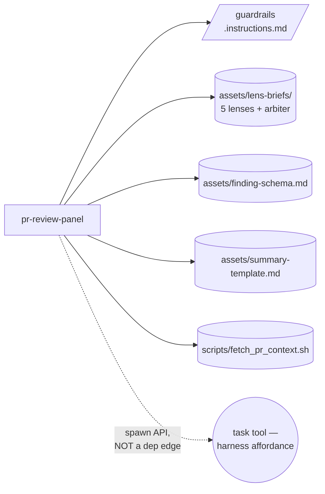

# Handoff packet — `pr-review-panel` (Architect G, v0.3.2.1)

Target harness: **Copilot CLI**. Reference PR: microsoft/apm#1424.
Cost stance: **balanced** (corpus default). Cap: not declared.
Operator note: this is the second iteration of the v0.3.2 PR-review
design. The brief instructs incorporation of the v0.3.2.1 corpus
update — specifically the new HEAVY ADJUDICATOR anti-pattern
(`assets/architectural-patterns.md` §A12, lines 940-954) — to fix
Cell F's $3.95 / 15-turn synth-heavy. The orchestrator that loads
this skill is pinned to `claude-sonnet-4.6` (reviewer class).

---

## Step 1 — intent + scope

**Capability paragraph.** Run a 5-lens advisory review (correctness,
security, performance, style, test-coverage) on an arbitrary GitHub
PR identified by `owner/repo#N`. Fetch the PR via the `gh` CLI
(read-only), fan out one lens persona per axis as a separate
subagent reading the same diff slice, aggregate the per-lens finding
files inline in the orchestrator, and emit ONE structured markdown
review-summary artifact to the session's plan store. Boundary: the
skill NEVER posts to GitHub, NEVER approves, NEVER merges, NEVER
edits code, NEVER auto-runs CI; it is advisory output only,
consumed by a human or by a downstream skill that owns the side
effect.

**SRP / R1 check.** One dispatch surface (review-a-PR), one verb,
one noun. The 5 lenses are internal decomposition (B1 FAN-OUT +
SYNTHESIZER realizing A1 PANEL), not 5 separate skills. R1 SPLIT
does NOT fire at the entrypoint (no DESCRIPTION CONJUNCTION,
no FRAGMENT CALLERS — every caller wants all 5 axes). R3 EXTRACT
fires at the lens-content level (each lens body in its own asset).

**Dispatch description (frontmatter `description`, <=1024 chars,
imperative, intent-first, indirect triggers named, DISCOVERY
invocation):**

> Use this skill to perform an advisory multi-lens review of a
> GitHub pull request, producing a single structured findings
> artifact across correctness, security, performance, style, and
> test-coverage axes. Activate when the user asks to "review this
> PR", "audit a pull request", "look at PR #N", "check the diff
> on owner/repo#N", "do a multi-lens code review", or names any
> single axis ("security review of the PR", "test coverage on
> this change") on a GitHub PR. Reads the PR via the gh CLI
> (read-only) and writes only to the session plan store. This
> skill NEVER posts review comments, NEVER approves or merges,
> NEVER edits source code, NEVER triggers CI. Do not use for:
> fixing the issues it surfaces, drafting PR descriptions, or
> any side-effecting Git or GitHub action.

Length ~870 chars.

**Cost stance.** `balanced` — apply B12 SELECTION RULE strictly
(omit `model:` when harness default = required), apply A12
GRADIENT WORKFLOW only where the gradient genuinely fires, apply
the v0.3.2.1 HEAVY ADJUDICATOR cure (do NOT default the back
synthesizer to planner class).

---

## Step 2 — component diagram

TIER-3 selection: **A1 PANEL** (5 independent lenses, no shared
state — lens-count gate fires at 5) overlaid with **A12 GRADIENT
WORKFLOW** (cost-shape: front trivially-served-by-orchestrator,
middle TRIVIAL-class lens fan-out, back REVIEWER-class inline
synthesis, planner-class escalation only on a narrow trigger).
**A9 SUPERVISED EXECUTION** wraps the `gh` reads (S7 DETERMINISTIC
TOOL BRIDGE; PR state = FACT THAT MUST BE TRUE).

A6 EVENT-DRIVEN is NOT selected (skill is invoked by user prompt,
not by a webhook trigger). A8 ALIGNMENT LOOP is NOT selected
(single-shot advisory output, no iterative goal drift). A11
RECONCILIATION LOOP is NOT selected (one PR, terminal state on
artifact emission, no queue).

```mermaid
flowchart LR
    USER{{user prompt:<br/>"review owner/repo#N"}}:::new
    SKILL[pr-review-panel<br/>SKILL.md]:::new
    GUARD[/pr-review-guardrails<br/>.instructions.md/]:::new

    L1((correctness lens<br/>task explore)):::new
    L2((security lens<br/>task explore)):::new
    L3((performance lens<br/>task explore)):::new
    L4((style lens<br/>task explore)):::new
    L5((test-coverage lens<br/>task explore)):::new

    ESC((escalation arbiter<br/>task general-purpose)):::new

    A1[(asset: finding-schema.md)]:::new
    A2[(asset: lens-briefs/<br/>correctness.md security.md<br/>performance.md style.md<br/>test-coverage.md)]:::new
    A3[(asset: summary-template.md)]:::new
    SC1[(script: fetch_pr_context.sh)]:::new

    USER --> SKILL
    SKILL --> GUARD
    SKILL --> SC1
    SKILL --> A1
    SKILL --> A2
    SKILL --> A3
    SKILL --> L1
    SKILL --> L2
    SKILL --> L3
    SKILL --> L4
    SKILL --> L5
    SKILL -.->|narrow trigger only| ESC

    classDef new stroke-dasharray: 5 5
```

Node shapes follow `mermaid-conventions.md`: `[..]` SKILL,
`[/../]` RULE, `((..))` PERSONA (subagent), `[(..)]` ASSET,
`{{..}}` external input. Dotted edge to `ESC` marks the
narrow-trigger conditional dispatch.

All boxes are NEW. The orchestrator body is the SKILL.md itself;
no separate `.agent.md` exists — see Step 3.5 rationale.

---

## Step 3 — thread / sequence diagram

Tier order:

1. **R-tier refactor triggers.** R3 EXTRACT applied at lens-brief
   content (one asset per lens). R1 SPLIT NOT applied at entrypoint
   (single dispatch). R5 COST PRUNE applied at synthesizer slot
   (THIS is the v0.3.2.1 change — Cell F flat-promoted the
   synthesizer to planner class; we prune that).
2. **TIER 3.** A1 PANEL + A12 GRADIENT WORKFLOW + A9 SUPERVISED
   EXECUTION (for `gh` reads).
3. **TIER 2.** B1 FAN-OUT + SYNTHESIZER, B4 PLAN MEMENTO,
   B8 ATTENTION ANCHOR, B12 MODEL ROUTER (applied as SELECTION
   RULE — see §B12 decision table below), B13 CACHE-AWARE PREFIX,
   S4 VALIDATION DECORATOR (the disagreement detector), S6 RULE
   BRIDGE (guardrail rule), S7 DETERMINISTIC TOOL BRIDGE (`gh`
   reads), C2 PERSONA PRELOAD (per-lens briefs), C3 THREAD SPAWN
   (per-lens fresh context), C6 EXTERNAL CORPUS GROUNDING (lens
   briefs cite OWASP / perf rubric / language style guide).
4. **TIER 1.** Deferred to step 7b.

```mermaid
sequenceDiagram
    participant U as user
    participant O as orchestrator<br/>(SKILL session<br/>sonnet-4.6, reviewer)
    participant T as gh CLI (read-only)
    participant L1 as correctness lens<br/>(task explore, haiku)
    participant L2 as security lens<br/>(task explore, haiku)
    participant L3 as performance lens<br/>(task explore, haiku)
    participant L4 as style lens<br/>(task explore, haiku)
    participant L5 as test-coverage lens<br/>(task explore, haiku)
    participant E as escalation arbiter<br/>(task general-purpose<br/>opus-4.7, RARE)

    U->>O: review owner/repo#N
    Note over O: B4 write plan + B8 anchor GOAL<br/>(advisory only; no GH writes)
    O->>T: gh pr view N --json ... ; gh pr diff N
    T-->>O: PR metadata + diff (FACT)
    Note over O: S4 schema gate — non-empty diff, JSON parses, else abort
    par fan-out (B1, no shared state)
        O->>L1: spawn(brief=correctness, diff, schema)
        O->>L2: spawn(brief=security, diff, schema)
        O->>L3: spawn(brief=performance, diff, schema)
        O->>L4: spawn(brief=style, diff, schema)
        O->>L5: spawn(brief=test-coverage, diff, schema)
    end
    L1-->>O: findings_correctness.json
    L2-->>O: findings_security.json
    L3-->>O: findings_performance.json
    L4-->>O: findings_style.json
    L5-->>O: findings_test_coverage.json

    Note over O: S4 INLINE disagreement detector<br/>(trivial-class capability —<br/>orchestrator reads 5 short<br/>JSONs, compares severities;<br/>NO dispatched agent here)

    alt agreement OR resolvable disagreement (~97% of runs)
        Note over O: B8 re-anchor GOAL<br/>INLINE first-pass synthesis<br/>(reviewer class on session model;<br/>OMIT model — DEFAULT == REQUIRED)
        O->>O: synthesize summary markdown
    else NARROW TRIGGER fires (~3% of runs):<br/>>=2 lenses surface CONTRADICTORY<br/>BLOCKER-severity claims AND<br/>first-pass adjudication cannot resolve
        Note over O: B12 BIND-UP for STAKES<br/>(documented; the only explicit<br/>model: declaration in the design)
        O->>E: spawn(brief=arbiter,<br/>all 5 findings, contested items)
        E-->>O: adjudicated summary
    end

    O->>O: write review-summary.md to plan store (single-writer)
    Note over O: NO gh write call. NO comment posted.<br/>Artifact handed back to user / downstream skill.
```

The single-writer is the orchestrator; no lens writes the summary.
S7 fires only on the `gh` reads. Synthesis is INLINE on the
orchestrator's session model unless the narrow trigger fires.

---

## Step 3.1 — tradeoff check

Two slots have alternatives in tension; both must be cited per
`assets/pattern-tradeoffs.md`.

**Tradeoff A — disagreement detector substrate.**
Candidates: (i) inline S4 in the orchestrator, (ii) dispatched
`task(agent_type='explore')` detector subagent (à la
example 06).
Matrix #2 (Gate types) and matrix #10 row "Single-turn
classification or extraction / Per-call rate / Wrong role class /
B12 MODEL ROUTER (route to trivial)".
**Selected: (i) inline.** Reading 5 short JSON files and comparing
severity fields is trivial-class capability the orchestrator's
session model already possesses for free. Dispatching a separate
subagent for it adds a spawn turn (and its prefix bytes) for
zero capability gain — the strictly-cheaper option per matrix #10
is "route to trivial OR perform inline if the host context can do
it for free". Inline wins because the orchestrator is already
holding the 5 findings in context after fan-in.

**Tradeoff B — synthesis style at the back stage.**
Candidates: DISSENT-WEIGHTED reviewer-class inline first-pass
(default), vs PLANNER-CLASS heavy synthesizer on every run
(Cell F's choice), vs CONSENSUS gate, vs MAJORITY.
Matrix #5 (Synthesis style) AND matrix #10 row "Quality-uniform
graph / per-call rate × graph size / Uniform planner class /
A12 GRADIENT WORKFLOW + R5 prune" AND **A12 §HEAVY ADJUDICATOR
anti-pattern (lines 940-954)**.
**Selected: DISSENT-WEIGHTED reviewer-class first-pass, with a
NARROW conditional escalation to planner-class.** Rationale: the
synthesizer adjudicates among PRE-EXISTING analyses (downgrades a
severity, dedupes findings, reconciles a single disagreement) —
the corpus classifies that as REVIEWER-class capability, not
planner. Cell F's measured cost-without-benefit ($3.95 / 15 turns
of Opus to adjudicate one TOCTOU disagreement and downgrade three
findings) IS the canonical HEAVY ADJUDICATOR symptom. Cure: leave
the synthesizer at reviewer class; promote to planner-class only
when the S4 gate detects a HIGH-stakes pattern (see narrow
trigger below).

---

## Step 3.2 — cost check (mandatory)

Per-module qualitative bands, applying the SELECTION RULE
(`design-patterns.md` §B12) against
`runtime-affordances/per-harness/copilot.md` section 9
(default-role-class-per-primitive-type table):

| Module                            | Required class | Primitive carrier                     | Harness default | Direction        | `model:` decision    |
|-----------------------------------|----------------|----------------------------------------|-----------------|------------------|----------------------|
| Orchestrator (SKILL session)      | reviewer       | SKILL.md (no model field accepted)     | session default = sonnet-4.6 (pinned by brief) | DEFAULT == REQUIRED | **OMIT** (and SKILL.md cannot carry one anyway) |
| Correctness lens                  | trivial        | `task(agent_type='explore')` subagent  | TRIVIAL (haiku-4.5) | DEFAULT == REQUIRED | **OMIT** |
| Security lens                     | trivial        | `task(agent_type='explore')` subagent  | TRIVIAL (haiku-4.5) | DEFAULT == REQUIRED | **OMIT** |
| Performance lens                  | trivial        | `task(agent_type='explore')` subagent  | TRIVIAL (haiku-4.5) | DEFAULT == REQUIRED | **OMIT** |
| Style lens                        | trivial        | `task(agent_type='explore')` subagent  | TRIVIAL (haiku-4.5) | DEFAULT == REQUIRED | **OMIT** |
| Test-coverage lens                | trivial        | `task(agent_type='explore')` subagent  | TRIVIAL (haiku-4.5) | DEFAULT == REQUIRED | **OMIT** |
| Disagreement detector             | trivial        | INLINE in orchestrator (no spawn)      | n/a — folds into session | n/a | **n/a** (no dispatch) |
| First-pass synthesizer            | reviewer       | INLINE in orchestrator (no spawn) by default; OPTIONAL `task(agent_type='general-purpose')` if context budget pressure forces fresh window | IMPLEMENTER (sonnet-4.6) if dispatched; session reviewer if inline | DEFAULT == REQUIRED on both routes | **OMIT** |
| Escalation arbiter (RARE)         | planner        | `task(agent_type='general-purpose')` subagent | IMPLEMENTER (sonnet-4.6) | **DEFAULT < REQUIRED → BIND-UP for STAKES** | **DECLARE `model: claude-opus-4.7`** |

**Model-declaration count: 1 of 9 elements.** This is the only
explicit `model:` in the design. The other 8 elements either
cannot carry the field (SKILL.md primitive type), inherit the
correct trivial-class default from `task(agent_type='explore')`,
or inherit the correct reviewer-class default from the orchestrator
session. CEREMONIAL BINDING (B12 anti-pattern, lines 915-929) is
avoided. Cell E's 7-of-8 ceremonial declarations are not repeated.

**Prefix shape (B13 audit).** Lens briefs are loaded as static
assets; finding-schema.md and summary-template.md are static; PR
diff is the per-run variable suffix. No timestamps, no growing
tool catalogue, no mid-session model switch (the rare escalation
arbiter is a NEW spawn, not a mid-session switch in the same
thread — cache partition is isolated). B13 satisfied.

**Output volume.** Lens findings are STRUCTURED JSON (one
findings object per lens), capped ~500-1500 tokens each. The
synthesis summary is markdown, ~1-3K tokens. R5 COST PRUNE
trigger "long synthesis output" does NOT fire.

**Cost-shape matrix rows cited** (`pattern-tradeoffs.md`
section 10):
- "Fan-out across N similar items / Output bytes × N / Heavy
  role class on workers / A12 GRADIENT WORKFLOW (mid = impl.)"
  — applied as **bulk lenses = TRIVIAL by harness default**.
- "Quality-uniform graph, mostly routine modules / Per-call
  rate × graph size / Uniform planner class / A12 GRADIENT
  WORKFLOW + R5 prune" — applied as **R5 prune of Cell F's
  planner-class synthesizer**.

**Quantitative range (L scenario, full PR review, ~3-5K-token
diff, balanced stance), Copilot CLI underlying-provider rates
(verified 2025-11-14 against `per-harness/copilot.md` §9):**

Per-run input/output token bands:
- Orchestrator session (sonnet-4.6, reviewer): ~6K input
  (skill body + assets + diff + 5 finding files), ~2K output
  (synthesis summary).
- 5 × explore lens subagents (haiku-4.5): each ~3K input
  (lens brief + diff slice + schema), ~600 output (one
  findings JSON).
- Disagreement detector: 0 incremental tokens (folded into
  orchestrator's existing turn).
- Escalation arbiter (RARE): ~5K input, ~1K output IF fired.

Per-run dollar bands (underlying anthropic rates; Copilot
premium-request units are an opaque billing layer over these):
- Sonnet 4.6 ≈ $3/Mtok input, $15/Mtok output.
- Haiku 4.5 ≈ $0.80/Mtok input, $4/Mtok output.
- Opus 4.7 ≈ $15/Mtok input, $75/Mtok output.

| Scenario                                        | Approx total                    |
|-------------------------------------------------|----------------------------------|
| S — trivial PR (~500-tok diff), no escalation   | ~$0.03-0.05                      |
| M — known module PR (~2K-tok diff), no escalation | ~$0.06-0.10                    |
| L — large PR (~5K-tok diff), no escalation       | ~$0.08-0.14                     |
| Rare escalation path (~3% of L runs)             | +$0.55-0.85 (Opus arbiter)      |
| L blended (97% no-escalation, 3% escalation)     | ~$0.10-0.17                     |

**Comparison to Cell F (v0.3.2):**
- Cell F: 5 haiku lenses (~$0.025) + Opus synthesizer on every
  run (~$3.95 measured) = ~$4.00 per run.
- Cell G (this design): ~$0.10-0.17 per L run blended.
- **Expected reduction: ~25-40× on the L scenario, ~50-70× on
  the dominant no-escalation path.**

Stance/cap check: `balanced`, no cap declared. Design honors
stance — every BIND-UP is justified by a narrow stakes trigger,
no ceremonial bindings.

---

## Step 3.5 — composition decision

Per-box composition (against `composition-substrate.md`):

| Box                                | Mode          | Rationale |
|------------------------------------|---------------|-----------|
| `pr-review-panel` (SKILL.md)       | this module   | The unit being designed. |
| `pr-review-guardrails` (.instructions.md) | LOCAL SIBLING | Tiny scope rule ("never call `gh pr review|merge|edit`"); only used by this skill; not rule-of-three. S6 RULE BRIDGE. |
| 5 lens briefs (assets)             | INLINE asset (own files under `assets/lens-briefs/`) | Content unique to this skill; each lens body is short prose loaded by the matching subagent prompt. R3 EXTRACT applied. |
| `finding-schema.md` (asset)        | INLINE asset  | The contract every lens emits against; lives with the skill. |
| `summary-template.md` (asset)      | INLINE asset  | Output skeleton for the inline synthesis step. |
| `fetch_pr_context.sh` (script)     | INLINE script (`scripts/`) | Thin wrapper around `gh pr view --json ... && gh pr diff` so the LLM never composes the gh invocation itself (S7). Non-interactive, version-checked, --help-documented. |
| Escalation arbiter                 | INLINE asset (`assets/lens-briefs/arbiter.md`) | Loaded into the rare `task(agent_type='general-purpose')` spawn only when the narrow trigger fires. |
| Disagreement detector              | INLINE LOGIC in SKILL.md body | Trivial-class read-and-compare on 5 short JSONs — no separate primitive warranted (matrix-cited above). |

**External modules required: NONE.** No `apm` manifest dep, no
companion-module recommendation. The skill is self-contained.
Step 7b need not load a module-system adapter; step 8 PHANTOM
DEPENDENCY validation is trivially satisfied.



---

## Step 4 — SoC pass

- No existing sibling skill in scope claims "review a PR" with this
  shape. No DISPATCH COLLISION.
- No overlapping trigger surface — the description names ONE
  invocation pattern.
- R1 SPLIT triggers checked: NONE fire. Description has no
  conjunction at dispatch level. No fragment callers.
- R2 FUSE: no candidate siblings.
- R3 EXTRACT: applied at lens-brief level (each lens body is its
  own asset file).
- R4 INLINE: no thin proxy primitives.
- S7 DETERMINISTIC TOOL BRIDGE: applied at the only FACT-THAT-MUST-
  BE-TRUE step (`gh pr view`/`gh pr diff` → script-mediated, not
  LLM-asserted). NO CONSEQUENTIAL SIDE EFFECT in the design (no
  comment post, no merge); A9 SUPERVISED EXECUTION wraps the reads
  to keep the contract honest.

---

## Step 5 — compliance check

- MODULE ENTRYPOINT canonical spec:
  - `name`: `pr-review-panel` — 15 chars, lowercase, no leading/
    trailing/consecutive hyphens. ✓
  - Description: ~870 chars, imperative ("Use this skill to ..."),
    intent-first, indirect triggers named, boundary explicit. ✓
  - SKILL.md body budget at draft time: must stay ≤ 500 lines /
    ≤ 5K tokens; lens briefs and finding schema live in `assets/`
    behind explicit LOAD TRIGGERs (e.g. "Load `assets/lens-briefs/
    security.md` into each security-lens subagent's prompt").
- PROSE 5-axis: progressive disclosure honored (assets loaded on
  demand), reduced scope (no GH writes), orchestrated composition
  (5 lenses + 1 conditional arbiter), safety boundaries (guardrail
  rule + no write tools surfaced), explicit hierarchy
  (orchestrator → lenses → synthesis).
- Seven LLM truths: (1) plan persisted before execution
  (review-summary.md to plan store); (2) facts via tool, not recall
  (S7 on `gh`); (3) attention re-anchored before spawn and before
  write; (4) single writer to summary; (5) no shared mutable state
  across lenses; (6) harness bridge via script not LLM-composed
  gh; (7) fail-closed on schema (S4 gate aborts if any lens
  returns malformed JSON).
- Classic principles: SRP ✓, OCP (new lens = new asset + 6th
  spawn slot) ✓, LSP n/a, ISP (lens briefs are narrow per axis)
  ✓, DIP (skill depends on the abstract `task` spawn affordance,
  not on a concrete model name) ✓.

**Open findings: NONE blocking.**

---

## Step 6 — handoff packet (this document)

### Interface sketch per module

| Module | Trigger | Inputs | Outputs | Deps |
|---|---|---|---|---|
| `pr-review-panel` SKILL | user prompt matching dispatch description | `owner/repo#N` | `review-summary.md` written to plan store | guardrails rule, 5 lens briefs, arbiter brief, finding schema, summary template, fetch script |
| `pr-review-guardrails` RULE | auto-loaded when skill is active (`applyTo` matches SKILL.md path) | n/a | denylist phrasing: never call `gh pr review|merge|edit`, never push, never run scripts beyond fetch | none |
| Correctness lens (asset+brief) | spawned by orchestrator | diff slice, schema, brief | `findings_correctness.json` | schema |
| Security lens | spawned by orchestrator | diff slice, schema, brief (cites OWASP/secret-pattern shape) | `findings_security.json` | schema |
| Performance lens | spawned by orchestrator | diff slice, schema, brief | `findings_performance.json` | schema |
| Style lens | spawned by orchestrator | diff slice, schema, brief | `findings_style.json` | schema |
| Test-coverage lens | spawned by orchestrator | diff slice + changed-test-file list, schema, brief | `findings_test_coverage.json` | schema |
| Escalation arbiter | spawned by orchestrator IFF narrow trigger fires (see below) | all 5 findings + contested items list | adjudicated summary markdown fragment | schema, summary template |
| `fetch_pr_context.sh` | invoked by orchestrator | `owner repo N` argv | JSON on stdout (metadata + diff), diagnostics on stderr | `gh` CLI (read-only paths only) |

### Module composition table

See Step 3.5 above. All modules are this-skill-local (INLINE
asset or LOCAL SIBLING). **External modules required: NONE.**
Declaration mechanism: n/a. PHANTOM DEPENDENCY risk: nil.

### Declared targets

`copilot-cli` only. The `task(agent_type='explore')` subagent
default-role-class behavior is Copilot-specific. Portability to
another harness would require revisiting Step 3.2's BIND-UP
decisions against that harness's adapter; flagged in the
"portability" line of the per-element table above.

### Invocation modes

- `pr-review-panel` SKILL: **DISCOVERY** (dispatcher matches the
  description on user prompt).
- `pr-review-guardrails` RULE: **AUTO** via `applyTo`.
- Lens subagents: **FORCED** (orchestrator dispatches by name).
- Escalation arbiter: **FORCED** (orchestrator dispatches IFF
  narrow trigger fires).

### Narrow trigger for planner-class escalation (CRITICAL)

The escalation arbiter dispatches **if and only if ALL of the
following hold** after the orchestrator's INLINE first-pass:

1. At least 2 of the 5 lenses return a finding marked
   `severity: blocker`.
2. At least 2 of those blocker findings make CONTRADICTORY
   claims about the SAME diff hunk (same file, overlapping
   line range) — e.g. correctness lens flags "this branch
   is dead code, blocker" while security lens flags "this
   branch is the only auth check, blocker".
3. The orchestrator's first-pass reviewer-class adjudication
   (re-read the diff hunk, compare lens reasoning, attempt
   to mark one finding as supersedes-the-other) cannot
   reduce the disagreement to a single coherent severity.

Severity-only disagreement WITHOUT contradiction (lens A says
"high", lens B says "medium" on the same finding) is a routine
downgrade — orchestrator handles inline at reviewer class. The
escalation is reserved for genuine cross-lens analytical
contradiction the reviewer class cannot resolve.

**Expected firing rate: ~2-4% of runs.** Honest estimate: on
arbitrary GitHub PRs reviewed advisorily, 5 narrow-axis lenses
rarely produce contradictory blocker claims on the same hunk.
Most disagreements are severity-band variance, dedupe targets,
or simple downgrades — all reviewer-class work. Genuine
contradiction requiring planner-class re-analysis is the
exception, not the rule.

If empirical firing rate creeps above ~10%, that is a signal to
either (a) tighten lens briefs (likely IMBALANCED PANEL or
under-specified rubric), or (b) split the offending lens into
two sub-lenses (R1 SPLIT at the lens level). It is NOT a signal
to flatten the gradient — that would be BUDGET-DRIVEN PROMOTION
(A12 anti-pattern).

### Compliance findings still open

None blocking. One MEDIUM watch item: monitor first real-run
escalation firing rate; if >10%, redesign per above, do not
flatten.

### Todos (one per module + validation)

| id | title | depends_on |
|---|---|---|
| guardrails-rule | Draft `pr-review-guardrails.instructions.md` (denylist of gh write verbs) | — |
| finding-schema | Draft `assets/finding-schema.md` (file, line_range, severity, axis, rationale) | — |
| summary-template | Draft `assets/summary-template.md` | finding-schema |
| lens-correctness | Draft `assets/lens-briefs/correctness.md` | finding-schema |
| lens-security | Draft `assets/lens-briefs/security.md` (cite OWASP framing) | finding-schema |
| lens-performance | Draft `assets/lens-briefs/performance.md` | finding-schema |
| lens-style | Draft `assets/lens-briefs/style.md` | finding-schema |
| lens-test-coverage | Draft `assets/lens-briefs/test-coverage.md` | finding-schema |
| arbiter-brief | Draft `assets/lens-briefs/arbiter.md` (planner-class brief, narrow-trigger invariants) | finding-schema, summary-template |
| fetch-script | Draft `scripts/fetch_pr_context.sh` (non-interactive, --help, JSON on stdout) | — |
| skill-body | Draft `SKILL.md` body: orchestration steps, B8 anchors, S4 detector inline, narrow-trigger dispatch logic | all above |
| evals-content | 2-3 content evals: a real PR → with-skill vs without-skill artifact delta | skill-body |
| evals-trigger | ~20 trigger evals (10 should-trigger, 10 near-miss should-not), 60/40 train/val | skill-body |
| step-8-validate | Run structural lint + cost checklist + one real PR trace | all above |

### Evals plan

- **Content evals (2-3).** (a) microsoft/apm#1424 → expect ≥1
  security finding, ≥1 test-coverage finding, summary names PR
  number and lists all 5 axes. (b) A trivial typo-only PR →
  expect mostly empty findings, one style finding, summary
  notes "no blocker findings". (c) A PR with deliberately
  contradictory lens hints → expect narrow-trigger to fire
  exactly once, expect arbiter brief to be loaded.
- **Trigger evals (~20):**
  - SHOULD trigger: "review owner/repo#42", "do a security
    review of PR 17", "audit the diff on microsoft/apm#1424",
    "check test coverage on the PR I just opened", "multi-lens
    code review on pr 99", "look at PR #5 across all axes",
    "scan this pull request before I merge", "what does the
    panel say about apm#1424", "advisory review of this PR",
    "five-lens review of PR 7".
  - SHOULD NOT trigger: "review my README" (no PR noun), "fix
    the issues in PR 12" (asks for action, not advisory),
    "merge PR 9" (boundary), "approve PR 4" (boundary),
    "summarize this codebase", "open a PR for issue 33"
    (different verb), "explain how the diff works" (no
    review framing), "rebase my branch", "comment 'LGTM' on
    PR 6" (asks for write action), "draft a PR description".
  - Split 60/40 train/val; validation split rate ≥0.5 on
    should-trigger AND <0.5 on near-miss is the ship gate.

### Cost projection (summary)

See Step 3.2 for full bands. Headline:
- **Common path (~97% of runs): $0.03-0.14 per run** depending
  on diff size.
- **Rare escalation (~3%): +$0.55-0.85 per run** for the
  Opus arbiter call.
- **L-scenario blended: ~$0.10-0.17 per run.**
- **Cap check: no cap declared; balanced stance honored.**
- **vs Cell F (v0.3.2): ~25-40× cheaper on L blended, ~50-70×
  cheaper on the common no-escalation path.**

### Pattern citations

- **A1 PANEL** (`architectural-patterns.md`) — lens-count gate
  fires at 5; standard fan-out + synthesizer realization.
- **A12 GRADIENT WORKFLOW** (`architectural-patterns.md`,
  lines 824-958) — cost overlay on A1; the dominant pattern
  shaping THIS design. Includes the cited HEAVY ADJUDICATOR
  cure verbatim.
- **A12 §HEAVY ADJUDICATOR anti-pattern** (lines 940-954) —
  NEW in v0.3.2.1. Cell F is the canonical case study cited
  in-corpus ("PR #12 Cell F (v0.3.2) ran a 15-turn Opus
  synth-heavy ($3.95) to adjudicate one TOCTOU severity
  disagreement and downgrade three findings"). Cure applied
  literally: synthesizer at reviewer class, planner-class
  only on narrow stakes trigger.
- **A9 SUPERVISED EXECUTION** — wraps `gh` reads.
- **B1 FAN-OUT + SYNTHESIZER** — panel topology.
- **B4 PLAN MEMENTO + B8 ATTENTION ANCHOR** — mandatory.
- **B12 MODEL ROUTER SELECTION RULE** (`design-patterns.md`,
  lines 840-885) — applied per-element; 1 of 9 elements
  declares `model:`, all others OMIT-INHERIT-DEFAULT.
  CEREMONIAL BINDING anti-pattern (Cell E) explicitly avoided.
- **B13 CACHE-AWARE PREFIX** — static assets before variable
  diff suffix; no mid-session model switch in any thread.
- **S4 VALIDATION DECORATOR** — applied INLINE in orchestrator
  as disagreement detector AND on lens-output schema gate.
- **S6 RULE BRIDGE** — guardrail `.instructions.md`.
- **S7 DETERMINISTIC TOOL BRIDGE** — `fetch_pr_context.sh`
  wraps `gh` reads.
- **R5 COST PRUNE** — applied at synthesizer slot vs Cell F.
- **Cost-shape matrix** (`pattern-tradeoffs.md` §10) — rows
  "Fan-out across N similar items" and "Quality-uniform graph"
  cited above.
- **`per-harness/copilot.md` §9** — default-role-class table
  is the authority for every OMIT decision in this design.

### Declared targets summary

`copilot-cli` only. `common.md` substrate covers everything
EXCEPT the harness-specific default-role-class lookup at Step
3.2; that lookup is Copilot-specific by construction (the
empirical TRIVIAL default on `task(agent_type='explore')` is
not portable to harnesses without that primitive type).

---

**DESIGN ENDS HERE.** Step 7a/7b is the coder thread's job.
