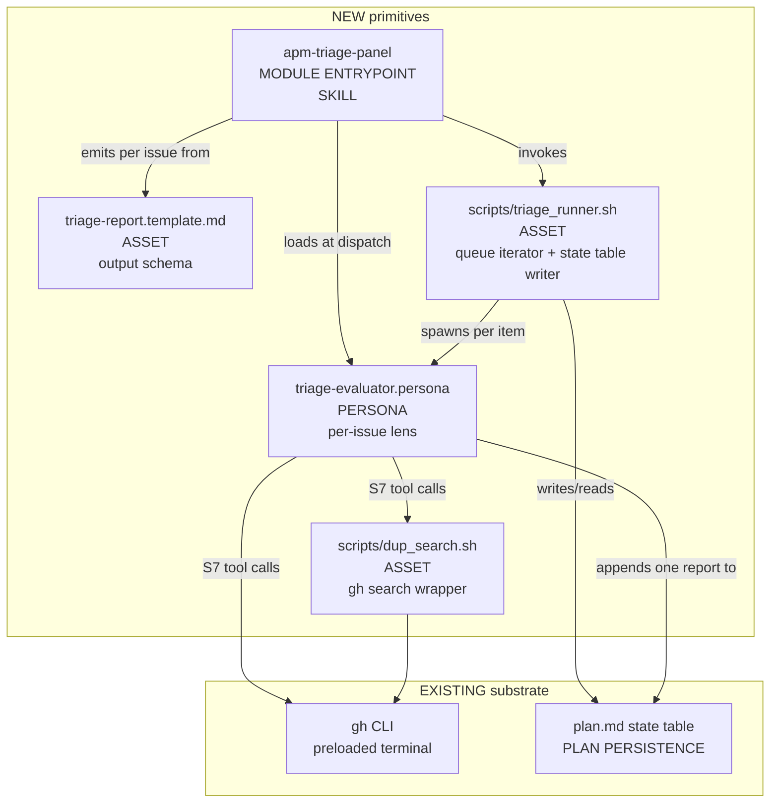
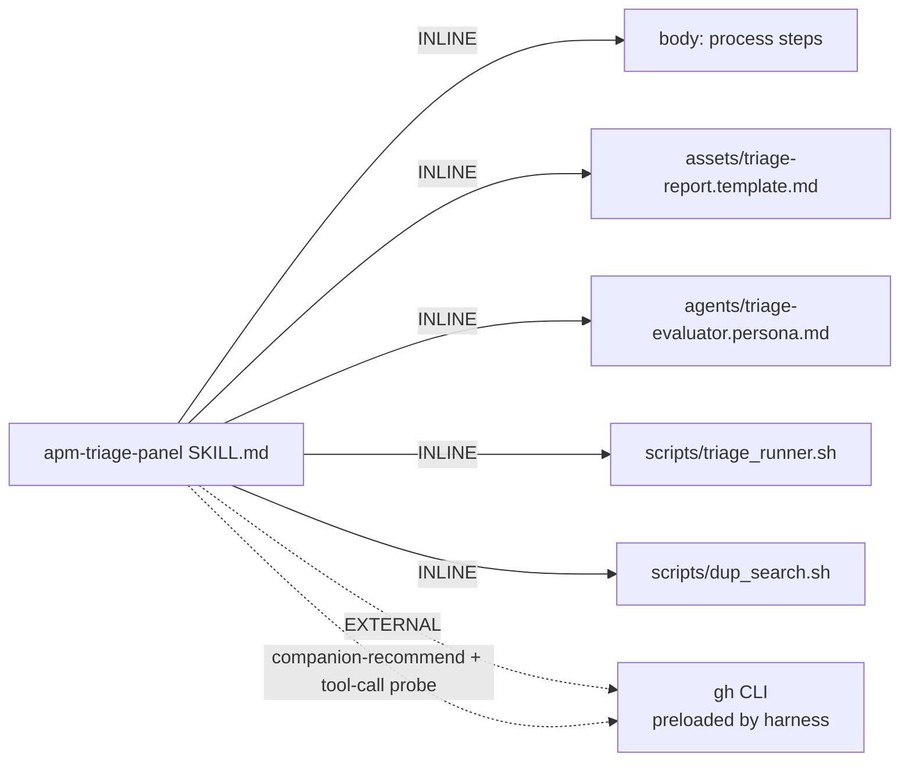

# Handoff packet — `apm-triage-panel` (S1)

Genesis v0.2.0 baseline corpus. Target harness: `copilot-cli` only.
Design ends at step 6; no natural-language module drafting.

---

## Step 1 — intent + scope

The operator points the skill at a GitHub issue or a set of issue
identifiers (label query, explicit numbers, or `--all-open`) and the
skill drives each issue through a six-dimension triage evaluation
(priority, area, duplicate-of, missing-info, severity, effort) and
emits one structured triage report per issue to a persisted artifact.
The skill does NOT post labels, comments, or any other write to
GitHub; report emission is the terminal state. The skill does NOT
prioritize across issues (no roadmap synthesis); each report stands
alone. The skill does NOT decide whether to close as duplicate; it
proposes a duplicate-of link and leaves the merge decision to a
human.

Dispatch description draft (≤1024 chars, imperative, intent-first,
indirect triggers named — per `assets/primitives.md` MODULE
ENTRYPOINT spec):

> Use this skill whenever the user wants to triage one or more
> GitHub issues — including phrasings like "triage these bugs",
> "sweep the backlog", "label dump from yesterday", "what are these
> issues actually about", "find duplicates of #1234", "estimate
> effort for the inbound queue", or "help me prep next sprint's
> bug review". For every issue the skill produces one structured
> report covering priority, owning area, candidate duplicate,
> missing reporter information, user-impact severity, and effort
> size (s/m/l/xl). Use it when a list of issue numbers, a GitHub
> label, or "open issues in repo X" appears in the request, even
> if the word "triage" is not used. Do NOT use it to write labels,
> comments, or close issues — emission is report-only and a human
> applies the verdict.

Invocation mode: `BOTH` — operator may invoke directly (FORCED via
slash-style "use apm-triage-panel on ...") AND the dispatcher should
be willing to match it on the indirect triggers above.

No "and" conjunction in the capability paragraph collapses to two
distinct capabilities; Single Responsibility holds.

---

## Step 2 — component diagram



Legend: PERSONA, SKILL, RULE, ORCHESTRATOR, ASSET. All five NEW
boxes are introduced by this design. The two EXISTING boxes are
substrate the harness already provides.

---

## Step 3 — thread / sequence diagram

Pattern tier walk (per SKILL.md §Step 3):

1. **Refactor triggers** — no existing module graph to refactor;
   `R1`–`R4` triggers do not fire.
2. **Tier 3 architectural pattern** — intent says "for each issue,
   drive to terminal state", a queue of items each in a non-terminal
   state with a deterministic per-item stop predicate (report has
   all 6 fields populated AND dup-check tool returned). That is
   `A11 RECONCILIATION LOOP`, verbatim per
   `architectural-patterns.md` selection heuristic. Inherits A11's
   anti-patterns wholesale. Per-item terminal state is
   "report-emitted", not "issue-closed" (the skill is report-only).
3. **Tier 2 design patterns** — A11 composes:
   - `B1 FAN-OUT + SYNTHESIZER` per item (one sub-agent per issue;
     "synthesis" is the per-issue report; the queue runner is the
     fan-in to the state table).
   - `B4 PLAN MEMENTO` — `plan.md` IS the queue + state table.
   - `B11 FOLD-BY-DEFAULT` — if a triage worker uncovers a related
     bug while reading, it gets added to the queue, not deferred.
   - `S4 VALIDATION DECORATOR` — the stop-predicate is a JSON
     schema check on the report file, not LLM self-assertion.
   - `S7 DETERMINISTIC TOOL BRIDGE` — every issue read and every
     duplicate search crosses `gh` CLI; no LLM-recalled issue
     bodies (preloaded terminal route).
   - `C2 PERSONA PRELOAD` — `triage-evaluator.persona` loaded per
     worker; cold context per issue.
   - `C4 DESCRIPTION DISPATCH` — the worker is dispatched per item
     with the issue id in the prompt.
   - `B6 PROMPT TEMPLATE` — the six-dimension report has a fixed
     schema; the asset `triage-report.template.md` is its skeleton.
   - `B8 ATTENTION ANCHOR` — every worker re-injects "your job is
     to emit ONE report for ONE issue; do not modify other issues;
     do not post to GitHub" before tool calls.
   - Bounded per-item retry (cap = 2) with `B10 HUMAN CHECKPOINT`
     on exhaustion (e.g. issue body unreadable, gh API repeatedly
     failing).
4. Tier 1 idioms — deferred to step 7b; out of scope for design.

Inside each per-item worker the six dimensions are evaluated in a
single thread (sequential, one persona). PANEL (`A1`) is
considered and REJECTED: the six dimensions are not specialized
lenses needing cold contexts; the body of one issue is short; the
per-issue spawn IS already the cold-context boundary. Spinning up
six sub-agents per issue would be `PREMATURE SPLIT` and would
multiply tool-call cost without value. (Trade-off recorded; see
step 3.1.)

```mermaid
sequenceDiagram
  participant Op as operator
  participant Runner as triage_runner.sh<br/>(parent thread)
  participant Plan as plan.md state table
  participant W as per-issue worker<br/>(CHILD-THREAD SPAWN)
  participant Per as triage-evaluator persona
  participant GH as gh CLI

  Op->>Runner: invoke skill with label or issue list
  Runner->>GH: gh issue list --label X --json number,title
  GH-->>Runner: id set
  Runner->>Plan: write state table (id, state=pending, owner=nil, attempts=0)

  loop per issue (fan-out, bounded parallelism)
    Runner->>Plan: claim issue (set owner=worker-N, state=in_progress)
    Runner->>W: spawn (issue id, plan slice, anchor)
    activate W
    W->>Per: load persona (C2)
    W->>GH: gh issue view <id> --json body,labels,author,comments
    GH-->>W: issue payload
    W->>GH: gh search issues / dup_search.sh <terms>
    GH-->>W: candidate duplicates
    W->>W: B8 re-inject anchor; fill 6-dim template (B6)
    W->>Plan: append report file path; set state=report-drafted
    W-->>Runner: structured verdict (path, hash, ok|retry|escalate)
    deactivate W
    Runner->>Runner: S4 stop-predicate (JSON schema valid AND<br/>all 6 fields populated AND dup-check completed)
    alt predicate passes
      Runner->>Plan: state=terminal; release owner
    else predicate fails AND attempts<2
      Runner->>Plan: state=pending; attempts++
    else attempts==2
      Runner->>Plan: state=escalated (B10 human checkpoint row)
    end
  end

  Runner->>Op: print summary table (n terminal, n escalated, paths)
```

The interlock IS the `owner` column on the state table; single-
writer per item, not per queue. Sub-agents read the state table on
spawn entry (B4 reload) and write only their assigned row.

### Step 3.1 — tradeoff check

Two alternatives surfaced for the per-item shape:

| Slot               | Option A                       | Option B                                   | Pick | Matrix row                       |
|--------------------|--------------------------------|--------------------------------------------|------|----------------------------------|
| Per-item evaluator | A1 PANEL (six lensed workers)  | Single sequential worker with B6 template  | B    | `pattern-tradeoffs.md` threading topology — "lens count <3 OR lenses non-specialized → single thread" |
| Stop predicate     | LLM self-assertion ("looks ok")| S4 JSON schema gate                        | S4   | `pattern-tradeoffs.md` gate types — "fact-that-must-be-true → deterministic gate" |
| Duplicate check    | LLM recall of similar issues   | gh search via S7                           | S7   | `pattern-tradeoffs.md` hallucination countermeasures — "fact about system of record → tool call" |

### Step 3.5 — composition decision (dependency graph)



Every authored artifact is INLINE in the skill bundle. Rationale:
none of the four "EXTERNAL MODULE" qualifiers fire — the persona,
template, and scripts are used only by this skill (no rule-of-
three), are owned by the same author, evolve on the same cadence,
and there is no pinning concern. `gh` is an external dependency
but is supplied by the operator's machine, not the module system;
it is declared via **companion-recommendation + tool-call probe at
use-site** (the runner script `command -v gh || { echo "install
gh"; exit 2; }` ahead of any invocation).

No `apm install …` / manifest-system declaration is required —
nothing this skill depends on ships through `apm` or a sibling
module-system tool. The declaration mechanism for `gh` is
**companion-module recommendation + tool-call probe** only.

---

## Step 4 — SoC pass

| Check                                                | Result |
|------------------------------------------------------|--------|
| Existing module duplicates this capability?          | No. `batch-bug-shepherd` (A11 worked example in corpus) drives bugs to merged PR; this skill stops at "report emitted". Disjoint terminal state. |
| Overlap with sibling triggers?                       | No siblings in this project yet. Dispatch description carves out report-only and explicitly excludes label/close actions to pre-empt collision with a future `apm-triage-applier`. |
| Dispatch collision with installed sibling?           | None known; re-check at step 8. |
| R1 SPLIT triggered?                                  | No. Dispatch description has no conjunctions; body is procedural, single lens. |
| R2 FUSE candidate?                                   | No (no sibling to fuse with). |
| R3 EXTRACT (inline content belongs in own persona/rule/asset)? | Yes for the evaluator voice → extracted to `agents/triage-evaluator.persona.md`; yes for the output schema → extracted to `assets/triage-report.template.md`. Both reflected in component diagram. |
| R4 INLINE (thin proxy)?                              | No. |
| CONSEQUENTIAL SIDE EFFECT or FACT-THAT-MUST-BE-TRUE? | Yes: read issue body (fact), search dup candidates (fact), emit report file (side effect on filesystem). All cross S7. Wrapped by A9 SUPERVISED EXECUTION (plan + per-item execute + S4 verify) implicit in the A11 shape. |

---

## Step 5 — compliance check

| Axis                                  | Finding | Severity |
|---------------------------------------|---------|----------|
| `name` regex (1–64, `[a-z0-9-]`, parent dir match) | `apm-triage-panel` passes. Parent dir must be named the same at step 7b. | OK |
| `description` ≤1024 chars             | Draft is ~880 chars. | OK |
| Imperative, intent-first              | "Use this skill whenever the user wants to triage…" | OK |
| Indirect triggers named               | Six concrete indirect phrasings + the "even if the word 'triage' is not used" clause. | OK |
| SKILL.md ≤500 lines, ≤5000 tokens     | Will be enforced at step 8; budget reserved by keeping the persona, template, and dup_search externalized. | OK projected |
| PROSE — Progressive Disclosure        | Template, persona, dup script are lazy-loaded by worker spawn, not preloaded. | OK |
| PROSE — Reduced Scope                 | Per-issue fresh context via C3 CHILD-THREAD SPAWN. | OK |
| PROSE — Orchestrated Composition      | Runner is the orchestrator façade (S3 implicit via the runner script + workers). | OK |
| PROSE — Safety Boundaries             | No GitHub writes; S4 schema gate; B10 on retry exhaustion; tool-call probe for `gh`. | OK |
| PROSE — Explicit Hierarchy            | Runner owns plan; workers own their row; persona owns voice. | OK |
| LLM truth #1 (context decays)         | B8 ATTENTION ANCHOR per worker. | OK |
| LLM truth #2 (context must be explicit) | All facts via S7; no recall. | OK |
| LLM truth #3 (cold start beats warm drift) | Per-issue CHILD-THREAD SPAWN. | OK |
| LLM truth #4 (plans must be written)  | `plan.md` state table; B4. | OK |
| LLM truth #5 (plan persisted before execute) | Runner writes state table BEFORE first spawn. | OK |
| LLM truth #6 (harnesses bridge LLM↔CPU)| `gh` via terminal route is the bridge. | OK |
| LLM truth #7 (small steps composed)   | One report per issue is the atomic unit. | OK |
| A11 anti-pattern: LOOP-WITHOUT-STOP-PREDICATE | Stop predicate is the JSON-schema check + dup-tool-returned flag. | OK |
| A11 anti-pattern: MULTI-WRITER PER ITEM | `owner` column on state table is the interlock. | OK |
| A11 anti-pattern: UNBOUNDED PER-ITEM RETRIES | Cap = 2; B10 on exhaustion. | OK |
| A11 anti-pattern: DRIFT WITHOUT REASSERTION | B4 reload at every re-entry; B8 anchor re-injected. | OK |
| A11 anti-pattern: A8 MISCAST AS A11    | N≥1 items, per-item stop predicate, cross-item interlocks present → A11 is correct grain. | OK |

No BLOCKER findings.

---

## Step 6 — handoff packet (this document)

### 6.1 Interface sketch per module

#### `apm-triage-panel` (SKILL — MODULE ENTRYPOINT)

- Trigger description: see step 1 draft.
- Inputs: a label string OR a list of issue numbers OR `--all-open`,
  plus an optional repo handle (defaults to current `gh repo view`).
- Outputs: one report file per issue under
  `./triage-reports/<issue-number>.md`, conforming to
  `assets/triage-report.template.md`; a `plan.md` state table at
  `./plan.md`; a stdout summary table.
- Dependencies: `[agents/triage-evaluator.persona.md]`,
  `[assets/triage-report.template.md]`,
  `[scripts/triage_runner.sh]`, `[scripts/dup_search.sh]`,
  `gh` (companion recommendation + tool-call probe).

#### `agents/triage-evaluator.persona.md` (PERSONA SCOPING FILE)

- Trigger: loaded by each per-issue worker on spawn.
- Inputs (as worker prompt): issue id, issue payload (from `gh issue
  view`), dup-search results, the anchor banner.
- Outputs: a populated `triage-report.template.md` for ONE issue.
- Voice: a senior triage engineer; calibrates priority/severity
  conservatively; names missing info explicitly; never asserts a
  duplicate without a candidate issue id from the dup-search tool.

#### `assets/triage-report.template.md` (ASSET — B6 PROMPT TEMPLATE)

- Inputs: persona fills slots.
- Output schema (markdown frontmatter + body):
  ```
  ---
  issue: <int>
  priority: critical|high|med|low
  area: <subsystem string>
  duplicate_of: <issue-number-or-null>
  missing_info: [<bullet list>]
  severity: <one of: blocker, major, minor, trivial>
  effort: s|m|l|xl
  evaluated_at: <iso8601>
  evaluator_attempts: <int>
  ---
  ## Reasoning
  <one paragraph per dimension, max 5 sentences each>
  ```
- Schema gate: `scripts/triage_runner.sh` re-parses frontmatter and
  asserts all eight keys are present + values match the enums; S4.

#### `scripts/triage_runner.sh` (ASSET — runner)

- Inputs: same flags as the skill (label, ids, --all-open).
- Outputs: spawns workers via the harness's child-thread
  affordance (in copilot-cli this is the agent dispatch contract;
  the runner emits a JSON queue and the skill body instructs the
  agent to fan out — the script itself does not call the LLM, it
  prepares the queue).
- Side effects: writes `plan.md`; reads/writes per-row state.
- Non-interactive; `--help` documented; structured JSON on stdout,
  diagnostics on stderr; pins `gh` version check via `gh --version`.

#### `scripts/dup_search.sh` (ASSET — gh search wrapper)

- Inputs: issue title + body keywords (extracted by the persona).
- Outputs: JSON list of candidate duplicate issue numbers + titles
  + similarity score (textual; `gh search issues`).
- Non-interactive; `--help`; stdout JSON; stderr diagnostics.

### 6.2 Module composition table

| Box                              | Composition mode                         | Rationale |
|----------------------------------|-------------------------------------------|-----------|
| `apm-triage-panel/SKILL.md` body | INLINE                                    | Unique to this skill. |
| `agents/triage-evaluator.persona.md` | LOCAL SIBLING (inside the skill bundle)| Reused only within this skill; lazy-loaded per worker; isolating voice from process satisfies R3 EXTRACT. |
| `assets/triage-report.template.md` | INLINE asset of the skill              | Output schema; ships with the skill. |
| `scripts/triage_runner.sh`       | INLINE asset                              | Skill-specific runner. |
| `scripts/dup_search.sh`          | INLINE asset                              | Skill-specific. May graduate to EXTERNAL MODULE if a second skill needs it (rule-of-three trigger). |
| `gh` CLI                         | EXTERNAL (host-supplied; not a module-system module) | Declared via companion-module recommendation + tool-call probe. |

### 6.3 External modules required (drives step 7b adapter loading)

None via the module system (no `apm` / `npm` / equivalent
manifest dependency). `gh` is an external **tool** dependency, not
an external module; declaration mechanism = **companion-module
recommendation in SKILL.md body + tool-call probe** in
`triage_runner.sh`. No module-system adapter need be loaded at
step 7b.

### 6.4 Declared target set

`copilot-cli` only. (The scenario stipulates this; portability to
other harnesses is out of scope for v1.) Step 7a will verify that
every affordance used — child-thread spawn, plan persistence, shell
terminal — is available on copilot-cli per
`runtime-affordances/per-harness/copilot.md`.

### 6.5 Invocation mode per module

| Module                              | Invocation mode |
|-------------------------------------|------------------|
| `apm-triage-panel` (SKILL)          | BOTH — operator may invoke directly OR dispatcher may match. |
| `triage-evaluator.persona`          | n/a (loaded by worker, not dispatched). |
| `triage-report.template.md`         | n/a (asset). |
| `triage_runner.sh`                  | n/a (asset; invoked from skill body). |
| `dup_search.sh`                     | n/a (asset; invoked from worker prompt). |

### 6.6 Open compliance findings

None at BLOCKER/HIGH. One MEDIUM watch item: if the operator
points the skill at >50 issues in a single invocation, the per-
worker `gh` rate-limit budget may force back-off; the runner
should serialize after N=10 parallel workers (encode this as a
runner flag `--max-parallel`, default 10).

### 6.7 Todo list

| id                | title                                                                 | depends_on |
|-------------------|------------------------------------------------------------------------|------------|
| `draft-skill-body`| Drafting `SKILL.md` body for `apm-triage-panel` (step 7b)              | —          |
| `draft-persona`   | Drafting `triage-evaluator.persona.md`                                | `draft-skill-body` |
| `draft-template`  | Drafting `triage-report.template.md` with frontmatter + reasoning body | —          |
| `author-runner`   | Authoring `scripts/triage_runner.sh` with `--help`, JSON stdout, schema gate | `draft-template` |
| `author-dup-search`| Authoring `scripts/dup_search.sh` wrapping `gh search issues`        | —          |
| `wire-probe`      | Adding `command -v gh` probe + companion-module banner to skill body  | `draft-skill-body` |
| `write-evals`     | Writing `evals/evals.json` with content + trigger evals (see §6.8)    | `draft-skill-body`, `draft-template` |
| `lint-step8`      | Running lint (PROSE 5-axis, size budget, ASCII, name regex, evals gate) | all above |
| `real-task-refine`| Running on ≥1 real backlog of 5+ issues, capturing trace, revising    | `lint-step8` |

### 6.8 Evals plan

#### Content evals (2-3 prompts; exercised with-skill vs without-skill)

1. **Single-issue triage** — input: a fabricated issue body
   describing a crash on Windows when loading file >2GB, with no
   repro steps, no version info. Expected with-skill: report
   populates all 6 fields, priority ≥ high, severity = blocker,
   missing_info names "repro steps" and "OS build / app version".
   Expected without-skill: ad-hoc prose, no enums, missing-info
   typically not enumerated.
2. **Duplicate detection** — input: two issues with overlapping
   keywords ("file picker hangs", "file dialog freezes"). Expected
   with-skill: at least one of the two reports populates
   `duplicate_of` with the other id and cites the dup-search tool
   output. Without-skill: typically no dup link or hallucinated id.
3. **Effort estimate calibration** — input: a one-line typo-fix
   issue alongside a "rewrite the auth layer" issue. Expected
   with-skill: `effort: s` and `effort: xl` respectively. Without-
   skill: prose narrative, no enum, often single inflated estimate.

If `with_skill` ≈ `without_skill` on any of the three, redesign or
delete (per `evaluating-skills` canonical doctrine cited in
`primitives.md`).

#### Trigger evals (~20 queries; 60/40 train/val split)

Should-trigger (8):

1. "triage these issues: 1234, 1235, 1236"
2. "sweep the bug backlog with the `inbox` label"
3. "what are these GitHub issues actually about"
4. "find duplicates among open issues in repo X"
5. "help me prep tomorrow's triage meeting"
6. "estimate effort across this label dump"
7. "I need a one-pager per issue for these 12 reports"
8. "label-quality pass on open issues in apm-guide"

Should-NOT-trigger near-misses (8):

1. "close issue #1234 as duplicate of #1230" (write action; out of scope)
2. "open a new issue about the file-picker bug" (creation, not triage)
3. "summarize this single issue thread for me" (one issue, no
   six-dimension structure asked)
4. "label all P0 issues red" (write action)
5. "what's the project's overall bug velocity?" (analytics, not
   per-issue triage)
6. "review this PR" (PR not issue)
7. "draft a release note from the closed issues" (different skill)
8. "rename the `inbox` label to `triage-queue`" (repo admin)

Train/val split: take 5 should-trigger + 5 near-miss as train; 3+3
as validation. Validation split is the ship gate (rate ≥ 0.5 on
should-trigger AND < 0.5 on should-NOT-trigger).

### 6.9 Persistence

This packet itself is the persisted plan artifact (truth #5;
substrate concept 6). It lives at
`dev/empirical-proof/cross-scenario/S1-triage-v02/handoff.md` and
is the source-of-truth that step 7b (out of scope here) would
reload before each module draft.

DESIGN ENDS HERE.

---

## MODEL BINDING DECLARATIONS

The v0.2.0 baseline corpus **does not contain** a model catalogue,
token-economics asset, model-router pattern, or any guidance on
choosing per-thread SKUs or `reasoning_effort` knobs. I verified
this by listing `assets/` — there is no `model-catalog.md` and no
`token-economics.md`, and the design-pattern catalogue stops at B11
(no B12 MODEL ROUTER, no B14 PROMPT THRIFT). The architect persona
is silent on the question.

I am declaring bindings anyway, since the scenario requires it. The
choices below are my own engineering judgment, not corpus-grounded,
and would need to be re-validated against a real model catalogue
when one exists.

| Spawned element                          | Recommended model SKU                    | reasoning_effort | Justification (NOT corpus-cited) |
|------------------------------------------|------------------------------------------|------------------|----------------------------------|
| Parent thread (skill dispatch + runner orchestration) | `claude-sonnet-4.6`             | `medium`         | Orchestration is short-lived per turn but benefits from solid tool-use; Sonnet is the default cost/quality balance for parent threads in copilot-cli today. |
| Per-issue worker (CHILD-THREAD SPAWN)    | `claude-haiku-4.5`                       | `low`            | The work is templated (B6 template, fixed 6-dimension schema), the input is short (one issue body + dup-search JSON), and the worker runs N times — small fast model is the right default. |
| Synthesis / runner aggregation step      | none — there is no cross-issue synthesis; the runner prints a summary table only | n/a              | A11 fan-in is to the state table, not to an LLM synthesizer. |
| B10 HUMAN CHECKPOINT escalation prompt   | inherits parent (`claude-sonnet-4.6`)    | `medium`         | Rare path; better reasoning matters more than throughput. |

**Confidence: low.** Without a model-catalogue asset in the corpus,
the SKU names above are pulled from my own background knowledge of
what copilot-cli exposes; they are not validated against a genesis-
sanctioned matrix. A future v0.3.x corpus addition (cost-aware
role-class routing) would supersede these choices.

---

## PATTERNS CITED

- `A11` RECONCILIATION LOOP (Tier 3) — top-level architecture.
- `A9` SUPERVISED EXECUTION (Tier 3) — implicit wrap on the per-item plan+execute+verify shape.
- `A1` PANEL (Tier 3) — explicitly considered and REJECTED at step 3 with `pattern-tradeoffs.md` citation (PREMATURE SPLIT risk).
- `B1` FAN-OUT + SYNTHESIZER (Tier 2) — per-item worker spawn.
- `B4` PLAN MEMENTO (Tier 2) — `plan.md` state table.
- `B6` PROMPT TEMPLATE (Tier 2) — `triage-report.template.md`.
- `B8` ATTENTION ANCHOR (Tier 2) — per-worker re-injection.
- `B10` HUMAN CHECKPOINT (Tier 2) — retry-exhaustion escalation.
- `B11` FOLD-BY-DEFAULT (Tier 2) — follow-up bugs land in queue.
- `C2` PERSONA PRELOAD (Tier 2) — `triage-evaluator.persona` per worker.
- `C3` THREAD SPAWN (substrate primitive; loaded indirectly via B1).
- `C4` DESCRIPTION DISPATCH (Tier 2) — worker boundary.
- `S3` ORCHESTRATOR FACADE (Tier 2) — runner script as the façade.
- `S4` VALIDATION DECORATOR (Tier 2) — JSON schema stop-predicate.
- `S7` DETERMINISTIC TOOL BRIDGE (Tier 2) — every `gh` call.
- `R3` EXTRACT (refactor) — persona, template, dup_search broken out.
- Primitive #2 MODULE ENTRYPOINT — `apm-triage-panel/SKILL.md`.
- Primitive #1 PERSONA SCOPING FILE — evaluator persona.
- Primitive #4 CHILD-THREAD SPAWN — per-issue workers.
- Primitive #6 PLAN PERSISTENCE — `plan.md` state table.

---

## PATTERNS WANTED BUT UNAVAILABLE

The v0.2.0 baseline corpus does not provide the following, all of
which would have sharpened this design:

- **Cost-aware role-class routing pattern (something like a "B12
  MODEL ROUTER")** — would have grounded the MODEL BINDING
  DECLARATIONS section against an explicit catalogue of model SKUs
  + role classes (orchestrator / worker / synthesizer / escalation)
  with a deterministic mapping rule. As written, my bindings are
  unsanctioned judgment calls.
- **Token-economics asset (`assets/token-economics.md`)** — would
  have let me state the projected cost per run with calibrated per-
  token rates and worker-count math instead of the rough estimate
  below.
- **Prompt-thrift pattern (something like a "B14 PROMPT THRIFT")**
  — would have offered a doctrine for keeping the per-worker
  prompt small (issue body trimming, dup-search JSON pruning) at
  scale. I am applying the principle ad hoc (C2 cold context + B6
  template-only) but without a named pattern to cite.
- **Per-harness model-binding adapter** — `runtime-affordances/
  per-harness/copilot.md` does not (in v0.2.0) document which SKUs
  copilot-cli exposes nor what `reasoning_effort` values it
  honours. Step 7b would have to discover this from outside the
  corpus.

These gaps do not invalidate the architectural design (A11 + the
Tier-2 mix above is well-grounded in the baseline corpus); they
only weaken the cost/model-binding layer.

---

## PROJECTED COST

Best-guess executor cost per run, assumptions stated explicitly
(corpus offers no calibration data — this is freehand):

Assumptions:

- Average issue body + comments ≈ 800 input tokens; dup-search
  JSON ≈ 400 tokens; persona ≈ 600 tokens; template ≈ 200 tokens;
  anchor banner ≈ 150 tokens → ~2.2k input per worker.
- Worker output (one report) ≈ 600 tokens.
- Parent thread per issue: ~400 input + 200 output (queue mgmt,
  spawn instruction, summary line).
- Tool calls (`gh issue view`, `gh search issues`) cost nothing at
  the LLM tier; rate-limit budget is the constraint, not dollars.
- Recommended SKUs: parent Sonnet ($ ≈ $3/M in, $15/M out);
  worker Haiku ($ ≈ $1/M in, $5/M out). These rates are my recall,
  not corpus-cited.

Per issue:

- Worker: 2.2k × $1/M + 0.6k × $5/M ≈ **$0.0052**
- Parent share: 0.4k × $3/M + 0.2k × $15/M ≈ **$0.0042**
- Total per issue ≈ **$0.009**

Per typical run (assume 20 issues): ≈ **$0.18**.
Per large run (100 issues): ≈ **$0.90**.

If we naively swapped worker to Sonnet (no router available): per
issue ≈ $0.016, run-of-20 ≈ $0.32 — nearly 2× the cost for a
templated extraction job. This is the gap a cost-aware router
would close; flagged above under PATTERNS WANTED BUT UNAVAILABLE.

Confidence: **low to medium**. Token estimates are reasonable
order-of-magnitude; SKU rates are not corpus-validated.

---

END OF HANDOFF PACKET.
