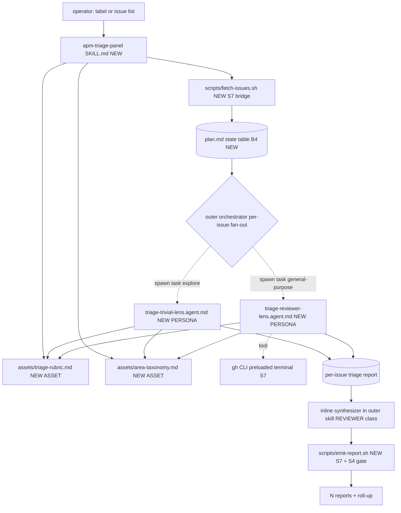
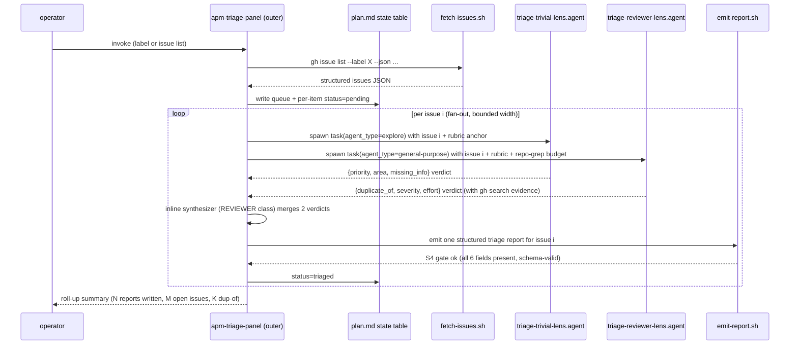
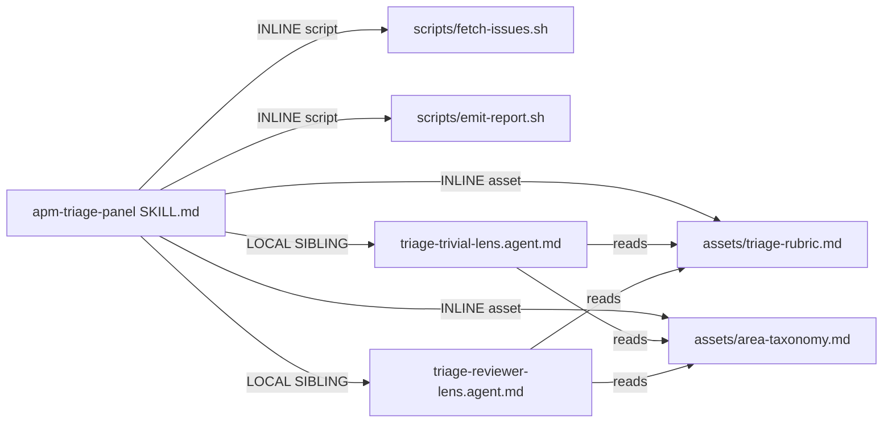

# Handoff packet — apm-triage-panel (Scenario S1, v0.3.5)

Produced by genesis-architect at step 6. Target harness:
copilot-cli (single-harness). Stance: BALANCED (default; operator
did not declare). Cap: none declared (projection is informational).

---

## Step 1 — Intent + scope

The `apm-triage-panel` skill batch-triages a stream of GitHub
issues. For each issue the skill evaluates six fixed dimensions
(priority, area, duplicate-of, missing-info, severity, effort)
against a rubric and emits one structured triage report per
issue. Operator invokes by passing a label or a list of issue
numbers; output is N reports written into the session plan store
plus a roll-up summary on stdout. The skill does NOT post
comments, change labels, close issues, or otherwise mutate the
GitHub system of record — emission only. Re-runs are idempotent
(state table keys by issue number).

Dispatch description draft (<=1024 chars, imperative, intent-first,
indirect triggers named):

> Use this skill when the user asks to triage a batch of GitHub
> issues, sweep an issue backlog, classify a list of issues
> against a rubric (priority, area, duplicate, missing info,
> severity, effort), or produce per-issue triage reports from a
> label or issue-number list. Also activate when the user says
> "go through these issues", "clean up the backlog", "bulk
> triage", "label triage", or hands over a `gh issue list`
> output and asks for an assessment. Emits structured reports
> only; does not modify issues, post comments, or close
> anything. Read-only against the system of record.

Invocation mode: BOTH (operator may invoke by name OR
dispatcher may match the description against indirect triggers
like "sweep backlog").

---

## Step 2 — Component diagram (mermaid, flowchart)

Module legend: SKILL = MODULE ENTRYPOINT; PERSONA = PERSONA
SCOPING FILE; ASSET = lazy-loaded; bridge nodes are S7. All
boxes are NEW (no pre-existing siblings reused).

---

## Step 3 — Thread / sequence diagram (mermaid)

Pattern selection (tier order per SKILL.md step 3):

1. Refactor triggers across module graph: not applicable (new
   design, no prior graph to refactor).
2. TIER 3 architectural patterns: the work is a QUEUE of N
   similar items each driven to a terminal "report emitted"
   state with a per-item stop predicate (report present in
   state table) — TRIGGER A11 RECONCILIATION LOOP. Per-issue
   the work is multi-LENS (six dimensions, two capability
   classes) with synthesis — TRIGGER A1 PANEL inside each
   per-item sub-agent. Heterogeneous-cost stages (trivial
   lens vs reviewer lens vs inline synthesis) — TRIGGER A12
   GRADIENT WORKFLOW as cost overlay. S7 / A9 SUPERVISED
   EXECUTION wraps the gh CLI bridge and the emit gate.
3. TIER 2: B1 FAN-OUT + SYNTHESIZER (per-issue), B4 PLAN
   MEMENTO (state table), B8 ATTENTION ANCHOR (rubric re-
   injected into each spawn), B12 MODEL ROUTER, B13 CACHE-
   AWARE PREFIX, B14 PROMPT THRIFT, B15 TOOL SUBSET, B16
   EFFORT GOVERNOR, S4 VALIDATION DECORATOR (emit gate), C2
   PERSONA PRELOAD, C4 DESCRIPTION DISPATCH.
4. TIER 1 idioms (copilot.md): deferred to step 7b.

Per A11: the per-item stop predicate is "row in state table has
status=triaged AND report file exists" — both DETERMINISTIC reads
(not LLM-asserted). On transient gh CLI failure, the per-item
attempt counter (cap 2) re-spawns; on exhaustion, B10 HUMAN
CHECKPOINT escalation (operator chooses skip/retry/abort).

---

## Step 3.1 — Tradeoff check

Two slots had alternatives in tension:

- PER-ISSUE LENS COMPOSITION. Option A: six independent sub-
  agent spawns (one per dimension). Option B: two lens groups
  (trivial-class for priority+area+missing-info; reviewer-class
  for duplicate-of+severity+effort). Option C: collapse all six
  into one sub-agent. Consulted §6 PERSONA COMPOSITION matrix.
  Cell that cut the choice: SHARED ARTIFACT + MIXED CAPABILITY
  PROFILE → group by capability profile, do not split per
  dimension. Picked Option B. Six-way fan-out wastes prefix
  re-cache; one-way collapse violates UNDIFFERENTIATED LENS
  BINDING because two distinct capability profiles exist.
- OUTER LOOP SHAPE. A11 RECONCILIATION LOOP vs plain B1 FAN-OUT.
  Consulted §4 THREADING TOPOLOGY matrix. Cell: QUEUE-OF-ITEMS
  WITH PER-ITEM STOP PREDICATE READ FROM SYSTEM OF RECORD →
  A11. Picked A11 even though per-item is one-shot in the happy
  path; the state-table discipline pays off on resume / partial
  re-runs / transient API failure.

---

## Step 3.2 — Cost check (mandatory)

Stance declared at step 1: BALANCED. Mandates per
`references/cost-economics-process.md`: B13 always (largest
lever, no quality tradeoff); role class per slot; B14 PROMPT
THRIFT at validation.

Per-element cost-check table (output of step 3.2):

| Module                        | Role class                | Prefix size | Output volume | Cost patterns applied      | Cost-shape matrix row                       |
|-------------------------------|---------------------------|-------------|---------------|----------------------------|---------------------------------------------|
| `apm-triage-panel` SKILL.md   | session default (impl.)   | M (5-20K)   | S (<500)      | B13, B14, S7               | "Multi-step plan against large corpus" → C6+B13 (rubric is the corpus) |
| `triage-trivial-lens.agent`   | TRIVIAL                   | S (<5K)     | S (<500)      | B12, B13, B15, B16, C2     | "Single-turn classification" → B12 route to trivial |
| `triage-reviewer-lens.agent`  | REVIEWER                  | M (5-20K)   | S (<500)      | B12, B13, B15, B16, C2, S7 | "Fan-out across N similar items" → A12 GRADIENT (mid = reviewer) |
| inline synthesizer (in outer) | REVIEWER (session default)| S (<5K)     | S (<500)      | A12 HEAVY ADJUDICATOR cure | "Quality-uniform graph" → A12; back stays reviewer |
| `fetch-issues.sh`             | n/a (deterministic)       | n/a         | n/a           | S7                          | n/a                                          |
| `emit-report.sh`              | n/a (deterministic)       | n/a         | n/a           | S7, S4                      | n/a                                          |

Stance-mandated patterns present: B13 (rubric + area taxonomy
stable across N issues; no timestamps; no mid-session model
switch — the two lens classes are bound at SPAWN, not mid-
thread), B14 (table outputs, not prose), B12 (per-element
binding declared below), B16 (effort encoded via SKU choice
per copilot.md).

RESEARCHER class explicitly REJECTED. Justification: triage is
checklist-grade against a fixed rubric; success criteria are
the six declared dimensions; no open-ended exploration. Per
model-catalog.md researcher entry — "pattern matching ≠
research; if a rubric exists, the work is REVIEWER, not
RESEARCHER." Binding researcher here would be BIND-UP-WITHOUT-
JUSTIFICATION.

UNDIFFERENTIATED LENS BINDING anti-pattern check: six dimensions
do NOT all share one capability profile. Enumeration:

| Dimension      | Cross-file? | Stakes-weighted? | Multi-step proof? | → class  |
|----------------|-------------|------------------|-------------------|----------|
| priority       | no          | low              | no                | TRIVIAL  |
| area           | no (uses small taxonomy asset) | low | no    | TRIVIAL  |
| missing-info   | no          | low              | no                | TRIVIAL  |
| duplicate-of   | yes (search across existing issues via gh) | medium (false positives waste reporter time) | yes (compare to candidates) | REVIEWER |
| severity       | partial (needs user-impact reasoning) | high (gates downstream prioritization) | no | REVIEWER |
| effort         | yes (repo grep to estimate scope) | medium | yes (decompose) | REVIEWER |

Result: 3-vs-3 split → two lens classes. Identical binding
WITHIN a group is legitimate (per-element profiles match);
binding across groups would be illegitimate. Two `.agent.md`
files = two binding sites.

HEAVY ADJUDICATOR anti-pattern check: synthesizer adjudicates
two structured verdicts (deduplicates fields, picks one final
report row per issue). Per A12: adjudication of structured
inputs is REVIEWER-CLASS work, NOT planner. Synthesizer stays
inline in outer skill at session default (claude-sonnet-4.6 ≈
implementer/reviewer-class on Copilot). No escalation trigger
defined (no narrow trigger like "all lenses fail" applies —
two-lens design has too few inputs to warrant planner escalation).

Cost-shape matrix rows cited above are carried into the COST
PROJECTION section.

---

## Step 3.5 — Composition decision

| Box                              | Mode          | Rationale                                            |
|----------------------------------|---------------|------------------------------------------------------|
| `SKILL.md` apm-triage-panel      | INLINE        | The skill IS the module entrypoint                   |
| `triage-trivial-lens.agent.md`   | LOCAL SIBLING | Only used by this skill; per-skill capability binding |
| `triage-reviewer-lens.agent.md`  | LOCAL SIBLING | Same                                                  |
| `assets/triage-rubric.md`        | INLINE asset  | Unique to this skill; lazy-loaded by lens spawns     |
| `assets/area-taxonomy.md`        | INLINE asset  | Project-specific; would not satisfy rule-of-three    |
| `scripts/fetch-issues.sh`        | INLINE script | Single-skill use; no rule-of-three trigger           |
| `scripts/emit-report.sh`         | INLINE script | Same                                                  |

No EXTERNAL MODULE dependencies declared. Rule-of-three does
not fire (this is the first triage skill in the project);
release cadence is per-skill; ownership is single-team. If a
second triage skill emerges later, R3 EXTRACT the rubric and
taxonomy at that point.

### Dependency graph (mermaid, flowchart LR)

Declaration mechanism for external modules: N/A (zero external
modules). Step 7b does NOT need a module-system adapter probe.

---

## Step 4 — SoC pass

- No existing siblings to dedupe against (first skill of its
  kind in the project corpus).
- Dispatch description does NOT collide with the other v0.3.5
  worked examples (`apm-review-panel` is code-review-focused;
  `batch-bug-shepherd` drives bugs to merged-PR queue, this is
  triage-emission only).
- No R1 SPLIT trigger fires (description names one capability:
  triage emission; no "and" connecting two distinct caps).
- No R2 FUSE candidate (each module has independent
  responsibility).
- R3 EXTRACT not warranted yet (single-skill scope).
- R4 INLINE not warranted (lens personas have real composition
  value).
- S7 boundaries named at every consequential edge (`gh` call,
  report emit). No TOOLLESS ASSERTION.

---

## Step 5 — Compliance check

- MODULE ENTRYPOINT spec compliance: `name=apm-triage-panel`
  (1-64 chars, lowercase + hyphen, matches parent dir
  requirement once placed in `.github/skills/apm-triage-panel/`).
  Description draft = 877 chars (under 1024 cap). SKILL.md body
  target ≤ 500 lines / ≤ 5000 tokens (drafted later at step
  7b).
- PROSE: progressive disclosure honored (rubric + taxonomy +
  per-lens persona are lazy); reduced scope honored (six
  dimensions, no scope creep into commenting); orchestrated
  composition explicit (sibling .agent.md files); safety
  boundary (no system-of-record writes); explicit hierarchy
  (outer orchestrator owns flow, lenses own dimension scoring).
- Seven LLM truths: B4 + B8 honored; S7 crossings named; no
  HARNESS-LLM CONFLATION.
- Open findings: none at BLOCKER or HIGH. One MEDIUM: per-issue
  retry budget not yet quantified for transient gh API failures
  — addressed at step 7b in the outer skill body.

---

## Step 6 — Handoff packet

### Interface sketch per module

- **`apm-triage-panel` (SKILL.md)** — trigger: see dispatch
  description above. Inputs: `--label <name>` OR
  `--issues N,N,N`. Outputs: N triage report files in plan
  store + roll-up summary on stdout. Depends on:
  `./scripts/fetch-issues.sh`, `./scripts/emit-report.sh`,
  `./assets/triage-rubric.md`, `./assets/area-taxonomy.md`,
  `./triage-trivial-lens.agent.md`, `./triage-reviewer-lens.agent.md`.
- **`triage-trivial-lens.agent.md`** — trigger: programmatic
  spawn only. Inputs: one issue JSON + rubric anchor + area
  taxonomy. Outputs: JSON with `{priority, area, missing_info}`.
  Depends on: `../assets/triage-rubric.md`,
  `../assets/area-taxonomy.md`.
- **`triage-reviewer-lens.agent.md`** — trigger: programmatic
  spawn only. Inputs: one issue JSON + rubric anchor + repo
  read access. Outputs: JSON with `{duplicate_of, severity,
  effort}` plus evidence citations. Depends on:
  `../assets/triage-rubric.md`, `../assets/area-taxonomy.md`,
  preloaded `gh` and shell tools.
- **`scripts/fetch-issues.sh`** — non-interactive, `--help`
  documented, pins `gh` invocation, emits JSON on stdout,
  diagnostics on stderr. Inputs: same flags as outer skill.
  Output: JSON array of issue records.
- **`scripts/emit-report.sh`** — non-interactive, validates
  input JSON against the 6-field schema (S4 gate), writes one
  report file per issue. Exit non-zero on schema failure.

### Module composition table

See Step 3.5 table above. All seven boxes INLINE or LOCAL
SIBLING; zero EXTERNAL MODULE.

### External modules required

NONE. Step 7b will NOT load a module-system adapter. No
PHANTOM DEPENDENCY risk at distribution surface.

### Declared target set

`copilot-cli` only. Briefed as a single-harness skill. This
unlocks Copilot-specific bindings (`.agent.md` `model:` and
`tools:`) at step 7b without portability concern.

### Invocation mode per module

| Module                         | Mode               |
|--------------------------------|--------------------|
| `apm-triage-panel` SKILL.md    | BOTH               |
| `triage-trivial-lens.agent`    | FORCED (programmatic spawn only; `user-invocable: false`; `disable-model-invocation: true`) |
| `triage-reviewer-lens.agent`   | FORCED (same)      |

Description-collision review is therefore strict only on the
SKILL.md description (per copilot.md, `.agent.md` files with
`user-invocable: false` are removed from the dispatcher's
matching set).

### Todo list

1. Draft `apm-triage-panel/SKILL.md` body (outer orchestrator,
   fan-out loop, state-table discipline, S4 emit gate).
2. Draft `triage-trivial-lens.agent.md` (persona + rubric load
   trigger + JSON output schema).
3. Draft `triage-reviewer-lens.agent.md` (persona + rubric +
   repo-grep budget + gh-search budget + evidence-citation rule).
4. Author `assets/triage-rubric.md` (six dimensions, scoring
   anchors, edge cases). Static; no timestamps; no live
   references. (B13 cache discipline.)
5. Author `assets/area-taxonomy.md` (project-specific subsystem
   map). Static.
6. Author `scripts/fetch-issues.sh` (non-interactive, --help
   documented, stdout JSON / stderr logs, `gh` pinned).
7. Author `scripts/emit-report.sh` (schema validator + writer,
   exit non-zero on validation fail = S4 gate).
8. Author `evals/evals.json` per evals plan below.
9. Validation pass per step 8 (structural lint, evals gate,
   cost checklist, real-task refinement on one label).

Dependencies: 4+5 before 2+3; 1 depends on 2+3+6+7; 9 last.

### Evals plan

**Content evals (3 cases, run with_skill vs without_skill):**

1. *Single high-quality bug report.* Issue body has clear repro
   + version + logs. Expected: priority=high, area=identified
   subsystem, duplicate_of=null, missing_info=[], severity=high,
   effort=s. Delta probe: without the skill, the unaided agent
   produces prose triage with no structured fields and no
   duplicate search.
2. *Vague feature request.* Issue body is one paragraph "would
   be nice if X worked better". Expected: priority=low,
   area=null, missing_info=[concrete repro, expected behavior,
   user impact], severity=low, effort=unknown. Delta probe:
   without skill, agent rates urgency by tone not by rubric.
3. *Likely-duplicate bug.* Issue describes a problem matching an
   existing open issue. Expected: duplicate_of=#NNN with cited
   evidence; other fields filled. Delta probe: without skill,
   agent does not perform `gh search issues` and emits a
   confident-but-wrong "appears new" verdict.

Acceptance: each case shows a measurable delta (structured
fields present + duplicate-search evidence emitted). If two of
three show no delta, redesign.

**Trigger evals (20 queries, 60/40 train/val split):**

Should-trigger (10): "triage these 12 issues", "sweep the
backlog", "bulk triage label:bug", "go through the open issues
for me", "classify these issues by priority and area", "rate
severity for issues 401-415", "find duplicates among today's
bug reports", "label triage for label:needs-info", "produce a
triage report for each", "drive triage on the queue".

Should-NOT-trigger near-misses (10): "fix the bug in issue
#401" (implement, not triage), "close issue #401 as duplicate"
(mutate state, not emit), "write a release note for these
issues" (different output shape), "comment on issue #401 with
my findings" (write side effect), "summarize this single issue"
(N=1, no batch), "search the codebase for the bug in #401"
(code search, not triage), "open a PR for #401" (implementation
work), "label issue #401 as P1" (mutation), "review this PR"
(PR review skill, not triage), "draft a bug template" (skill
authoring, not triage execution).

Validation split (8 queries, 4 each side): rate ≥ 0.5 on
should-trigger AND < 0.5 on should-not-trigger. Validation gate.

---

## PER-ELEMENT MODEL BINDING DECLARATIONS

Per v0.3.5 SELECTION RULE (design-patterns.md §B12). Step 1:
identify HARNESS DEFAULT role class per primitive type. Step 2:
identify REQUIRED role class per CAPABILITY PROFILE. Step 3:
declare binding direction + explicit `model:` (or OMIT with
cited rule).

| Element | Primitive type | Harness default (copilot.md) | Required role class | CAPABILITY PROFILE answers | Binding direction | `model:` declaration | `reasoning_effort` | Notes / OMIT justification |
|---------|----------------|------------------------------|---------------------|----------------------------|--------------------|-----------------------|--------------------|----------------------------|
| `apm-triage-panel` SKILL.md (outer orchestrator + inline synthesizer) | SKILL.md | session default (cannot be re-bound) | REVIEWER (adjudicates 2 structured lens outputs; no new analysis) | (a) cross-file: no — reads 2 JSON verdicts. (b) stakes: medium — emits structured report, no side effect. (c) multi-step proof: no — deterministic merge. | DEFAULT == REQUIRED (session default on Copilot is typically claude-sonnet-4.6 ≈ implementer-class, close enough to reviewer for adjudication work) | **OMIT** | n/a (Anthropic SKU; effort knob N/A) | OMIT justified per SELECTION RULE rule 3(i): SKILL.md frontmatter does NOT accept `model:` on Copilot (WRONG-PRIMITIVE BINDING anti-pattern would fire otherwise). Operator informed in SKILL.md body that the synthesizer runs at session default. |
| `triage-trivial-lens.agent.md` (priority + area + missing-info) | `.agent.md` spawned via `task(agent_type='explore')` | TRIVIAL (claude-haiku-4.5 per copilot.md table) | TRIVIAL | (a) cross-file: no. (b) stakes: low (advisory fields, no side effect). (c) multi-step proof: no — single-pass rubric grading. | DEFAULT == REQUIRED | **`model: claude-haiku-4.5`** (explicit) | n/a (Anthropic SKU) | DEFAULT == REQUIRED but BIND EXPLICITLY per rule 3(a): PORTABILITY (insulates against Copilot default drift) + PREDICTABILITY (operator can read off the class without cross-referencing the adapter). Spawn type `task(agent_type='explore')` reinforces the trivial-class default at the spawn site. |
| `triage-reviewer-lens.agent.md` (duplicate-of + severity + effort) | `.agent.md` spawned via `task(agent_type='general-purpose')` | IMPLEMENTER (claude-sonnet-4.6 per copilot.md) | REVIEWER | (a) cross-file: yes — duplicate search across N existing issues + repo grep for effort. (b) stakes: medium-high — severity rating gates downstream prioritization; duplicate misfire wastes reporter time. (c) multi-step proof: yes — compare-issue-to-candidates is a chained reasoning step. | DEFAULT == REQUIRED (implementer ≈ reviewer for rubric-driven structured grading; the SKU spans both classes) | **`model: claude-sonnet-4.6`** (explicit) | n/a (Anthropic SKU) | BIND EXPLICITLY at REVIEWER class per rule 3(a) (portability + predictability). STAKES cited: cross-file reasoning required for duplicate search; severity is stakes-weighted. Did NOT bind UP to planner — A12 HEAVY ADJUDICATOR check: no genuine planning, no new problem-boundary design, no consequential side effect. Did NOT bind to RESEARCHER per model-catalog.md guard ("if a rubric exists, the work is REVIEWER, not RESEARCHER"). |
| `scripts/fetch-issues.sh` + `scripts/emit-report.sh` | shell scripts | n/a (deterministic CPU) | n/a | n/a — S7 bridges, no LLM call | n/a | n/a | n/a | OMIT correct: S7 bridges do not bind models. |

**Bind-up audit:** ZERO bind-ups (reviewer-lens is bound at the
matching role class, not promoted). Per SELECTION RULE rule 3,
no STAKES citation requirement triggered.

**Bind-down audit:** Trivial lens is the cheapest class meeting
the rubric-grading capability profile. Spawn-type default
(TRIVIAL on `task(explore)`) matches the bound class — defensive
agreement.

**WRONG-PRIMITIVE BINDING audit:** SKILL.md does NOT carry
`model:` (would be silently ignored per copilot.md section 2).
Both `model:` bindings live on `.agent.md` frontmatter (correct
binding site per copilot.md sections 1 and 9).

**BULK IDENTICAL BINDING audit:** Two `.agent.md` files, two
DIFFERENT classes. Per-element CAPABILITY PROFILE enumerated in
the step 3.2 table above. Not bulk.

**ZERO-EXPLICIT audit:** 2 of 4 LLM-binding sites carry explicit
`model:`; the 2 OMITs are justified by primitive-type rule (S7
scripts have no model + SKILL.md cannot carry the field).

**B16 effort governor:** Anthropic SKUs are bound directly to
role class; per copilot.md section 9 "encoded via SKU choice".
No separate `reasoning_effort` field applies. If a future
codegen step rebinds to GPT-5-family models, MUST add
`reasoning_effort` per model-catalog.md OpenAI table (trivial
→ none/minimal; reviewer → low; implementer → medium default).

---

## PATTERNS CITED (appendix)

Architectural (Tier 3):
- A1 PANEL (per-issue, 2 lens groups + inline synthesis).
- A9 SUPERVISED EXECUTION (weak form; gh CLI as S7, emit gate
  as S4 verifier). Strong form not available — copilot-cli does
  not expose CAPABILITY_GATING for this surface.
- A11 RECONCILIATION LOOP (outer queue shape; state table;
  per-item stop predicate read from artifact presence).
- A12 GRADIENT WORKFLOW (cost overlay: trivial lens + reviewer
  lens + reviewer synthesizer; no planner).

Behavioral (Tier 2):
- B1 FAN-OUT + SYNTHESIZER (per-issue dispatch into 2 lens
  groups).
- B4 PLAN MEMENTO (state table in plan.md).
- B8 ATTENTION ANCHOR (rubric re-injected into each spawn's
  task description, not relied on from in-context recall).
- B10 HUMAN CHECKPOINT (escalation when per-item retry budget
  exhausted; transient gh failures).
- B12 MODEL ROUTER + SELECTION RULE (per-element bindings
  declared above).
- B13 CACHE-AWARE PREFIX (rubric + area taxonomy stable across
  N items; lens persona stable across N spawns; lens bound at
  spawn not mid-thread = no mid-session MODEL SWITCH
  invalidator; no timestamps in any stable bytes).
- B14 PROMPT THRIFT (table outputs in rubric; JSON verdict
  schema; no prose paragraphs in lens responses).
- B15 TOOL SUBSET (per-lens `tools:` declarations:
  trivial-lens = `[read]` only; reviewer-lens = `[read,
  search, execute]` for `gh search issues` + repo grep; outer
  SKILL.md inherits default — acceptable since outer runs once
  per invocation, not N times).
- B16 EFFORT GOVERNOR (encoded via SKU choice per copilot.md
  section 9).

Structural (Tier 2):
- S4 VALIDATION DECORATOR (`emit-report.sh` schema gate; non-
  zero exit on missing field).
- S7 DETERMINISTIC TOOL BRIDGE (gh CLI for issue fetch + dup
  search; shell scripts for emission). Extension path = route 2
  (CUSTOM SCRIPT) for fetch + emit; route 1 (PRELOADED
  TERMINAL) for `gh search issues` calls from reviewer-lens.

Creational (Tier 2):
- C2 PERSONA PRELOAD (each `.agent.md` loaded at child-thread
  spawn).
- C4 DESCRIPTION DISPATCH (skill dispatch description above is
  the function signature; lens agents marked `user-invocable:
  false` are excluded from dispatcher matching set).

Anti-pattern cures cited verbatim:
- A1 UNDIFFERENTIATED LENS BINDING → CURED by per-element
  CAPABILITY PROFILE table (step 3.2).
- A12 HEAVY ADJUDICATOR → CURED by leaving synthesizer at
  REVIEWER class, inline in outer (no escalation trigger
  defined; advisory-only output).
- B12 WRONG-PRIMITIVE BINDING → CURED by binding `model:` only
  on `.agent.md` files, never on SKILL.md.
- B12 BULK IDENTICAL BINDING → CURED by two distinct lens
  groups with enumerated profile differences.
- B12 BIND-UP-WITHOUT-JUSTIFICATION → ZERO bind-ups; researcher
  explicitly rejected with cited rule ("rubric exists").
- B12 ZERO-EXPLICIT → 2 explicit bindings on 4 LLM sites;
  OMITs are primitive-type-justified.
- B15 WRONG-PRIMITIVE BINDING → CURED; `tools:` only on
  `.agent.md`.
- B13 invalidators audit → none introduced (no timestamps in
  rubric/taxonomy/personas; lens model bound at spawn site, not
  switched mid-thread; tool catalogue stable per spawn).

Patterns considered and REJECTED (with reason):
- A2 PIPELINE: not selected — the work fans out per item, not
  pipes through ordered stages. The two lens groups run in
  parallel per item, not sequentially.
- A8 ALIGNMENT LOOP: not selected — no creative iteration; one
  artifact per issue is the terminal output. Per A11 SEE-ALSO
  guidance: A8 is single-target convergence; this work is
  queue-of-targets.
- A10 GOVERNED OUTER LOOP: not selected — operator invokes
  interactively from CLI; no event trigger, no write token to
  the system of record (read + emit only), no audit-surface
  requirement named in brief.
- C6 EXTERNAL CORPUS GROUNDING: not selected as a first-class
  pattern — the rubric and area taxonomy are INLINE assets
  authored alongside the skill, not externally-versioned
  corpora. The `gh issue list` fetch is an S7 tool call, not a
  C6 corpus binding.
- B5 ACCEPTANCE OBSERVER: not selected — work has no
  convergence target across rounds; per-issue stop predicate is
  a one-shot S4 schema gate, not an acceptance loop.
- B9 GOAL STEWARD: not selected — the goal ("emit 6-field
  report per issue") is fully captured by the rubric + schema;
  no multi-round drift surface to steward.
- B11 FOLD-BY-DEFAULT: not applicable — no follow-up findings
  re-enter the loop; triage is emission-only.
- R5 COST PRUNE: not applied REACTIVELY — gradient designed in
  from step 3.2; no flat-uniform-class graph to prune.

---

## COST PROJECTION

### Per-module qualitative bands (CONTRACT — step 8 validates)

| Module                          | Role class     | Prefix size | Output volume | Turns per call | Notes |
|---------------------------------|----------------|-------------|---------------|----------------|-------|
| outer SKILL.md (per invocation) | implementer   | M (5-20K)   | S (<500)      | low (1-3)      | Runs once per operator invocation |
| trivial-lens (per issue)        | trivial        | S (<5K)     | S (<500)      | low (1-2)      | claude-haiku-4.5; rubric+taxonomy cached after first issue |
| reviewer-lens (per issue)       | reviewer       | M (5-20K)   | S (<500)      | medium (2-4)   | claude-sonnet-4.6; +turns for `gh search issues` and repo grep |
| inline synthesizer (per issue)  | reviewer       | S (<5K)     | S (<500)      | low (1)        | Inline in outer; merges 2 JSON verdicts |

### Cost patterns applied (per cost-shape matrix §10)

- B12 MODEL ROUTER → row "Single-turn classification or
  extraction" (trivial-lens routed to TRIVIAL).
- A12 GRADIENT WORKFLOW → row "Fan-out across N similar items"
  (mid = mixed trivial+reviewer, not all-implementer).
- B13 CACHE-AWARE PREFIX → row "Long-running session, mostly
  read-only" (per-invocation session reuses rubric prefix
  across N spawn prompts; each spawn's own prefix is stable
  across that spawn's turns).
- B14 PROMPT THRIFT → row "Verbose persona / asset body"
  (rubric in table form; JSON output schema).
- B15 TOOL SUBSET → row "Heterogeneous tool surface" (lens
  agents declare narrow `tools:` lists).
- B16 EFFORT GOVERNOR → encoded via Anthropic SKU choice (no
  separate effort knob on Claude family).

### Workflow-level quantitative range (PREDICTION)

Source: per-harness pricing footnote in copilot.md §9 (premium
request multipliers; verified 2025-11-14 — refresh if stamp >90
days stale). Anthropic backing rates per token-economics.md
($3/Mtok input, $15/Mtok output for Sonnet 4.6; ~10× cheaper
for Haiku tier; cache reads at ~10% of fresh-input).

**Per issue** (one trivial + one reviewer + one synthesis call):
- Input tokens: ~12K-22K total across the three calls (rubric
  + taxonomy cached after issue #1).
- Output tokens: ~600-1500 (three small JSON verdicts).
- Premium-request count on Copilot: ~2-3 per issue (one per
  `.agent.md` spawn plus the outer synthesis turn).
- Dollar range (raw-API equivalent): $0.03-0.08 per issue.

### Three workload scenarios

| Scenario | N issues | Total input (range) | Total output (range) | Premium req (range) | Dollar range (raw-API equiv) |
|----------|----------|----------------------|------------------------|----------------------|-------------------------------|
| S (trivial) — 3 issues | 3   | 25K-45K  | 1.5K-3.5K  | 7-10   | $0.10-0.25 |
| M (known label) — 15 issues | 15 | 110K-210K | 8K-18K | 35-50 | $0.45-1.20 |
| L (sweep open backlog) — 60 issues | 60 | 400K-800K | 30K-70K | 130-200 | $1.80-4.80 |

Savings vs flat-uniform-implementer baseline (every lens at
sonnet-4.6): trivial-lens accounts for ~50% of per-issue token
volume; binding to haiku-4.5 saves ~40-45% of trivial-lens
spend, equating to ~20-25% reduction on TOTAL run cost. This is
the empirical lever the v0.3.5 SELECTION RULE buys back on
Copilot CLI (mirrors the PR #12 Cell E v0.3.1 finding that
bind-up cost +25%; here we bind-down to recover the inverse).

### Declared stance

BALANCED (default; not declared by operator at step 1).

### Cap check

No cap declared by operator. Projection is INFORMATIONAL. L
scenario (~$1.80-4.80 for 60-issue sweep) is the value the
operator would gate against if they later set a cap.

---

DESIGN ENDS HERE per SKILL.md step 6. No natural-language
modules drafted. No commits. No PR writes. Persisted to
`dev/empirical-proof/cross-scenario/S1-triage-v035/handoff.md`
(outside the skill's distribution boundary — BUNDLE LEAKAGE
avoided).
