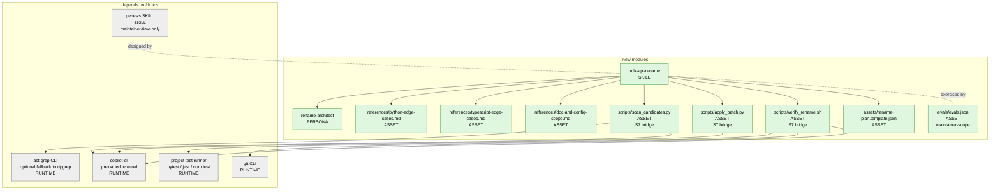
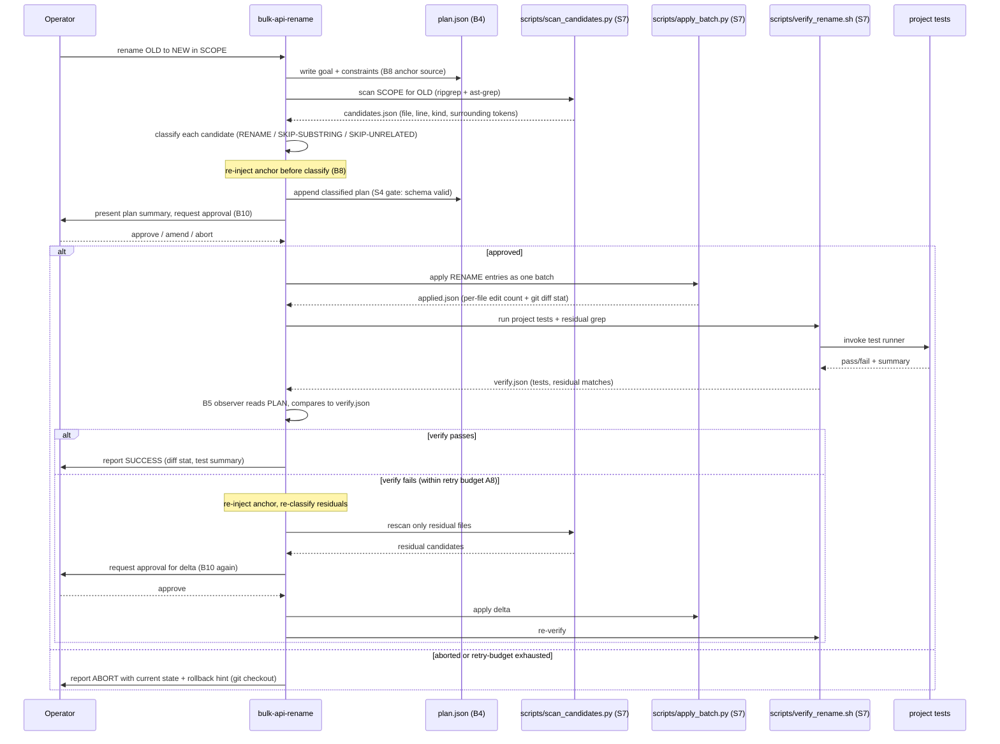
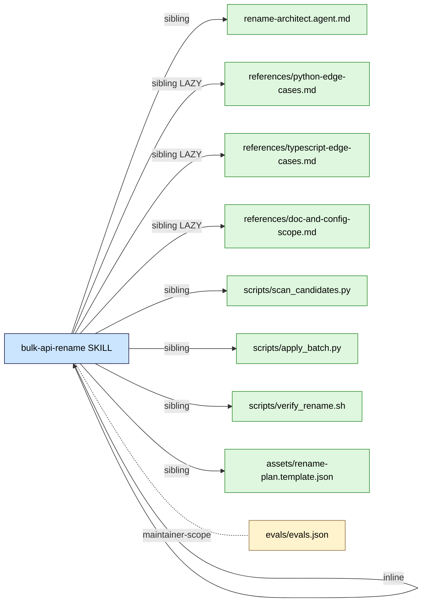

# Handoff Packet — S2 bulk-api-rename (v0.2 baseline)

Genesis run against `/Users/danielmeppiel/Repos/copilot-worktrees/genesis-v020-baseline/skills/genesis/`.
Scenario: skill that takes an old/new API name + scope and produces an audited,
applied, verified rename across a Python or TypeScript codebase.
Target harness: `copilot-cli` only. Steps 1–6 only. DESIGN ENDS AT STEP 6.

---

## Step 1 — Intent + scope

**Capability.** Given an operator-supplied triple `(old_name, new_name, scope)`,
produce an audited rename plan (every candidate occurrence classified as
RENAME / SKIP-SUBSTRING / SKIP-UNRELATED), apply the approved edits as one
structured batch across source, tests, and docs, run the project's existing
test suite, and emit a verification report (residual matches, test result,
diff summary).

**Trigger conditions.** Operator says "rename API X to Y", "rename function /
class / HTTP route / env var across the codebase", "bulk rename", "audited
rename"; or names two identifiers and a scope (directory, package, repo).

**Boundary (NOT covered).** Refactors that change call signatures, behavior,
or types. Cross-repo renames. Renames that require database migrations. Git
operations beyond `git status` / `git diff` reads — branching, committing, and
pushing remain with the operator. The skill does NOT pick the new name.

**Single Responsibility check.** Paragraph holds one verb chain
(plan → apply → verify a rename). No connective "and" splitting two capabilities.
PASS.

**Dispatch description (frontmatter `description`, draft, ≤1024 chars,
imperative, intent-first, indirect-triggers named, FORCED+DISCOVERY):**

> Use this skill whenever the operator asks to rename an identifier across a
> codebase — a function, class, method, HTTP route, environment variable, CLI
> flag, or config key — and the change must land in source, tests, and docs
> without breaking substring-similar names (e.g. rename `User` without
> touching `UserProfile`). Activate even when the operator does not say
> "rename": phrases like "replace every reference to X with Y", "swap the
> old name for the new one everywhere", "bulk find-and-replace this API",
> "move from old_flag to new_flag in the whole repo", or "we shipped the
> new name, retire the old one" all qualify. Required inputs are old name,
> new name, and scope (path / package / repo). The skill produces an
> audited plan first, asks for approval, then applies edits and runs the
> project's tests. It does not invent the new name and does not perform
> behavior-changing refactors.

Length: 952 chars. Invocation mode: **BOTH** (FORCED when operator names the
inputs, DISCOVERY on the indirect triggers above).

---

## Step 2 — Component diagram

Primitive tags: `bulk-api-rename` = MODULE ENTRYPOINT (SKILL).
`rename-architect` = PERSONA SCOPING FILE. `references/*` = ASSET (lazy load).
`scripts/*` = ASSET (executables called via S7). `evals/*` = ASSET (maintainer-
scope, lives outside user-facing bundle distribution boundary).

---

## Step 3 — Thread / sequence diagram

Pattern tier walk:

1. **Refactor triggers (R1–R4).** Body is single-responsibility; no R1 SPLIT.
   No proxy collapse (R4). EXTRACT (R3) for python / typescript / doc edge
   cases into `references/` — they only load when scope dictates.
2. **TIER 3 architectural.** The work names a SYSTEM OF RECORD (file tree
   under scope, project test suite) and CONSEQUENTIAL ACTIONS (bulk edits,
   test execution). Pick **A9 SUPERVISED EXECUTION** (plan → tool-apply →
   tool-verify, with retry on failed verify). Stages have ordered hand-offs
   with persisted artifacts between them — that overlays an **A2 PIPELINE**
   shape (scan → classify → plan → apply → verify) inside the A9 controller.
   When verify fails, a bounded **A8 ALIGNMENT LOOP** retries (re-classify
   the residual matches, re-apply, re-verify) up to N=2.
3. **TIER 2 design.** Mandatory **B4 PLAN MEMENTO** (the rename plan is the
   externalized state) and **B8 ATTENTION ANCHOR** (re-inject old_name,
   new_name, scope, "do not touch UserProfile" constraints at each step).
   **B10 HUMAN CHECKPOINT** before apply (operator must approve the plan).
   **B5 ACCEPTANCE OBSERVER** for the post-apply verify gate.
   **S7 DETERMINISTIC TOOL BRIDGE** for scan, apply, and verify (the rename
   is a side effect; substring classification is a fact-that-must-be-true).
   **S4 VALIDATION DECORATOR** between stages (plan must be schema-valid;
   apply diff must be non-empty; verify residual count must equal classifier-
   SKIPped count).
4. **TIER 1 idioms.** Defer to step 7b (copilot-cli adapter).

Single-thread topology: no fan-out is warranted. The work is one ordered
pipeline; lenses are not independent (each later stage strictly reads the
prior artifact). Lens-count gate did not fire → **NOT A1 PANEL**.

### Step 3.1 — Tradeoff check

No genuine alternative-in-tension. The lens-count gate (one ordered pipeline,
strictly stage-coupled) excludes A1 PANEL; the system-of-record + irreversible
edit gate selects A9 over plain A2; A8 is invoked only as the wrapping
retry-on-recoverable-failure layer per A9's composition note. SKIP the
`pattern-tradeoffs.md` consultation per the SKILL.md gate ("Skip this step
if step 3 produced an unambiguous pattern selection").

### Step 3.5 — Composition decision

Per-box composition mode:

| Box | Mode | Rationale |
|---|---|---|
| `bulk-api-rename` (SKILL.md body) | INLINE asset within itself | The module body is the unique procedure. |
| `rename-architect` PERSONA | LOCAL SIBLING (same skill folder, `agents/`) | Reused only by this skill; small; canonical per `primitives.md` PERSONA SCOPING placement. |
| `references/python-edge-cases.md` | LOCAL SIBLING (LAZY ASSET, C1) | Load only when scope path matches `**/*.py` or operator says "python". |
| `references/typescript-edge-cases.md` | LOCAL SIBLING (LAZY ASSET, C1) | Load only when scope path matches `**/*.{ts,tsx,js,jsx}` or operator says "typescript". |
| `references/doc-and-config-scope.md` | LOCAL SIBLING (LAZY ASSET, C1) | Load only when the candidate set contains `.md`/`.rst`/`.env`/`.yaml`/`.toml` hits. |
| `scripts/scan_candidates.py` | LOCAL SIBLING | S7 deterministic bridge. Ships with the skill bundle (user-facing runtime need). |
| `scripts/apply_batch.py` | LOCAL SIBLING | Same as scan. Atomic batch applier. |
| `scripts/verify_rename.sh` | LOCAL SIBLING | Same. Wraps the project's existing test runner; does not introduce one. |
| `assets/rename-plan.template.json` | LOCAL SIBLING | Template the LLM fills; pattern-match grounding per `SKILL.md` step 7b ("INCLUDE A TEMPLATE inline … agents pattern-match against concrete structure better"). |
| `evals/evals.json` | LOCAL SIBLING **maintainer-scope** (OUTSIDE user-facing distribution boundary) | Per `composition-substrate.md` BUNDLE LEAKAGE rule — eval scenarios are not needed at runtime. Lives in `evals/` next to SKILL.md but does not ship as a runtime asset. |

**No EXTERNAL MODULE declared.** All primitives live inside the skill folder.
`ast-grep` and the project test runner are NOT modules — they are CLIs probed
via S7. → Step 7b will NOT need a module-system adapter. → **DECLARATION
MECHANISM = N/A.** PHANTOM DEPENDENCY risk: none.

---

## Step 4 — SoC pass

- **Existing module overlap?** No existing skill in scope renames identifiers.
  No collision.
- **Sibling trigger collision?** The dispatch description targets a narrow
  intent ("rename identifier across a codebase"). Distinct from generic
  refactor / search-and-replace skills (none in the baseline corpus).
- **R1 SPLIT triggers.** Description has no conjunction of two capabilities.
  Body fits inside the 500-line / 5000-token budget (estimated ~280 lines).
  No multi-lens body. PASS.
- **R2 FUSE.** Body is not a one-paragraph shadow of a sibling. PASS.
- **R3 EXTRACT.** Applied — language edge cases live in `references/` with
  explicit load triggers.
- **R4 INLINE.** No thin proxy. PASS.
- **CONSEQUENTIAL SIDE EFFECT / FACT-MUST-BE-TRUE?** Yes — bulk file edits
  (apply) and test outcomes (verify) and substring-similarity classification
  (fact). All three cross **S7 DETERMINISTIC TOOL BRIDGE** via `scripts/*`,
  wrapped in **A9 SUPERVISED EXECUTION**. The apply step also gets
  **B10 HUMAN CHECKPOINT** because the edit is bulk and non-trivially
  reversible (git checkout is the rollback; named explicitly to operator).

---

## Step 5 — Compliance check

Classic principles & PROSE / LLM-truth pass:

| Axis | Finding | Severity |
|---|---|---|
| Single Responsibility | One capability chain. | PASS |
| Progressive Disclosure | `references/*` and scripts loaded on trigger; body stays lean. | PASS |
| Reduced Scope | Boundary excludes signature/behavior refactor and git mutations. | PASS |
| Orchestrated Composition | A9 wraps A2-shaped stages with B4/B8/B10/B5/S7/S4. | PASS |
| Safety Boundaries | B10 before apply; S4 between stages; rollback hint on abort. | PASS |
| Explicit Hierarchy | SKILL → persona + lazy references + scripts; no implicit imports. | PASS |
| LLM truth #1 (context decay) | B8 anchor re-injection at each stage boundary. | PASS |
| LLM truth #2 (context explicit) | All facts (candidate list, residuals, test outcome) flow as tool outputs. | PASS |
| LLM truth #5 (plan before execution) | Plan persisted to `plan.json` before any apply. | PASS |
| LLM truth #6 (harnesses bridge) | S7 routes named (scripts via copilot-cli terminal). | PASS |

### MODULE ENTRYPOINT canonical spec

| Check | Status |
|---|---|
| `name` matches `[a-z0-9-]`, 1–64 chars, equals directory | `bulk-api-rename` PASS |
| Body ≤ 500 lines AND ≤ 5000 tokens | Estimated 260–300 lines / ~3800 tokens PASS |
| `description` ≤ 1024 chars, imperative, intent-first, indirect triggers named | 952 chars PASS |
| Overflow content moved to `references/` with explicit load trigger | YES — language + doc references PASS |
| ASCII only | PASS (no non-ASCII in plan) |

**Open findings:** none at BLOCKER or HIGH. One LOW: classifier reasoning is
LLM-owned (substring vs full-token discrimination) — mitigated by S7
emitting structured surrounding-token context (preceding/following character
class, AST node kind when `ast-grep` is available), and by S4 verifying that
SKIP-SUBSTRING counts equal residual counts post-apply.

---

## Step 6 — Handoff packet

### Interface sketches

**`bulk-api-rename` (SKILL.md)**
- Trigger description: see Step 1 (≤1024 chars).
- Inputs: `old_name` (string), `new_name` (string), `scope` (path or glob),
  optional `language` hint (`python` / `typescript` / auto-detect), optional
  `dry_run` (bool, default false; if true, stop after plan presentation).
- Outputs (to operator chat): plan summary table, approval request, apply
  diff stat, verify report (tests pass/fail + residual count + diff link).
- Persisted artifacts (in working area): `plan.json`, `applied.json`,
  `verify.json`, `anchor.md` (B8 source).
- Dependencies (relative links): `agents/rename-architect.agent.md`,
  `references/{python,typescript,doc-and-config}-edge-cases.md`,
  `scripts/{scan_candidates.py, apply_batch.py, verify_rename.sh}`,
  `assets/rename-plan.template.json`.

**`agents/rename-architect.agent.md` (PERSONA)**
- Voice: meticulous refactor reviewer; assumes substring matches are guilty
  until classifier proves innocent.
- Loaded at: skill activation.
- Outputs: classification calls + go/no-go on apply.

**`scripts/scan_candidates.py`** — S7 bridge
- Contract: `scan_candidates.py --old NAME --scope PATH [--lang auto|py|ts]
  --out candidates.json`.
- Behavior: ripgrep word-boundary search (`\bNAME\b`), then ast-grep pass
  when available (Python / TS / TSX grammars) to enrich each hit with
  `kind` (identifier-decl, identifier-ref, string-literal, comment, import,
  test-id, doc-mention) and surrounding-token character classes.
- Stdout: structured JSON. Stderr: diagnostics. Exit non-zero on scope-not-
  found. `--help` documented. Pinned: `ast-grep@>=0.20`, optional.

**`scripts/apply_batch.py`** — S7 bridge
- Contract: `apply_batch.py --plan plan.json --out applied.json`.
- Behavior: reads only entries with `decision == "RENAME"`; performs
  atomic per-file edits (write to temp, fsync, rename). Aborts if any
  hunk's surrounding context changed since scan (stale-plan guard). Refuses
  to run if `git status --porcelain` shows uncommitted changes outside the
  scope (S4 precondition).
- `--help` documented; non-interactive.

**`scripts/verify_rename.sh`** — S7 bridge
- Contract: `verify_rename.sh --plan plan.json --applied applied.json
  --runner auto|pytest|jest|npm-test --out verify.json`.
- Behavior: residual grep (`rg -w OLD scope`); invokes detected test
  runner; emits structured `verify.json` with `tests_passed`,
  `tests_failed`, `residual_matches`, `expected_residuals` (= count of
  SKIP-* decisions from plan), `diff_stat`.

### Module composition table

(See Step 3.5 table above — reproduced as the authoritative version.)

### External modules required

**NONE.** No `apm`/`pip`/`npm` package dependency declaration is needed.
No module-system adapter loads at step 7b. Declaration mechanism: **N/A**.

### Declared target set

`copilot-cli` (single harness, as scoped by operator). Step 7a portability
check still runs against `runtime-affordances/common.md`; per-harness adapter
`runtime-affordances/per-harness/copilot.md` loads at 7b only if a
common-substrate gap is found (anticipated: B10 HUMAN CHECKPOINT realization
and PLAN PERSISTENCE slot — both likely supported in `common.md`; if not,
copilot adapter has to name the slot).

### Invocation mode

- `bulk-api-rename` SKILL: **BOTH** (FORCED on explicit "rename X to Y";
  DISCOVERY on the indirect-trigger phrasings in the description).
- `rename-architect` PERSONA: scoped to this skill (auto-loaded).
- `references/*`: DISCOVERY by load trigger (file extensions present in
  candidate set).

### Open compliance findings

LOW (1): classifier substring discrimination is LLM-owned. Mitigated by
structured context from S7 + S4 residual-count gate; accepted.

### Todo list (for step 7b coder thread)

| ID | Title | Depends on |
|---|---|---|
| `td-skill-body` | Draft `SKILL.md` body (procedure, template, links, anchor protocol) | — |
| `td-persona` | Draft `agents/rename-architect.agent.md` | `td-skill-body` |
| `td-ref-py` | Draft `references/python-edge-cases.md` (imports, `__all__`, conftest, fixtures, docstrings, type aliases) | `td-skill-body` |
| `td-ref-ts` | Draft `references/typescript-edge-cases.md` (re-exports, `import type`, JSX tag names, decorators, jest mocks) | `td-skill-body` |
| `td-ref-doc` | Draft `references/doc-and-config-scope.md` (markdown code fences vs prose, env files, YAML keys vs values) | `td-skill-body` |
| `td-scan` | Implement `scripts/scan_candidates.py` (ripgrep + ast-grep fallback) | — |
| `td-apply` | Implement `scripts/apply_batch.py` (atomic batch, stale-plan + clean-tree guards) | `td-scan` |
| `td-verify` | Implement `scripts/verify_rename.sh` (residual grep + runner detect) | `td-scan` |
| `td-template` | Draft `assets/rename-plan.template.json` (schema + example) | `td-skill-body` |
| `td-evals` | Implement `evals/evals.json` per evals plan below | `td-skill-body` |
| `td-validate` | Step-8 validation pass (lints + real-task refinement on this repo) | all above |

### Evals plan

Per SKILL.md step 6 evals-plan requirement (canonical spec for MODULE
ENTRYPOINT primitive evaluating-skills + optimizing-descriptions; see
`assets/primitives.md`).

**Content evals (with_skill vs without_skill, 3 scenarios):**

1. *Python function rename, 60 files, with `User` vs `UserProfile`
   substring trap.* Expected with_skill: classifier marks 11 `UserProfile`
   hits as SKIP-SUBSTRING; apply touches 49 files; tests pass; residual
   count = 11. Expected without_skill: high likelihood of false-positive
   edits in `UserProfile`, broken tests.
2. *TypeScript HTTP route rename `/v1/users` → `/v1/people`, hits in
   route file + 4 tests + 2 OpenAPI docs.* Expected with_skill: doc
   reference loaded, all three site classes correctly identified. Without:
   docs likely missed.
3. *Env var rename `OLD_API_TOKEN` → `NEW_API_TOKEN` across `.env.example`,
   YAML CI files, Python config loader.* Expected with_skill: YAML keys
   updated only when keys, not values; CI references updated.

Gate: if `with_skill` and `without_skill` outputs are indistinguishable on
any scenario, redesign or delete. Spec-mandated.

**Trigger evals (~20, 60/40 train/val):**

Should-trigger (10): "rename `OldClient` to `NewClient` everywhere in
`src/`", "swap our HTTP route `/v1/users` for `/v1/people`", "we renamed
the env var `OLD_TOKEN` → `NEW_TOKEN`, retire the old one across the
repo", "bulk find-and-replace `getUser` with `fetchUser` in the TS
project", "rename CLI flag `--old-mode` to `--mode` everywhere it appears",
"replace every reference to the old config key `legacy_timeout` with
`request_timeout_ms`", "audit and apply the rename of method `Foo.bar`
to `Foo.baz`", "we shipped the new name `Customer`; remove all uses of
`Client` in the customer-service package", "rename Python function
`load_data` to `load_records` across src and tests", "swap the React prop
`onClicked` for `onClick` in our components".

Near-miss should-NOT-trigger (10): "rename this branch to feature-x" (git,
not code), "rename this file from `a.py` to `b.py`" (file rename, not
identifier), "rename the workspace" (IDE), "refactor `getUser` to take a
context argument" (signature change), "extract `fetchUser` into its own
module" (move, not rename), "deprecate `OldClient` but keep both" (no
rename), "translate variable names from French to English" (i18n, fuzzy),
"rename my AWS S3 bucket" (cloud), "let's rename our team" (org), "rename
the database column `legacy_id` to `id`" (schema migration, outside
boundary).

Split 60/40 train/val. Validation split is the ship gate:
- `should_trigger` rate on val ≥ 0.5
- `should_not_trigger` rate on val < 0.5

---

## Appendix — Model binding declarations (BEST-GUESS; corpus has no model catalog)

> The v0.2.0 baseline corpus does NOT include a `model-catalog.md` or
> `token-economics.md`. The architect therefore makes best-guess SKU
> bindings from generic knowledge. **THESE BINDINGS ARE UNGROUNDED.**

| Role | Suggested SKU (best guess) | Justification (heuristic, not corpus-cited) |
|---|---|---|
| `bulk-api-rename` SKILL orchestrator (the body that reads candidates, classifies, drives the pipeline) | a strong general-purpose coding model (e.g. Claude Sonnet 4.x / GPT-5 / GPT-4.1 class) | needs reliable JSON-shaped output, code understanding, and disciplined plan adherence across many candidates |
| `rename-architect` PERSONA (classification reasoning per candidate) | same tier as orchestrator | substring vs identifier discrimination is the load-bearing reasoning; a smaller model risks the LOW finding becoming MEDIUM |
| Step-8 validation (PROSE / size-budget lint) | small fast model (e.g. Haiku / GPT-5-mini class) | mechanical, schema-shaped |
| Eval grader (trigger eval scoring) | small fast model | binary should/should-not labels |

**Cost note: best-guess only.** Concrete per-1M-token figures not derivable
from the baseline corpus.

---

## Appendix — PATTERNS CITED (all present in v0.2.0 corpus)

- **A9 SUPERVISED EXECUTION** — `assets/architectural-patterns.md` §A9.
  Selected as the wrapping topology (plan / deterministic-execute / verify).
- **A2 PIPELINE** — `assets/architectural-patterns.md` §A2. Shape of the
  internal stage progression inside A9.
- **A8 ALIGNMENT LOOP** — `assets/architectural-patterns.md` §A8 (referenced
  by A9's composition note). Bounded retry on verify failure.
- **B4 PLAN MEMENTO** — `assets/design-patterns.md` §B4. `plan.json`
  externalized state.
- **B8 ATTENTION ANCHOR** — `assets/design-patterns.md` §B8. Goal + hard
  constraints (`do not rename UserProfile`, `scope = X`) re-injected at
  every stage boundary.
- **B10 HUMAN CHECKPOINT** — `assets/design-patterns.md` (referenced from
  A9). Approval gate before apply.
- **B5 ACCEPTANCE OBSERVER** — `assets/design-patterns.md` §B5. Verify
  stage compares plan to actual outcome.
- **S7 DETERMINISTIC TOOL BRIDGE** — `assets/design-patterns.md` §S7.
  Three bridges (scan, apply, verify), all via PRELOADED TERMINAL ROUTE.
- **S4 VALIDATION DECORATOR** — `assets/design-patterns.md` §S4. Gates
  between stages.
- **C1 LAZY ASSET** — `assets/design-patterns.md` §C1. Language and doc
  references loaded only when relevant.
- **R3 EXTRACT** — `assets/refactor-patterns.md` §R3. Edge cases promoted
  out of SKILL.md body into `references/`.
- **Composition substrate concept 3 (DISTRIBUTION BOUNDARY)** — used to
  place `evals/` as maintainer-scope to avoid BUNDLE LEAKAGE
  (`assets/composition-substrate.md` anti-patterns).
- **MODULE ENTRYPOINT canonical spec** — `assets/primitives.md` §2. Used
  for `description` length, body size budget, `name` regex, references/
  load-trigger discipline.
- **PRELOADED TERMINAL ROUTE** — `assets/design-patterns.md` §S7 EXTENSION
  PATHS, route 1. Chosen because installed CLIs (`rg`, `ast-grep`, `git`,
  test runners) already do the work.

---

## Appendix — PROJECTED COST estimate

> Best-effort heuristic estimate. The v0.2.0 baseline corpus has NO
> `token-economics.md` — no per-stage token budgets or per-SKU $/1M figures.
> Numbers below are **architect-eyeballed**, not corpus-grounded.

Per single rename run, 60-file scope, ~120 candidate hits, ~80 RENAME +
40 SKIP-*:

| Stage | Approx. tokens (in+out) | Notes |
|---|---|---|
| Scan ingestion + classification | 35k–60k | candidates.json is the bulk; LLM emits structured decisions |
| Plan synthesis + present-to-operator | 5k–10k | summary table only |
| Apply oversight | 2k–4k | reads applied.json, emits diff stat |
| Verify oversight + B5 observer | 4k–8k | reads verify.json |
| Anchor re-injections (B8, 4 boundaries) | 2k–4k total | goal + hard constraints only |
| Optional retry loop (×1) | +20k–35k | only on verify failure |
| **Total per run (no retry)** | **~50k–85k tokens** | dominated by classification |
| **Total per run (with one A8 retry)** | **~70k–120k tokens** | |

Without `model-catalog.md` / `token-economics.md`, the architect **cannot
produce a $-figure** in this v0.2 cell. Recorded as a gap below.

---

## Appendix — PATTERNS WANTED BUT UNAVAILABLE (in v0.2.0 corpus)

Patterns / catalogs the design would have benefited from but which are
**absent** from the baseline corpus and were therefore NOT cited:

1. **`assets/model-catalog.md`** — would have produced grounded SKU
   bindings for orchestrator vs persona vs validator vs eval-grader roles
   instead of best-guess. Absence visible in the model-binding appendix.
2. **`assets/token-economics.md`** — would have produced per-stage token
   budgets, per-SKU $/1M figures, and a defensible projected-cost line
   item per scenario instead of an eyeballed range.
3. A pattern explicitly named "**ATOMIC BATCH WRITE**" or "**STAGED
   DIFF APPLY**" — the design hand-rolls atomic write + stale-plan guard
   inside `apply_batch.py`. A first-class pattern would have made the S7
   bridge's correctness argument citable rather than locally argued.
4. A pattern explicitly named "**LANGUAGE-AWARE SCOPE RESOLVER**" —
   would have generalized the ast-grep-vs-ripgrep fallback chain and
   the substring-vs-identifier classifier so the design could cite it
   rather than describe it inline.
5. A "**RETRY-WITH-DIFFERENTIAL-REPLAN**" behavioral pattern — A8
   ALIGNMENT LOOP is close but is goal-alignment-oriented. The bounded
   "re-scan only residuals, present delta for approval, re-apply" loop
   here would have been cleaner as its own named pattern.
6. A per-harness adapter section in `runtime-affordances/per-harness/
   copilot.md` covering the **copilot-cli interactive shell input
   discipline** (B10 checkpoint realization in a CLI terminal) — present
   adapter file may or may not cover this; not inspected in step 6 per
   SKILL.md gate ("per-harness adapters load only at step 7b").

DESIGN ENDS HERE. Do not draft natural-language module bodies.
