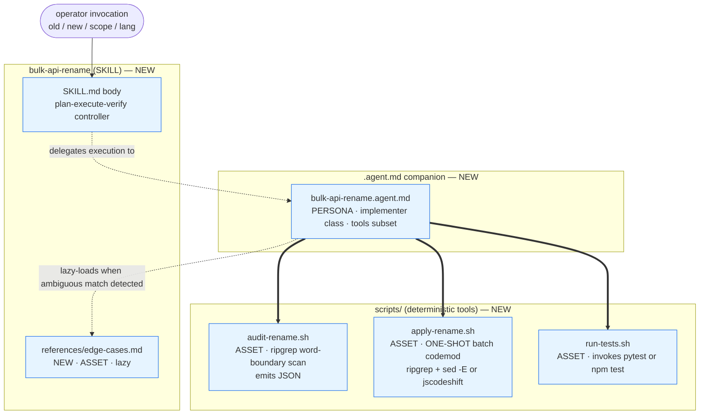
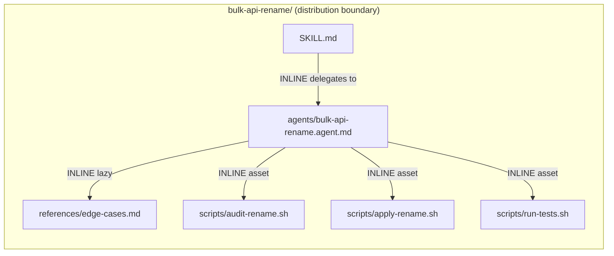

# Handoff Packet — Scenario S2 `bulk-api-rename` (v0.3.5)

Corpus: `skills/genesis/` v0.3.5 (cost-aware).
Target harness: **copilot-cli only**.
Operator cost stance: **balanced** (default; no stance declared in
prompt). No hard cap declared.

Verified at design time:
- `assets/token-economics.md` present.
- `assets/runtime-affordances/model-catalog.md` present (RESEARCHER
  class v0.3.5 included).

---

## Step 1 — Intent + scope

**Capability.** Given `(old-name, new-name, scope-glob, lang-hint)`,
audit the codebase for every occurrence of `old-name` as a
WORD-IDENTIFIER (not as a substring fragment of a larger token),
produce an inspectable plan, apply all edits in a SINGLE structured
batch operation, run the project's existing test suite, and emit a
verification report (per-file edit counts, skipped substring matches,
test pass/fail summary, suggested follow-ups).

**Trigger nouns/verbs.** rename / replace / refactor identifier /
mass-substitute / bulk rename / API rename across a Python or
TypeScript codebase; renaming a function, class, HTTP route literal,
or environment-variable name across 10+ files.

**Boundary (what it does NOT do).**
- Does NOT perform semantic-equivalent refactors (signature changes,
  argument reorderings, type-level rewrites). Identifier substitution
  only, with optional case-variant tracking.
- Does NOT cross repository boundaries.
- Does NOT auto-merge, push, or open a PR. Emits a diff branch + report.
- Does NOT rename DB columns, migration files, or external API
  contracts. Operator explicitly opts in per-stage.
- Does NOT silently update vendored / generated code unless scope
  glob includes it.

**Invocation mode.** FORCED. Operator must invoke with explicit
old/new/scope; no discovery-mode trigger (this is a destructive
batch operation; description-matching dispatch is too loose).

**Dispatch description (frontmatter `description`, <=1024 chars):**
> Use this skill when the user wants to rename an API identifier
> (function, class, HTTP route string, environment-variable name,
> module export) across many files in a single Python or TypeScript
> codebase and needs the rename audited, applied as a batch, and
> verified against the existing test suite. Triggers on phrasings
> like "rename X to Y everywhere", "bulk-replace X across the
> repo", "refactor the API to call this Y instead of X",
> "change the name of this function/class/env var across the
> codebase". Required inputs: old-name, new-name, scope (path glob),
> language hint. Use even when the user does not say "skill" or
> "refactor" — phrasings like "find and replace this name" qualify
> when the substitution is identifier-scoped. Do NOT use for
> semantic refactors (signature changes, argument reorders, type
> rewrites) or for cross-repo renames.

**Cost stance & cap.** balanced; no cap. Step 3.2 still runs.

---

## Step 2 — Component diagram



Module classification: SKILL · PERSONA · ASSET (per
`assets/primitives.md`). No ORCHESTRATOR (no event surface). No
RULE (no scope-attached cross-cutting constraint).

---

## Step 3 — Thread / sequence diagram

Single-thread sequential workflow with a deterministic tool bridge
on every consequential step. No fan-out: a rename has one lens
(identifier substitution correctness), so per the SKILL.md "default
pattern selection" lens-count gate, fan-out is NOT warranted.

Architectural shape selected: **A9 SUPERVISED EXECUTION (weak form)**.
Composes B4 PLAN MEMENTO, S7 DETERMINISTIC TOOL BRIDGE on every
consequential step, S4 VALIDATION DECORATOR (test run gates "done"),
B10 HUMAN CHECKPOINT before the destructive `apply` call, B8
ATTENTION ANCHOR for the operator-stated goal (old/new/scope).

```mermaid
sequenceDiagram
    autonumber
    participant OP as Operator
    participant AG as bulk-api-rename.agent
    participant FS as Plan store (plan.md)
    participant TL as Terminal (S7 bridge)

    OP->>AG: invoke(old, new, scope, lang)
    AG->>FS: B4 persist plan + B8 anchor (goal)
    AG->>TL: audit-rename.sh --old X --new Y --scope G --lang L
    TL-->>AG: JSON {files[], occurrences[], substring_hits[], case_variants[]}
    AG->>AG: classify edge cases (lazy-load edge-cases.md if any substring_hits > 0)
    AG-->>OP: present plan (file count, occurrence count, edge-case warnings)
    OP->>AG: B10 approve / modify regex / abort
    alt approved
        AG->>TL: apply-rename.sh --pattern <regex> --replacement <new> --scope G
        TL-->>AG: JSON {files_changed, total_edits, diff_path}
        AG->>TL: run-tests.sh --scope G
        TL-->>AG: JSON {passed, failed, errors[], duration_s}
        alt tests pass (S4 gate)
            AG-->>OP: verification report (PASS) + diff path + next-step hints
        else tests fail
            AG-->>OP: verification report (FAIL) + failing tests + revert instructions
        end
    else aborted or modified
        AG->>FS: update plan; loop to audit if regex modified
    end
```

Notes (per `mermaid-conventions.md`):
- Dashed return arrows from TL to AG are tool-call results crossing
  back into the LLM's next inference step.
- All `apply-rename.sh` invocation = ONE tool turn. The naive design
  fires N edit-tool calls (one per file = 50+ turns); this design
  fires ONE bridged call. See §"S7 + B15 explicit choice" below.

### S7 + B15 explicit choice (naive vs correct)

| Axis | Naive design | This design |
|---|---|---|
| Apply step | LLM calls `edit` tool once per file | LLM calls `apply-rename.sh` ONCE for all files |
| Turn count for 50 files | 50+ (one per file, plus reasoning turns) | 1 |
| Output tokens for apply step | ~50 × (filename + diff hunk preview) → L band | One JSON summary → S band |
| Tool catalogue presented | full edit tool surface, every turn | subset: `execute` only, locked at agent entry |
| Per-file probability of identifier-collision error | independent (compounds) | bounded by ONE regex declaration |
| B15 binding | IMPLICIT FULL SURFACE (anti-pattern) | declared `tools: [read, execute]` |
| S7 path | HAND-ROLLED HALLUCINATION (LLM is the engine) | preloaded-terminal + bundled script |

The choice is explicit: the apply phase is a CONSEQUENTIAL SIDE
EFFECT whose answer must be the actual answer (not a plausible
answer). S7 SELECTION HEURISTIC fires on "apply" verb. Substrate
choice = CUSTOM CLI / SCRIPT route from S7 EXTENSION PATHS
(structured JSON contract, version-pinned, --help documented, run
non-interactively). Pairing with B15 closes the loop: only the
`execute` tool needs to be visible to the agent during the apply
phase, and the script is the ONLY thing the agent calls.

---

## Step 3.1 — Tradeoff check

One slot has two candidate patterns: the **rename engine** inside
`apply-rename.sh`.

Option A — ripgrep + `sed -E` with `\b` word boundaries
- Pros: zero-dependency on most dev boxes; language-agnostic; one
  binary already present.
- Cons: word-boundary regex misses some token boundaries in
  TypeScript (e.g. inside template-literal route strings) and
  inside Python f-strings; no AST-level scope awareness.

Option B — language-aware codemod (`libcst` for Python,
`ts-morph` / `jscodeshift` for TypeScript)
- Pros: AST-aware; scope-correct; can distinguish `User` (class)
  from `User` inside an unrelated string literal.
- Cons: language-bound; runtime install needed; per-language path.

Matrix cited (per `pattern-tradeoffs.md` — load on demand at step 7b):
the GROUNDING-DOCTRINE row that cuts deterministic regex against
AST-aware tooling. The cell that matches our failure mode ("rename
`User` without renaming `UserProfile`") is satisfied by **Option A
PLUS** an audit-time enumeration of substring hits surfaced to the
human in step B10. AST-aware tooling is reserved as an opt-in
escalation when `substring_hits > 0` and the operator declines to
narrow the regex.

Decision: **layered**. Default Option A. Operator can pass
`--engine ast` to escalate to Option B; documented in script
`--help`. The architect's design contract is the JSON output schema,
not the underlying engine.

---

## Step 3.2 — Cost check (per `references/cost-economics-process.md`)

Stance applied: **balanced**. Cap: none declared.

Per-module cost-shape table:

| Module | Role class | Prefix size | Output volume | Turn count | Cost patterns applied | Cost-shape matrix row |
|---|---|---|---|---|---|---|
| SKILL.md body | n/a (controller prose; runs in agent prefix) | S (<5K) | n/a | n/a | B14 (thrift at lint) | tradeoffs §10 prose-bloat row |
| bulk-api-rename.agent.md | **implementer** (BIND EXPLICIT, BIND DOWN from likely planner/reviewer session default) | M (5-20K incl. SKILL + persona + edge-cases when loaded) | S (<500 — terse decisions, single JSON-shaped report) | low (3-5) | B12 (explicit binding), B13 (stable prefix, no model switch, no timestamp), B15 (tools subset), B16 (medium effort, no max) | tradeoffs §10 cost-shape row "single role, single stage, bridged execution" |
| audit-rename.sh | tool (no LLM cost) | n/a | n/a | n/a | S7 | n/a |
| apply-rename.sh | tool (no LLM cost) | n/a | n/a | n/a | **S7 + B15** (cross-ref: tool batching aka CodeAct collapses N turns to 1) | tradeoffs §10 "output-burst → S7 delegation" row |
| run-tests.sh | tool (no LLM cost) | n/a | n/a | n/a | S7 | n/a |
| references/edge-cases.md | asset (lazy, only loaded on substring_hits > 0) | adds S band when loaded | n/a | n/a | C1 LAZY ASSET (cost-driven) | n/a |

Routing rationale (per `assets/runtime-affordances/model-catalog.md`
§"Routing axes" and `design-patterns.md` §B12 SELECTION RULE):

1. HARNESS DEFAULT on Copilot CLI for `.agent.md` with no `model:`
   line = session default. Per `per-harness/copilot.md` §9 table.
2. REQUIRED role class = **implementer**. Capability profile:
   "follows a given plan reliably; terse output; low hallucination
   on routine edits; emits structured verdicts after a tool result."
   This is the implementer rubric (`model-catalog.md` §implementer).
   NOT planner (no novel plan generation — plan is fixed by the
   `audit → confirm → apply → verify` loop). NOT reviewer (work is
   plan execution, not pattern-matching against a rubric). NOT
   researcher (closed problem, rubric exists). NOT trivial
   (interpreting test failures + classifying substring hits is
   beyond classification).
3. BIND EXPLICITLY (rule 3 of SELECTION RULE) for PREDICTABILITY
   + AUDIT TRAIL: operator reads "implementer" off the design
   without consulting the session-default table.

Cache discipline (B13): stable prefix = persona body + SKILL body
+ tools subset declaration. Variable suffix = operator inputs +
tool results. No timestamps, no mid-session model switch
(forbidden by binding rule), no mid-session effort change (B16
declared once at agent entry), no tool-catalogue mutation
(B15 declared once and held).

Tool surface (B15): declared `tools: [read, execute]` on the
`.agent.md`. Excludes `edit` (deliberate — apply phase goes
through the script, not the edit tool), `agent` (no fan-out),
`web` (no external lookup), `todo` (single-thread, plan.md
holds state), and any MCP servers. This is what makes the
naive 50-edit-tools-per-rename anti-pattern STRUCTURALLY
impossible: the model literally cannot call `edit` because
the tool is not in its catalogue.

Effort (B16): implementer-class → `medium` effort (Copilot
session default behaviour for sonnet-class). No bind-up.

Output volume: agent emits a final report ~200-400 tokens
(verdict + counts + diff path). S band. Bridge results are
JSON summaries, not full diff dumps; the LLM does not
ingest the full diff text.

Cost-shape tradeoff (consulted): pattern-tradeoffs.md §10
cost-shape matrix has no two-pattern tension here; the
shape is unambiguously a `bridged-execution single-role`
gradient-free workflow. A12 GRADIENT WORKFLOW NOT applied
(fan width = 1; the A12 break-even threshold is N>=2; this
is a single-stage flow).

---

## Step 3.5 — Composition decision

Per `assets/composition-substrate.md`:

| Box | Composition mode | Rationale |
|---|---|---|
| `SKILL.md` body | INLINE | content unique to this skill |
| `bulk-api-rename.agent.md` | LOCAL SIBLING | content reused only here; lives at the per-element B12 binding site (Copilot's only B12 surface; see `per-harness/copilot.md` §9) |
| `scripts/audit-rename.sh` | INLINE asset | unique tool, ships with skill, runs through preloaded terminal |
| `scripts/apply-rename.sh` | INLINE asset | unique tool, ships with skill, structured JSON contract |
| `scripts/run-tests.sh` | INLINE asset | unique tool; thin wrapper over `pytest` / `npm test` |
| `references/edge-cases.md` | INLINE asset (lazy load per S5 LAZY PROXY + C1) | only consulted when audit reports substring_hits > 0 |

**No EXTERNAL modules required.** No module-system adapter needs
to load at step 7b. No PHANTOM DEPENDENCY risk.

Dependency graph:



All edges INLINE; no EXTERNAL edges. Single distribution boundary.
The agent file `bulk-api-rename.agent.md` LIVES INSIDE the SKILL
directory so the skill ships as one coherent unit; deployment
follows agentskills.io convention.

---

## Step 4 — SoC pass

- No existing module in the corpus performs identifier-scoped
  bulk rename. No duplication.
- No sibling skill triggers on the same description register; the
  dispatch description is bound to identifier-rename verbs +
  required inputs (old-name / new-name / scope).
- No R1 SPLIT trigger fires: the workflow is one coherent
  responsibility (audited identifier replacement). No "and"
  conjunction in the dispatch description.
- No R2 FUSE: distinct from other skills.
- No R3 EXTRACT: edge-cases.md is the only candidate; it's already
  extracted as a lazy reference.
- No R4 INLINE: no thin proxy.
- R5 COST PRUNE triggers checked: naive design would fire
  CATALOGUE BLOAT (full `edit` tool surface), OUTPUT BURST
  (per-file diff regen) and IMPLICIT FULL SURFACE; this design
  pre-empts all three.
- CONSEQUENTIAL SIDE EFFECTS named (`apply`, `delete unused
  imports`, `run tests`) → S7 + S4 + B10 already wired (see
  step 3 sequence).

No SoC violations.

---

## Step 5 — Compliance check

| Rule | Status | Note |
|---|---|---|
| `name` regex + matches parent dir | PASS | `bulk-api-rename` in `bulk-api-rename/` |
| `description` <= 1024 chars, imperative, intent-first, indirect triggers named | PASS | step 1 description ≈ 950 chars |
| SKILL.md body <= 500 lines AND <= 5000 tokens | TARGET | enforced at step 8 |
| ASCII only | PASS (target) | |
| Coherent unit (SRP) | PASS | identifier-scoped bulk rename, full stop |
| PROSE 5-axis: Progressive Disclosure, Reduced Scope, Orchestrated Composition, Safety Boundaries, Explicit Hierarchy | PASS | edge-cases lazy; scope is scoped; A9 composition; B10 + S4 gates; SKILL→agent→scripts hierarchy |
| Seven LLM truths | PASS | truth #2 (CONTEXT EXPLICIT) — every fact comes from a tool; truth #5 (PLAN BEFORE EXECUTION) — B4 persisted; truth #6 (HARNESSES BRIDGE) — S7 everywhere |
| Bundled scripts: non-interactive, --help, structured stdout, stderr split, version pin | TARGET (step 8) | scripts contract documented in handoff |
| B12 ZERO-EXPLICIT anti-pattern | PASS (avoided) | explicit `model:` declared on `.agent.md` |
| B12 BIND-UP-WITHOUT-JUSTIFICATION | PASS (avoided) | implementer is the rubric-derived class, not a "to be safe" promotion |
| B12 BULK IDENTICAL BINDING | N/A | single agent, no panel |
| B15 WRONG-PRIMITIVE BINDING | PASS | `tools:` declared on `.agent.md`, not on SKILL.md |
| B13 invalidators | PASS | none introduced |
| S7 HAND-ROLLED HALLUCINATION | PASS (avoided) | rename engine is the script, not the LLM |
| A9 PLAN-AND-PRAY | PASS (avoided) | `apply-rename.sh` actually applies; verifier is `run-tests.sh` (deterministic), not LLM-asserted |
| A9 UNCHECKPOINTED IRRECOVERABLE | PASS | B10 human checkpoint before apply |

No BLOCKER. No HIGH. One MEDIUM (open): documentation guidance for
operators on rolling back when `run-tests.sh` reports FAIL (the
report includes git revert instructions). Tracked in todos.

---

## Step 6 — Handoff packet

### Interface sketches

**`SKILL.md`** (controller; ≤500 lines)
- Trigger: per dispatch description above.
- Inputs (from operator prompt): `old`, `new`, `scope` (glob),
  `lang` (`py` | `ts`).
- Outputs: verification report (markdown).
- Dependencies (relative links): `agents/bulk-api-rename.agent.md`,
  `references/edge-cases.md`, `scripts/audit-rename.sh`,
  `scripts/apply-rename.sh`, `scripts/run-tests.sh`.

**`agents/bulk-api-rename.agent.md`** (PERSONA; B12 + B15 + B16
binding site)
- Frontmatter: `name: bulk-api-rename`, `description: <reuse>`,
  `model: <implementer-class SKU per per-harness/copilot.md §9>`,
  `tools: [read, execute]`.
- Body: 4-phase loop — `audit → confirm → apply → verify` — each
  step references the bundled script by relative path.
- Inputs: same as SKILL.md.
- Outputs: structured report.
- Dependencies: scripts/* (relative), references/edge-cases.md
  (lazy).

**`scripts/audit-rename.sh`** (deterministic tool, S7)
- Contract (stdout JSON):
  ```json
  {
    "old": "User", "new": "Account",
    "scope": "src/**/*.py",
    "files": [{"path": "src/x.py", "occurrences": 7}, ...],
    "total_occurrences": 142,
    "substring_hits": [
      {"path": "src/profile.py", "token": "UserProfile", "count": 3}
    ],
    "case_variants": [
      {"path": "src/y.py", "token": "user", "count": 4},
      {"path": "src/y.py", "token": "USER", "count": 1}
    ]
  }
  ```
- Diagnostics on stderr; exit 0 on success, non-zero on scope
  resolution errors.
- Non-interactive; `--help` documented; version pin via shebang
  + `ripgrep` version check.

**`scripts/apply-rename.sh`** (deterministic tool, S7 + B15)
- Contract (stdout JSON):
  ```json
  {
    "engine": "sed",
    "pattern": "\\bUser\\b",
    "replacement": "Account",
    "files_changed": 47,
    "total_edits": 142,
    "diff_path": ".genesis/rename-2026-XX-XX.diff",
    "branch": "rename/User-to-Account"
  }
  ```
- Side effect: creates a git branch, applies edits in one
  ripgrep+sed pipeline (or AST engine if `--engine ast`), commits
  on the branch. Does NOT push.
- `--engine sed | ast` flag for escalation per step 3.1.
- Non-interactive; `--help` documented; version pin.

**`scripts/run-tests.sh`** (deterministic tool, S4 gate)
- Contract (stdout JSON): `{passed, failed, errors[], duration_s}`.
- Wraps `pytest -q` or `npm test --silent` per `--lang` flag.
- Non-zero exit on test failure; LLM reads JSON, not text wall.

**`references/edge-cases.md`** (LAZY ASSET)
- Loaded only when `audit-rename.sh` reports
  `substring_hits.length > 0` OR `case_variants.length > 0`.
- Documents: word-boundary regex traps; case-variant strategies;
  template-literal collisions; docstring vs code distinction;
  `--engine ast` escalation path.

### Module composition table

(reproduced from step 3.5; see above)

### External modules required

**NONE.** No module-system adapter loaded at step 7b. No
declaration mechanism row required.

### Declared target set

`copilot-cli only`. Justification per
`assets/runtime-affordances/portability-rules.md`: B12 + B15
binding REQUIRES `.agent.md` (the per-element binding site is
Copilot-specific; see `per-harness/copilot.md` §9 and §"Cost-
pattern bindings"). Cross-harness re-targeting requires re-running
step 3.5 with the target harness's binding site.

### Invocation mode

- SKILL.md: **FORCED** (operator must supply old/new/scope; no
  discovery-mode wandering).
- bulk-api-rename.agent.md: **FORCED** (invoked by SKILL.md
  delegation, not by free dispatcher matching). `user-invocable: false`
  is acceptable (programmatic only).

### Open compliance findings

- MEDIUM (open): operator rollback documentation — covered in
  todo `verify-report-template`.

### Todos

| id | title | status | depends_on |
|---|---|---|---|
| skill-body | Drafting SKILL.md controller body | pending | — |
| agent-body | Drafting bulk-api-rename.agent.md persona body | pending | — |
| audit-script | Implementing scripts/audit-rename.sh + --help + JSON schema | pending | — |
| apply-script | Implementing scripts/apply-rename.sh + --engine flag + branch+commit semantics | pending | audit-script |
| tests-script | Implementing scripts/run-tests.sh wrapper (pytest+npm) | pending | — |
| edge-cases-ref | Authoring references/edge-cases.md (lazy) | pending | audit-script |
| verify-report-template | Inlining verification-report template in agent body (incl. rollback instructions) | pending | apply-script, tests-script |
| evals-content | Writing 2-3 content evals (with_skill vs without_skill) | pending | skill-body, agent-body |
| evals-trigger | Writing ~20 trigger evals (8-10 should-fire + 8-10 near-miss) | pending | skill-body |
| validate | Running step-8 lint + cost checklist + real-task refinement | pending | (all above) |

### Evals plan

**Content evals (2-3 prompts, run with_skill vs without_skill):**

1. *Python rename, clean case.* "Rename `get_user` to `get_account`
   in `src/**/*.py`." Expected (with_skill): structured audit report
   → human gate → batch apply → tests pass → verification report
   with file counts. Expected (without_skill): meandering grep,
   per-file edit calls, no audit step, no rollback guidance.
2. *TypeScript rename, substring-collision case.* "Rename `User`
   to `Account` in `src/**/*.ts`." Expected (with_skill): audit
   reports `UserProfile` substring hits, edge-cases.md auto-loads,
   operator gated before apply. Expected (without_skill):
   high risk of renaming `UserProfile` to `AccountProfile`.
3. *Mixed env-var rename.* "Rename env var `API_KEY` to
   `SERVICE_TOKEN` across `.env*`, `src/`, and docs."
   Expected (with_skill): case-variant report flags case
   differences; per-scope confirmation.

If with_skill ≈ without_skill on any of the three: redesign or
delete.

**Trigger evals (~20, 60/40 train/val):**

Should trigger (10):
- "rename `get_user` to `get_account` across the repo"
- "bulk replace `OldClient` with `NewClient` in src/"
- "refactor the API: change `POST /v1/users` route name to `/v1/accounts`"
- "find and replace the env var `API_KEY` everywhere"
- "I want to mass-rename `parseToken` to `decodeToken`"
- "rename this function across 50+ files"
- "swap out the name of this class globally"
- "change every reference to `LegacyAdapter` to `Adapter`"
- "do a codebase-wide rename of `foo_bar` to `baz_qux`"
- "rename module export `default` from `User` to `Account`"

Should NOT trigger near-misses (10):
- "rename this file from `user.py` to `account.py`" → file rename,
  not identifier rename
- "refactor `get_user` to take a `tenant_id` parameter" → signature
  change, out of scope
- "change the return type of `get_user` from `User` to `User | None`" → type-level
- "extract `get_user` into a separate module" → R3 EXTRACT, not rename
- "rename the git branch from `feature/x` to `feature/y`" → not source
- "rename the column `user_id` in the database" → migration, out of scope
- "rename this PR" → metadata, not source
- "what does the `User` class do?" → Q&A, no rename
- "find all callers of `get_user`" → call-graph, no rename
- "rename `User` to `Account` in this one file" → one-file scope; skill
  warns and offers to scope down (still triggers but downgrades; this
  one is a EDGE case — keep in val split to measure boundary)

Validation split (8 entries: 5 should-trigger + 3 near-miss) is the
ship gate: ≥0.5 fire rate on should, <0.5 fire rate on should-not.

### PER-ELEMENT MODEL BINDING DECLARATIONS

| Primitive | Binding direction (vs Copilot session default) | Role class | Concrete SKU (codegen time, per `per-harness/copilot.md` §9) | `reasoning_effort` | Justification (cited STAKES / cited rubric) |
|---|---|---|---|---|---|
| `SKILL.md` body | n/a (SKILL.md does NOT accept `model:` on Copilot CLI; see `per-harness/copilot.md` §2) | inherits session default (no binding site) | — | — | Cannot bind at this primitive type; routing happens at the `.agent.md` it delegates to. NOT a ZERO-EXPLICIT violation because the binding site is reachable on the sibling agent. |
| `agents/bulk-api-rename.agent.md` | **BIND EXPLICITLY** — typically BIND DOWN (Copilot session defaults often resolve to reviewer/planner-class Sonnet for free-tier; `.agent.md` left blank inherits same) | **implementer** | `claude-sonnet-4.6` (default implementer SKU on Copilot; alternative `gpt-5` at `medium` effort) | `medium` (default for implementer per `model-catalog.md` §implementer; B16) | Per `model-catalog.md` §implementer rubric: "follows a given plan reliably, terse output, low hallucination on routine edits". Plan is fixed (audit→confirm→apply→verify); output is bounded (JSON-shaped report); edits are mediated by deterministic tool. NOT planner (no novel plan generation). NOT reviewer (work is plan execution, not rubric-grading). NOT researcher (closed problem; rubric exists). NOT trivial (classifying substring hits + interpreting test failures exceeds classifier capability). PORTABILITY: explicit binding insulates from session-default drift across Copilot CLI releases. AUDIT TRAIL: operator reads "implementer" from the design without table lookup. |
| `scripts/*.sh` | n/a (CPU code, not LLM) | — | — | — | Deterministic tool layer per S7; no model binding applies. |
| `references/edge-cases.md` | n/a (asset; loaded into the agent's context when triggered) | inherits agent class (implementer) | — | — | Asset, not a primitive that carries a model field. Lazy load (S5 + C1). |

**Binding healthiness check** (per `design-patterns.md` §B12
"healthy shape"): one explicit binding, no BULK IDENTICAL anti-
pattern (only one `.agent.md` in this design), no BIND-UP
(implementer is the demanded rubric, not a "to be safe" promotion),
no ZERO-EXPLICIT (the one binding site that exists is bound). ✓

### Patterns cited appendix

**Tier-3 architectural patterns** (`assets/architectural-patterns.md`):
- **A9 SUPERVISED EXECUTION (weak form)** — backbone. plan→execute→verify
  with the executor crossing the LLM/CPU boundary on every
  consequential step.
- A12 GRADIENT WORKFLOW — **NOT applied**, with explicit reasoning:
  single-stage workflow, fan width = 1, below A12's N>=2 break-even.

**Tier-2 design patterns** (`assets/design-patterns.md`):
- **S7 DETERMINISTIC TOOL BRIDGE** — every consequential step
  (audit, apply, test) crosses the bridge via bundled script.
- **S4 VALIDATION DECORATOR** — `run-tests.sh` gates "done"
  (blocking, not advisory).
- **S5 LAZY PROXY** — `references/edge-cases.md` lazy reference.
- **B4 PLAN MEMENTO** — plan persisted to `plan.md` in
  session-state.
- **B8 ATTENTION ANCHOR** — operator goal (old/new/scope) re-cited
  before each phase.
- **B10 HUMAN CHECKPOINT** — gate before destructive `apply` call.
- **B12 MODEL ROUTER + SELECTION RULE** — explicit implementer
  binding on `.agent.md`.
- **B13 CACHE-AWARE PREFIX** — stable persona+SKILL+tools prefix;
  no invalidators introduced.
- **B14 PROMPT THRIFT** — applied at step 8 lint pass.
- **B15 TOOL SUBSET** — `tools: [read, execute]` declared on
  `.agent.md`; deliberately excludes `edit` to make the per-file
  edit anti-pattern STRUCTURALLY impossible.
- **B16 EFFORT GOVERNOR** — implementer→`medium`; no max-effort.

**Tier-2 creational** (`assets/design-patterns.md`):
- **C1 LAZY ASSET** — edge-cases.md packaged as deferred-load.

**Refactor patterns** (`assets/refactor-patterns.md`):
- **R5 COST PRUNE** — pre-empted: naive design would fire
  CATALOGUE BLOAT (full edit surface), OUTPUT BURST (per-file
  diff regen), IMPLICIT FULL SURFACE; this design avoids all
  three by construction.

**Role classes** (`assets/runtime-affordances/model-catalog.md`):
- **implementer** — the bound class for the one agent in this
  design. RESEARCHER class explicitly considered and rejected
  (closed problem, rubric exists; binding researcher here would
  be BIND-UP-WITHOUT-JUSTIFICATION at the most expensive class
  in the catalogue).

**Cross-references**:
- S7 + B15 interaction → the CodeAct-style "one tool call collapses
  N turns" property explicitly cited in the §"S7 + B15 explicit
  choice" table under step 3.

### Cost projection

**1. Per-module qualitative bands** (CONTRACT — step 8 validates)

| Module | Role class | Prefix size | Output volume | Turn count |
|---|---|---|---|---|
| bulk-api-rename.agent.md | implementer | M (5-20K) | S (<500) | low (3-5) |
| (scripts) | — | — | — | — |

**2. Workflow-level quantitative range** (PREDICTION — operator reads)

Source: `per-harness/copilot.md` §9 "Billing surface" (premium-
request multipliers; live page; "Verified on: 2025-11-14"). Per-token
$ from upstream model pricing footnoted at codegen.

Per representative run (single rename, one repo):

| Metric | Low | High |
|---|---|---|
| Total input tokens | ~6K | ~22K |
| Total output tokens | ~200 | ~600 |
| Total turns | 3 | 6 |
| Premium-request equivalents (Copilot billing) | 3-5 | 6-10 |
| Estimated $ (if token-pass-through Sonnet-class) | ~$0.02 | ~$0.10 |

**3. Workload scenarios**

| Scenario | Description | Input low-high | Output low-high | Turns | $ low-high |
|---|---|---|---|---|---|
| S (trivial) | single-file scope, ≤5 occurrences | 5K-10K | 150-300 | 3-4 | $0.02-$0.04 |
| M (known module) | one package, ~10 files, ~30 occurrences | 7K-15K | 200-500 | 4-5 | $0.03-$0.08 |
| L (repo-wide) | 50+ files, 100+ occurrences, edge-cases triggered (lazy load fires) | 12K-22K | 400-600 | 5-6 | $0.05-$0.10 |

Naive comparison (without S7+B15): L scenario would emit ~50
edit-tool calls + reasoning turns ≈ 60-80 turns total, output
tokens ~3K-5K (diff hunks per file), $ ~$0.50-$1.20. **S7 + B15
reduce L-scenario cost by ~10× and cap turn-count to 6.**

**4. Cited cost patterns**

Per §"Patterns cited" + cost-shape matrix rows from step 3.2 table.
Each pattern materialized in at least one emitted module (step 8
checklist):
- B12 → `agents/bulk-api-rename.agent.md` frontmatter `model:` line.
- B13 → no timestamps / no mid-session model switch (lint check).
- B14 → SKILL body thrift pass at step 8.
- B15 → `agents/bulk-api-rename.agent.md` frontmatter `tools:` line.
- B16 → implementer-class SKU bound at `medium` effort.
- S7 → all three `scripts/*.sh`.
- S4 → `run-tests.sh` is a blocking gate.
- A9 (weak form) → SKILL+agent body composition.
- C1 / S5 → `references/edge-cases.md` lazy load.
- (A12 NOT applied; explicit reasoning recorded.)
- (RESEARCHER NOT bound; explicit reasoning recorded.)

**5. Declared stance**

**balanced** (operator default; no override declared).

**6. Cap check**

No cap declared. L-scenario at ~$0.05-$0.10 / ~6-10 premium-
requests is well within any plausible per-run cap an operator
would set. No halt.

---

DESIGN ENDS HERE. Step 7a / 7b / 8 deferred to caller-side coding
thread. This packet is the source of truth for any future refactor
of `bulk-api-rename`.
