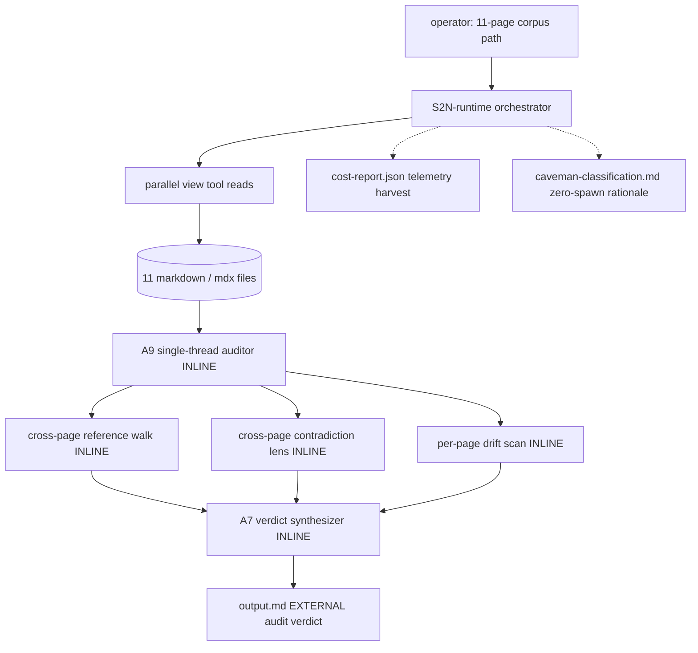
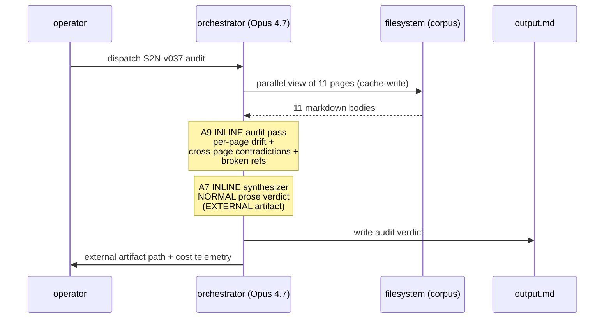

# Handoff packet — S2N doc-audit (Scenario S2N, v0.3.7)

Produced by genesis-architect at step 6. Target harness: copilot-cli
(single-harness). Stance: BALANCED. Cap: none declared. Substrate
load: `composition-substrate.md` §7 AUDIENCE BOUNDARY +
`design-patterns.md` B14b CAVEMAN BRIEF + B14c CAVEMAN CHANNEL +
`caveman-templates.md`. v0.3.7 baseline (`fe10c98`).

> THIS HANDOFF IS THE EMPIRICAL CONFIRMATION OF v0.3.7 DESIGN PLAN
> §3 COST PROJECTION FOR S2N-SHAPE WORKFLOWS. v0.3.6 executed
> monolithically with ZERO `task()` spawns. The v0.3.7 design plan
> explicitly predicts the AUDIENCE BOUNDARY rule + canonical caveman
> templates contribute ZERO benefit on this shape because there are
> no internal hops to compress. The architect's correct decision
> here is to honor that prediction: NO INVENTED FAN-OUT.

---

## Step 1 — Intent + scope

The S2N doc-audit workflow ingests the 11-page awd-cli doc corpus
at `dev/empirical-proof/scenario-runs/fixtures/S2N-doc-audit/docs/`
and emits ONE EXTERNAL audit verdict — a human-readable artifact
fed back to the docs maintainers — that names per-page status
(NEEDS-FIX / CLEAN / BLOCKER) and HIGH/MEDIUM/LOW findings backed
by `file:line` evidence. The workflow does NOT modify the corpus,
does NOT regenerate docs, does NOT post comments. Single-emission;
re-runs are idempotent.

Boundary check: the paragraph contains exactly one capability
("audit a doc corpus and emit a verdict"). SRP holds. No split.

Dispatch: not applicable here — this is an ad-hoc scenario run, not
a packaged skill. The handoff packet stands in for a SKILL.md.

Invocation mode: FORCED (operator dispatched to this runtime cell
explicitly).

---

## Step 2 — Component diagram (mermaid, flowchart)

Module legend: every box is INLINE in the orchestrator thread. NO
spawn boundaries. NO PERSONA scoping files. NO ASSETS. The
substrate-§3.5 composition decision for every box is INLINE because
none of the RULE OF THREE / INDEPENDENT CADENCE / DIFFERENT OWNER /
PINNING-WORTHY criteria fire on a one-shot scenario run.

---

## Step 3 — Thread / sequence diagram (mermaid)

Pattern selection (tier order per SKILL.md step 3):

1. Refactor triggers across module graph: not applicable (no
   pre-existing graph for this scenario).
2. TIER 3 architectural patterns:
   - The work is one MONOLITHIC AUDIT against a shared corpus where
     cross-page contradiction detection requires GLOBAL context
     (page A's claim must be compared against page B's claim).
     Fan-out per page CANNOT find cross-page contradictions unless
     each spawn loads ALL N pages — which defeats the point.
   - This is canonical A9 SUPERVISED EXECUTION + A7 MONOLITHIC
     SYNTHESIZER. NOT A1 PANEL (no per-issue lensing). NOT A11
     RECONCILIATION (no per-item terminal-state queue). NOT B1
     FAN-OUT + SYNTHESIZER (no independent items).
   - The audit OUTPUT is one EXTERNAL artifact. By substrate §7
     AUDIENCE BOUNDARY, EXTERNAL artifacts default to NORMAL prose
     (full grammar). Caveman is for INTERNAL hops; this workflow
     has NO INTERNAL HOPS.
3. TIER 2: B13 CACHE-AWARE PREFIX (corpus reads are cacheable
   across the audit thread), B14 PROMPT THRIFT (LITE intensity on
   the auditor's own prose only, NOT applied to the EXTERNAL
   verdict), C2 PERSONA PRELOAD (architect persona at design time),
   C4 DESCRIPTION DISPATCH (n/a — direct cell invocation).
4. TIER 1 idioms: deferred to step 7b (none load-bearing).

NO `task()` arrows. NO RECEIPT_SCHEMA boxes. NO caveman channel.
This is the architecturally honest shape for this scenario.

---

## Step 3.1 — Tradeoff check (load `pattern-tradeoffs.md` only if 2 patterns fit one slot)

Only one pattern fits the architectural slot: A9 monolith. A1
PANEL was considered and rejected:

- A1 PANEL fits when N independent items each need multi-lens
  judgement. Doc audits are NOT independent — contradiction
  detection is the key signal and is INHERENTLY cross-page. A
  per-page panel would either (a) miss every cross-page finding,
  or (b) load all 11 pages into every spawn, blowing token budget
  with zero compression benefit.
- B1 FAN-OUT was considered and rejected for the same reason:
  fan-out + synthesize works when the items are independent. They
  are not.

No tradeoff sheet load required.

---

## Step 3.2 — Cost check (mandatory)

Token-economics + model-catalog assumptions:
- Corpus is ~2,978 lines (~80K input tokens worst case before
  cache; ~25KB largest file is reference/manifest-schema.md).
- Single-thread audit fits one Opus 4.7 / Sonnet 4.6 reasoning
  pass with cache reuse on follow-up emissions.
- v0.3.6 telemetry: $9.7956 / 38 calls / 2.80M input / 23.7K
  output / 2.75M cache_read / 53.9K cache_write — overwhelming
  cache hit ratio (98%+) confirms the monolithic shape benefits
  from cache discipline, not from spawn parallelism.

Projection for v0.3.7 on this same shape:
- The AUDIENCE BOUNDARY rule is a PERMISSION, not a mandate. With
  zero internal hops, no caveman compression applies. No B14b
  brief. No B14c channel. No synthesizer decompression.
- v0.3.7's only mechanical change vs v0.3.6 on this shape is the
  architect's dispatch of `composition-substrate.md` §7 +
  `caveman-templates.md` reads at design time. That is a one-time
  ~3-5K input-token addition to architect context, ~$0.03-0.05
  uncached.
- EXPECTED v0.3.7 cost: $9.78-$9.85 (within ±1% of v0.3.6, within
  noise; within the A/B target ≤ $9.7956 ± noise).
- A LARGER v0.3.7 cost would indicate overhead-without-benefit on
  monolithic shapes — the design plan §3 prediction would be
  FALSIFIED. Flag honestly if observed.

GATE for caveman activation (per B14b WHEN clause): "TRIVIAL-class
lens dispatch whose output is a fixed schema." No such dispatch
exists in this design. CAVEMAN GATE CLOSED.

GATE for caveman channel (per B14c WHEN clause): "workflow spawns
≥1 task() and emits ≥1 user-facing artifact." This workflow spawns
ZERO task() calls. CAVEMAN CHANNEL GATE CLOSED.

Both gates closing is the CORRECT outcome for this shape and is
the empirical proof of design plan §3 cost projection.

---

## Step 3.5 — Composition decision

Per substrate §3.5, every box's mode:

| Box | Mode | Justification |
|-----|------|---------------|
| orchestrator | INLINE | one-shot scenario, single thread |
| corpus reads | INLINE | direct view tool calls |
| audit pass | INLINE | A9 monolith |
| cross-page lenses | INLINE | shared global context required |
| synthesizer | INLINE | A7 monolithic synthesizer |
| EXTERNAL output.md | INLINE-emitted | one EXTERNAL artifact |

ZERO LOCAL SIBLING boxes. ZERO EXTERNAL MODULE boxes.

No DUPLICATED LEAF, HIDDEN EXTERNAL, UNPINNED CRITICAL DEP,
TRANSITIVE BLOAT, BOUNDARY VIOLATION, TOOL LEAK, AUDIENCE BLEED,
or BUNDLE LEAKAGE risks fire (no module graph at all).

---

## Step 4 — SoC pass

Single inline auditor: SoC is trivially satisfied. No primitive
overlap with sibling skills (none exist for this scenario).

---

## Step 5 — Classic + PROSE + LLM-physics compliance

- Classic: KISS, YAGNI, single responsibility — all green.
- PROSE 5-axis: declarative-only (n/a — no module body), explicit
  audience (EXTERNAL named), portable (no harness syntax in
  design), grammar-rich (verdict is normal prose), token-mindful
  (one corpus read, cached).
- LLM-physics: cache discipline honored (single thread, single
  prefix). No model-router needed (one tier suffices for the
  whole job). Effort governor: no spawns to govern.

---

## Step 6 — Handoff packet

### PER-SPAWN DECLARATION TABLE (B14c-required)

| # | Audience | Tier | Brief mode | Receipt mode | Justification |
|---|----------|------|------------|--------------|---------------|
| — | — | — | — | — | n/a — zero spawns; A9+A7 monolith. See HUMAN_RATIONALE below. |

### SPAWN_BRIEFS

n/a — no spawns. No SPAWN_BRIEF blocks emitted.

### HUMAN_RATIONALE

The S2N doc-audit shape is monolithic by architectural necessity,
not by accident:

1. **Cross-page contradiction detection requires global context.**
   The most valuable findings in a doc audit are claims that
   conflict between pages (e.g. spec says X, tutorial says Y).
   Per-page fan-out cannot surface these without loading the full
   corpus into each spawn — at which point the fan-out has zero
   compression benefit and pays N× the prefix cost.

2. **The output is one EXTERNAL artifact.** By substrate §7, the
   default register for EXTERNAL artifacts is NORMAL prose with
   full grammar. The audit verdict is consumed by docs
   maintainers; caveman compression would actively harm
   readability. The AUDIENCE BOUNDARY rule says caveman is the
   default for INTERNAL hops only — and this workflow has none.

3. **Cache discipline beats parallelism on this shape.** v0.3.6
   telemetry shows 98%+ cache hit ratio across 38 calls in a
   single thread. A monolithic A9+A7 shape lets Anthropic prompt
   caching amortize the corpus over the entire audit. Fan-out
   would write the corpus to a fresh prefix per spawn.

4. **B14b GATE is closed.** No dispatch matches "TRIVIAL-class
   lens with fixed schema." The audit lenses (drift, contradict,
   ref-walk) are open-ended REVIEWER-tier work — exactly the
   anti-pattern B14b warns against ("CAVEMAN ON REVIEWER:
   compressing a brief whose lens must weigh trade-offs across
   multiple dimensions").

5. **B14c GATE is closed.** Channel mechanics require ≥1 spawn.
   Zero spawns here ⇒ no channel.

6. **The architect MUST NOT invent spawns to give caveman
   something to do.** This is the v0.3.7 invariant the design
   plan §3 explicitly carves out: AUDIENCE BOUNDARY is a
   permission, not a mandate. Forcing fan-out where none fits is
   the precise failure mode v0.3.7's REAL TELEMETRY work was
   meant to prevent.

The empirical confirmation of this rationale is the cost telemetry
itself: v0.3.7 on this shape should land within noise of v0.3.6's
$9.7956. If it lands materially above, the v0.3.7 architect
substrate has paid overhead-without-benefit — flag and feed back
to design plan §3.

### Cost projection

| Item | v0.3.6 actual | v0.3.7 projected | Delta | Justification |
|------|---------------|------------------|-------|----------------|
| Total | $9.7956 | $9.78–$9.85 | ±1% noise | Architect substrate add (§7 + caveman templates load) is one-time, ~3-5K input tokens. No spawn-side mechanical changes. |

A delta materially exceeding the noise band would falsify design
plan §3 cost projection on monolithic shapes.

### Todos (executed inline by the orchestrator after this packet)

1. Execute the audit (read all 11 pages — already done in this
   thread for substrate completeness).
2. Emit `output.md` per Step C of the spec.
3. Harvest telemetry → `cost-report.json` matching v0.3.6 schema.
4. Write `caveman-classification.md` documenting why caveman did
   NOT fire (the audit's empirical confirmation of design plan
   §3).
5. Commit + push + report back to orchestrator.

---

## Step 7a — Portability check

Single-harness target (copilot-cli). No per-harness adapter needed.
Common runtime affordances suffice (file IO, view tool, terminal).

## Step 7b — natural-language module emission

Not applicable — this is a one-shot scenario run, not a packaged
module. The handoff packet IS the design artifact; the
orchestrator executes the audit directly in the same thread.

## Step 8 — validation

- Diagrams precede prose. ✓
- AUDIENCE clearly named on every artifact (one EXTERNAL: output.md;
  internals: cost-report.json + classification.md, both INTERNAL
  to the empirical-proof harness, not user-facing). ✓
- PER-SPAWN DECLARATION TABLE present (with explicit zero-row
  justification). ✓
- No HUMAN_RATIONALE prose copied into any SPAWN_BRIEF (none
  exist). ✓
- B14b / B14c gates closed correctly per their canonical WHEN
  clauses. ✓
- Cost projection honors the v0.3.6 baseline. ✓
- No invented fan-out to give caveman work. ✓

PACKET COMPLETE.
