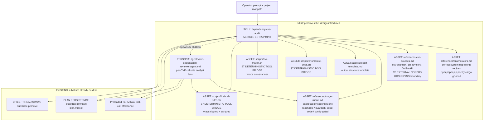
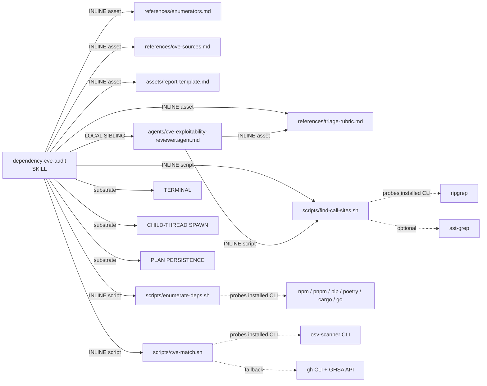

# Handoff Packet — Scenario S3: `dependency-cve-audit`

Corpus: v0.2.0 BASELINE (`genesis-v020-baseline/skills/genesis/`)
Target harness: `copilot-cli` only
Design ends at step 6. No step-7 codegen, no module bodies.

---

## Step 1 — intent + scope

**Capability paragraph.** `dependency-cve-audit` audits a single project's
transitive dependency tree for known CVEs and emits a TRIAGED report whose
per-finding verdict is grounded in the project's ACTUAL use of the
vulnerable function (not mere presence of the dependency). The operator
invokes it with a project root path. For each vulnerable transitive
dependency, the skill examines the project's real call sites of the
vulnerable function(s) and renders a project-specific exploitability
judgment plus a suggested remediation. Boundary: the skill does NOT patch,
PR, deploy, or otherwise mutate the project; it does NOT scan the
project's own first-party code for non-CVE bugs; it does NOT police
license terms; it does NOT enforce policy across many repositories
(single-project scope).

Single-Responsibility check: the description uses "and" twice
("enumerate AND look up" / "triage AND report") but both connectors join
stages of one coherent capability (vulnerability triage for THIS
project). No R1 SPLIT trigger fires; staying single-skill.

**Dispatch description draft (<=1024 chars, imperative, intent-first,
indirect triggers named, DISCOVERY+FORCED invocation):**

> Use this skill when the user wants to know which third-party
> dependencies in a project are exposed to known CVEs AND whether
> those CVEs are actually exploitable given how this codebase uses
> them. Triggers even when the user does not say "CVE": "audit our
> dependencies", "is log4shell a problem for us", "any known
> vulnerabilities in our deps", "security review of node_modules",
> "what's our exposure to the latest npm advisory", "check transitive
> deps for security issues", "vendor risk for this repo", "GHSA scan",
> "supply chain audit". Operator supplies a project root path; the
> skill enumerates the transitive dependency tree, matches against
> CVE / GHSA corpora, then for each hit inspects the project's actual
> call sites of the vulnerable function before assigning a
> project-specific exploitability verdict. Emits a triaged report
> only; does NOT patch, open PRs, or modify the project.

Length: ~960 characters, well under the 1024 hard cap from MODULE
ENTRYPOINT canonical spec (`assets/primitives.md`).

Invocation mode: **BOTH** (discovery via dispatcher LLM matching the
description; forced via explicit `/audit-deps` style invocation by an
operator who knows the skill exists).

---

## Step 2 — component diagram



Modules marked NEW: `SKILL`, `REVIEWER` persona, four `references/`
assets, one `assets/` template, three `scripts/`. Everything in
EXISTING is already provided by the harness substrate (per
`assets/runtime-affordances/common.md`) and is depended on, not
re-authored.

---

## Step 3 — thread / sequence diagram

```mermaid
sequenceDiagram
    autonumber
    actor OP as Operator
    participant PARENT as Parent thread<br/>(SKILL dependency-cve-audit)
    participant TERM as TERMINAL<br/>(preloaded tool)
    participant PLAN as plan.md<br/>(PLAN PERSISTENCE)
    participant C1 as Child thread #1<br/>(REVIEWER on CVE_a)
    participant CN as Child thread #N<br/>(REVIEWER on CVE_n)
    participant REPORT as Triaged report<br/>(single-writer sink)

    OP->>PARENT: invoke with project root
    PARENT->>PLAN: write intent + scope + checklist (B4 + B7)
    PARENT->>TERM: scripts/enumerate-deps.sh <root><br/>S7 + A9 plan-execute-verify
    TERM-->>PARENT: dep tree JSON (transitive)
    PARENT->>TERM: scripts/cve-match.sh <dep tree><br/>S7 + C6 EXTERNAL CORPUS GROUNDING<br/>(osv-scanner / gh advisory)
    TERM-->>PARENT: list of CVE hits (CVE id, dep, version, vuln fns)
    PARENT->>PLAN: append per-CVE TODOs (one terminal-state item each)<br/>A11 RECONCILIATION LOOP framing

    par fan-out, bounded width, one child per CVE hit
        PARENT->>C1: spawn(CVE_a context + project root + rubric link)<br/>B1 FAN-OUT + SYNTHESIZER, C3 THREAD SPAWN
        C1->>TERM: scripts/find-call-sites.sh <vuln fn>
        TERM-->>C1: file:line call sites + surrounding hunks
        C1->>C1: apply triage rubric (reachable / guarded / dead / config-gated)
        C1-->>PARENT: per-CVE verdict struct (id, severity, exploitability, fix)
    and
        PARENT->>CN: spawn(CVE_n context + project root + rubric link)
        CN->>TERM: scripts/find-call-sites.sh <vuln fn>
        TERM-->>CN: file:line call sites + surrounding hunks
        CN->>CN: apply triage rubric
        CN-->>PARENT: per-CVE verdict struct
    end

    PARENT->>PLAN: reload plan (B4 + B8 re-grounding on fan-in)
    PARENT->>REPORT: synthesize triaged report from N verdicts<br/>(parent is SOLE WRITER; one-writer rule)
    PARENT-->>OP: report path + summary
```

**Pattern selection** (per step 3 tier order):

1. **Refactor triggers** — none fire on a greenfield design; SoC checked
   in step 4 below.
2. **Tier 3 architectural** — the OUTER shape is **A2 PIPELINE** (enumerate
   → match → triage → synthesize) because each stage is a typed
   transformation with a clean handoff artifact. The TRIAGE stage is
   internally **A11 RECONCILIATION LOOP** (queue of CVE-hit items, each
   driven to terminal verdict state under per-call-site non-determinism)
   composed with **B1 FAN-OUT + SYNTHESIZER** for parallelism. Whole
   thing is wrapped by **A9 SUPERVISED EXECUTION** at the deterministic
   stages so dep enumeration and CVE matching are tool-bridged, not
   LLM-recalled.
3. **Tier 2 design** along GoF axes:
   - Creational: **C3 THREAD SPAWN** (one child per CVE hit), **C6
     EXTERNAL CORPUS GROUNDING with BOUNDED SCOPE** (CVE corpus is
     authoritative for vuln data; not promoted into exploitability
     verdict).
   - Structural: **S7 DETERMINISTIC TOOL BRIDGE** (three scripts, all
     facts-that-must-be-true), **S4 VALIDATION DECORATOR** (post-fan-in
     schema check on verdict structs before report synthesis), **S2
     DEPENDENCY ADAPTER** for per-ecosystem enumerators (npm vs pip vs
     cargo) selected at runtime via lockfile detection.
   - Behavioral: **B1 FAN-OUT + SYNTHESIZER**, **B4 PLAN MEMENTO**
     (mandatory), **B7 TODO COMMAND** (per-CVE items), **B8 ATTENTION
     ANCHOR** (mandatory; reload plan after each fan-in / between
     pipeline stages).
4. **Tier 1** — defer to step 7b per the corpus rule.

The lens-count gate: the >=3-independent-lenses test for FAN-OUT-vs-loop
fires (there are typically dozens of independent CVE hits with no shared
state across triage decisions). Single-loop triage would be the
anti-pattern; fan-out is correct.

---

## Step 3.1 — tradeoff check

Two slots had near-alternatives:

| Slot | Candidates | Chosen | Reason (cite matrix in `pattern-tradeoffs.md`) |
|---|---|---|---|
| Per-CVE analysis topology | A1 PANEL vs B1 FAN-OUT+SYNTHESIZER | B1 | PANEL is multi-lens on ONE artifact; here it's the SAME lens on MANY artifacts (one per CVE). Threading-topology matrix row: "many independent items, one procedure" → FAN-OUT, not PANEL. |
| Exploitability verdict gate | A7 ADVERSARIAL REVIEW vs S4 VALIDATION DECORATOR | S4 | Hallucination-countermeasures matrix: A7 fits creative outputs where dissent improves quality; CVE triage is rubric-scored, so a schema-validating decorator (verdict struct shape + rubric-band sanity) is the cheaper guard. A7 reserved for the optional `--strict` flag where each verdict gets a red-team pass. Documented as future option only; not in baseline design. |

---

## Step 3.5 — composition decision

Per-box composition mode, with rationale:

| Box | Mode | Rationale |
|---|---|---|
| `SKILL.md` (entrypoint body) | **INLINE** in the new MODULE ENTRYPOINT | unique to this skill; lives at its own distribution surface. |
| `agents/cve-exploitability-reviewer.agent.md` | **LOCAL SIBLING** inside the skill bundle | one consumer (this skill); not used elsewhere; rule-of-three not met → no EXTERNAL MODULE. |
| `references/enumerators.md` | **INLINE asset** (lazy) | only loaded when enumeration stage runs; per-ecosystem recipes, content unique to this skill. |
| `references/cve-sources.md` | **INLINE asset** (lazy) | C6 boundary documented here; unique. |
| `references/triage-rubric.md` | **INLINE asset** (lazy) | unique; loaded by both parent (for queue framing) and reviewer children. |
| `assets/report-template.md` | **INLINE asset** | output template per the corpus rule "INCLUDE A TEMPLATE inline". |
| `scripts/enumerate-deps.sh` | **INLINE script** | bundled; thin wrapper around installed CLIs (npm, pnpm, pip, poetry, cargo, go). |
| `scripts/cve-match.sh` | **INLINE script** | bundled wrapper around `osv-scanner` (preferred) with fallback to `gh api /repos/.../security-advisories`. |
| `scripts/find-call-sites.sh` | **INLINE script** | bundled wrapper around `ripgrep` (always present) + `ast-grep` (preferred when installed; falls back to regex). |
| `osv-scanner` CLI | **EXTERNAL TOOL on PATH** (not a primitive; an environmental dependency probed at runtime) | rule-of-three met (used by many other tools), independent release cadence. Probed at use-site per A9; install instruction printed on miss. NOT declared as an EXTERNAL MODULE because the genesis module-system adapter (`apm`) does not manage shell tooling. See "External modules required" below. |
| Preloaded TERMINAL, CHILD-THREAD SPAWN, PLAN PERSISTENCE | **SUBSTRATE** (already on disk via common runtime affordances) | named as edges in dependency graph; not authored. |

**Dependency graph:**



**External modules required:** **NONE** (no `apm install ...` step
needed). The skill ships standalone; its CLI dependencies are environmental
and probed at use-site per A9 SUPERVISED EXECUTION.

Because no EXTERNAL MODULE is declared, no module-system adapter (`apm.md`)
load is required at step 7b, and PHANTOM DEPENDENCY cannot occur. CLI
absence (e.g. `osv-scanner` not installed) is handled by the standard
A9 probe → ask operator → install / fallback / abort flow.

---

## Step 4 — SoC pass

- **Existing-module overlap?** None on a greenfield install. If a sibling
  `security-policy-audit` skill exists later, the BOUNDARY between them is:
  this skill = single-project transitive CVE exposure; that skill = policy
  rules across the org. Dispatch descriptions stay disjoint.
- **Sibling description collision?** None today. The dispatch draft above
  is specific (CVE / GHSA / exposure framing), not the generic "security
  review" that would risk collision with future skills.
- **R1 SPLIT triggers?**
  - description conjunction → no (single capability).
  - fragment callers → no.
  - body over budget → projected ~350 lines, under 500-line cap.
  - multi-lens body → no (one reviewer lens, multiplexed across CVE hits;
    that is fan-out, not multi-lens).
  - divergent change cadence → enumerators and CVE-source recipes evolve
    independently → already split into separate `references/` files
    (R3 EXTRACT preempted at design time).
- **R2 FUSE?** No thin sibling to fuse.
- **R3 EXTRACT?** Already applied (the per-CVE reviewer is a sibling
  persona file precisely because the rubric + call-site analysis is a
  coherent unit worth its own context window; it could be promoted to an
  EXTERNAL MODULE later if a second skill needs it (rule of three not yet
  met, so stays LOCAL SIBLING).
- **R4 INLINE?** No thin proxy with one caller and one reference exists
  to collapse.
- **Side-effects / facts-that-must-be-true?** The three steps that name
  a fact ("the project's installed dep tree", "the CVE corpus", "the
  project's actual call sites") all cross S7 DETERMINISTIC TOOL BRIDGE
  via the three bundled scripts. They are wrapped in A9 SUPERVISED
  EXECUTION (plan stage in SKILL body → execute stage via terminal →
  verify stage by checking exit code + JSON shape). No LLM-asserted
  facts.

---

## Step 5 — compliance check

Classic principles + PROSE + LLM truths:

| Axis | Status | Notes |
|---|---|---|
| Single Responsibility | OK | one capability; "and" in description joins stages, not capabilities |
| Progressive Disclosure | OK | enumerators / cve-sources / rubric all in lazy `references/` with explicit load-trigger phrasing |
| Reduced Scope (CHILD-THREAD SPAWN) | OK | per-CVE child carries only the one CVE's context + rubric link + project root; fresh window |
| Orchestrated Composition | OK | pipeline + reconciliation + fan-out + supervised execution composed explicitly |
| Safety Boundaries | OK | no consequential writes; report is the ONLY emitted artifact; A9 guards each tool call |
| Explicit Hierarchy | OK | cascading: SKILL → REVIEWER persona → triage rubric is a linear hierarchy |
| Truth #1 attention decay | OK | B4 + B8 reloaded between pipeline stages and after every fan-in |
| Truth #2 context explicit | OK | child threads receive explicit per-CVE payload; nothing assumed |
| Truth #5 plan before exec | OK | step 6 packet IS the plan; persisted to plan.md before any tool runs |
| Truth #6 harnesses bridge | OK | all facts via S7; all writes via A9 |
| MODULE ENTRYPOINT canonical spec | OK | name `dependency-cve-audit` matches regex (lowercase, hyphens, 23 chars); description ~960 chars; body projected <500 lines |
| ASCII only | OK | diagrams + tables are ASCII |
| Description: imperative / user-intent / indirect triggers / <=1024 | OK | see draft above |

**Open findings (with severity):**
- (LOW) `osv-scanner` install instructions need an OS-matrix; punt to
  step 7b coder.
- (LOW) ast-grep optional fallback path needs concrete grep
  alternative documented in `find-call-sites.sh --help`.
- No BLOCKER or HIGH.

---

## Step 6 — handoff packet

(This whole document is the packet; the items below are the explicit
required fields, restated.)

### Interface sketch per module

#### SKILL `dependency-cve-audit`

- **Trigger description:** (see step 1 draft, ~960 chars)
- **Inputs:** project root path (operator-supplied); optional
  `--strict` flag (future, gated for A7 ADVERSARIAL REVIEW pass).
- **Outputs:** a triaged report at `./cve-audit-report.md` (or stdout
  if `--stdout`), structured per `assets/report-template.md`. One row
  per CVE hit with: CVE ID, GHSA ID (if any), severity, vulnerable
  package + version, vulnerable function(s), project-specific
  exploitability verdict (`REACHABLE` | `GUARDED` | `DEAD-CODE` |
  `CONFIG-GATED` | `UNCLEAR`), call-site references, suggested
  remediation (upgrade target version / workaround / waive-with-note).
- **Dependencies (relative links):**
  - `agents/cve-exploitability-reviewer.agent.md`
  - `references/enumerators.md`
  - `references/cve-sources.md`
  - `references/triage-rubric.md`
  - `assets/report-template.md`
  - `scripts/enumerate-deps.sh`
  - `scripts/cve-match.sh`
  - `scripts/find-call-sites.sh`

#### PERSONA `cve-exploitability-reviewer`

- **Trigger:** spawned by SKILL parent, one child per CVE hit (B1 +
  C3).
- **Inputs:** `{ cve_id, ghsa_id?, package, version, vulnerable_fns[],
  project_root, rubric_path }` payload + repo read access.
- **Outputs:** single verdict struct (schema in
  `references/triage-rubric.md`).
- **Dependencies:** `references/triage-rubric.md`,
  `scripts/find-call-sites.sh`.

### Module composition table (final, restated)

See step 3.5 table above.

### External modules required

**None.** No `apm` adapter needed at step 7b. CLI tools
(`osv-scanner`, `ripgrep`, `gh`, package managers, optionally
`ast-grep`) are environmental and probed at use-site per A9. They are
NOT genesis EXTERNAL MODULES because the corpus's only module-system
adapter (`apm`) covers primitive modules, not shell binaries.

**Declaration mechanism (per external module):** N/A (no external
modules). For environmental CLI deps: documented in SKILL body under
"Prerequisites" + probed by each bundled script's preflight check.
This is the A9 SUPERVISED EXECUTION "supervised probe" flow, applied
to environmental rather than module-system deps.

### Declared target set

`copilot-cli` only (per the experiment constraint). Step 7a will
verify that all required affordances (`CHILD-THREAD SPAWN`,
`TERMINAL`, `PLAN PERSISTENCE`) live in `common.md` (they do; this is
a `common-only` design that happens to be SHIPPED single-harness — no
common.md violations introduced).

### Intended invocation mode per module

- SKILL `dependency-cve-audit`: **BOTH** (DISCOVERY-friendly
  description so the dispatcher matches "audit our deps"; FORCED
  invocation supported via direct mention).
- PERSONA `cve-exploitability-reviewer`: **FORCED only**
  (substrate-invoked by parent SKILL via CHILD-THREAD SPAWN; not
  dispatcher-matched, so the description-collision risk is zero for
  this entry).

### Open compliance findings

Two LOW (see step 5). No BLOCKER / HIGH / MEDIUM.

### Todos (one per module + validation)

(Operational; persisted to session SQL `todos` table at execution
time. IDs in kebab-case, titles in gerund form per corpus rule.)

| id | title | depends_on |
|---|---|---|
| `enumerators-ref` | Drafting references/enumerators.md (per-ecosystem listing recipes) | — |
| `cve-sources-ref` | Drafting references/cve-sources.md (C6 bounded-corpus boundary) | — |
| `triage-rubric-ref` | Drafting references/triage-rubric.md (verdict bands + struct schema) | — |
| `report-template` | Drafting assets/report-template.md | `triage-rubric-ref` |
| `enumerate-script` | Authoring scripts/enumerate-deps.sh (non-interactive, --help, JSON stdout) | `enumerators-ref` |
| `match-script` | Authoring scripts/cve-match.sh (osv-scanner wrapper + gh fallback) | `cve-sources-ref` |
| `find-sites-script` | Authoring scripts/find-call-sites.sh (rg + ast-grep) | — |
| `reviewer-persona` | Drafting agents/cve-exploitability-reviewer.agent.md | `triage-rubric-ref`, `find-sites-script` |
| `skill-body` | Drafting SKILL.md body (pipeline orchestration + spawn protocol + reload triggers) | all of the above |
| `evals-content` | Authoring 2-3 content evals (with_skill / without_skill) | `skill-body` |
| `evals-triggers` | Authoring ~20 trigger evals (60/40 train/val) | `skill-body` |
| `lint-validate` | Step-8 structural lint + REAL-TASK refinement on at least one repo | `skill-body`, `evals-content`, `evals-triggers` |

### Evals plan

**Content evals (2-3, exercised with_skill vs without_skill):**

1. *Reachable real CVE.* Seed a fixture repo that imports `lodash`
   pre-CVE-2019-10744 and CALLS `_.defaultsDeep` with user-controlled
   input on a hot path. Expected: skill reports CVE-2019-10744 with
   `REACHABLE` verdict and remediation = upgrade to >=4.17.12.
   `without_skill`: expect a generic "you have lodash, may be
   vulnerable" or hallucinated CVE id.
2. *Dead-code CVE.* Seed a fixture repo that imports
   `jsonwebtoken` <9.0.0 (CVE-2022-23529 family) but only via a code
   path guarded by `process.env.LEGACY_AUTH === '1'` which is never
   set in any config in the repo. Expected: skill reports the CVE
   with `CONFIG-GATED` (or `DEAD-CODE` if guard is structurally
   unreachable) and a downgraded remediation note. `without_skill`:
   expect blanket "CRITICAL severity, upgrade immediately" without
   the exploitability nuance.
3. *No-hit baseline.* Seed a fixture repo with deps that have NO open
   CVEs. Expected: skill emits a clean report ("no CVE matches").
   `without_skill`: expect either fabricated hits or generic
   "couldn't determine".

Delta gate: if `with_skill` and `without_skill` produce structurally
indistinguishable outputs on (1) or (2), redesign or delete per the
corpus rule.

**Trigger evals (~20 queries, 60/40 train/val, ship gate = val passes):**

Should-trigger (10):
1. "Audit our dependencies for known CVEs."
2. "Is log4shell a problem for this repo?"
3. "Any known vulnerabilities in our deps?"
4. "Security review of node_modules."
5. "What's our exposure to the latest npm advisory?"
6. "Check transitive deps for security issues."
7. "Vendor risk for this project."
8. "GHSA scan on the package.json tree."
9. "Supply-chain audit, please."
10. "Are we vulnerable to that new openssl CVE?"

Should-NOT-trigger (10):
1. "Refactor this function for readability." (general code work)
2. "Write unit tests for the auth module." (testing, no CVE framing)
3. "Why is my CI build red?" (build debug)
4. "Lint the whole repo." (style, not security)
5. "Open a PR with the dependency upgrade." (mutation requested;
   skill is read-only and shouldn't grab this)
6. "Review my SOC2 controls." (policy / org-scope, not single-project
   CVE exposure)
7. "Set up Dependabot." (config of another tool; not a one-shot
   audit run)
8. "Scan my Docker image for vulnerabilities." (image scan, not
   source-tree dep tree; out of scope)
9. "Tell me about CVE-2021-44228." (encyclopedic question; user
   didn't ask about THEIR project)
10. "Threat-model this new feature." (design-time activity, not
    dep-tree audit)

Split: first 6 should-trigger + first 6 should-not = train (12); last
4 + 4 = val (8). Val gate: >=4/4 should-trigger AND <2/4
should-NOT (i.e., >=0.5 / <0.5 thresholds from the canonical spec).

---

## Appendix A — MODEL BINDING DECLARATIONS (best-guess; not in v0.2 corpus)

> **Caveat.** The v0.2.0 corpus has NO model-binding mechanism, NO
> class taxonomy (no RESEARCHER / LONG-CONTEXT-RETRIEVER / REVIEWER
> primitive types), and NO cost-aware framework. The following is a
> best-guess sketch the operator could apply MANUALLY at runtime
> (e.g. by picking which model to spawn each child with). It is NOT
> derivable from any v0.2.0 pattern.

| Box | Best-guess model | Reasoning |
|---|---|---|
| Parent SKILL thread | mid-tier general-purpose model (e.g. Sonnet-class) | orchestration + plan reload + synthesis — needs reliable instruction-following, not deep reasoning |
| `enumerate-deps.sh` / `cve-match.sh` / `find-call-sites.sh` | N/A (deterministic shell) | no model invocation; S7 deterministic |
| Per-CVE REVIEWER child thread | strong-reasoning model (e.g. Opus-class or GPT-5-class) | per-CVE exploitability is novel-reasoning over novel code; this is the most judgment-heavy step |
| Trigger-eval / content-eval scoring | mid-tier model | rubric-graded, no novelty |

These would be naturally expressed in v0.3.5 as RESEARCHER class
(novel CVE corpus lookup) + LONG-CONTEXT-RETRIEVER class (code +
corpus into one window) + REVIEWER class (exploitability rubric
verdict). They are NOT expressible in v0.2.0 vocabulary.

---

## Appendix B — PATTERNS CITED (all from v0.2.0 corpus only)

| Pattern ID | Name | Source file | Where used |
|---|---|---|---|
| A2 | PIPELINE | `architectural-patterns.md` | Outer enumerate→match→triage→synthesize shape |
| A9 | SUPERVISED EXECUTION | `architectural-patterns.md` | Wrapping each S7 tool bridge (plan→execute→verify) |
| A11 | RECONCILIATION LOOP | `architectural-patterns.md` | Triage stage framing: queue of CVE hits, each driven to terminal verdict state |
| A7 | ADVERSARIAL REVIEW | `architectural-patterns.md` | Reserved for future `--strict` mode; rejected for baseline per step 3.1 tradeoff |
| A1 | PANEL | `architectural-patterns.md` | Explicitly rejected at step 3.1 (wrong gate; this is fan-out, not multi-lens) |
| B1 | FAN-OUT + SYNTHESIZER | `design-patterns.md` | Per-CVE parallel triage with parent synthesizing the report |
| B4 | PLAN MEMENTO | `design-patterns.md` | MANDATORY; plan.md is the source of truth across spawns |
| B7 | TODO COMMAND | `design-patterns.md` | Per-CVE TODO items written after the match stage |
| B8 | ATTENTION ANCHOR | `design-patterns.md` | MANDATORY; plan reload between pipeline stages and on every fan-in |
| C3 | THREAD SPAWN | `design-patterns.md` | One child per CVE hit |
| C6 | EXTERNAL CORPUS GROUNDING (with BOUNDED SCOPE) | `design-patterns.md` | OSV / GHSA cited for vuln data; NOT promoted into the exploitability-verdict ontology |
| S2 | DEPENDENCY ADAPTER | `design-patterns.md` | Per-ecosystem enumerator selection (npm vs pip vs cargo) |
| S4 | VALIDATION DECORATOR | `design-patterns.md` | Verdict-struct schema + rubric-band sanity check at fan-in |
| S7 | DETERMINISTIC TOOL BRIDGE | `design-patterns.md` | Three bundled scripts; the structural seam between LLM and shell |
| R1 | SPLIT | `refactor-patterns.md` | Checked, NOT triggered (step 4) |
| R3 | EXTRACT | `refactor-patterns.md` | Pre-applied at design time: reviewer persona is a sibling, not body content |
| MODULE ENTRYPOINT canonical spec | `primitives.md` (citing agentskills.io) | name regex, body budget, directory layout, description cap |
| PROSE axes | `primitives.md` table | Progressive Disclosure / Reduced Scope / Orchestrated Composition / Safety Boundaries / Explicit Hierarchy — all five satisfied |
| Substrate concept 6 PLAN PERSISTENCE | `composition-substrate.md` + `primitives.md` #6 | plan.md as truth between stages and across spawns |

No pattern not present in v0.2.0 is cited.

---

## Appendix C — PROJECTED COST estimate (rough; informational only)

> **Caveat.** v0.2.0 corpus contains NO cost-aware machinery. The
> numbers below are operator-side projections, not corpus-derived.

Assume a medium project: 600 transitive deps, ~25 CVE hits after
match.

| Stage | Threads | Approx. tokens in | Approx. tokens out | Notes |
|---|---|---|---|---|
| Enumerate (parent + tool) | 1 | ~3k (SKILL body + plan) | ~1k (plan update + tool call) | dep tree itself returned as file path, not inlined |
| CVE match (parent + tool) | 1 | ~2k | ~3k (writes CVE-hit list into plan) | osv-scanner JSON summarized into plan |
| Per-CVE triage (fan-out) | 25 children | ~8k each (rubric + payload + ~5 call-site hunks) = ~200k total | ~1k each = ~25k total | dominant cost line |
| Synthesis (parent) | 1 | ~30k (25 verdict structs + template) | ~5k (final report) | |
| **Total** | ~27 threads | **~235k in** | **~34k out** | excluding eval runs |

Per-CVE triage dominates. Two ways to compress in a v0.3.x world that
v0.2.0 cannot express:
- bind only the per-CVE REVIEWER to a heavy-reasoning model; bind
  parent + enumerator stages to a cheaper model;
- cap fan-out width and stream CVE hits in waves (A5 WAVE EXECUTION
  variant) — v0.2.0 has A5 listed but no cost-driven heuristic for
  when to invoke it for this reason.

---

## Appendix D — PATTERNS WANTED BUT UNAVAILABLE in v0.2.0

These would have made the design crisper but DO NOT exist in the
v0.2.0 corpus. Listed as gaps for the experiment record:

1. **Class / role taxonomy with model binding.** A first-class
   RESEARCHER / LONG-CONTEXT-RETRIEVER / REVIEWER classification on
   primitives, so that per-CVE child threads could declare their
   reasoning class and the substrate could auto-bind an appropriate
   model. Today I had to invent Appendix A by hand.
2. **Cost-aware fan-out gate.** A pattern that explicitly weighs
   per-child token cost against latency to decide between B1 wide
   fan-out and A5 WAVE EXECUTION. A5 exists but its selection
   heuristic in v0.2.0 is shape-based ("waves of related work"), not
   cost-based.
3. **Corpus-cache pattern.** C6 EXTERNAL CORPUS GROUNDING covers the
   epistemics (don't promote external corpus into your own
   ontology), but says nothing about caching expensive lookups
   (e.g., OSV results) across runs. Each invocation re-hits the
   external corpus. A "MEMOIZED CORPUS" sibling to C6 would close
   this gap.
4. **Exploitability rubric primitive.** I had to put the rubric in a
   `references/` asset because the corpus has no first-class
   "rubric / scoring schema" primitive. In v0.3.x this might surface
   as a structured rubric asset type with built-in S4 hooks.
5. **Per-spawn timeout / failure-mode pattern.** A long fan-out (25
   children) needs a CIRCUIT-BREAKER / per-child timeout pattern.
   The v0.2.0 corpus has A9 verification but no named pattern for
   "child N is hung; fail the verdict to UNCLEAR and proceed".
6. **Streaming-synthesis pattern.** Parent currently waits for all 25
   verdicts before writing the report. A "STREAMING SYNTHESIZER"
   variant of B1 would let the report grow incrementally; the v0.2.0
   B1 description is batch-only.

None of (1)-(6) were used in this design. Listing them per the
experiment's instructions.

---

**DESIGN ENDS HERE.** Step 7 (portability check) and step 7b
(natural-language drafting) are out of scope for this cell.
