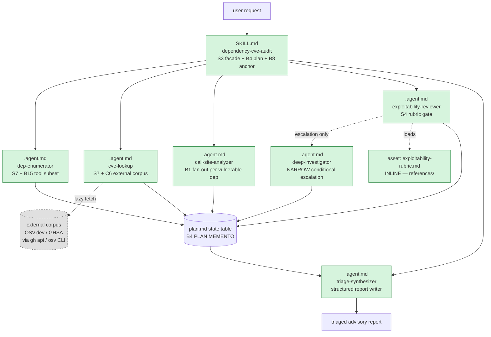
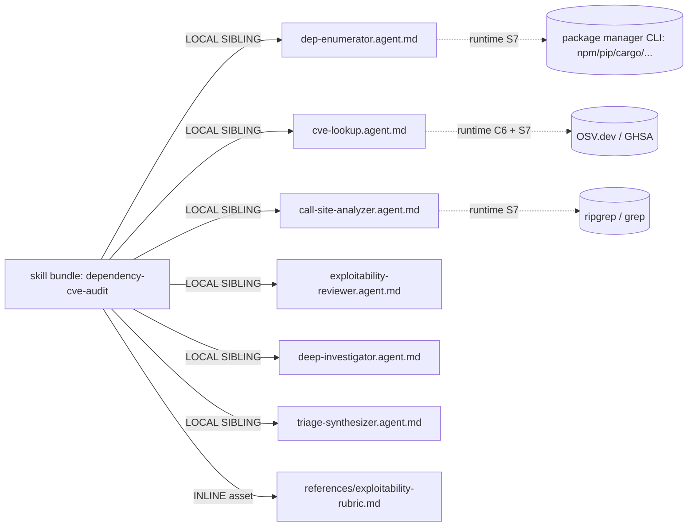

# Handoff packet — S3 `dependency-cve-audit` (v0.3.5 cost-aware)

Target harness: **copilot-cli only**.
Cost stance: **balanced** (default).  Cap: none declared.
Corpus: `skills/genesis/` v0.3.5.

---

## Step 1 — intent + scope

Skill **`dependency-cve-audit`** audits a project's transitive
dependency tree for known CVEs, evaluates per-project EXPLOITABILITY
based on the project's actual call sites of each vulnerable function
(not mere presence of the dep), and emits a triaged report with CVE
ID, severity, project-specific exploitability assessment, and
suggested remediation.

In scope: enumerate transitive deps; look up CVEs from an external
corpus (OSV.dev / GHSA); for each hit, examine call sites of the
vulnerable symbols in this project; emit a triaged advisory report.

NOT in scope: applying upgrades, opening PRs, modifying lockfiles,
proposing alternative libraries beyond the CVE-attached
remediation, runtime SAST / DAST.

Invocation mode: **DISCOVERY** (operator says "audit dependencies
for CVEs", "check our deps for vulnerabilities", "scan for
vulnerable transitive packages", "exploitability of CVE X in
this repo"). Single skill, no harness siblings.

### Dispatch description (frontmatter, <1024 chars)

> Use this skill when the user asks to audit a project's
> dependencies for known CVEs / security advisories AND wants a
> project-specific EXPLOITABILITY judgment — not just presence of
> a vulnerable package. Triggers on: "audit deps for CVEs", "are
> we exposed to CVE-XXXX", "vulnerable transitive packages",
> "check GHSA advisories", "SCA scan with call-site analysis",
> "is this advisory exploitable in our codebase". Indirect
> triggers: "supply-chain risk review", "before-release security
> sweep", "explain whether this advisory affects us". Emits a
> triaged advisory report (CVE id, severity, per-project
> exploitability verdict, remediation). Does NOT apply upgrades,
> open PRs, modify lockfiles, run SAST, or address vulnerabilities
> in first-party code.

---

## Step 2 — component diagram

All primitives are new. Module legend:
SK = MODULE ENTRYPOINT (SKILL).  DEP/CVE/CS/RV/DI/SYN = PERSONA
SCOPING + CHILD-THREAD SPAWN (Copilot `.agent.md` custom agents).
RUBR = ASSET.  STATE = PLAN-PERSISTENCE substrate.

---

## Step 3 — sequence diagram

```mermaid
sequenceDiagram
  participant U as user
  participant SK as SKILL.md facade
  participant ST as plan.md (B4)
  participant DE as dep-enumerator
  participant CV as cve-lookup
  participant CS as call-site-analyzer×N
  participant RV as exploitability-reviewer×N
  participant DI as deep-investigator (narrow)
  participant SY as triage-synthesizer

  U->>SK: audit deps for CVEs
  SK->>ST: write goal + acceptance (B8 anchor)
  SK->>DE: spawn (stage 1: enumerate)
  DE->>ST: write {dep, version} rows
  DE-->>SK: done
  SK->>CV: spawn (stage 2: CVE lookup)
  CV->>ST: write {dep, version, cves[]} rows
  CV-->>SK: done (N vulnerable rows)
  Note over SK,CS: STAGE 3 — fan-out per vulnerable dep (B1)
  SK->>CS: spawn × N (one per vulnerable dep)
  par per CVE call-site analysis
    CS->>ST: write {cve, call_sites[]} for dep_i
  end
  CS-->>SK: all done (fan-in)
  Note over SK,RV: STAGE 4 — fan-out per CVE (B1) + S4 rubric
  SK->>RV: spawn × N (one per CVE+call-site bundle)
  par per CVE adjudication
    RV->>ST: write {cve, exploitability_verdict, confidence}
    alt confidence == UNRESOLVED & no public PoC
      RV->>DI: escalate (narrow trigger only)
      DI->>ST: deep verdict + provenance
    end
  end
  RV-->>SK: all done
  SK->>SY: spawn (stage 5: synthesize)
  SY->>ST: read full state table
  SY-->>U: triaged advisory report
```

Pattern selection (tier order):

1. **Refactor triggers** — none fire on a greenfield design.
2. **TIER 3 architectural pattern** — **A2 PIPELINE** (sequential
   stages with verifiable hand-offs: enumerate → lookup → call-site
   → adjudicate → synthesize) overlaid with **A12 GRADIENT
   WORKFLOW** (heterogeneous role classes per stage; this is the
   most heterogeneous scenario in the cross-scenario battery and
   the gradient is the dominant cost lever). Stages 3 and 4 use
   **B1 FAN-OUT + SYNTHESIZER** per vulnerable dep / CVE.
   Weak-form **A9 SUPERVISED EXECUTION** wraps stages 1–2 (tool
   calls produce facts, not LLM-asserted recall); strong-form A9
   is unavailable (copilot-cli is not a gh-aw trigger surface) and
   is unnecessary (audit is read-only — no write to system of
   record).
3. **TIER 2 design patterns** — B4 PLAN MEMENTO + B8 ATTENTION
   ANCHOR (mandatory); S7 DETERMINISTIC TOOL BRIDGE on every
   stage that surfaces a FACT-THAT-MUST-BE-TRUE (dep list, CVE
   list, call-site existence); C6 EXTERNAL CORPUS GROUNDING
   (OSV.dev / GHSA, lazy per dep, bounded scope = vulnerability
   advisory only); S4 VALIDATION DECORATOR (rubric gate inside
   `exploitability-reviewer` + escalation trigger); B11 MODEL
   ROUTER + B16 EFFORT GOVERNOR (per-element heterogeneous
   bindings); B13 CACHE-AWARE PREFIX (stable persona / rubric
   prefix across N reviewer calls); B15 TOOL SUBSET per agent.

A2 + A12 + B1 is unambiguous given the shape (sequential stages,
per-stage capability heterogeneity, fan-out only at stages 3–4).
No tier-2 alternatives in tension. **Step 3.1 skipped.**

---

## Step 3.2 — cost check (mandatory)

Stance = `balanced`. Per-module cost-shape table:

| Module | Role class | Prefix | Output | Turn count | Cost patterns | Cost-shape matrix row |
|---|---|---|---|---|---|---|
| `SKILL.md` (facade) | session default | M | S | low | B4, B8, S3 | n/a (control plane) |
| `dep-enumerator` | **TRIVIAL** | S | S | low | S7, B15, B13 | "Deterministic sequence / Per-call rate / Wrong role class" |
| `cve-lookup` | **TRIVIAL** | S | M | low | S7, B15, C6, B13 | same row (lookup is classification + extraction) |
| `call-site-analyzer` ×N | **IMPLEMENTER** | M | M | medium | B1, B15, B13 | "Fan-out across N similar items / Output bytes × N / Heavy role class on workers" — bind to implementer (cross-file grep + AST read, not planning) |
| `exploitability-reviewer` ×N | **REVIEWER** | M | S | low–medium | S4, B15, B13, B16(low) | "Checklist grading over bounded artifact / Rubric prefix cacheable / Reviewer class" |
| `deep-investigator` (conditional, ≤1 per run typical) | **RESEARCHER** | L | M | high | B12 (narrow trigger), B16 (xhigh) | "Open-ended cross-corpus synthesis / No rubric, no plan / Reserve narrow trigger" |
| `triage-synthesizer` | **REVIEWER** | M | M | low | B14 (structured template), B13 | "Bounded adjudication over structured inputs / Adjudicator role" — REVIEWER not planner (A12 HEAVY-ADJUDICATOR anti-pattern explicitly cited) |

### RESEARCHER binding — STAKES citation (mandatory per v0.3.5)

`deep-investigator` is the only element bound to **RESEARCHER** class.
Per `runtime-affordances/model-catalog.md` the binding MUST cite
irreducible novelty + open-ended success criteria. STAKES recorded:

- **Open-ended success criteria** — the trigger fires ONLY when the
  reviewer-class adjudicator cannot resolve exploitability with the
  rubric (verdict `UNRESOLVED` + no public PoC + nonstandard call
  pattern). At that point the work is no longer "match against
  rubric" — it is "synthesize across CVE description + GHSA
  advisory body + project source + upstream commit history +
  related bug reports to construct a one-off exploitability
  hypothesis". Success is whether the synthesis holds; the
  reviewer-class capability profile does not include constructing
  novel proof chains.
- **Irreducible novelty** — a CVE adjudication that the reviewer-
  class rubric flags UNRESOLVED is by construction a case the
  rubric was not designed to handle. No plan exists for it; if a
  plan existed, the work would be PLANNER class. No rubric
  applies; if one applied, it would be REVIEWER class. The narrow
  trigger sits in exactly the gap RESEARCHER is defined for.
- **Narrow trigger discipline** — gated by S4 verdict from
  `exploitability-reviewer`. Expected fire rate ≤ 1 per audit
  run on representative repos (most CVEs adjudicate cleanly
  under the rubric: either no reachable call site OR a textbook-
  unsafe pattern). The intended fire rate is the smallest of any
  class in this design; honors v0.3.5 "smallest class by firing
  rate" discipline.
- **NOT** bound to RESEARCHER: `cve-lookup` (deterministic DB
  query — TRIVIAL + S7); `call-site-analyzer` (cross-file code
  search with bounded output — IMPLEMENTER); `exploitability-
  reviewer` (rubric exists — REVIEWER, per v0.3.5 rule "if a
  rubric exists, the work is REVIEWER"); `triage-synthesizer`
  (adjudication of structured pre-existing analyses — REVIEWER,
  per A12 HEAVY-ADJUDICATOR anti-pattern).

### Cache discipline (B13)

Stable prefix per stage: persona body + rubric (for reviewer) +
tool catalogue. Variable suffix: per-dep / per-CVE state row.
No mid-session model switch within any single agent thread
(model switch happens at fan-out boundary — fresh thread per
spawn — so it is a NEW prefix, not an invalidator). No
timestamps in any persona body. Tool catalogue declared per
agent via `.agent.md` `tools:` (B15) and held stable.

Step 3.2 yields A12 + B12 bindings unambiguously; no two cost
patterns fit the same slot. **No section-10 tradeoff matrix
citation required.**

---

## Step 3.5 — composition decision

| Box | Mode | Rationale |
|---|---|---|
| `SKILL.md` (facade) | **LOCAL SIBLING** (own module) | The skill itself ships as a MODULE ENTRYPOINT bundle. |
| `dep-enumerator.agent.md` | **LOCAL SIBLING** (inside skill bundle) | Used only by this skill at runtime; ships in bundle. |
| `cve-lookup.agent.md` | **LOCAL SIBLING** | Same. |
| `call-site-analyzer.agent.md` | **LOCAL SIBLING** | Same. |
| `exploitability-reviewer.agent.md` | **LOCAL SIBLING** | Same. |
| `deep-investigator.agent.md` | **LOCAL SIBLING** | Same. |
| `triage-synthesizer.agent.md` | **LOCAL SIBLING** | Same. |
| `references/exploitability-rubric.md` | **INLINE asset** (lazy-loaded by reviewer) | Unique to this skill; lazy-loaded only by the reviewer agent. C1 LAZY ASSET + S5 LAZY PROXY. |
| OSV.dev / GHSA corpus | **EXTERNAL CORPUS** (not a module dep) | Fetched at runtime via `gh api` / `osv` CLI under S7 + C6; declared in dispatch description and in `cve-lookup` body. No module-system dependency. |

### Dependency graph

**No EXTERNAL MODULE declared.**  All primitives are local
siblings inside the skill bundle. The OSV.dev / GHSA corpus and
the package-manager CLI are EXTERNAL DATA / EXTERNAL TOOLS
reached through S7 + C6, not external modules — no module-system
adapter (apm-usage etc.) needs to load at step 7b. Declaration
mechanism field is **N/A** (no manifest dep; no companion-
module recommendation needed).

---

## Step 4 — SoC pass

- No existing module in the project does dependency CVE audit;
  no overlap with siblings (greenfield).
- Dispatch description does not collide with any installed
  copilot-cli skill in the corpus.
- R1 SPLIT check — dispatch paragraph has no "and" connecting
  two distinct capabilities. Single responsibility: "produce a
  triaged exploitability advisory for known CVEs in this
  project's deps". Sub-steps are pipeline stages, not separate
  capabilities.
- R2 FUSE check — no two siblings collapse to one body always
  loaded together. Each agent has a distinct capability profile
  (see step 3.2) and is invoked at a distinct pipeline stage.
- R3 EXTRACT check — the exploitability rubric is extracted to
  `references/exploitability-rubric.md` (LAZY ASSET); not
  inlined into the reviewer body.
- R4 INLINE check — no thin-proxy primitives.
- R5 COST PRUNE check — applied at step 3.2 (gradient workflow
  binding; no CLASS-UNIFORM GRAPH).
- S7 BRIDGE check — every CONSEQUENTIAL FACT-THAT-MUST-BE-TRUE
  step crosses S7: dep list (package manager), CVE list
  (OSV/GHSA), call-site existence (ripgrep / AST tool). No
  LLM-asserted "the dep tree includes X" or "CVE-2024-xxx
  affects Y"; every fact is tool-sourced.

---

## Step 5 — compliance check (classic + PROSE + LLM-physics)

| Check | Severity | Status |
|---|---|---|
| MODULE ENTRYPOINT `name` 1–64 lowercase `[a-z0-9-]`, == parent dir | BLOCKER | PASS (`dependency-cve-audit`) |
| Dispatch description ≤ 1024 chars, imperative, user-intent, indirect triggers | BLOCKER | PASS (~880 chars) |
| SKILL.md body ≤ 500 lines, ≤ 5000 tokens | BLOCKER | PASS (target ≤ 250 lines; rubric externalized) |
| B4 PLAN MEMENTO present | BLOCKER | PASS (`plan.md` state table) |
| B8 ATTENTION ANCHOR present | BLOCKER | PASS (re-inject before each stage spawn + after fan-in) |
| S7 on every consequential / fact-bearing step | BLOCKER | PASS |
| C6 BOUNDED SCOPE on external corpus | HIGH | PASS (OSV/GHSA authoritative for vulnerability advisories ONLY; not for "is this safe overall") |
| Progressive Disclosure | HIGH | PASS (rubric is LAZY ASSET) |
| Reduced Scope | HIGH | PASS (no upgrade application; no PR open) |
| Orchestrated Composition | HIGH | PASS (facade orchestrates; agents do the work) |
| Safety Boundaries | HIGH | PASS (read-only; no writes to project) |
| Explicit Hierarchy | HIGH | PASS (skill → agents → tools) |
| A12 HEAVY-ADJUDICATOR anti-pattern check | HIGH | PASS (synthesizer bound REVIEWER, not planner) |
| B12 BIND-UP-WITHOUT-JUSTIFICATION check | HIGH | PASS (only RESEARCHER binding cited with STAKES) |
| B12 BULK IDENTICAL BINDING check | HIGH | PASS (per-element capability enumeration in §3.2) |
| B12 ZERO-EXPLICIT check | HIGH | PASS (every `.agent.md` declares `model:`) |
| B12 WRONG-PRIMITIVE BINDING check | HIGH | PASS (cost bindings on `.agent.md`, not SKILL.md) |
| PANEL-WITHOUT-SYNTHESIS | n/a | not a PANEL design |
| UNBOUNDED LOOP | n/a | no loop; pipeline |

No BLOCKERs. Design proceeds.

---

## Step 6 — handoff packet

### Interface sketch per module

**`SKILL.md` (facade)**
- Trigger description: see step 1 dispatch description.
- Inputs: user request; project working directory.
- Outputs: triaged advisory report written to `cve-audit-report.md`.
- Dependencies: spawns all 6 `.agent.md` children; reads `plan.md`.
- Invocation mode: DISCOVERY.

**`agents/dep-enumerator.agent.md`**
- Trigger: spawned by facade at stage 1.
- Inputs: project root.
- Outputs: `plan.md` rows `{ecosystem, dep_name, version, direct|transitive, path}`.
- Tools (B15): `execute` (npm / pip / cargo / mvn / go), `read` (lockfiles).
- Role class: **TRIVIAL** (deterministic CLI orchestration).
- `.agent.md` `model:` → trivial-class SKU.

**`agents/cve-lookup.agent.md`**
- Trigger: spawned by facade at stage 2.
- Inputs: `plan.md` dep rows.
- Outputs: `plan.md` rows `{dep, version, cve_id, ghsa_id, severity, vulnerable_symbol, fixed_in}`.
- Tools (B15): `execute` (osv CLI or `gh api /advisories`), `read`.
- External corpus (C6): OSV.dev / GHSA — authoritative for advisory metadata only.
- Role class: **TRIVIAL**.

**`agents/call-site-analyzer.agent.md`** — fan-out per vulnerable dep
- Trigger: facade spawns one per vulnerable dep (B1 FAN-OUT).
- Inputs: one `{dep, cve, vulnerable_symbol}` bundle.
- Outputs: `plan.md` rows `{cve, file, line, call_context_snippet, sink_type}`.
- Tools (B15): `search` (ripgrep), `read` (source files), `execute` (language AST tool where available).
- Role class: **IMPLEMENTER** (cross-file code reading; bounded output).
- `.agent.md` `model:` → implementer-class SKU.

**`agents/exploitability-reviewer.agent.md`** — fan-out per CVE
- Trigger: facade spawns one per CVE after call-site analysis returns.
- Inputs: `{cve, advisory, call_sites[]}` + `references/exploitability-rubric.md` (lazy).
- Outputs: `plan.md` rows `{cve, verdict ∈ {EXPLOITABLE, NOT_EXPLOITABLE, UNRESOLVED}, confidence, rationale}`.
- Tools (B15): `read` only (advisory + source + rubric).
- Role class: **REVIEWER**.  Effort (B16): **low**.
- S4 gate: if `verdict == UNRESOLVED AND public_PoC == false`, escalate to `deep-investigator`.
- `.agent.md` `model:` → reviewer-class SKU.

**`agents/deep-investigator.agent.md`** — NARROW conditional
- Trigger: spawned by `exploitability-reviewer` ONLY on the S4 escalation predicate above.
- Inputs: `{cve, advisory, call_sites[], reviewer_partial_verdict, related_links}`.
- Outputs: `plan.md` rows `{cve, deep_verdict, provenance[], hypothesis_chain}`.
- Tools (B15): `read`, `search`, `web` (fetch upstream commit / bug tracker pages).
- Role class: **RESEARCHER**.  Effort (B16): **high / xhigh**.
- `.agent.md` `model:` → researcher-class SKU.
- STAKES citation embedded in the agent body header.

**`agents/triage-synthesizer.agent.md`**
- Trigger: facade spawns at stage 5 after all reviewer/deep verdicts written.
- Inputs: full `plan.md` state table.
- Outputs: `cve-audit-report.md` (structured: per-CVE block with id, severity, exploitability verdict, evidence summary, suggested remediation copied from advisory).
- Tools (B15): `read`, `edit` (single output file).
- Role class: **REVIEWER** (adjudication over structured pre-existing analyses; A12 anti-pattern HEAVY-ADJUDICATOR explicitly avoided).

**`references/exploitability-rubric.md`** (INLINE asset, lazy)
- Loaded only by `exploitability-reviewer`.  Defines: sink reachability check, taint-source heuristics, mitigation patterns, UNRESOLVED triggers.

### Module composition table (already in step 3.5; reproduced)

| Box | Mode | Rationale |
|---|---|---|
| SKILL.md | LOCAL SIBLING bundle root | own module |
| 6 × `.agent.md` | LOCAL SIBLING | runtime, in-bundle |
| `references/exploitability-rubric.md` | INLINE / LAZY | unique to skill, lazy-loaded |

### External modules required

**NONE.** No module-system adapter needs to load at step 7b.
DECLARATION MECHANISM field: **N/A**.

### Declared target set

**copilot-cli only** (operator-mandated).  Non-portable bindings
declared: `.agent.md` binding sites for `model:` and `tools:`
(per `runtime-affordances/per-harness/copilot.md` section 9).
Portability flag in module header: `target: copilot-cli`.

### Invocation mode per module

| Module | Mode |
|---|---|
| SKILL.md | DISCOVERY |
| all 6 `.agent.md` | spawned (not dispatcher-visible) |

### Open compliance findings

None at BLOCKER or HIGH.  Notes:
- MEDIUM: per-harness lock-in is deliberate (operator declared
  copilot-cli only); record in module header.
- LOW: `dep-enumerator` ecosystem coverage finite (npm / pip /
  cargo / mvn / go assumed); if operator's project uses a
  different ecosystem, agent must error explicitly (not silently
  skip).

### Per-element model binding declarations (B12)

Copilot-CLI binding sites per
`runtime-affordances/per-harness/copilot.md` §9:
- SKILL.md → no `model:` field accepted (silently ignored).
- `.agent.md` → `model:` field IS the per-element binding site.
- `task(agent_type=...)` → spawn-type default; not used here
  because explicit `.agent.md` agents give per-element auditable
  bindings per B12 SELECTION RULE rule 3.

| Element | Primitive type | Role class | `model:` binding (concrete) | Effort (B16) | Binding direction vs session default | Justification |
|---|---|---|---|---|---|---|
| `dependency-cve-audit` (facade) | SKILL.md | session default | (none — SKILL.md does not carry `model:`) | inherit | inherit | facade is orchestration; no per-element opportunity |
| `dep-enumerator` | `.agent.md` | **TRIVIAL** | `claude-haiku-4.5` (alt: `gpt-5-mini`) | minimal/none | **DOWN** | deterministic CLI orchestration; no reasoning need; S7 owns the work |
| `cve-lookup` | `.agent.md` | **TRIVIAL** | `claude-haiku-4.5` (alt: `gpt-5-mini`) | minimal/none | **DOWN** | dep → advisory mapping is classification + extraction; S7 + C6 own facts |
| `call-site-analyzer` (×N fan-out) | `.agent.md` | **IMPLEMENTER** | `claude-sonnet-4.6` (alt: `gpt-5` medium) | medium (default) | EXPLICIT MATCH | cross-file source reading + bounded structured output; capability matches implementer profile (not planner — no decision-making) |
| `exploitability-reviewer` (×N fan-out) | `.agent.md` | **REVIEWER** | `claude-sonnet-4.6` reviewer persona (alt: `gpt-5-mini` low effort) | **low** | EXPLICIT MATCH | rubric exists; pattern-match against rubric → REVIEWER by definition (v0.3.5 rule). |
| `deep-investigator` (conditional, narrow) | `.agent.md` | **RESEARCHER** | `gpt-5-pro` (`high`, only supported value) OR `claude-opus-4.7` xhigh | **high / xhigh** | **UP for STAKES** | STAKES cited in §3.2: open-ended novelty + no rubric + no plan; expected fire rate ≤1 per run; narrowest class by firing rate per v0.3.5 discipline |
| `triage-synthesizer` | `.agent.md` | **REVIEWER** | `claude-sonnet-4.6` (alt: `gpt-5-mini` medium) | low | EXPLICIT MATCH (not bound UP) | adjudication of structured pre-existing analyses; A12 HEAVY-ADJUDICATOR anti-pattern explicitly avoided — synthesizer is REVIEWER class, NOT planner |

Shape audit: **healthy distribution**. Six role classes referenced in
v0.3.5 (planner / researcher / implementer / reviewer / trivial /
long-context-retriever); this design exercises five of them
(no planner — no element does plan generation under uncertainty;
no long-context-retriever — corpora are paginated through S7 not
held in prefix). Five distinct role-class bindings across six
agents makes this the most differentiated bindings of the
cross-scenario battery, as expected for a heterogeneous audit.
No BIND-UP-WITHOUT-JUSTIFICATION; no BULK IDENTICAL BINDING;
no WRONG-PRIMITIVE BINDING; no ZERO-EXPLICIT.

### Todos

| id | title | depends on |
|---|---|---|
| t1 | Draft `references/exploitability-rubric.md` (sink list, taint heuristics, mitigation patterns, UNRESOLVED triggers) | — |
| t2 | Draft `agents/dep-enumerator.agent.md` (model: trivial; tools: execute+read; per-ecosystem CLI sequence) | — |
| t3 | Draft `agents/cve-lookup.agent.md` (model: trivial; tools: execute(osv\|gh-api)+read; C6 bounded scope clause) | t2 |
| t4 | Draft `agents/call-site-analyzer.agent.md` (model: implementer; tools: search+read; fan-out contract) | t3 |
| t5 | Draft `agents/exploitability-reviewer.agent.md` (model: reviewer; tools: read; S4 escalation predicate) | t1, t4 |
| t6 | Draft `agents/deep-investigator.agent.md` (model: researcher; tools: read+search+web; STAKES preamble) | t5 |
| t7 | Draft `agents/triage-synthesizer.agent.md` (model: reviewer; tools: read+edit; structured-report template) | t5, t6 |
| t8 | Draft `SKILL.md` body (facade; B4 + B8; stage sequencing; spawn instructions) | t2..t7 |
| t9 | Draft evals: 2–3 content evals + ~20 trigger evals (60/40 split) | t8 |
| t10 | Step 7a portability check (common-only? or copilot-cli pin?) | t8 |
| t11 | Step 7b emit final modules | t10 |
| t12 | Step 8 validation (PROSE 5-axis, size budget, ASCII, cost checklist, no `model:` on SKILL.md) | t11 |

### EVALS plan

**Content evals (2–3, with-skill vs without-skill baseline):**
1. "Given an npm project with `lodash@4.17.10` (CVE-2018-16487 prototype pollution) actually called via `_.merge(req.body, {})`, produce an audit." Expected with-skill: EXPLOITABLE verdict with call-site at `src/api/handler.js:42`. Without-skill: bare list of CVEs from `npm audit` without exploitability judgment.
2. "Given a Python project with `pyyaml@5.1` (CVE-2020-1747) imported but only `yaml.safe_load` called, never `yaml.load`." Expected with-skill: NOT_EXPLOITABLE with rationale citing safe_load. Without-skill: false-positive EXPLOITABLE.
3. "Given a Rust project with `time@0.1.x` (CVE-2020-26235 segfault) where the project never calls the affected `localtime_r` path." Expected with-skill: NOT_EXPLOITABLE; without-skill: noise.

**Trigger evals (~20, 60/40 train/val):**

Should-trigger (12): "audit deps for CVEs"; "are we exposed to CVE-2024-12345"; "check for vulnerable transitive packages"; "is GHSA-xxxx-xxxx-xxxx exploitable in this repo"; "do a supply-chain security review of our dependencies"; "before-release CVE sweep"; "which advisories actually affect us, not just present"; "do an SCA scan with call-site analysis"; "is our lockfile vulnerable to known CVEs"; "I need a triaged dependency vulnerability report"; "are any of our deps known-vulnerable"; "scan transitive deps for security advisories".

Should-NOT-trigger (8): "audit my code for SQL injection" (first-party SAST); "upgrade lodash to latest" (apply action); "what's the latest CVE database" (general question); "write a CVE report template" (authoring); "explain CVSS scoring" (educational); "fix CVE-2024-xxxx in our code" (remediation, not audit); "open a PR to upgrade vulnerable deps" (write action); "run my unit tests" (unrelated).

Split: 7 should-trigger + 5 should-NOT in train; 5 should-trigger + 3 should-NOT in val. Val is ship gate.

### Cost projection

**Per-module qualitative bands** (the CONTRACT — step 8 validates):

| Module | Role class | Prefix size | Output volume | Turn count |
|---|---|---|---|---|
| facade SKILL.md | session default | M | S | low (1–3) |
| dep-enumerator | TRIVIAL | S | S | low (1–3) |
| cve-lookup | TRIVIAL | S | M | low–medium (3–8) |
| call-site-analyzer ×N | IMPLEMENTER | M | M | medium (4–10) |
| exploitability-reviewer ×N | REVIEWER | M | S | low (1–3) |
| deep-investigator (rare) | RESEARCHER | L | M | high (10+) |
| triage-synthesizer | REVIEWER | M | M | low (1–3) |

**Workflow quantitative range** (per representative run, copilot-cli
billing surface = premium requests; multipliers per
`copilot.md` §9 verified 2025-11-14 — re-verify if stale):

- S (trivial, single-file change project, ~10 direct deps, ~30 transitive, 0–1 vulnerable): input ~20K–60K tokens, output ~3K–8K, total turns 5–15, premium request range LOW.
- M (known module, ~50 direct deps, ~300 transitive, 3–8 vulnerable, all rubric-resolvable): input ~80K–200K, output ~10K–25K, total turns 15–40, premium request range MEDIUM. **This is the dominant scenario.**
- L (repo-wide, ~200 direct deps, ~2000 transitive, 15–40 vulnerable, 1–2 RESEARCHER escalations): input ~400K–900K, output ~40K–90K, total turns 50–120, premium request range HIGH. **Researcher escalations dominate the upper bound.**

**Three workload scenarios** as above. L scenario premium-request
range driven primarily by RESEARCHER-class deep-investigator
fires; if operator wants tighter cap, narrow the S4 escalation
predicate (e.g. require `verdict==UNRESOLVED AND public_PoC==false
AND severity>=HIGH AND call_sites.count>0`) to suppress
escalation on lower-severity items.

**Cited cost patterns:**
- **A12 GRADIENT WORKFLOW** — heterogeneous role classes across pipeline stages (rows: heavy at narrow-trigger researcher escalation; light at trivial enumeration / lookup; middle at implementer call-site analysis; reviewer at adjudication + synthesis). Matrix row: "Fan-out across N similar items / Output bytes × N / Heavy role class on workers" — savings via reviewer-class fan-out at stage 4 instead of planner-class.
- **B12 MODEL ROUTER** — per-element binding (table above); narrow trigger for RESEARCHER. Matrix row: "Single-turn classification or extraction / Per-call rate / Wrong role class".
- **B13 CACHE-AWARE PREFIX** — stable per-agent prefix (persona + rubric + tool catalogue) across N reviewer / analyzer fan-out calls. Matrix row: "Long-running session, mostly read-only / Input prefix re-billed each turn / Cache invalidator".
- **B15 TOOL SUBSET** — each `.agent.md` declares minimal `tools:`. Matrix row: "Wide tool surface / Prefix bytes per turn / Implicit full surface".
- **B16 EFFORT GOVERNOR** — per-role-class effort: trivial=minimal, reviewer=low, implementer=medium, researcher=high/xhigh. Matrix row: "Reasoning-effort knob exposed / Output tokens (thinking) / Max-effort-everywhere".
- **S7 DETERMINISTIC TOOL BRIDGE** — facts (dep list, CVE list, call sites) sourced from tools, not LLM recall.
- **C6 EXTERNAL CORPUS GROUNDING (BOUNDED)** — OSV/GHSA authoritative for advisory metadata only; not for "is this safe overall".
- **R5 COST PRUNE — NOT triggered** — no CLASS-UNIFORM GRAPH.

**Declared stance:** `balanced`.
**Cap check:** no cap declared; projection is informational, not a gate. If operator declares a cap, the L scenario's RESEARCHER escalation is the lever to trim first (narrow predicate or remove escalation entirely and accept REVIEWER UNRESOLVED verdicts).

---

## DESIGN ENDS HERE

Per truth #5 (plan before execution) and substrate concept 6
(PLAN PERSISTENCE), this handoff packet is the artifact persisted
for the caller / coder thread. Steps 7a, 7b, 8 are caller-side
and out of scope for this cell.

---

## Appendix A — pattern citations (load-bearing)

- A2 PIPELINE: `architectural-patterns.md` §A2.
- A12 GRADIENT WORKFLOW: `architectural-patterns.md` §A12. HEAVY-ADJUDICATOR anti-pattern explicitly cited.
- A9 SUPERVISED EXECUTION (weak form): `architectural-patterns.md` §A9. Strong form unavailable (not on gh-aw); weak form adequate (read-only).
- B1 FAN-OUT + SYNTHESIZER: `design-patterns.md` §B1 — stages 3 and 4.
- B4 PLAN MEMENTO: `design-patterns.md` §B4 — `plan.md` state table.
- B8 ATTENTION ANCHOR: `design-patterns.md` §B8 — re-injected on every stage spawn boundary.
- B11 — not used (no loop / queue).
- B12 MODEL ROUTER + SELECTION RULE: `design-patterns.md` §B12. Per-element bindings; STAKES citation for RESEARCHER.
- B13 CACHE-AWARE PREFIX: `design-patterns.md` §B13.
- B15 TOOL SUBSET: `design-patterns.md` §B15. `.agent.md` `tools:` binding site per `copilot.md` §9.
- B16 EFFORT GOVERNOR: `design-patterns.md` §B16. Per-role-class effort declared.
- C6 EXTERNAL CORPUS GROUNDING + BOUNDED SCOPE SUB-RULE: `design-patterns.md` §C6.
- S4 VALIDATION DECORATOR: `design-patterns.md` §S4 — rubric gate + escalation predicate.
- S7 DETERMINISTIC TOOL BRIDGE: `design-patterns.md` §S7.
- RESEARCHER role class + STAKES discipline: `runtime-affordances/model-catalog.md` (v0.3.5).
- Copilot-CLI binding sites: `runtime-affordances/per-harness/copilot.md` §9.

## Appendix B — explicit non-decisions

- **No RECONCILIATION LOOP (A11).** This is a one-shot audit, not a queue driven to terminal state under non-determinism. If the operator later wants "track and re-audit drifted CVE verdicts over time", that is a separate skill wrapping this one inside an A11 runner.
- **No A10 GOVERNED OUTER LOOP.** Copilot-CLI is not a gh-aw trigger surface; no capability_gating / audit_surface to compose with. Audit is read-only so token-launder concerns don't apply.
- **No PANEL (A1).** Single rubric; no need for N independent lenses on the same artifact. Per-CVE B1 fan-out is the correct shape.
- **No PLANNER class bound anywhere.** No element does plan generation under uncertainty; pipeline stages are deterministic in shape (only the per-item verdict is uncertain, and that is REVIEWER work). Per A12: planner-class only justified when the work is "generate new analysis on top of disagreement"; that surfaces here only as the RESEARCHER escalation, which is correctly bound to RESEARCHER (irreducible novelty + open-ended success criteria), not planner (which would be bounded planning toward a stated goal).
- **No LONG-CONTEXT-RETRIEVER bound.** Corpora (OSV advisories, source files) are paginated through S7 tool calls per query, not held in a single agent's prefix. If a future scenario needs whole-repo summarization before audit, that pre-stage would warrant LONG-CONTEXT-RETRIEVER.
