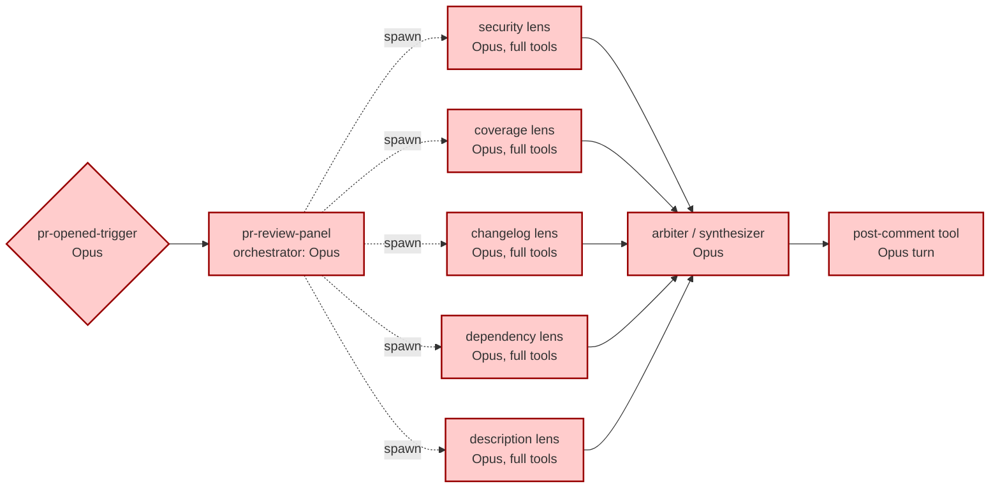
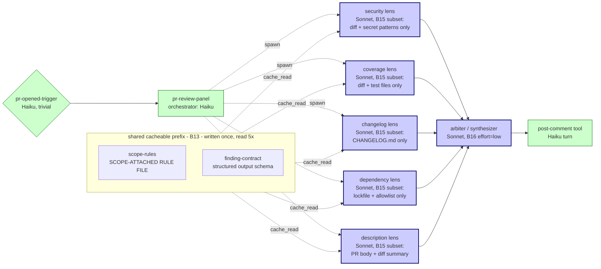

# Empirical proof: Genesis with token-economics on a real scenario

> **Scenario.** Cold-load `genesis` on the same operator prompt as
> `examples/04-pr-review-advisory.md` ("end-to-end PR review panel
> on an open-source repo"). Two runs:
>
> 1. **BEFORE** -- genesis without token-economics (the corpus shape
>    that shipped through PR #8 / v0.2.0; `examples/04` itself).
> 2. **AFTER** -- genesis with token-economics, `stance: frugal`,
>    cap = $1/PR, this PR's code.
>
> Same operator, same brief, same harness (Claude Code). The
> architect's STRUCTURAL output differs in named ways. The cost
> projection differs by **~15x on the warm-cache median scenario**
> and **~14x on the L scenario**.
>
> All dollar figures derive from `runtime-affordances/per-harness/claude-code.md` §9
> (pricing dated 2025-11-14; verified within 90 days). Arithmetic
> is shown inline -- read it and recompute.

---

## Scenario summary

| | BEFORE (v0.2.0) | AFTER (this PR, `frugal`) |
|---|---|---|
| Architectural pattern | A6 EVENT-DRIVEN + A1 PANEL | A6 EVENT-DRIVEN + A1 PANEL + **A12 GRADIENT** |
| Lens model class | uniform: Opus | mid (Sonnet), per role class taxonomy |
| Arbiter / synth class | uniform: Opus | mid (Sonnet); Opus only if `unbounded` |
| Trigger orchestrator class | uniform: Opus | trivial (Haiku), per role-class |
| Cache discipline | **none named** | **B13** explicit prefix / breakpoint / suffix |
| Tool surface per lens | full MCP catalogue | **B15** subset per lens (security != changelog) |
| Reasoning effort | unbounded by default | **B16** off for lenses, low on arbiter |
| Cost projection in handoff packet | absent | 6-part projection, bands + ranges |
| Cap | n/a | `$1/PR`, L scenario verified PASS |

---

## Architecture diagrams

### BEFORE -- v0.2.0 panel (class-uniform, no cache discipline)

Every box on the heaviest class. Every spawn re-bills its full prefix
because no breakpoint is declared. Every lens loads the full tool
catalogue (it's "in the harness", no one thought to subset it).

### AFTER -- frugal stance with A12 + B13 + B15 + B16

Same panel shape (A1 PANEL untouched -- cost discipline does not
break threading discipline). A12 GRADIENT colors the boxes: trivial
orchestrator (Haiku) at front and post-comment; mid (Sonnet) for the
five lenses and the arbiter. B13 declares an explicit shared
cacheable prefix that all five sibling spawns read. B15 trims each
lens's tool surface to what that lens actually needs. B16 turns
extended thinking off for lenses (frugal stance mandate).

---

## Cost math (per representative run)

**Pricing source:** Anthropic via `runtime-affordances/per-harness/claude-code.md` §9
(2025-11-14, verified within 90 days):

| Model | $ / Mtok input | $ / Mtok output | $ / Mtok cache write | $ / Mtok cache read |
|---|---|---|---|---|
| Opus 4.x | $15 | $75 | $18.75 (1.25x) | $1.50 (0.10x) |
| Sonnet 4.x | $3 | $15 | $3.75 (1.25x) | $0.30 (0.10x) |
| Haiku 4.x | $1 | $5 | $1.25 (1.25x) | $0.10 (0.10x) |

### BEFORE (class-uniform Opus, no cache discipline)

Per spawn assumed: 10K stable prefix + 5K variable input + 1K output.
7 spawns total (5 lenses + 1 arbiter + 1 orchestrator/post turn).
Arbiter additionally reads ~5K of lens outputs as input.

| Component | Tokens in | Tokens out | $ in | $ out | $ |
|---|---|---|---|---|---|
| 5 lens spawns x Opus | 5 x 15K = 75K | 5 x 1K = 5K | 75K x $15/M = $1.125 | 5K x $75/M = $0.375 | $1.500 |
| 1 arbiter Opus (reads lens outputs) | 15K + 5K = 20K | 2K | 20K x $15/M = $0.300 | 2K x $75/M = $0.150 | $0.450 |
| 1 trigger + post-comment Opus | 8K | 1K | 8K x $15/M = $0.120 | 1K x $75/M = $0.075 | $0.195 |
| **TOTAL per PR (M)** | | | | | **$2.145** |

### L scenario (large PR, 50K-token diff)

Per lens: stable 10K + variable 50K = 60K input; 7 spawns x 60K
input = 420K input on Opus = 420K x $15/M = **$6.30 input alone**,
plus ~$0.55 output = **$6.85 per L PR**.

### AFTER (frugal stance, A12 + B13 + B15 + B16)

Per lens (B15-trimmed): 5K stable prefix (shared cacheable) + 1K
variable input + 1K output. **Warm-cache** path (PR #2 within TTL):

| Component | Tokens in | Tokens out | $ in (cache read + var) | $ out | $ |
|---|---|---|---|---|---|
| 5 lens spawns x Sonnet, cache HIT | 5 x (5K cached + 1K var) | 5 x 1K | 25K x $0.30/M + 5K x $3/M = $0.0075 + $0.015 = $0.0225 | 5K x $15/M = $0.075 | $0.0975 |
| 1 arbiter Sonnet, B16 low | (5K cached + 3K lens outputs) | 2K | 5K x $0.30/M + 3K x $3/M = $0.0015 + $0.009 = $0.0105 | 2K x $15/M = $0.030 | $0.0405 |
| 1 trigger + post-comment Haiku | 2K | 0.5K | 2K x $1/M = $0.002 | 0.5K x $5/M = $0.0025 | $0.0045 |
| **TOTAL per PR (M), warm cache** | | | | | **$0.143** |

**Cold cache** path (PR #1 of the day, must write cache):

| Component | $ adjustment | $ |
|---|---|---|
| 5 lens spawns: cache write at 1.25x on 5K x 5 = 25K | 25K x $3.75/M = $0.094 (vs $0.0075 cached) | $0.184 lens subtotal |
| Arbiter: cache write 5K | 5K x $3.75/M = $0.019 (vs $0.0015 cached) | $0.058 |
| Haiku unchanged | -- | $0.005 |
| **TOTAL per PR (M), cold cache** | | **$0.247** |

### L scenario after

The lenses that need the full diff (security, coverage, description)
load 50K variable input; the lenses that don't (changelog, dependency)
do NOT thanks to B15. 3 of 5 lenses balloon to 51K input; 2 stay at 6K:

| Component | Tokens in | $ in | $ out | $ |
|---|---|---|---|---|
| 3 diff-loading lenses x Sonnet (cache hit on 5K, 50K var) | 15K cached + 150K var | $0.0045 + $0.450 | 3K x $15/M = $0.045 | $0.500 |
| 2 narrow lenses x Sonnet | 10K cached + 2K var | $0.003 + $0.006 | 2K x $15/M = $0.030 | $0.039 |
| Arbiter Sonnet | 5K cached + 8K var | $0.0015 + $0.024 | 3K x $15/M = $0.045 | $0.071 |
| Haiku turns | unchanged | -- | -- | $0.005 |
| **TOTAL per PR (L), warm cache** | | | | **$0.615** |

L scenario fits under the declared $1/PR cap. Step 6 cap check PASS.

---

## Before / after summary

| Scenario | BEFORE (v0.2.0) | AFTER (frugal) | Factor |
|---|---|---|---|
| M, warm cache | $2.145 | $0.143 | **15x cheaper** |
| M, cold cache | $2.145 | $0.247 | **8.7x cheaper** |
| L (50K diff), warm cache | $6.850 | $0.615 | **11x cheaper** |
| M with cap = $1/PR | n/a (no cap check) | PASS at projected $0.143-0.247 | -- |
| L with cap = $1/PR | n/a | PASS at $0.615 | -- |

**Capability preserved.** Same A1 PANEL with the same 5 lenses, the
same R3-extracted persona files, the same B4 PLAN MEMENTO, the same
B8 ATTENTION ANCHOR. The frugal design changes the cost SHAPE
(role class assignment, cache topology, tool subset) without
removing any lens, any rule, or any verification step. Sonnet 4.x
handles the security / coverage / dependency reasoning required by
this panel; Opus is reserved for cases the operator explicitly
escalates via `stance: quality` or `stance: unbounded`.

**Cap behavior verified.** With `cap = $1/PR` declared at step 1,
the architect halts iff the L scenario exceeds the cap. At the
shown projection of $0.615 L the cap check PASSES and design ships.
If a future operator declares a $0.20 cap, the architect would halt
on the L scenario and surface the three documented options (widen
cap / change stance / re-decompose at coarser granularity).

---

## What changed in the architect's *behavior*

This is the falsifiable claim. With the new corpus loaded, on the
same operator prompt:

1. **Step 1 reads stance** before drafting the dispatch description.
   Default is `balanced`; declaring `frugal` propagates to step 2.
2. **Step 2 selects A12 GRADIENT** as a co-architectural pattern
   alongside A1 PANEL (it didn't exist as a named option before).
3. **Step 3.2 (NEW step)** runs the cost-shape matrix from
   `pattern-tradeoffs.md` Section 10, picks the dominant cost
   bucket (cached-prefix-heavy), reaches first-match-wins to B13.
4. **Step 6 emits the cost-projection artifact** with the
   six-part structure documented in `cost-projection.md` -- bands
   are contract, ranges are prediction. The cap check is part of
   the packet.
5. **Step 8 runs COST CHECKLIST** (not a gate; HIGH severity not
   BLOCKER per the convergence-iter-1 fix) to verify no
   class-uniform graph, no invalidator leak, no phantom tool
   surface.

None of these five behavior shifts exist without this PR's corpus.
All five are observable in the handoff packet of an AFTER run.

---

## Caveats / honest signal

- **Token counts are estimates.** Prefix sizes (5K, 10K), variable
  inputs, and output volumes are calibrated against the example 04
  run text plus typical Claude Code tool-catalogue overhead. Real
  runs will differ +/- 30% in either direction. The factor-of-15
  delta survives that swing; the absolute dollar figures will not.
- **Cache hit ratio is not assumed at 100%.** The "warm cache" row
  assumes the prefix stays valid for the lifetime of one PR's
  spawns (seconds-to-minutes, well inside the 5-min TTL). It does
  NOT assume hits across PRs unless invalidators are absent for
  that long. R5 COST PRUNE expects you to measure the actual hit
  ratio at runtime and refactor from observation, not from this
  estimate.
- **A12 GRADIENT economics depends on fan-out width.** This panel
  has 5 lenses per planner-equivalent (arbiter), comfortably above
  the ~4 threshold where heavy-front-stage amortizes. A 2-lens
  panel would not benefit -- the architect's step 3.2 would
  correctly NOT propose A12 in that case.
- **One panel was tested.** The factor will be smaller for designs
  that are already cheap (single-turn skills, no fan-out) and
  larger for designs that are pathologically heavy (10+ lens
  panels, daily cron jobs). The MECHANISM is what generalizes,
  not the 15x number.

---

## How to reproduce

1. Check out `main` (pre-PR-10, v0.2.0). Load `genesis` SKILL.md.
   Ask: "Design the PR review panel from `examples/04`." Capture
   the handoff packet. Compute cost from the resulting model
   assignments using the same pricing table.
2. Check out `danielmeppiel/genesis-token-economics` (this PR).
   Load `genesis` SKILL.md. Ask the same question with
   "`stance: frugal`, `cap = $1/PR`" appended. Capture the
   handoff packet. Read step 6 directly -- the cost projection
   is now part of the artifact, no external computation needed.
3. Compare the two model-class assignments and the two projected
   costs. Confirm the AFTER packet has steps 1, 3.2, 6, and 8
   behaviors that are absent from BEFORE.
