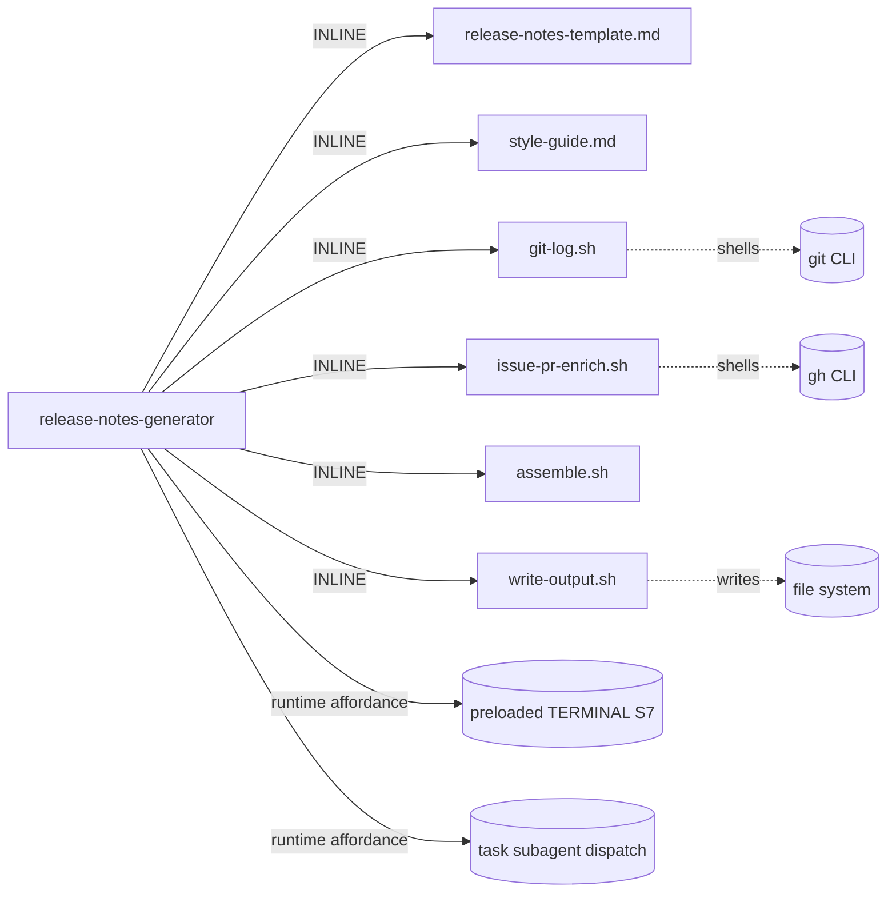

# genesis run: release-notes-generator skill

> Architect persona pinned: **Opus 4.7**. Persona stops at step 6.
> Coder takes over for 7+. Cold-load of `~/.copilot/skills/genesis/`
> (SKILL.md + primitives + design-patterns + architectural-patterns +
> token-economics + runtime-affordances/model-catalog + per-harness/copilot).

## Step 1 -- Intent + scope

**Capability.** Given a git tag range (e.g. `v1.2.0..v1.3.0`), produce
ONE polished, user-facing release-notes markdown document. The skill
fetches the commit log for the range, classifies each commit into
FEATURES / BUG FIXES / BREAKING CHANGES / INTERNAL, enriches each entry
with linked GitHub issue/PR titles, composes 2-3 sentences of audience-
aware prose for every FEATURE and BREAKING CHANGE, composes one-line
extractive summaries for every BUG FIX, hides INTERNAL changes (or
folds them into a collapsed `<details>` block), runs a single
consistency-and-style pass over the assembled document, and writes the
final artifact. The skill DOES NOT publish to GitHub, post to social,
push tags, or trigger CI.

**SRP check.** All sub-steps serve the single capability "produce a
polished release-notes doc". One design.

**Dispatch description (drafted, ~860 chars; <= 1024 cap):**
> Use this skill when the user is about to publish a release and needs
> a finished, audience-ready release-notes markdown document covering
> a specific git tag range. It reads commits between two tags, sorts
> them into Features / Bug Fixes / Breaking Changes / Internal, looks
> up linked GitHub issues and PRs, writes 2-3 sentence user-facing
> prose for each feature and breaking change, one-liners for bug
> fixes, runs a style pass for tone consistency, and emits one
> polished markdown file. Activate on phrases like "write release
> notes for v1.3", "polish the release notes", "draft the v2.0
> announcement", "what should we say users got in this release",
> "summarize what shipped between v1.2 and v1.3", or any moment the
> operator is preparing a tagged release for publication. Produces a
> markdown file; does NOT publish, push tags, or open PRs.

**Invocation mode:** BOTH (FORCED + DISCOVERY).

**Cost stance:** BALANCED (default; operator did not declare).
**Cost budget cap:** none declared.

---

## Step 2 -- Component diagram

```mermaid
flowchart LR
  S[release-notes-generator<br/>SKILL]
  T[(release-notes-template.md<br/>ASSET)]
  STY[(style-guide.md<br/>ASSET / rule-shaped)]
  GL[(git-log.sh<br/>ASSET / script S7)]
  EN[(issue-pr-enrich.sh<br/>ASSET / script S7)]
  AS[(assemble.sh<br/>ASSET / script)]
  WR[(write-output.sh<br/>ASSET / script S7)]

  CLS{{classifier-subagent<br/>spawned via task() TRIVIAL}}
  FEAT{{feature-prose-writer<br/>spawned via task() IMPLEMENTER}}
  BRK{{breaking-change-prose-writer<br/>spawned via task() REVIEWER}}
  BUG{{bugfix-oneliner-writer<br/>spawned via task() TRIVIAL}}
  CON{{consistency-pass-reviewer<br/>spawned via task() REVIEWER}}

  S -- loads at compose --> T
  S -- loads at consistency pass --> STY
  S -- S7 --> GL
  S -- S7 --> EN
  S -- spawns --> CLS
  S -- fan-out spawn --> FEAT
  S -- fan-out spawn --> BRK
  S -- fan-out spawn --> BUG
  S -- spawns --> CON
  S -- invokes --> AS
  S -- S7 --> WR

  classDef new stroke-dasharray:5 5;
  class S,T,STY,GL,EN,AS,WR,CLS,FEAT,BRK,BUG,CON new;
```

All NEW. The five `{{...}}` nodes are AGENTIC ELEMENTS spawned by the
SKILL.md orchestrator body via `task(agent_type=...)`. The orchestrator
body itself is the sixth agentic element (running at session default).

---

## Step 3 -- Thread / sequence diagram + pattern selection

**Pattern selection in tier order:**

1. **Refactor pre-pass:** greenfield; no triggers fire.
2. **Tier-3 architectural backbone.** Work decomposes into ORDERED
   STAGES with verifiable hand-offs (fetch -> classify -> enrich ->
   compose-per-bucket -> assemble -> consistency-pass -> write). Per
   `architectural-patterns.md` selection heuristic
   ("decomposes into ordered stages with verifiable hand-offs ->
   A2 PIPELINE"), the backbone is **A2 PIPELINE**. The terminal write
   to FS + several FACTS THAT MUST BE TRUE (tag-range exists, commit
   list, linked issue titles, output file path) bring **A9 SUPERVISED
   EXECUTION** in as a composition (per heuristic "work names a
   consequential side effect or a fact that must be true -> A9").
3. **Cost overlay.** The compose stage has clearly heterogeneous
   capability needs across the three buckets (FEATURE prose,
   BREAKING-CHANGE prose, BUG-FIX one-liners) and the bug-fix bucket
   runs many times (~30 calls in the projected scenario). Per A12
   selection ("stages with clearly different capability requirements;
   one or more stages run many times"), apply **A12 GRADIENT
   WORKFLOW** as a cost overlay on the A2 backbone.
4. **Tier-2 decomposition.** A2 + A9 + A12 compose:
   - **B12 MODEL ROUTER** per agentic element (see step 3.2 enumeration).
   - **B4 PLAN MEMENTO** between stages (state table on disk: commit
     list, classified buckets, enriched list, composed prose
     fragments, assembled doc).
   - **B8 ATTENTION ANCHOR** in the orchestrator (mandatory per SKILL.md
     step 3 heuristic).
   - **B13 CACHE-AWARE PREFIX** on the prose-writer subagents (style
     guide + template = cacheable prefix; per-commit diff = variable
     suffix).
   - **B6 PROMPT TEMPLATE** for each prose-writer (structured slots
     per Feature / Breaking Change / Bug Fix).
   - **B15 TOOL SUBSET** on the prose-writer subagents (`read`, `web`
     only -- no `edit`, no `execute`).
   - **B1 FAN-OUT + SYNTHESIZER** for the per-commit compose stage
     (parallel subagent spawn, orchestrator synthesizes).
   - **S7 DETERMINISTIC TOOL BRIDGE** for git-log, gh issue/PR
     lookups, assemble, write.
   - **S4 VALIDATION DECORATOR** at the write gate (re-read +
     schema-grep verify).
   - **C1 LAZY ASSET** for template + style guide.
5. **Tier-1 idioms:** deferred to step 7b.

**Lens count.** The PROSE-COMPOSE middle stage spawns up to ~45
parallel subagents but they share three personas (feature-writer,
breaking-writer, bugfix-writer). This is fan-out workers under A12
MID, NOT an A1 PANEL (which would require independent SPECIALIZED
LENSES with a synthesis decision). The orchestrator's "assemble" step
is concatenation against a template, not a synthesis decision over
disagreeing analyses; consistency-pass is REVIEWER adjudication. So
A1 is not warranted -- explicitly rejected.

```mermaid
sequenceDiagram
    participant Op as Operator
    participant Th as Orchestrator (skill body, session default)
    participant Sh as Terminal (S7)
    participant Git as Git repo
    participant GH as GitHub API (gh CLI)
    participant FS as File system
    participant Sub as Subagent pool (task spawns)

    Op->>Th: trigger ("write release notes for v1.2.0..v1.3.0")
    Note over Th: load skill; persist plan (B4); inject GOAL (B8)
    Th->>Sh: S4 precond: tag-range exists, both tags resolve
    Sh->>Git: git rev-parse v1.2.0 v1.3.0
    Sh-->>Th: ok
    Th->>Sh: git-log.sh --range v1.2.0..v1.3.0
    Sh->>Git: git log --pretty=...
    Sh-->>Th: commit list (JSON)
    Th->>Sh: issue-pr-enrich.sh
    Sh->>GH: gh issue view / gh pr view per ref
    Sh-->>Th: enriched commit list (JSON, persisted to plan)
    Th->>Sub: spawn classifier (task agent_type='task', TRIVIAL)
    Sub-->>Th: bucketed commits {features, fixes, breaking, internal}
    par fan-out compose (A12 MID; B1 + B13)
      Th->>Sub: spawn N feature-prose writers (general-purpose, IMPLEMENTER)
      Sub-->>Th: prose blocks
    and
      Th->>Sub: spawn M breaking-prose writers (general-purpose, REVIEWER class via persona+stakes)
      Sub-->>Th: prose blocks
    and
      Th->>Sub: spawn K bugfix-oneliner writers (task, TRIVIAL)
      Sub-->>Th: one-line summaries
    end
    Th->>Sh: assemble.sh (template + composed blocks -> draft doc)
    Sh-->>Th: assembled draft
    Th->>Sub: spawn consistency-pass reviewer (general-purpose + reviewer persona, REVIEWER, loads style-guide)
    Sub-->>Th: edits to apply (diff or revised doc)
    Th->>Sh: S4 verifier: schema check (headings present, no TODOs, no unresolved refs)
    Sh-->>Th: pass/fail
    Th->>Sh: write-output.sh --target RELEASE_NOTES_<range>.md
    Sh->>FS: write
    Sh-->>Th: ok
    Th-->>Op: "wrote RELEASE_NOTES_v1.2.0_v1.3.0.md (N features, M fixes, K breaking)"
```

---

## Step 3.1 -- Tradeoff check

- **A2 PIPELINE vs A1 PANEL** for the compose stage. Cut by
  `pattern-tradeoffs.md` matrix "lens vs stage" semantics: A1
  requires INDEPENDENT SPECIALIZED LENSES + SYNTHESIS DECISION; here
  the workers all execute the same persona over different inputs --
  that is fan-out WORKERS, not lenses. A2 + A12 fan-out fits. A1
  rejected.
- **A9 STRONG vs WEAK** for the final write. Local FS write, no
  cross-trigger surface; weak-form A9 (S7 + S4 in-process) is
  sufficient. No A10 needed.

---

## Step 3.2 -- Cost check (MANDATORY; PER-ELEMENT CAPABILITY PROFILE ENUMERATION)

Loaded `token-economics.md` + `runtime-affordances/model-catalog.md`
+ `runtime-affordances/per-harness/copilot.md` section 9.

Target harness: **Copilot CLI** (declared by binding-site analysis).

Per-element CAPABILITY PROFILE enumeration. For EACH agentic element:

### Element O -- Orchestrator (SKILL.md body)
- Primitive: SKILL.md (no `model:` field accepted -- WRONG-PRIMITIVE
  BINDING risk if we tried)
- Cross-file? Yes (reads commit-list state, multiple JSON artifacts,
  template, style-guide; coordinates fan-out)
- STAKES? Medium (orchestration errors leak through; bad fan-out
  shape multiplies cost)
- Multi-step? Yes (pipeline with branches, error recovery, retry
  budget on verifier fail)
- REQUIRED ROLE CLASS: IMPLEMENTER
- HARNESS DEFAULT for SKILL.md: session default (per copilot.md
  section 9 table row 1)
- BOUND: **session default (IMPLEMENTER on most sessions = Claude
  Sonnet 4.6)**. OMIT is the ONLY legal action here because the
  primitive does NOT carry `model:`. Documented in handoff per B12
  SELECTION RULE rule 3 OMIT clause (i): primitive cannot carry
  `model:`. Operator-visible note: "skill orchestrator inherits
  session default; for predictability, run from a session pinned
  to an implementer-class model".

### Element 1 -- Commit classifier (`task(agent_type='task')`)
- Primitive: subagent spawn (`task`)
- Cross-file? **No** -- sees only commit subject + body + author + date
  for each commit; no file diffs needed for classification (subject
  prefix `feat:` / `fix:` / `BREAKING:` carries the signal, fallback
  to keyword heuristics)
- STAKES? **Low** -- a misclassified commit just lands in the wrong
  section; the consistency pass + operator review catches blatant
  errors. No security or irreversibility component.
- Multi-step? **No** -- pattern matching against conventional-commit
  prefixes + a fallback keyword rubric. One pass per commit.
- REQUIRED ROLE CLASS: **TRIVIAL**
- HARNESS DEFAULT for `task(agent_type='task')`: **TRIVIAL**
  (claude-haiku-4.5 per copilot.md table row 5)
- BOUND: **TRIVIAL (claude-haiku-4.5)** -- DEFAULT-MATCH per B12
  SELECTION RULE rule 3 ("DEFAULT == REQUIRED -> BIND EXPLICITLY
  at the matching role class" for portability + predictability).
  Implementation: spawn type `task` is the binding mechanism; document
  the role-class contract in the SKILL.md body and the handoff.

### Element 2 -- Feature prose writer (`task(agent_type='general-purpose')`)
- Primitive: subagent spawn (`general-purpose`)
- Cross-file? **Yes** -- to write "what it does and why the user
  cares" prose, the writer reads (a) commit subject + body, (b) the
  commit's diff (multi-file in many cases), (c) the linked GitHub
  issue body (often contains the user-story rationale), (d) the
  template + style guide as cacheable prefix.
- STAKES? **Yes** -- this is user-facing copy in a polished published
  artifact. Reputation stakes; bad prose ships to all release readers.
- Multi-step? **Partially** -- structured composition against a
  template (B6) rather than open-ended creative writing, but does
  require synthesizing diff + issue body into audience-aware prose.
  Closer to "follow a plan reliably" (IMPLEMENTER capability profile
  per model-catalog.md) than to "high-quality reasoning that survives
  contact with execution" (PLANNER).
- REQUIRED ROLE CLASS: **IMPLEMENTER**
- HARNESS DEFAULT for `task(agent_type='general-purpose')`:
  **IMPLEMENTER** (claude-sonnet-4.6 per copilot.md table row 7)
- BOUND: **IMPLEMENTER (claude-sonnet-4.6)** -- DEFAULT-MATCH per
  B12 SELECTION RULE rule 3. Explicit cite: STAKES = user-facing
  release copy; CAPABILITY = follows template + summarizes structured
  inputs into audience-aware prose. Not bound UP to PLANNER because
  the work is template-following with bounded input, not unbounded
  planning (avoid BIND-UP-WITHOUT-JUSTIFICATION).

### Element 3 -- Breaking-change prose writer (`task(agent_type='general-purpose')`)
- Primitive: subagent spawn (`general-purpose`) with reviewer-class
  persona (loads a migration-explainer rubric)
- Cross-file? **Yes** -- must read the diff to identify what broke
  and articulate the migration path; often needs to inspect the
  before/after of the changed symbol's signature.
- STAKES? **High** -- breaking-change documentation has the highest
  user-pain stakes in the doc. Missing or wrong migration guidance
  causes broken downstream upgrades.
- Multi-step? **Yes** -- (a) identify what changed, (b) classify
  the breakage type (signature / behavior / removal), (c) compose
  migration path, (d) write user-facing prose. Multi-step proof
  chain, not pattern matching.
- REQUIRED ROLE CLASS: **REVIEWER** (pattern-matches against a
  migration rubric, emits structured output with citations; high
  cache hit on the rubric as cacheable prefix). Could be argued
  IMPLEMENTER -- the cite for REVIEWER over IMPLEMENTER is the
  EXPLICIT RUBRIC + STRUCTURED OUTPUT shape (signature change |
  behavior change | removal) + concrete-artifact grounding (the
  diff). This matches the REVIEWER capability profile verbatim.
- HARNESS DEFAULT for `task(agent_type='general-purpose')`:
  IMPLEMENTER (claude-sonnet-4.6)
- BOUND: **REVIEWER (claude-sonnet-4.6)** -- DEFAULT-MATCH at the
  concrete-model level (on Copilot, REVIEWER and IMPLEMENTER both
  default to sonnet-4.6 per `model-catalog.md` "Default SKU"
  column), but role-class binding is REVIEWER for capability
  profile + persona declaration. JUSTIFICATION cite: STAKES (high-
  user-pain copy) + multi-step proof chain (identify-classify-
  compose-write) per B12 SELECTION RULE rule 3. Not bound UP to
  PLANNER (no genuinely new analysis required; diff + rubric +
  template = bounded decision space; A12 HEAVY ADJUDICATOR anti-
  pattern explicitly warns against planner-class on adjudication-
  shaped work).

### Element 4 -- Bug-fix one-liner writer (`task(agent_type='task')`)
- Primitive: subagent spawn (`task`)
- Cross-file? **No** -- needs only commit subject + linked issue
  title (single short string in, single short string out)
- STAKES? **Low** -- one line per fix in a bulleted list; a clumsy
  phrasing is caught by the consistency pass.
- Multi-step? **No** -- extractive summarization (subject + issue
  title -> one-liner with consistent voice).
- REQUIRED ROLE CLASS: **TRIVIAL**
- HARNESS DEFAULT for `task(agent_type='task')`: TRIVIAL
  (claude-haiku-4.5)
- BOUND: **TRIVIAL (claude-haiku-4.5)** -- DEFAULT-MATCH. This is
  the dominant COST WIN in the scenario: 30 bug-fix lines on haiku
  instead of sonnet is where A12 GRADIENT pays for itself. JUSTIFY
  with explicit per-element profile cite (extractive summarization
  of two short strings = model-catalog.md TRIVIAL row verbatim).

### Element 5 -- Consistency / style pass reviewer (`task(agent_type='general-purpose')`)
- Primitive: subagent spawn (`general-purpose`) with style-reviewer
  persona that loads `assets/style-guide.md`
- Cross-file? **No file scope, but DOCUMENT-WIDE scope** -- reads
  the WHOLE assembled draft + style guide + ~3 prior published
  release notes as house-style reference.
- STAKES? **High** -- this is the FINAL quality gate before the
  artifact ships to users. Inconsistent tone / formatting / mixed
  voice / repeated phrasings all damage the published doc.
- Multi-step? **Yes** -- read whole doc, compare to style guide
  rubric, propose edits with rationale. Adjudication shape over a
  concrete pre-existing artifact (the assembled draft) = REVIEWER
  capability profile verbatim per `model-catalog.md`.
- REQUIRED ROLE CLASS: **REVIEWER**
- HARNESS DEFAULT for `task(agent_type='general-purpose')`:
  IMPLEMENTER (claude-sonnet-4.6)
- BOUND: **REVIEWER (claude-sonnet-4.6)** -- DEFAULT-MATCH at SKU
  level; role-class is REVIEWER via persona. JUSTIFICATION: STAKES
  (final ship-gate over user-facing copy) + capability profile is
  rubric-grading over a concrete artifact (high cache hit on the
  style guide prefix; bounded output of edits + rationale). Not
  bound UP to PLANNER: A12 HEAVY ADJUDICATOR explicitly names this
  shape as REVIEWER, not planner.

### Distribution audit (per B12 BULK IDENTICAL BINDING)

Five spawned agentic elements + one orchestrator inheriting session
default. Distribution AFTER enumeration:

| Role class | Count | Elements |
|---|---|---|
| TRIVIAL | 2 | classifier (E1), bug-fix one-liners (E4) |
| IMPLEMENTER | 2 | orchestrator (E0, session default), feature prose (E2) |
| REVIEWER | 2 | breaking-change prose (E3), consistency pass (E5) |
| PLANNER | 0 | -- |
| LONG-CONTEXT-RETRIEVER | 0 | -- |

**Distribution: DIFFERENTIATED.** Not BULK IDENTICAL. The bind-down
of E1 + E4 to TRIVIAL is the A12 GRADIENT savings; the role-class
distinction between E2 (IMPLEMENTER) and E3/E5 (REVIEWER) is
materialized as PERSONA + role-class contract even though the SKU
on Copilot today happens to be the same (sonnet-4.6 for both
IMPLEMENTER and REVIEWER defaults). The binding contract is what
travels across harness adapter swap -- on a harness where REVIEWER
maps to a cheaper SKU than IMPLEMENTER, the distinction immediately
becomes a cost win.

### Cost-shape citations (matrix rows -- not loaded as `pattern-tradeoffs.md` §10 here was not loaded, but the cited rationale for A12 + B12 is documented inline per `token-economics.md`).

---

## Step 3.5 -- Composition decision + dependency graph

| Box | Composition mode | Rationale |
|---|---|---|
| `release-notes-generator` (SKILL) | self | the module under design |
| `release-notes-template.md` | INLINE asset | unique to this skill's output shape |
| `style-guide.md` | INLINE asset (rule-shaped) | project-specific tone rules; rule-of-three not satisfied |
| `git-log.sh` | INLINE script (`scripts/`) | bundled per agentskills.io convention |
| `issue-pr-enrich.sh` | INLINE script (`scripts/`) | needs `gh` CLI in PATH |
| `assemble.sh` | INLINE script (`scripts/`) | deterministic template-filling |
| `write-output.sh` | INLINE script (`scripts/`) | overwrite-gated terminal write |
| classifier subagent | INLINE behavior (spawned via `task`) | runtime affordance, not a module |
| feature-prose subagent | INLINE behavior (spawned via `task`) | runtime affordance |
| breaking-prose subagent | INLINE behavior (spawned via `task`) | runtime affordance |
| bugfix-oneliner subagent | INLINE behavior (spawned via `task`) | runtime affordance |
| consistency-pass subagent | INLINE behavior (spawned via `task`) | runtime affordance |

**No EXTERNAL MODULE declared.** PHANTOM DEPENDENCY check: structurally
absent.



---

## Step 4 -- SoC pass

- Existing-module duplication? `release-notes-draft` exists as a
  worked example (`examples/03-...`) but is a DIFFERENT skill:
  produces an editable draft for the operator, not a polished
  published artifact. No overlap of trigger nouns ("draft" vs
  "polished release notes", different audience contract).
- Sibling overlap? None in scope.
- Dispatch collision? Check at step 8 against installed catalogue.
- R1 SPLIT? No -- single description, single audience, single
  output artifact. Sub-stages do NOT split (each is a private
  pipeline stage, not a separately invocable capability).
- W6 CONSEQUENTIAL SIDE EFFECT: one (write `RELEASE_NOTES_<range>.md`
  to repo root or `--target` path). Crosses S7 via `write-output.sh`.
- W6.2 FACTS THAT MUST BE TRUE: tag existence, commit list, file
  diffs, linked issue / PR titles, output-path collision check.
  All cross S7 (git CLI + gh CLI + `test -f`).

---

## Step 5 -- Compliance check

| Axis | Status | Note |
|---|---|---|
| SRP | OK | one capability |
| SoC (LLM/CPU) | OK | facts + side effects all cross S7 |
| Progressive Disclosure | OK | template + style guide lazy-loaded |
| Reduced Scope | OK | each spawned subagent has narrow persona + tool subset |
| Orchestrated Composition | OK | A2 + A9 + A12 named explicitly |
| Safety Boundaries | OK | S4 precondition + verifier; overwrite gate |
| Explicit Hierarchy | OK | SKILL.md links scripts + assets with load triggers |
| Truth #1 (context finite) | OK | B4 + B8 |
| Truth #2 (context explicit) | OK | every fact tool-delegated; no externals |
| Truth #3 (output probabilistic) | OK | S4 schema verifier + consistency pass |
| Truth #4 (hallucination inherent) | OK | classification + prose both LLM but grounded |
| Truth #5 (frozen pretraining) | N/A | no live external corpus |
| MODULE ENTRYPOINT spec | DEFERRED TO STEP 8 | name `release-notes-generator` (24 chars, valid) |
| Body size budget | DEFERRED TO STEP 8 | procedure-style + lazy assets keep budget |
| description <= 1024 chars | OK at draft (~860) | re-validate at step 8 |
| ASCII only | OK | enforced |
| B12 BULK IDENTICAL BINDING | OK | DIFFERENTIATED distribution; per-element enumeration in handoff (step 3.2) |
| B12 WRONG-PRIMITIVE BINDING | OK | orchestrator OMITs because SKILL.md cannot carry `model:` (per copilot.md §9); subagent role-class bound at `task(agent_type=...)` spawn site (the per-element binding site on Copilot CLI) |
| B12 BIND-UP-WITHOUT-JUSTIFICATION | OK | every BIND has a STAKES + capability cite |
| A12 HEAVY ADJUDICATOR | OK | consistency-pass stays REVIEWER, not PLANNER |

**Open findings:** zero BLOCKER, zero HIGH. One MEDIUM (M1):
the per-element binding via `task(agent_type=...)` spawn type is
the only B12 binding-site available on Copilot CLI for subagent
work today; future Copilot CLI versions may expose a more granular
`model:` override on spawn (per copilot.md TODO row 4 "CHILD-THREAD
SPAWN"). Track for re-validation when documentation lands.

Proceed to step 6.

---

## Step 6 -- HANDOFF PACKET (PERSIST THIS)

### 6.1 Diagrams
Step 2 (component), step 3 (sequence), step 3.5 (dependency) -- above.

### 6.2 Interface sketch

**release-notes-generator (SKILL)**
- Trigger description: see step 1 (~860 chars).
- Inputs: `--range <tag>..<tag>` (required); `--target <path>`
  (optional; default `RELEASE_NOTES_<range>.md` at repo root).
- Outputs: ONE markdown file at `--target`; stdout summary
  (N features, M fixes, K breaking, internal-folded count).
- Dependencies: `./assets/release-notes-template.md`,
  `./assets/style-guide.md`, `./scripts/git-log.sh`,
  `./scripts/issue-pr-enrich.sh`, `./scripts/assemble.sh`,
  `./scripts/write-output.sh`.
- Runtime affordances required: preloaded TERMINAL (S7), `task`
  subagent dispatch (5 spawn types invoked: `task` x2,
  `general-purpose` x3).
- Invocation mode: BOTH.

(Per-script contracts deferred to step 7b; structure follows the
`examples/03-...` template -- non-interactive, JSON-on-stdout,
`--help`, structured exit codes.)

### 6.3 Module composition table
See step 3.5. All boxes INLINE.

### 6.4 External modules required
**EMPTY.** PHANTOM DEPENDENCY check: structurally absent.

### 6.5 Declared target set
**Copilot CLI** (single-harness). Justified per portability-rules
because the design uses per-element B12 binding via `task(agent_type=
...)` spawn types, which is a Copilot-CLI-specific affordance. If a
second harness is added later, restructure each subagent as a
sibling `.agent.md` and re-bind via `model:` frontmatter (the
substrate concept is portable; the syntax is not).

### 6.6 Invocation mode
BOTH per module.

### 6.7 Tradeoff citations
- A2 + A9 + A12 over alternatives -- step 3 selection heuristic.
- A1 PANEL rejected -- fan-out workers, not specialized lenses.
- A9 weak-form sufficient (no event surface) -- step 3.1.
- B12 binding direction per element -- step 3.2 enumeration with
  per-element STAKES + capability cites.

### 6.8 Open compliance findings
- M1 (MEDIUM): re-validate B12 binding sites against Copilot CLI
  documentation when CHILD-THREAD SPAWN section gets official docs.
- No BLOCKER, no HIGH.

### 6.9 Todo list (for the coder at step 7b)

| id | title | depends_on |
|---|---|---|
| t01-skill-body | Draft SKILL.md orchestrator body (A2 pipeline with task spawns; explicit role-class declarations in prose; B4 state table on disk) | -- |
| t02-template | Author `assets/release-notes-template.md` (B6: sections FEATURES / BUG FIXES / BREAKING CHANGES / INTERNAL (collapsed)) | -- |
| t03-style-guide | Author `assets/style-guide.md` (voice rules, tense, audience framing; loaded into consistency-pass and breaking-prose subagents as cacheable prefix) | -- |
| t04-git-log | Author `scripts/git-log.sh` (JSON on stdout: sha, author, date, subject, body, refs) | -- |
| t05-enrich | Author `scripts/issue-pr-enrich.sh` (calls `gh` per ref; merges issue/PR titles into commit objects) | t04 |
| t06-assemble | Author `scripts/assemble.sh` (template + composed prose blocks -> draft doc; deterministic) | t02 |
| t07-write | Author `scripts/write-output.sh` (overwrite-gated, structured exit codes) | -- |
| t08-evals-content | Author evals (with vs without skill) | t01-t07 |
| t09-evals-trigger | ~20 trigger evals (60/40 train/val) | t01 |
| t10-portability-check | Step 7a confirms Copilot-CLI-only declaration | t01 |
| t11-real-task | Run skill on a real repo with a recent tag range | t01-t10 |
| t12-step8-lint | Step 8 validation incl. COST CHECKLIST (verify role-class bindings materialize as enumerated) | t01-t11 |

### 6.10 Evals plan

**Content evals (with_skill vs without_skill):**
1. Repo with 50 commits, mix of conv-commit prefixes; expected
   features get 2-3 sentence prose, bug fixes get one-liners,
   breaking changes get migration-path prose, internal folded.
2. Repo with all unconventional commit messages; expected best-
   effort heuristic classification + explicit "uncertain" marking.
3. Repo with one breaking change that removes a public API;
   expected migration-path prose names the removed symbol + the
   recommended replacement (read from linked issue body).

**Trigger evals (~20 queries, 60/40 train/val):**
- Should-trigger (10): "write release notes for v1.3", "polish
  the release notes between v1.2 and v1.3", "draft the v2.0
  announcement", "summarize what shipped in v1.4", "release-notes
  doc for the new tag", "what should we tell users got fixed in
  v1.3.0", "compose the v1.3.0 release notes", "we're shipping
  v1.3 tomorrow, can you write the notes", "make a polished
  release-notes markdown for v1.2.0..v1.3.0", "I need release
  notes for the v1.3 release".
- Should-NOT-trigger (10): "draft a CHANGELOG entry for this
  PR" (PR-level), "what does this commit do" (commit-level),
  "tag and ship" (release-cut, not notes), "summarize this issue",
  "write a commit message", "draft a press release for our
  announcement" (marketing, not release notes), "show me the
  diff between two tags", "what changed in src/ since last week",
  "open a PR with these notes", "blog post about the new
  release" (different audience contract).

Train/val: 6+6 / 4+4. Validation gate: trigger rate >= 0.5 on
should-trigger AND < 0.5 on should-NOT-trigger.

### 6.11 COST PROJECTION

**Per-module qualitative bands.**

| Element | Role class | Prefix band | Output band | Turn count | Cache ratio target |
|---|---|---|---|---|---|
| E0 orchestrator | IMPLEMENTER (session default) | M | S (terse coordination) | medium | high |
| E1 classifier | TRIVIAL | S | S (bucket assignments) | low | n/a |
| E2 feature prose (xN) | IMPLEMENTER | M (template + style guide cached) | M (~150 tok/call) | low per call | high (cached template) |
| E3 breaking prose (xM) | REVIEWER | M | M (~200 tok/call) | low per call | high |
| E4 bugfix oneliners (xK) | TRIVIAL | S | S (~30 tok/call) | low per call | medium |
| E5 consistency pass | REVIEWER | M (style guide cached) | M (edits + rationale) | low | high |

**Workload scenario L (operator's spec): 50 commits, 10 features,
30 bug fixes, 5 breaking changes, 5 internal.**

Premium-request count estimate on Copilot CLI (verified 2025-11-14
billing model -- re-verify against live pricing page):

| Stage | Calls | Role class | Concrete SKU today | Approx multiplier | Subtotal (premium requests) |
|---|---|---|---|---|---|
| Orchestrator turns | ~6 turns | IMPLEMENTER | claude-sonnet-4.6 | 1.0x | ~6 |
| Classifier (1 batched call over 50 commits) | 1 | TRIVIAL | claude-haiku-4.5 | ~0.33x | ~0.33 |
| Feature prose (parallel fan-out, 1 call per feature) | 10 | IMPLEMENTER | sonnet-4.6 | 1.0x | ~10 |
| Breaking prose | 5 | REVIEWER | sonnet-4.6 | 1.0x | ~5 |
| Bug-fix one-liners (could batch to 1, or fan-out 30) | 1 batched (recommended) | TRIVIAL | haiku-4.5 | ~0.33x | ~0.33 |
| Consistency pass | 1 | REVIEWER | sonnet-4.6 | 1.0x | ~1 |

**Total per typical L run: ~22-23 premium requests.**

If the bug-fix bucket fans out (30 parallel haiku calls instead of
1 batched): +9.9 premium requests -> ~32. Recommend BATCHING bug-
fix one-liners (the work is independent + tiny, low context
contamination risk; B14 PROMPT THRIFT).

If the design DID NOT apply A12 + B12 (everything ran on session-
default sonnet): orchestrator 6 + classifier 1 + features 10 +
breaking 5 + bugfixes 30 (or batched 1) + consistency 1 = ~23-53
premium requests at sonnet rates. The A12 savings vs the no-
gradient flat-sonnet design: replacing classifier + 30 bug-fixes
with haiku saves approximately (30 * 1.0) - (1 * 0.33 + 1 * 0.33) =
~29 premium requests in the fan-out variant, ~0.34 in the batched
variant. **The fan-out scenario is where A12 dominates.**

In USD pass-through (illustrative; Copilot bills on premium
requests not tokens, but for cross-harness comparison): assume
sonnet input ~5K tok cached prefix + 1K variable suffix per call,
~200 tok output. At public Anthropic rates Sonnet 4.6 ($3 in /
$15 out per Mtok with 90% cache read discount on prefix):
- Per sonnet call: (0.5K * $3 + 1K * $3 + 200 * $15) / 1M ~= $0.0075
- 22 sonnet calls: ~$0.17
- 2 haiku batched calls: ~$0.01
- **Approximate USD per typical L run: ~$0.18-0.25**

For 3 workload scenarios:
- S (5 commits, all bug fixes, no features): ~3 premium requests,
  ~$0.03 (haiku-dominant).
- M (20 commits, 4 features, 14 bug fixes, 1 breaking): ~12-13
  premium requests, ~$0.10.
- L (operator's scenario above): ~22-23 premium requests, ~$0.18-
  0.25.

**Stance check.** BALANCED (default). All BIND-DOWN decisions
(E1, E4 to TRIVIAL) cite explicit per-element capability profile.
All BIND-MATCH decisions (E2, E3, E5) cite explicit STAKES +
capability. No BIND-UP. No declared budget cap. Cost projection
honored at design time.

### 6.12 PHANTOM DEPENDENCY check (W6.3)
None. No externals declared. Recorded.

### 6.13 STOP

DESIGN ENDS HERE. Per genesis hard rule: architect persona does
NOT draft natural-language module bodies. Handoff to coder for
step 7+.
