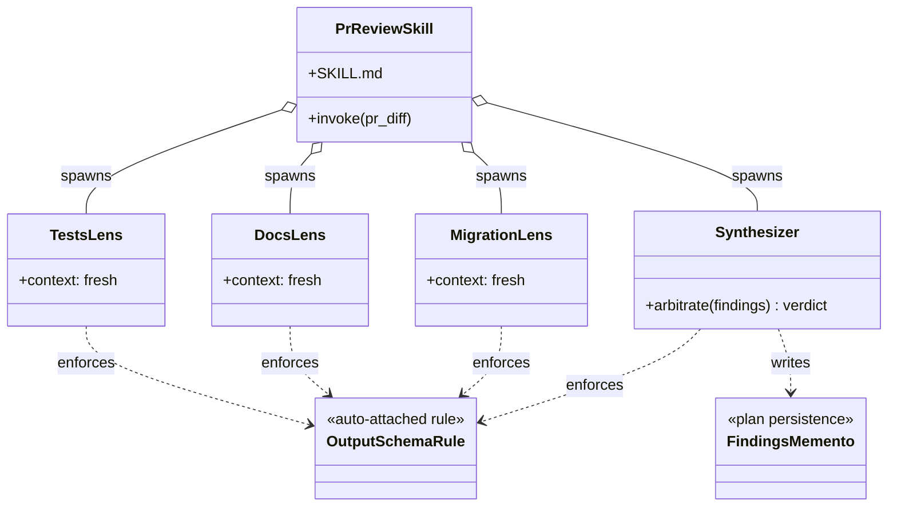

This walkthrough takes you from a blank repo to your first `/genesis` invocation, end to end. You will type one prompt, read the proposed layout, and accept (or reject) the architect handoff before any file is written.

## 1. Install

```bash
npx skills add danielmeppiel/genesis
```

Zero global install. Works with Claude Code, Cursor, Codex, OpenCode, GitHub Copilot, and 41+ more agents -- see [skills.sh](https://skills.sh).

Already using [apm](https://github.com/microsoft/apm) (manifest + lockfile)?

```bash
apm install danielmeppiel/genesis
```

For full install paths, post-install verification, and harness detection, see [Install](/genesis/guides/install/).

## 2. Summon the skill

In your agent (Claude Code, Cursor, GitHub Copilot, OpenCode, Codex), type `/genesis` followed by what you want designed:

```text
/genesis I want every PR on my repo reviewed for missing tests, undocumented
public API, and unsafe migrations -- aggregated into one comment. Never
approve, never auto-merge.
```

You will get a named pattern, an execution diagram, an acceptance test, and a written plan -- **before any file is touched**.

## 3. Read the proposed layout

Before writing a single file, Genesis proposes a layout grounded in the catalogue. For the prompt above, expect something like:

```text
.github/skills/pr-review/
|-- SKILL.md                       # entrypoint, 8-step contract
|-- agents/
|   |-- pr-tests-lens.agent.md     # missing-tests reviewer (fresh context)
|   |-- pr-docs-lens.agent.md      # public-API doc reviewer
|   |-- pr-migration-lens.agent.md # unsafe-migration reviewer
|   `-- pr-synthesizer.agent.md    # arbiter, dissent-weighted
|-- rules/
|   `-- review-output.md           # auto-attached output schema
|-- assets/
|   |-- severity-rubric.md         # acceptance gate
|   `-- findings.template.md       # plan persistence shape
`-- triggers/
    `-- on-pull-request.yml        # event binding
```

Then it justifies each piece against the catalogue. Patterns are cited by name (A1 Panel, B1 Fan-Out + Synthesizer, S4 Validation Decorator, B4 Plan Memento, A6 Event-Driven). The architect tells you not just **what** to build, but **why this and not that**.

## 4. The runtime shape (object diagram)

Genesis emits a class diagram of the runtime shape before you write any code:



The file you eventually author is the easy part. The composition above is what was missing.

## 5. Accept the handoff

The architect step ends with a **handoff packet**: diagrams + interface sketch + declared targets + module composition table + todos. A separate coding step (your agent's normal coder loop) then turns the artifacts into actual files. Diagrams come first; files come second.

If the proposed layout is wrong, reject it now -- it is cheap. Once files exist, restructuring is expensive.

## What's next

- **Different prompt, different architecture.** Three cold-load runs of the same skill yield three materially different output shapes. See the [examples gallery](#) (coming soon) for worked walkthroughs of release-notes, advisory PR review, and verdict-emitting PR review.
- **Drill into the substrate.** The output above cites primitives by name. Start with [Primitives](/genesis/reference/primitives/) for the six concepts every harness implements.
- **Wire it for your harness.** `/genesis` resolves differently on each runtime. See [Harness setup](/genesis/reference/harnesses/) for file paths, frontmatter dialects, and known limitations.
