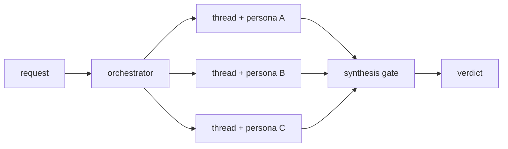

A1 PANEL is the workhorse Tier-3 pattern for any decision that benefits from multiple independent lenses with a synthesis step. It is the agentic analog of Microservices behind an API Gateway: N specialized services produce findings; one synthesizer reads them and produces a single decision.

## Verbatim definition

> CLASSICAL ANALOG: Microservices + API Gateway -- N specialized services behind one entry point that synthesizes their outputs.
>
> COMPOSES:
> - B1 FAN-OUT + SYNTHESIZER (the topology)
> - N x C2 PERSONA PRELOAD (one specialized lens per worker)
> - S4 VALIDATION DECORATOR at the synthesis step (gates the verdict)
> - B4 PLAN MEMENTO (the synthesis output is the plan artifact)
>
> WHEN:
> - A decision benefits from >=3 specialized lenses (security, cost, UX, architecture, etc.).
> - The lenses are independent; no shared state during evaluation.
> - The synthesis is itself a decision, not a concatenation.

## Topology



Each persona thread is SPAWNED with a fresh context window ([C3 THREAD SPAWN](/genesis/reference/patterns/design/#c3-thread-spawn)) and PRELOADED with its specialized lens ([C2 PERSONA PRELOAD](/genesis/reference/patterns/design/#c2-persona-preload)). The synthesizer is a separate role -- typically a [B9 GOAL STEWARD](/genesis/reference/patterns/design/#b9-goal-steward) persona -- whose job is to read N findings and produce ONE verdict, not to add another opinion.

## Variants

The PANEL shape generalizes along three axes:

1. **Lens count.** Three is the floor; below three, this is "second opinion", not adversarial deliberation. Five to seven is typical; beyond ten the synthesis step becomes the bottleneck.
2. **Synthesis policy.** Three commonly-named synthesis disciplines:
   - **MAJORITY** -- count GO vs REFINE; ties default to REFINE.
   - **DISSENT-WEIGHTED** -- N-1 GO + 1 REFINE escalates to the synthesizer; the dissent is the highest-information signal and must be examined explicitly. Default for high-stakes panels.
   - **STEWARD-ARBITRATED** -- the synthesizer is itself a persona ([B9 GOAL STEWARD](/genesis/reference/patterns/design/#b9-goal-steward)) that judges each finding against the goal artifact rather than counting votes. Required when the goal is qualitative (positioning, narrative, fit-for-purpose).
3. **Adversarial layer.** Layering [A7 ADVERSARIAL REVIEW](/genesis/reference/patterns/architectural/#a7-adversarial-review-red-team--cold-reader-gate) into the panel adds cold-context reviewers whose only job is to find what the specialists ignored. Mandatory for cold-traffic surfaces (README, public docs, PR descriptions).

## Anti-patterns (verbatim)

> - PANEL-WITHOUT-SYNTHESIS -- N lenses, then a concatenation. The user reads N reports instead of one decision. The synthesis IS the panel.
> - PANEL-IN-ONE-CONTEXT -- running all N lenses sequentially in a single window. Each lens contaminates the next; later lenses inherit attention drift from earlier ones. The dominant failure mode for senior engineers stepping into agent design.
> - IMBALANCED PANEL -- N-1 lenses agree, 1 dissents, the synthesis follows the majority without examining the dissent. The dissenting lens is usually the highest-information signal.

### PANEL-IN-ONE-CONTEXT, deep-dive

The temptation is real: "I'll just have one thread play five reviewer roles in sequence; saves on spawns; one log to read." Every senior engineer who steps into agent design proposes this at least once. It is wrong on LLM physics: each reviewer's tokens contaminate the next reviewer's attention budget. Lens 5 inherits accumulated bias from lenses 1-4. The reviewers stop being independent the moment their tokens share a context window.

Cure: ALWAYS spawn one [C3 THREAD](/genesis/reference/patterns/design/#c3-thread-spawn) per lens. Each thread loads its persona at startup and reads the artifact ONLY. The synthesizer is yet another thread that loads each finding (not the reviewers' reasoning traces) and produces the verdict.

[Example 02 -- review panel architecture](/genesis/resources/examples/02-review-panel-architecture/) is the verbatim cautionary tale.

### IMBALANCED PANEL, deep-dive

The dominant failure of synthesis under MAJORITY policy. When N-1 reviewers say GO and 1 says REFINE, the cheap call is to ship; the high-information call is to examine the dissent. In practice the dissent is usually grounded -- the dissenting lens is reading the artifact for a property the others never had reason to weigh.

Cure: switch the synthesis policy to DISSENT-WEIGHTED or STEWARD-ARBITRATED. A dissent must be cited and either rebutted (with evidence) or absorbed (the artifact changes). It must NEVER be silently overridden.

## Real-world examples

- [`apm-review-panel`](https://github.com/microsoft/apm/blob/main/.apm/skills/apm-review-panel/SKILL.md) in `microsoft/apm` -- six personas (Python Architect, CLI Logging Expert, DevX UX Expert, Supply Chain Security Expert, APM CEO, OSS Growth Hacker) with the CEO as the steward arbitrator.
- [Example 02 -- review panel architecture](/genesis/resources/examples/02-review-panel-architecture/) -- re-architecture lesson showing the broken PANEL-IN-ONE-CONTEXT shape and its corrected fan-out form.
- [Example 04 -- PR review (advisory)](/genesis/resources/examples/04-pr-review-advisory/) -- six-persona advisory panel with DISSENT-WEIGHTED arbiter; multi-primitive realization (personas + assets + scripts + trigger + entrypoint + rule + evals).
- [Example 05 -- PR review (verdict)](/genesis/resources/examples/05-pr-review-verdict/) -- the verdict-required regime: same lens topology, different consequence (PANEL output gates a tool call instead of just informing).
- [Example 01 -- README iteration](/genesis/resources/examples/01-readme-iteration/) -- A8 ALIGNMENT LOOP in which each round body is itself a PANEL.

## Selection heuristic

Pick A1 PANEL when:

```
the request names >=3 specialized concerns AND
the lenses are independent (no shared state) AND
the synthesis is itself a decision (not a list)
```

Do NOT pick A1 PANEL when:

- The request names ONE concern. Use a single persona thread; no panel needed.
- The lenses share state (each reviewer's finding is the input to the next reviewer). That is [A2 PIPELINE](/genesis/reference/patterns/architectural/#a2-pipeline-pipes-and-filters), not A1.
- The "synthesis" is a concatenation. Cut the panel; ship the N reports as separate artifacts.

When the artifact is also creative / cold-traffic, layer [A7 ADVERSARIAL REVIEW](/genesis/reference/patterns/architectural/#a7-adversarial-review-red-team--cold-reader-gate) inside the panel -- specialist reviewers PLUS cold readers. When the panel runs across multiple rounds, wrap it in [A8 ALIGNMENT LOOP](/genesis/reference/patterns/architectural/#a8-alignment-loop-bounded-iteration-with-goal-steward) with a [B9 GOAL STEWARD](/genesis/reference/patterns/design/#b9-goal-steward) and a bounded round counter.

## Cross-references

- [Architectural patterns catalogue](/genesis/reference/patterns/architectural/)
- [B1 FAN-OUT + SYNTHESIZER](/genesis/reference/patterns/design/#b1-fan-out--synthesizer) -- the Tier-2 engine
- [C2 PERSONA PRELOAD](/genesis/reference/patterns/design/#c2-persona-preload) -- the lens substrate
- [A7 ADVERSARIAL REVIEW](/genesis/reference/patterns/architectural/#a7-adversarial-review-red-team--cold-reader-gate) -- the layering pattern that hardens A1 against IMBALANCED PANEL
- [Agentic SDLC Handbook, Chapter 12 -- Multi-Agent Orchestration](https://danielmeppiel.github.io/agentic-sdlc-handbook/handbook/ch12-multi-agent-orchestration.html) -- long-form companion on multi-thread topologies
