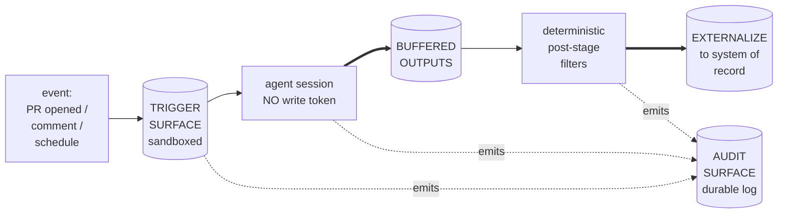

A10 GOVERNED OUTER LOOP is the architectural pattern for any agent run that fires from an external event, externalizes state to a system of record, AND must do so under explicit governance -- capability gating, sandboxing, and a durable audit surface. It is a SPECIALIZATION of [A6 EVENT-DRIVEN](/genesis/reference/patterns/architectural/#a6-event-driven) with three substrate guarantees added.

## Verbatim definition

> CLASSICAL ANALOG: a CI/CD pipeline backed by a capability-bounded service account. The job has just enough permission to do the declared work, the surface that holds the credentials is not the surface that runs the user's code, and every run leaves a durable audit trail.
>
> The defining property: an event-triggered, sandboxed, capability-gated agent run whose externalizations are mediated by a deterministic post-stage and whose entire trace survives the session. The agent NEVER holds the write tokens for its declared externalization targets.

## Substrate guarantees

A10 promotes three optional fields of [TRIGGER ORCHESTRATOR](/genesis/reference/primitives/trigger-orchestrator/) into mandatory ones:

- **SANDBOXING** -- the runtime that hosts the agent session denies network egress, filesystem access, or peer-process visibility outside its declared allowlist. Even a fully compromised agent cannot reach what the sandbox does not expose.
- **CAPABILITY_GATING** -- the substrate denies write capability to the agent. Externalizations are buffered as artifacts and applied by a deterministic post-stage with declared filters. The agent emits intent; the substrate executes (or refuses).
- **AUDIT_SURFACE** -- every event firing, every agent emission, every post-stage decision is appended to a durable log. Auditors can reconstruct what fired, what ran, and what was written, after the fact.

## Topology



(Double-line `==>` edges denote tool-call results / artifacts crossing into the next deterministic stage; thin edges are LLM-internal control flow or audit emission.)

## Composition

> COMPOSES:
> - TRIGGER ORCHESTRATOR (substrate primitive #5) WITH the optional fields SANDBOXING, CAPABILITY_GATING, and AUDIT_SURFACE all populated by the trigger surface.
> - STRONG FORM of [A9 SUPERVISED EXECUTION](/genesis/reference/patterns/architectural/#a9-supervised-execution-plan-deterministic-execute-verify) -- because CAPABILITY_GATING is the defining substrate field, the enforcement form is runtime-enforced by construction.
> - [A6 EVENT-DRIVEN](/genesis/reference/patterns/architectural/#a6-event-driven) as the macro topology. A10 is a SPECIALIZATION of A6 with three named guarantees added; non-governed event-driven work stays at A6.

## When to pick A10

> WHEN:
> - Work is reactive to an external event (PR opened, comment with label, schedule fires, issue created).
> - The agent must externalize state to a system of record (post a comment, file a ticket, create a PR, label an issue).
> - The operator's threat model includes a compromised or off-task agent; the system must not depend on the agent's good behavior for the bound on what gets externalized.
> - An auditor (security, compliance, manager, future maintainer) must be able to reconstruct what fired, what ran, and what was written, after the fact.

## Canonical realization (gh-aw)

> CANONICAL REALIZATION: GitHub Agentic Workflows (gh-aw) on GitHub Actions runners. The trigger surface IS the substrate that supplies SANDBOXING (firewall + MCP gateway + per-tool containers), CAPABILITY_GATING (`safe-outputs:` subsystem), and AUDIT_SURFACE (Actions logs). The inference harness is independently chosen (Claude Code OR Codex) per the substrate's harness orthogonality rule.

The gh-aw harness page in the [reference section](/genesis/reference/harnesses/) covers the substrate fields in detail.

## Vendor reality

> A10 is GitHub-specific only in its CHEAPEST realization. The PATTERN itself is vendor-agnostic; on GitLab CI, Buildkite, Jenkins, or an internal scheduler, the same shape is buildable but SANDBOXING and CAPABILITY_GATING must be wired by hand (network policy + restricted service account + manual buffer-and-apply post-stage). The architect's job is to NAME the pattern, then surface the vendor cost in the design's portability declaration so the operator chooses with eyes open.

If your substrate is NOT gh-aw, the design handoff MUST flag the substrate gap explicitly:

> "A10 selected; canonical strong-form A9 (substrate-enforced capability_gating) not available on \<substrate\>; degrade to weak-form A9 with engineered token isolation and document the residual risk."

Do not pretend the gap does not exist.

## Anti-patterns (verbatim)

> - **TOKEN-LAUNDERING** -- the workflow grants the agent step a write token to the system of record "because the post-stage is too fiddly". The capability_gating substrate field is the WHOLE POINT of A10; bypassing it reduces the design to A6 EVENT-DRIVEN with extra ceremony. If the externalizer truly cannot express the desired write, treat that as a missing capability of the trigger surface and either extend the post-stage or re-classify the work as in-session (A1/A2/A8 inside an interactive harness).
> - **IMPLICIT-TRUST OUTER LOOP** -- no audit surface; "the team will notice if it goes wrong". A10's third guarantee is non-optional; without AUDIT_SURFACE this is a clandestine bot and operators cannot recover from misbehavior they cannot see.
> - **OVER-BROAD TRIGGERS** -- `on: push` (any branch, any path) when the work is meaningful only on `main` for `docs/`. Tighten the trigger declaration; every event the agent fires on is an event it can misbehave on.
> - **HARNESS-PORTABILITY THEATRE** -- the design names A10 but pins the inference harness to a single per-harness adapter without justification. Substrate's orthogonality rule applies: if the work could run under any A10-compatible harness, declare both the trigger-surface adapter AND say "common-only" for the per-harness axis.
> - **INNER-LOOP MISCAST AS OUTER** -- promoting a single-developer laptop task to A10 because "governance sounds good". A10 pays in trigger-surface lock-in; cash that cost only when the governance properties are needed.
> - **WEAK-FORM A9 INSIDE A STRONG-FORM SURFACE** -- the workflow runs on gh-aw but the agent body asks for a `gh` CLI call to comment. The agent holds the token; CAPABILITY_GATING is bypassed by design. Use `safe-outputs:` instead.

## Selection heuristic

> A10 is the right call when an outcome-framed operator prompt mentions ALL THREE of (a) an event or schedule that fires the work, (b) an external write target, and (c) a constraint on the agent's authority (audit, no-approve, no-merge, "must not hold token", "must be reviewable"). If only (a) and (b) are present without (c), [A6 EVENT-DRIVEN](/genesis/reference/patterns/architectural/#a6-event-driven) is sufficient. If only (a) is present, the work is in-session reactive UI; use A1/A2/A8 inside the inference harness directly.

```
event/schedule fires work?  ----+
external write target?      ----+--> all three? --> A10
authority constraint?       ----+        |
                                         only (a)+(b) --> A6
                                         only (a)     --> A1/A2/A8 in-session
```

## Worked references

- The `safe-outputs:` subsystem in gh-aw is the canonical CAPABILITY_GATING realization. The agent emits structured intents (post-comment, label-issue, etc.); the deterministic post-stage validates against declared filters and applies them.
- For the same reasoning at the substrate level applied to inner-loop work, see [A9 SUPERVISED EXECUTION](/genesis/reference/patterns/architectural/#a9-supervised-execution-plan-deterministic-execute-verify) (weak form on developer laptop; strong form when the substrate offers it).

## Cross-references

- [Architectural patterns catalogue](/genesis/reference/patterns/architectural/)
- [A6 EVENT-DRIVEN](/genesis/reference/patterns/architectural/#a6-event-driven) -- the parent pattern A10 specializes
- [A9 SUPERVISED EXECUTION](/genesis/reference/patterns/architectural/#a9-supervised-execution-plan-deterministic-execute-verify) -- strong form composed inside A10
- [TRIGGER ORCHESTRATOR](/genesis/reference/primitives/trigger-orchestrator/) -- the substrate primitive whose optional fields A10 promotes to mandatory
- [Agentic SDLC Handbook, Chapter 12 -- Multi-Agent Orchestration](https://danielmeppiel.github.io/agentic-sdlc-handbook/handbook/ch12-multi-agent-orchestration.html) and [Chapter 14 -- Anti-Patterns and Failure Modes](https://danielmeppiel.github.io/agentic-sdlc-handbook/handbook/ch14-anti-patterns-and-failure-modes.html)
