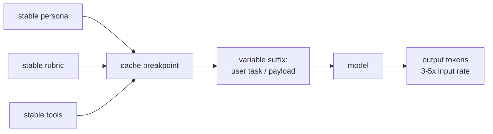
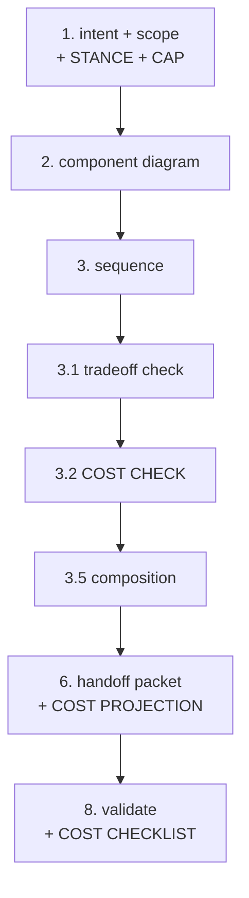

import { Card, CardGrid } from '@astrojs/starlight/components';

**Markdown that steers an LLM is code. Tokens are its runtime cost.**

When Genesis designs an agent workflow, model choice, prefix shape,
and pattern composition each have a cost. Token economics names that
cost vocabulary so the architect reasons about it the same way it
reasons about threading, persistence, and attention -- as a first-class
substrate concern, not a post-hoc optimization.

## The seven substrate concepts

The same way the corpus already names THREADING, PERSISTENCE, and
ATTENTION, the cost surface needs durable concepts the persona can
cite. Seven:

1. **Cacheable prefix** -- stable bytes at the start of every request
   the harness/provider can cache and bill at a reduced rate.
2. **Variable suffix** -- bytes that change per request and invalidate
   any cache hit on the prefix if reordered into it.
3. **Output tax** -- output tokens cost 3-5x input tokens; reasoning /
   thinking tokens bill at output rates. A "short reply" is the
   cheapest knob the architect controls.
4. **Cache breakpoint** -- the explicit marker the provider uses to
   mint or read a cached prefix (e.g. Anthropic's `cache_control`).
5. **Cache invalidator** -- any byte mutation upstream of a breakpoint:
   timestamps in persona, mid-session model switch, mid-session MCP
   tool catalogue churn, mid-session effort change.
6. **TTL tradeoff** -- 5-minute caches refresh free on hit; 1-hour
   caches pay 2x to write but persist across pauses. Pick by cadence.
7. **Per-harness billing unit** -- some harnesses bill credits per
   request type (Copilot premium-request multipliers), others bill
   pass-through ($/Mtok). The role-class taxonomy spans both.

## Role-class taxonomy

Models age out every six months. Role classes don't. Genesis designs
in role classes; each harness adapter pins its current concrete SKU.
The minimum workable set:

| Role class | Capability | Per-call cost | Use when |
|---|---|---|---|
| **planner** | deep reasoning, multi-step decomposition | highest | architectural decisions, novel problems |
| **implementer** | competent execution on specified work | high | well-scoped code/text, normal flow |
| **reviewer** | match output against rubric, surface findings | medium | per-lens audit, classifier-with-rationale |
| **trivial** | classify, route, summarize | lowest | dispatch, idempotency probe, tag |
| **long-context-retriever** | hold large context, extract spans | medium-high | doc-RAG over big corpora, mass review |

Per-harness concrete bindings live in
[the harness adapter pages](/genesis/reference/harnesses/) (section 9
of each), date-stamped. Re-verify pricing past 90 days.

## Where this surfaces in the process

The 8-step [Genesis loop](/genesis/) gains four cost touchpoints:

- **Step 1** -- read the operator's *cost stance* and any declared *cap*.
- **Step 3.2** -- mandatory cost check (mirrors the tradeoff check); pick
  cost patterns by the cost-shape matrix.
- **Step 6** -- emit a cost projection artifact alongside the handoff
  packet: per-module bands (CONTRACT) + per-workflow dollar range
  (PREDICTION).
- **Step 8** -- cost checklist (human-applied, not a lint): verify
  emitted modules honor their role-class bands and did not leak cache
  invalidators.

## Read next

<CardGrid>
  <Card title="Operator stance & cap" icon="setting">
    Four-stance knob and dollar/token/credit cap.
    [Stance and cap &rarr;](/genesis/reference/token-economics/stance-and-cap/)
  </Card>
  <Card title="Cost projection artifact" icon="document">
    What the step-6 projection looks like and what's contract vs prediction.
    [Cost projection &rarr;](/genesis/reference/token-economics/cost-projection/)
  </Card>
  <Card title="Cost patterns" icon="puzzle">
    B12 MODEL ROUTER, B13 CACHE-AWARE PREFIX, B14, B15, B16, A12, R5.
    [Patterns &rarr;](/genesis/reference/token-economics/patterns/)
  </Card>
  <Card title="Worked example" icon="open-book">
    A 6-lens review panel re-architected for ~5-7x cost reduction.
    [Example 06 &rarr;](/genesis/resources/examples/06-cost-aware-panel/)
  </Card>
</CardGrid>
