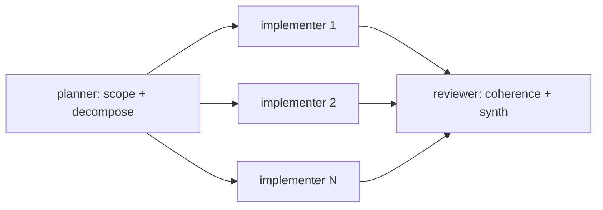

Token economics adds seven catalogue entries. Five at TIER 2 design
patterns (Bxx), one at TIER 3 architectural pattern (Axx), one
refactor pattern (Rxx).

## TIER 3 architectural

### A12 GRADIENT WORKFLOW

Heavy planner-class front stage; mid-class implementer fan-out across
N similar items; lightweight reviewer/triage back stage. The agentic
analog of Tiered Architecture: pay heavy class only where reasoning
is genuinely required.

**Pays off when** N >= ~4 mid workers per planner call (heavy front
amortized across fan-out width). For N < 4, flat single-class design
is structurally simpler with comparable cost.

**Anti-patterns**: INVERTED GRADIENT (cheap front -> expensive bulk),
ROUTER-AS-PLANNER (front stage doing real planning on trivial class).

## TIER 2 design

### B12 MODEL ROUTER

A trivial-class classifier dispatches each request to one of N
downstream branches, each bound to a different role class. Pays off
when traffic is heterogeneous and the cheapest meeting-capability
branch dominates traffic.

**Rule:** router cost must be < 5% of the cheapest downstream call,
else routing is the dominant cost.

**Anti-pattern:** ROUTER-AS-PLANNER. If the router does the work
instead of dispatching, it cannot be trivial class.

### B13 CACHE-AWARE PREFIX

Place all stable content (persona, rubric, tool catalogue, system
prompt) BEFORE the explicit cache breakpoint. Variable content
(user task, payload, retrieved spans) goes AFTER. Cache discipline
is BOOLEAN per turn -- one invalidator and the entire prefix re-bills
at input rate.

**Invalidators to audit:** timestamped persona ("## Current date:"),
mid-session model switch, mid-session MCP tool catalogue churn,
mid-session effort change (extended thinking on/off).

**Largest no-tradeoff lever** in the catalogue. A design that
correctly applies B13 typically halves input billing on repeat turns.

### B14 PROMPT THRIFT

Remove rationale, hedging, and worked examples from always-loaded
prefix. Move to `references/` files loaded on demand. Coding
discipline applied per-module.

**Trigger:** prefix budget over 80% AND recent edits added prose
(rationale/hedging) rather than capability.

### B15 TOOL SUBSET

Expose only the tools this module needs. Catalogue bleed (every MCP
server's full tool list loaded into every session) inflates the
stable prefix proportionally to the wider toolchain, not the
module's actual needs.

**Frugal stance mandates.** Apply proactively to skills with tight
prefix budget, even if MCP catalogue is small today.

### B16 EFFORT GOVERNOR

Declare the reasoning-effort level (e.g. Claude extended thinking
on/off, OpenAI reasoning effort low/med/high/xhigh) once per session.
Mid-session effort changes invalidate cache (B13 invalidator).

**Stance binding:** `frugal` -> minimum/none; `balanced` -> low-med
per role; `quality` -> high-xhigh on planner/critic; `unbounded` ->
unrestricted.

## Refactor

### R5 COST PRUNE

Applied to existing designs that exceed budget. Step 1: **OBSERVE
the trace** (do not guess) -- capture a real run's input-prefix
bytes per turn, total turns, total output tokens, observed cache
hit ratio. Then apply the cost-shape matrix to identify the
dominant bucket and the right refactor (B13, B14, A12, etc.).

**Anti-pattern:** COST-OPTIMIZED-BY-VIBES -- applying B12+B13+B14+B15
reflexively without measuring first.

## Selection rule

The cost-shape matrix in `pattern-tradeoffs.md` Section 10 is
first-match-wins. Do not stack all seven patterns reflexively. Each
pattern names a structural choice with a deterministic cost shape;
pick the one whose shape matches the workflow.

## Anti-patterns introduced by this layer

The cost-economics addition created its own catalogue of failure
modes worth naming:

- **CLASS-UNIFORM GRAPH** -- every module on the most-capable model.
  R5 trigger.
- **INVALIDATOR LEAK** -- timestamp / model switch / tool churn
  inside the cached region.
- **COST-OPTIMIZED-BY-VIBES** -- pattern stacking without observing
  a baseline trace.
- **HARDCODED MODEL NAMES** -- binding to "Claude Opus 4.7" instead
  of the planner role class; designs age out within 6 months.
- **ROUTER-AS-PLANNER** -- the B12 router doing real planning on
  trivial-class capacity.
- **INVERTED GRADIENT** -- A12 with the cheap class on the front
  stage and the expensive class on the bulk fan-out.
- **BUDGET-DRIVEN PROMOTION** -- promoting to heavier class because
  the budget allows it, not because capability requires it.
