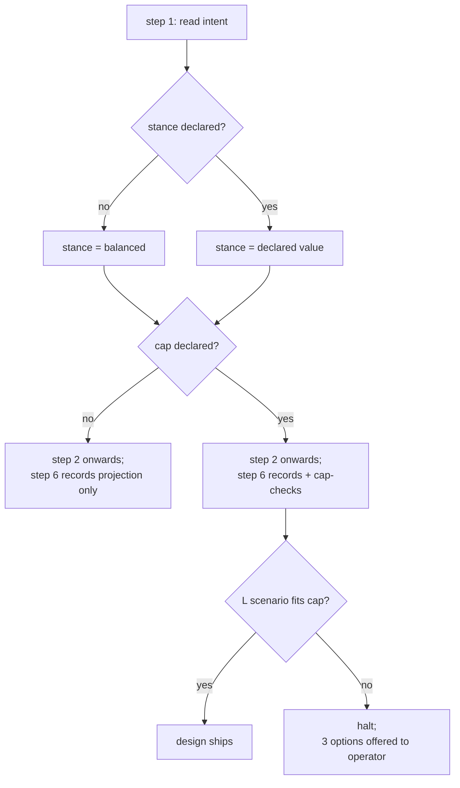

Genesis ships a balanced default and lets the operator dial bias when
they need to. Two independent knobs:

- **Stance** -- shapes the SHAPE of the design (which patterns get picked).
- **Cap** -- shapes the SIZE of the design (whether to redo it smaller).

Conflating them produces silent over-constraint (one knob, operator
under-specifies) or silent over-spend (one knob, operator
over-specifies). They are orthogonal.

## Stance (per-invocation)

The persona reads a single stance value during step 1 and propagates
it through pattern selection.

| Stance | What changes |
|---|---|
| `frugal` | B12 MODEL ROUTER / B15 TOOL SUBSET / B16 EFFORT GOVERNOR each MUST appear. Default trivial-class everywhere. Forbid Max effort. Forbid mid-session model switch. A12 GRADIENT WORKFLOW preferred over flat panels. |
| `balanced` | DEFAULT. Best $/quality per primitive. Cache discipline enforced. Model class picked per role. (Genesis without explicit stance.) |
| `quality` | Heavy-class allowed for planner/critic roles. B13 still on. B14 considered when MCP catalogue > 20 tools. |
| `unbounded` | No cost-side gate. The persona warns once per design and proceeds. For research / capability-ceiling work where the architect explicitly wants the model not to self-limit. Still records cost projection so the operator sees it. |

**How to declare.** State it in the first prompt ("design this in
`frugal` mode") OR write `stance: frugal` to a session-scoped config
file the persona reads at step 1.

**Default = `balanced`.** Most operators never touch this.

## Cap (optional hard ceiling)

Independently of stance, the operator can declare a hard budget in
step 1. Three units, pick one:

- **Dollar cap** (per representative run, or per period with cadence)
- **Token cap** (input + output, per representative run)
- **Premium-request cap** (for credit-billed harnesses like Copilot)

If the step-6 cost projection's L scenario exceeds the cap, design
halts and surfaces three options:

1. Widen the cap (with explicit "how much" feedback)
2. Change stance to a cheaper class
3. Pick a coarser pattern (re-decompose)

This is the ONLY place Genesis refuses to proceed on cost grounds.

## Decision tree

## Why two layers, not one

If stance and cap collapse to a single knob, the failure modes are:

- **One stance knob.** Operator under-specifies, persona picks
  pessimistic, design over-constrained, operator frustrated.
- **One cap knob.** Operator over-specifies (tight cap), persona
  ignores the constraint at synthesis time because the cap has no
  influence on pattern selection, surprise over-spend at runtime.

Two knobs, orthogonal: stance steers pattern choice; cap steers
whether to redo smaller. Each independently auditable for governance.

## v0.3 forward-look

The DevUX panel review of this layer flagged the stance enum as one
value too many (`unbounded` differs from `quality` only in whether
projection is recorded). A future revision may collapse to 3 values
plus a `--no-projection` opt-out flag. For now, four stances are the
shipped vocabulary; their behavior is fully documented above.
