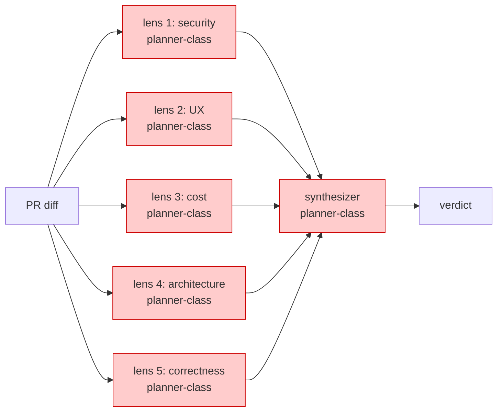
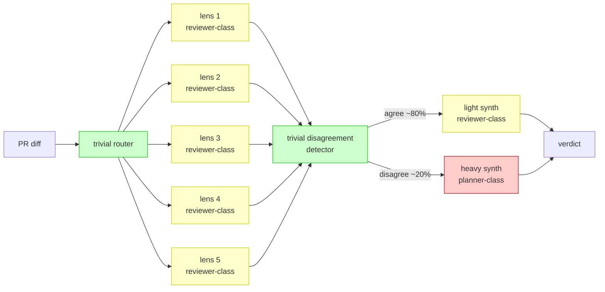

This example walks one real panel design from cost-unconscious (every
lens on planner-class) to cost-aware (gradient workflow with
disagreement-gated synth promotion). It is the canonical reference
for any review-shaped workload (PR review, security audit,
multi-lens critique).

## Starting design (cost-unconscious)

A 6-lens review panel: 5 specialist lenses (security / UX / cost /
architecture / correctness) plus 1 synthesizer. Each lens reads the
same PR diff, applies its rubric, surfaces findings. The synthesizer
reads all 5 sets of findings and produces one verdict.

**R5 trigger fires.** 6 planner-class calls per PR. CLASS-UNIFORM GRAPH.

## Cost-aware re-architecture

Apply A12 GRADIENT WORKFLOW + B12 MODEL ROUTER + B13 CACHE-AWARE
PREFIX + S4 VALIDATION DECORATOR.

Patterns applied:

- **A12 GRADIENT WORKFLOW** -- heavy class only on the disagree path.
- **B12 MODEL ROUTER** -- trivial-class router at entry.
- **B13 CACHE-AWARE PREFIX** -- rubric + persona stable (cached); PR
  diff variable (suffix).
- **S4 VALIDATION DECORATOR** -- the disagreement detector. Trivial-
  class classifier reading 5 lens outputs, deciding agree/disagree.
- **R5 COST PRUNE** -- the refactor trigger.

## Cost projection

Anthropic billing, verified 2025-11-14 (see
[claude-code adapter](/genesis/reference/harnesses/claude-code/) Section 9):

| Version | Calls | Approx input | Approx output | $/run |
|---|---|---|---|---|
| Cost-unconscious | 6 x planner (Opus) | 30K | 6K | ~$0.90 |
| Cost-aware (agree, ~80%) | 1 trivial router + 5 reviewer (Sonnet) + 1 detector + 1 reviewer synth | 29K | ~3.9K | ~$0.10-0.15 |
| Cost-aware (disagree, ~20%) | adds 1 planner arbiter | +~5K | +~1K | ~$0.20-0.30 |

**Arithmetic check.** Opus: $15/Mtok input + $75/Mtok output =
30K x $15/M + 6K x $75/M = $0.45 + $0.45 = ~$0.90. Sonnet:
$3/Mtok input + $15/Mtok output = 28K x $3/M + 3.5K x $15/M
~ $0.08 + $0.05 + tiny router/detector = ~$0.13.

**Blended:** ~$0.12-0.18 per run across 80/20 agree/disagree mix.
Reduction: ~5-7x on blended workload, ~6-9x on the dominant agree
path.

## What stays the same

- **Quality envelope on agree case.** Same 5 lenses fire. Same rubric.
  Reviewer-class meets the capability profile of "match against
  rubric, surface findings."
- **Quality envelope on disagree case.** The planner-class arbiter
  still adjudicates when genuinely needed.
- **Structural correctness.** Still fan-out + synthesizer. Still no
  SHARED MUTABLE STATE. Still no CONTEXT THRASH.

## When this is the WRONG call

A12 GRADIENT WORKFLOW pays off when N >= ~4 mid workers per planner
call. For N < 4, or for:

- **Low cadence + high disagreement rate** (e.g. quarterly strategic
  reviews where every lens always disagrees) -- the disagree path
  fires too often; route everything to planner-class directly.
- **Quality stance** explicitly declared -- the operator paid for
  premium and wants premium throughout.
- **N < 4** -- flat single-class is structurally simpler with
  comparable cost.

Then the cost-unconscious version IS the right call.

## Anti-patterns this re-architecture would create if done wrong

- **ROUTER-AS-PLANNER** -- if the trivial router actually evaluates
  the PR instead of dispatching, it cannot be trivial class.
- **INVERTED GRADIENT** -- if the lens fan-out is planner-class and
  the synthesizer is reviewer-class, you have paid heavy for the
  bulk and cheap for the decision.
- **BUDGET-DRIVEN PROMOTION** -- promoting lenses to planner-class
  because the budget allows it, not because capability requires it.
- **INVALIDATOR LEAK** -- a timestamp in the rubric, or mid-session
  effort change between detector and synth, would re-bill the entire
  prefix at input rate.
- **TIMESTAMP IN RUBRIC** -- "as of 2025-11-14" in the stable
  rubric breaks cache on the rubric-update day.

## Operator tuning

This walkthrough assumes `balanced` stance. With other stances:

- **`frugal`** -- the heavy synth on the disagree path becomes
  reviewer-class too; arbiter capability ceiling lowered.
- **`quality`** -- the gradient flattens upward; light synth becomes
  planner-class; reviewer lenses become implementer-class.
- **`unbounded`** -- no gradient at all; everything planner-class
  (back to the cost-unconscious version, recorded in projection).

See [stance and cap](/genesis/reference/token-economics/stance-and-cap/).
